# 🎮 Sensor Game Hub v6.0 - part 1


> 프로젝트의 모든 것을 이해하고 독립적으로 개발할 수 있도록 돕는 완전한 가이드입니다.

---

## 📑 목차

### Part 1: 시작하기 (Getting Started)
- [1.1 프로젝트 개요](#11-프로젝트-개요)
- [1.2 핵심 개념 이해](#12-핵심-개념-이해)
- [1.3 로컬 환경 설정](#13-로컬-환경-설정)
- [1.4 첫 실행 및 동작 확인](#14-첫-실행-및-동작-확인)
- [1.5 개발 도구 설정](#15-개발-도구-설정)

### Part 2: 프로젝트 아키텍처 (Architecture Deep Dive)
- [2.1 전체 시스템 아키텍처](#21-전체-시스템-아키텍처)
- [2.2 디렉토리 구조 완전 분해](#22-디렉토리-구조-완전-분해)
- [2.3 핵심 모듈 역할 및 상호작용](#23-핵심-모듈-역할-및-상호작용)
- [2.4 데이터 흐름 추적](#24-데이터-흐름-추적)

### Part 3-10: [다음 Phase에서 계속...]

---

# Part 1: 시작하기 (Getting Started)

## 1.1 프로젝트 개요

### 무엇을 만드는 프로젝트인가요?

**Sensor Game Hub v6.0**은 AI 기반 센서 게임 생성 및 플레이 플랫폼입니다.

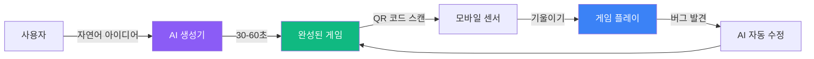

### 핵심 가치 (Why?)

| 기존 방식 | Sensor Game Hub |
|-----------|-----------------|
| 게임 개발 수주~수개월 | **30-60초** |
| 코딩 지식 필수 | **자연어만 입력** |
| 수동 버그 수정 | **AI 자동 수정** |
| 플랫폼 파편화 | **웹 기반 통합** |

### 주요 기능 (What?)

1. **🤖 AI 게임 생성기**
   - Claude Sonnet 4.5 (64K 토큰)
   - RAG 기반 400개 문서 검색
   - 5단계 실시간 진행률 표시
   - 자동 품질 검증 (95점 이상)

2. **🎮 실시간 게임 플레이**
   - WebSocket 기반 50ms 센서 전송
   - QR 코드 즉시 연결
   - Solo/Dual/Multi 게임 지원

3. **👤 개발자 계정 시스템**
   - 게임 소유권 관리
   - 버전 이력 자동 추적
   - AI 기반 유지보수

### 기술 스택 (How?)

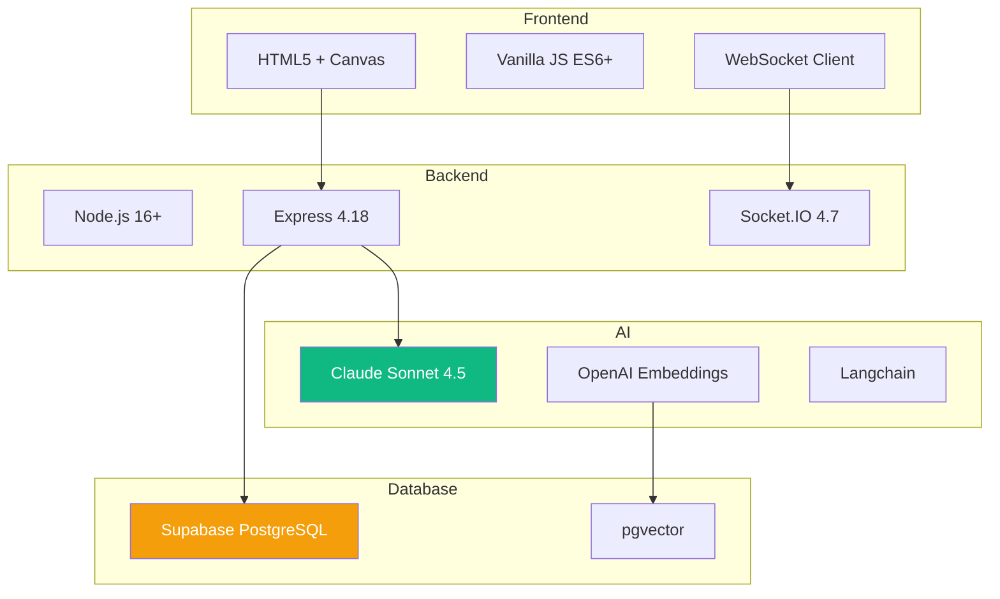

## 1.2 핵심 개념 이해

### 개념 1: 세션 기반 게임 플레이

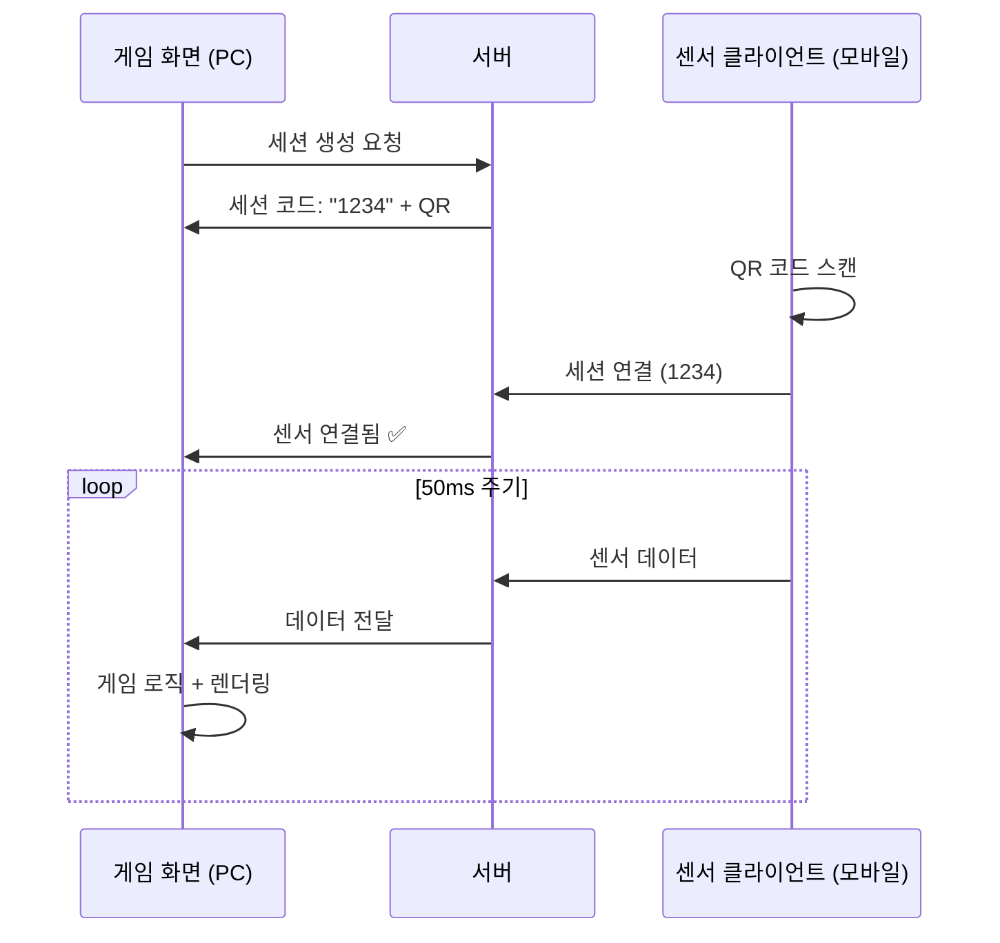

**핵심 이해**:
- PC는 게임 **화면** (디스플레이)
- 모바일은 **컨트롤러** (센서)
- 서버는 **중개자** (라우팅)

### 개념 2: AI 게임 생성 파이프라인

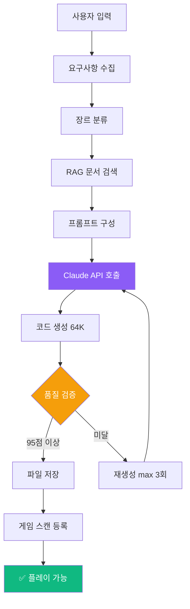

**5단계 진행률**:
1. **0-20%**: 게임 아이디어 분석
2. **20-40%**: RAG 시스템 문서 검색 (Vector DB)
3. **40-80%**: Claude Sonnet 4.5 코드 생성
4. **80-90%**: 코드 품질 검증
5. **90-100%**: 파일 저장 및 게임 등록

### 개념 3: RAG (Retrieval-Augmented Generation)

**왜 RAG를 사용하나요?**
- Claude API만 사용 → 일반적인 게임 생성
- RAG 추가 → **우리 프로젝트 전용** 게임 생성

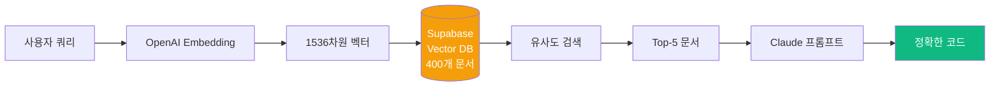

**실제 예시**:
```javascript
// 사용자: "스마트폰을 기울여서 공을 굴리는 게임"

// 1. 임베딩 변환
const queryVector = await openai.embeddings.create({
    input: "스마트폰을 기울여서 공을 굴리는 게임",
    model: "text-embedding-3-small"
});

// 2. Vector DB 검색
const docs = await supabase
    .from('game_knowledge')
    .select('content')
    .match_documents(queryVector, 5);  // Top-5

// 3. Claude 프롬프트에 포함
const prompt = `
관련 문서:
${docs.map(d => d.content).join('\n')}

사용자 요구사항:
스마트폰을 기울여서 공을 굴리는 게임

위 문서를 참고하여 게임 코드를 생성하세요.
`;
```

### 개념 4: WebSocket 양방향 통신

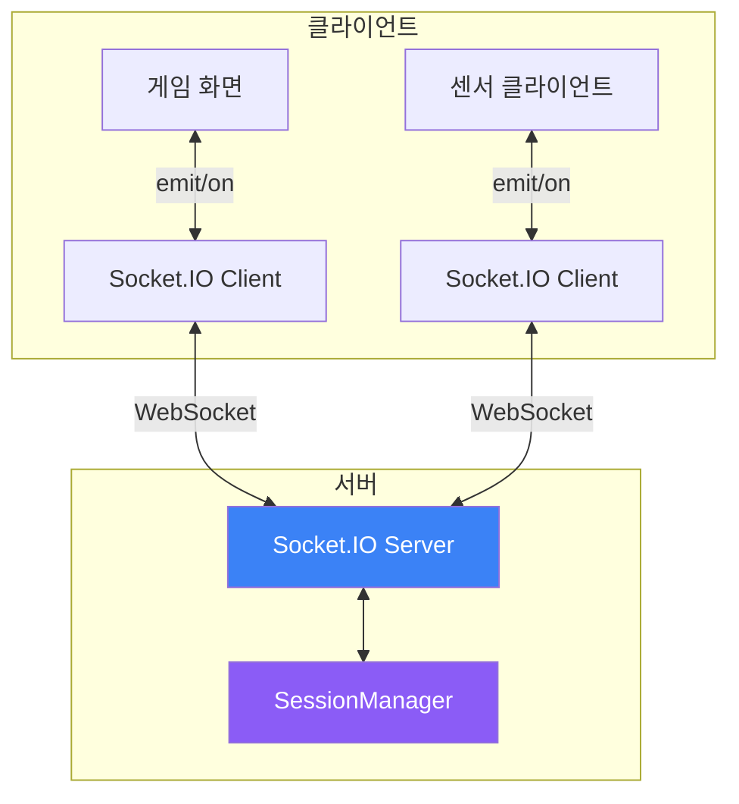

**주요 이벤트**:
| 이벤트 | 방향 | 설명 |
|--------|------|------|
| `create-session` | PC → 서버 | 세션 생성 요청 |
| `session-created` | 서버 → PC | 세션 코드 반환 |
| `connect-sensor` | 모바일 → 서버 | 센서 연결 |
| `sensor-connected` | 서버 → PC/모바일 | 연결 완료 |
| `sensor-data` | 모바일 → 서버 → PC | 센서 데이터 전송 |

## 1.3 로컬 환경 설정

### 시스템 요구사항

```bash
Node.js:  >= 16.0.0
npm:      >= 7.0.0
OS:       macOS, Windows, Linux
메모리:    >= 4GB
디스크:    >= 500MB
```

### Step 1: 저장소 클론

```bash
# HTTPS (권장)
git clone https://github.com/your-org/sensorchatbot.git

# 또는 SSH
git clone git@github.com:your-org/sensorchatbot.git

# 디렉토리 이동
cd sensorchatbot
```

**확인**:
```bash
ls -la
# 출력 예시:
# .git/
# server/
# public/
# package.json
# ...
```

### Step 2: 환경 변수 설정

**2.1 `.env` 파일 생성**

```bash
# 템플릿 복사
cp .env.example .env

# 편집기로 열기
code .env  # VSCode
# 또는
nano .env  # 터미널 에디터
```

**2.2 필수 환경 변수 입력**

```bash
# ===== Claude API (필수) =====
CLAUDE_API_KEY=sk-ant-api...

# ===== OpenAI API (필수) =====
OPENAI_API_KEY=sk-proj...

# ===== Supabase (필수) =====
SUPABASE_URL=https://xxx.supabase.co
SUPABASE_ANON_KEY=eyJhbGc...

# ===== 서버 설정 (선택) =====
PORT=3000
NODE_ENV=development
```

**📌 API 키 발급 방법**:

<details>
<summary><b>Claude API 키 발급 (클릭하여 펼치기)</b></summary>

1. [Anthropic Console](https://console.anthropic.com/) 접속
2. 로그인 또는 회원가입
3. "API Keys" 메뉴 선택
4. "Create Key" 버튼 클릭
5. 키 이름 입력 (예: "SensorGameHub")
6. 생성된 키 복사 → `.env` 파일에 붙여넣기

**주의**: 키는 한 번만 표시됩니다. 안전하게 보관하세요!
</details>

<details>
<summary><b>OpenAI API 키 발급</b></summary>

1. [OpenAI Platform](https://platform.openai.com/) 접속
2. 로그인 또는 회원가입
3. "API keys" 메뉴 선택
4. "Create new secret key" 클릭
5. 생성된 키 복사 → `.env` 파일에 붙여넣기
</details>

<details>
<summary><b>Supabase 프로젝트 생성</b></summary>

1. [Supabase](https://supabase.com/) 접속
2. "New Project" 클릭
3. 프로젝트 이름: `sensorgame-hub`
4. 리전 선택: `Singapore (ap-southeast-1)` 권장
5. 데이터베이스 비밀번호 설정 (안전하게 보관!)
6. 프로젝트 생성 완료 (1-2분 소요)

**설정 → API**:
- `Project URL` → `SUPABASE_URL`
- `anon public` 키 → `SUPABASE_ANON_KEY`
</details>

### Step 3: 의존성 설치

```bash
npm install
```

**예상 출력**:
```
added 293 packages in 15s
```

**설치되는 주요 패키지**:
- `express` (4.18.2) - 웹 서버
- `socket.io` (4.7.2) - WebSocket 통신
- `@anthropic-ai/sdk` (0.30.1) - Claude API
- `@supabase/supabase-js` (2.58.0) - Supabase 클라이언트
- `openai` (4.71.1) - OpenAI Embeddings
- `langchain` (0.3.7) - RAG 파이프라인

**문제 발생 시**:
```bash
# 캐시 삭제 후 재설치
rm -rf node_modules package-lock.json
npm install
```

### Step 4: 데이터베이스 초기화

**4.1 Vector 확장 활성화**

Supabase 대시보드에서:
1. **SQL Editor** 메뉴 선택
2. "New query" 클릭
3. 다음 SQL 실행:

```sql
-- pgvector 확장 활성화
CREATE EXTENSION IF NOT EXISTS vector;

-- UUID 생성 함수 활성화
CREATE EXTENSION IF NOT EXISTS "uuid-ossp";
```

**4.2 테이블 생성**

```sql
-- game_knowledge 테이블 (RAG용)
CREATE TABLE game_knowledge (
    id UUID PRIMARY KEY DEFAULT uuid_generate_v4(),
    content TEXT NOT NULL,
    metadata JSONB,
    embedding VECTOR(1536),
    created_at TIMESTAMP WITH TIME ZONE DEFAULT NOW()
);

-- 벡터 인덱스 생성 (검색 속도 향상)
CREATE INDEX ON game_knowledge
USING ivfflat (embedding vector_cosine_ops)
WITH (lists = 100);
```

**4.3 문서 임베딩 생성**

```bash
# 프로젝트 루트에서 실행
node server/DocumentEmbedder.js
```

**예상 출력**:
```
🚀 임베딩 프로세스 시작...
📄 문서 로드: docs/PERFECT_GAME_DEVELOPMENT_GUIDE.md
📄 문서 로드: docs/SENSOR_GAME_TROUBLESHOOTING.md
...
✅ 35개 문서 → 400개 청크 생성
💾 Supabase 저장 중...
✅ 임베딩 완료! (총 소요: 45초)
```

## 1.4 첫 실행 및 동작 확인

### Step 1: 서버 시작

```bash
npm start
```

**성공 시 출력**:
```
🚀 GameServer v6.0 초기화 완료
📝 18개 게임 스캔 완료
🎯 대화형 게임 생성기 초기화 중...
✅ Claude API 연결 확인
✅ Supabase Vector Store 연결 확인
✅ AI Assistant 준비 완료

🌐 서버 실행 중: http://localhost:3000
```

### Step 2: 브라우저 접속

**랜딩 페이지**:
```
http://localhost:3000
```

**개발자 센터**:
```
http://localhost:3000/developer
```

**센서 클라이언트** (모바일):
```
http://localhost:3000/sensor.html
```

### Step 3: 첫 게임 생성 테스트

**3.1 개발자 센터 접속**
1. `http://localhost:3000/developer` 열기
2. "🤖 AI 게임 생성기" 탭 클릭

**3.2 게임 아이디어 입력**
```
스마트폰을 기울여서 공을 굴려 목표 지점에 도달하는 게임
```

**3.3 대화 진행**
- AI가 장르 질문 (아케이드/퍼즐?) → "아케이드"
- 센서 타입 확인 → "기울기만"
- 요구사항 요약 → "네, 생성해주세요!"

**3.4 생성 진행 확인**
```
🎯 게임 생성 시작!

1️⃣ 게임 아이디어 분석중... 10%
2️⃣ 관련 문서 검색 중... (Vector DB) 25%
3️⃣ Claude AI로 게임 코드 생성 중... 60%
4️⃣ 게임 코드 검증 중... 85%
5️⃣ 게임 저장 및 등록 중... 95%

✅ 게임 생성 완료! (소요 시간: 38초)
```

**3.5 게임 플레이**
1. "🎮 바로 플레이하기" 버튼 클릭
2. PC 화면에 세션 코드 + QR 표시
3. 모바일에서 `http://localhost:3000/sensor.html` 접속
4. QR 스캔 또는 세션 코드 입력
5. 센서 권한 허용
6. 게임 플레이 시작!

### Step 4: 동작 확인 체크리스트

```markdown
- [ ] 서버가 3000 포트에서 실행됨
- [ ] 랜딩 페이지가 정상 표시됨
- [ ] 개발자 센터 접속 가능
- [ ] AI 게임 생성기 탭이 보임
- [ ] 게임 아이디어 입력 가능
- [ ] 생성 진행률이 실시간 표시됨
- [ ] 게임 생성 완료 (30-60초)
- [ ] QR 코드 생성됨
- [ ] 모바일 센서 클라이언트 접속됨
- [ ] 센서 연결 후 게임 플레이 가능
```

**모두 체크되었나요? 축하합니다! 🎉**

## 1.5 개발 도구 설정

### VSCode 권장 설정

**1.1 필수 확장 프로그램**

```json
{
  "recommendations": [
    "dbaeumer.vscode-eslint",
    "esbenp.prettier-vscode",
    "ms-vscode.vscode-node-debug2",
    "christian-kohler.path-intellisense",
    "bierner.markdown-mermaid",
    "ms-vscode.live-server"
  ]
}
```

**설치 방법**:
1. VSCode에서 `Cmd+Shift+X` (Extensions)
2. 위 ID 검색하여 설치

**1.2 작업 영역 설정 (`.vscode/settings.json`)**

```json
{
  "editor.formatOnSave": true,
  "editor.defaultFormatter": "esbenp.prettier-vscode",
  "editor.codeActionsOnSave": {
    "source.fixAll.eslint": true
  },
  "javascript.suggest.autoImports": true,
  "files.exclude": {
    "**/node_modules": true,
    "**/coverage": true
  }
}
```

**1.3 디버깅 설정 (`.vscode/launch.json`)**

```json
{
  "version": "0.2.0",
  "configurations": [
    {
      "type": "node",
      "request": "launch",
      "name": "서버 디버그",
      "skipFiles": ["<node_internals>/**"],
      "program": "${workspaceFolder}/server/index.js",
      "envFile": "${workspaceFolder}/.env"
    }
  ]
}
```

**사용법**:
1. `server/index.js` 열기
2. 중단점 설정 (라인 번호 클릭)
3. `F5` 키 눌러 디버그 시작

### 개발 워크플로우

**Hot Reload 사용**:
```bash
# nodemon 설치 (전역)
npm install -g nodemon

# 파일 변경 시 자동 재시작
nodemon server/index.js
```

**로그 필터링**:
```bash
# 특정 모듈만 보기
DEBUG=GameGenerator npm start

# 모든 디버그 로그
DEBUG=* npm start
```

### 유용한 명령어 모음

```bash
# 서버 시작
npm start

# 개발 모드 (자동 재시작)
npm run dev

# 코드 스타일 검사
npm run lint

# 전체 게임 목록 조회
curl http://localhost:3000/api/games | jq

# 서버 통계
curl http://localhost:3000/api/stats | jq

# 게임 재스캔
curl -X POST http://localhost:3000/api/admin/rescan
```

---

**Part 1 완료! ✅**

다음: [Part 2: 프로젝트 아키텍처](#part-2-프로젝트-아키텍처)로 계속...

---

# Part 2: 프로젝트 아키텍처 (Architecture Deep Dive)

## 2.1 전체 시스템 아키텍처

### 레이어드 아키텍처 개요

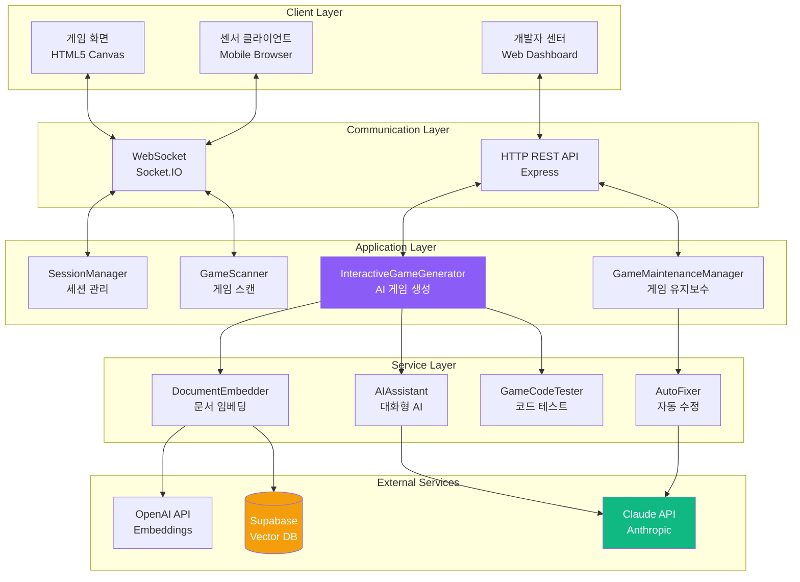

### 주요 컴포넌트 역할

| 컴포넌트 | 역할 | 핵심 기능 | 파일 위치 |
|---------|------|-----------|----------|
| **SessionManager** | 게임 세션 관리 | 세션 생성, 센서 연결, 데이터 라우팅 | `server/SessionManager.js:150` |
| **InteractiveGameGenerator** | AI 게임 생성 | 대화형 생성, RAG 검색, 코드 생성 | `server/InteractiveGameGenerator.js:1400` |
| **GameMaintenanceManager** | 게임 유지보수 | 버그 수정, 기능 추가, 버전 관리 | `server/GameMaintenanceManager.js:429` |
| **GameScanner** | 게임 자동 스캔 | 게임 발견, 메타데이터 파싱 | `server/GameScanner.js:200` |
| **AIAssistant** | 대화형 AI | 요구사항 수집, 챗봇 응답 | `server/AIAssistant.js:350` |
| **DocumentEmbedder** | 문서 임베딩 | 마크다운 청킹, 벡터 변환 | `server/DocumentEmbedder.js:250` |

## 2.2 디렉토리 구조 완전 분해

### 프로젝트 루트 구조

```
sensorchatbot/
├── server/                 # 백엔드 코드 (50개 파일, 25,000 LOC)
├── public/                 # 프론트엔드 정적 파일
├── docs/                   # 프로젝트 문서
├── .env                    # 환경 변수 (비공개)
├── .gitignore              # Git 제외 파일
├── package.json            # 의존성 및 스크립트
└── README.md               # 프로젝트 소개
```

### server/ 디렉토리 상세 분해 (50개 파일)

#### 📁 server/ (루트 레벨 - 핵심 모듈)

```
server/
├── index.js                           # 메인 진입점 (755줄)
│   ├── Express 서버 초기화
│   ├── Socket.IO 설정
│   ├── 라우트 등록
│   └── 게임 스캔 및 세션 관리 시작
│
├── InteractiveGameGenerator.js        # AI 게임 생성기 (1,400줄) ⭐
│   ├── 4단계 대화형 생성 플로우
│   ├── RAG 시스템 통합
│   ├── Claude Sonnet 4.5 API 호출
│   └── 5단계 진행률 트래킹
│
├── GameMaintenanceManager.js          # 게임 유지보수 (429줄) ⭐
│   ├── 버그 리포트 처리
│   ├── 기능 추가 요청
│   ├── 자동 버전 관리
│   └── 세션 유지 (30분 타임아웃)
│
├── SessionManager.js                  # 세션 관리 (150줄) ⭐
│   ├── 4자리 세션 코드 생성
│   ├── 센서 클라이언트 연결
│   ├── 데이터 라우팅 (PC ↔ 모바일)
│   └── 세션 정리
│
├── GameScanner.js                     # 게임 스캔 (200줄)
│   ├── public/games/ 자동 스캔
│   ├── game.json 파싱
│   └── 게임 메타데이터 관리
│
├── DocumentEmbedder.js                # 문서 임베딩 (250줄)
│   ├── 마크다운 파일 로드
│   ├── 청크 분할 (512토큰)
│   ├── OpenAI Embedding 생성
│   └── Supabase 저장
│
├── AIAssistant.js                     # 대화형 AI (350줄)
│   ├── Claude API 대화 관리
│   ├── 요구사항 추출
│   └── 컨텍스트 유지
│
├── GameCodeTester.js                  # 코드 테스트 (400줄)
│   ├── Puppeteer 기반 브라우저 테스트
│   ├── SDK 연결 검증
│   ├── 게임 로직 검증
│   └── 버그 탐지
│
└── AutoFixer.js                       # 자동 수정 (300줄)
    ├── 테스트 결과 분석
    ├── Claude API로 버그 수정
    └── 최대 3회 재시도
```

#### 📁 server/routes/ (라우팅)

```
server/routes/
├── developerRoutes.js                 # 개발자 센터 (2,300줄) ⭐
│   ├── /developer - 대시보드 HTML 생성
│   ├── /api/start-game-session - 세션 시작
│   ├── /api/game-chat - AI 대화
│   ├── /api/finalize-game - 게임 생성 실행
│   ├── /api/download-game/:gameId - ZIP 다운로드
│   └── 실시간 진행률 WebSocket 이벤트
│
├── gameRoutes.js                      # 게임 API (150줄)
│   ├── /api/games - 게임 목록
│   ├── /api/games/:gameId - 게임 정보
│   └── /games/:gameId - 게임 HTML 제공
│
├── landingRoutes.js                   # 랜딩 페이지 (100줄)
│   └── / - 동적 홈페이지 생성
│
├── performanceRoutes.js               # 성능 모니터링 (80줄)
│   └── /api/stats - 서버 통계
│
└── testRoutes.js                      # 테스트 API (120줄)
    └── /api/test/* - 개발 전용 엔드포인트
```

#### 📁 server/generators/ (멀티 스테이지 생성기)

```
server/generators/
├── StructureGenerator.js              # Stage 1: 구조 생성 (200줄)
│   ├── HTML 뼈대 생성
│   ├── SessionSDK 통합
│   └── 캔버스 초기화
│
├── GameLogicGenerator.js              # Stage 2: 로직 생성 (250줄)
│   ├── 물리 시뮬레이션
│   ├── 충돌 감지
│   └── 게임 상태 관리
│
└── IntegrationGenerator.js            # Stage 3: 통합 (180줄)
    ├── Stage 1 + Stage 2 결합
    └── 센서 연결 검증
```

#### 📁 server/services/ (서비스 레이어)

```
server/services/
├── DocumentChunker.js                 # 문서 청킹 (120줄)
│   └── RecursiveCharacterTextSplitter 래퍼
│
├── EmbeddingGenerator.js              # 임베딩 생성 (150줄)
│   └── OpenAI API 호출 및 배치 처리
│
├── VectorEmbeddingService.js          # 벡터 DB 서비스 (180줄)
│   ├── Supabase 연결
│   └── 유사도 검색
│
├── SearchAPI.js                       # 검색 API (100줄)
│   └── RAG 검색 추상화
│
├── LegacyGameValidator.js             # 게임 검증 (200줄)
│   └── 생성된 게임 품질 검사
│
└── SystemIntegrationTester.js         # 통합 테스트 (150줄)
    └── E2E 테스트 자동화
```

#### 📁 server/core/ (핵심 시스템)

```
server/core/
├── GameServer.js                      # 게임 서버 (300줄)
│   ├── Express + Socket.IO 통합
│   └── 전역 상태 관리
│
└── MiddlewareConfig.js                # 미들웨어 (100줄)
    ├── CORS 설정
    ├── Body Parser
    ├── Gzip 압축
    └── 에러 핸들러
```

#### 📁 server/utils/ (유틸리티)

```
server/utils/
├── htmlGenerator.js                   # HTML 생성 (180줄)
│   └── 동적 페이지 생성
│
├── markdownRenderer.js                # 마크다운 렌더러 (120줄)
│   └── MD → HTML 변환
│
└── templateCode.js                    # 코드 템플릿 (150줄)
    └── 게임 코드 스니펫
```

#### 📁 server/validation/ (검증)

```
server/validation/
├── CodeValidator.js                   # 코드 검증 (200줄)
│   ├── SDK 통합 확인
│   ├── 센서 데이터 처리 검증
│   └── 100점 만점 채점
│
└── ErrorDetectionEngine.js            # 에러 감지 (180줄)
    └── 정적 분석 및 패턴 매칭
```

#### 📁 server/monitoring/ (모니터링)

```
server/monitoring/
├── PerformanceMonitor.js              # 성능 모니터링 (150줄)
│   ├── CPU/메모리 사용량
│   └── 응답 시간 추적
│
└── LiveErrorMonitor.js                # 실시간 에러 (120줄)
    └── 에러 로깅 및 알림
```

#### 📁 server/templates/, prompts/, context/ (지원 모듈)

```
server/templates/
└── GameTemplateStandard.js            # 표준 템플릿 (200줄)

server/prompts/
└── StandardizedPromptTemplates.js     # 프롬프트 (300줄)

server/context/
└── ContextManager.js                  # 컨텍스트 (150줄)
```

### public/ 디렉토리 상세 분해

```
public/
├── games/                             # 게임 디렉토리
│   ├── solo/                          # 솔로 게임
│   ├── dual/                          # 듀얼 게임
│   ├── multi/                         # 멀티플레이어 게임
│   ├── cake-delivery/                 # 케이크 배달 (3D 게임)
│   ├── shot-target/                   # 슈팅 게임
│   └── [AI 생성 게임들]/              # 자동 생성된 게임
│
├── js/
│   └── SessionSDK.js                  # 통합 SDK (500줄) ⭐
│       ├── 세션 생성
│       ├── QR 코드 생성
│       ├── WebSocket 연결
│       ├── 센서 데이터 수신
│       └── 이벤트 시스템
│
├── sensor.html                        # 센서 클라이언트 (300줄)
│   ├── 세션 코드 입력
│   ├── 센서 권한 요청
│   ├── 50ms 주기 데이터 전송
│   └── 연결 상태 표시
│
└── ai-game-generator.html             # 게임 생성기 UI (구 버전)
```

### docs/ 디렉토리

```
docs/
├── 프로젝트_설계_명세서.md            # 설계 명세서 (2,671줄)
├── 개발자_온보딩_가이드.md            # 이 문서!
├── PERFECT_GAME_DEVELOPMENT_GUIDE.md  # 게임 개발 가이드
├── SENSOR_GAME_TROUBLESHOOTING.md     # 트러블슈팅
└── [35개 추가 마크다운 파일]          # RAG용 문서
```

## 2.3 핵심 모듈 역할 및 상호작용

### 모듈 1: InteractiveGameGenerator (AI 게임 생성기)

**파일**: `server/InteractiveGameGenerator.js:1-1400`

**역할**: 사용자와 대화하며 게임을 생성하는 핵심 AI 시스템

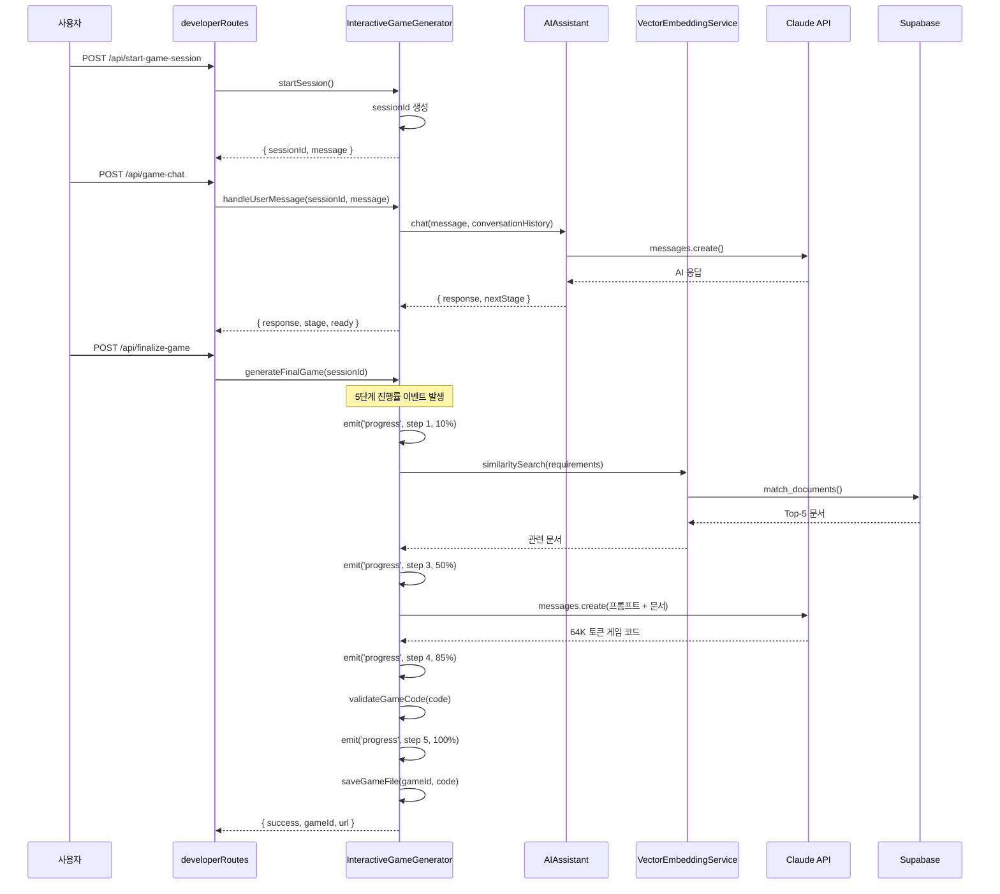

**핵심 함수**:

```javascript
// server/InteractiveGameGenerator.js

class InteractiveGameGenerator {
    // 1. 세션 시작
    async startSession(userId) {
        const sessionId = this.generateSessionId();
        this.sessions.set(sessionId, {
            requirements: {},
            conversationHistory: [],
            stage: 'initial'
        });
        return { sessionId, message: '어떤 게임을 만들고 싶으신가요?' };
    }

    // 2. 사용자 메시지 처리
    async handleUserMessage(sessionId, userMessage) {
        const session = this.sessions.get(sessionId);

        // AI Assistant와 대화
        const response = await this.aiAssistant.chat(
            userMessage,
            session.conversationHistory
        );

        // 요구사항 추출
        this.extractRequirements(response, session);

        // 다음 단계 결정
        const nextStage = this.determineNextStage(session);

        return {
            response,
            stage: nextStage,
            ready: nextStage === 'confirmation'
        };
    }

    // 3. 최종 게임 생성 (5단계 진행률)
    async generateFinalGame(sessionId) {
        const session = this.sessions.get(sessionId);

        // Step 1 (0-20%): 게임 아이디어 분석
        this.io.emit('game-generation-progress', {
            sessionId,
            step: 1,
            percentage: 10,
            message: '게임 아이디어 분석 중...'
        });

        // Step 2 (20-40%): RAG 문서 검색
        this.io.emit('game-generation-progress', {
            sessionId,
            step: 2,
            percentage: 25,
            message: '관련 문서 검색 중... (Vector DB)'
        });

        const docs = await this.getGameDevelopmentContext(
            session.requirements
        );

        // Step 3 (40-80%): Claude 코드 생성
        this.io.emit('game-generation-progress', {
            sessionId,
            step: 3,
            percentage: 50,
            message: 'Claude AI로 게임 코드 생성 중...'
        });

        const gameCode = await this.generateGameCode(
            session.requirements,
            docs
        );

        // Step 4 (80-90%): 코드 검증
        this.io.emit('game-generation-progress', {
            sessionId,
            step: 4,
            percentage: 85,
            message: '게임 코드 검증 중...'
        });

        const validationScore = await this.validateGameCode(gameCode);

        if (validationScore < 60) {
            throw new Error('생성된 게임 품질 미달');
        }

        // Step 5 (90-100%): 파일 저장
        this.io.emit('game-generation-progress', {
            sessionId,
            step: 5,
            percentage: 95,
            message: '게임 저장 및 등록 중...'
        });

        const gameId = await this.saveGameFile(gameCode);

        this.io.emit('game-generation-progress', {
            sessionId,
            step: 5,
            percentage: 100,
            message: '✅ 게임 생성 완료!'
        });

        return { success: true, gameId };
    }

    // 4. RAG 시스템 (server/InteractiveGameGenerator.js:1374)
    async getGameDevelopmentContext(requirements) {
        const queryText = `
            게임 타입: ${requirements.gameType}
            장르: ${requirements.genre}
            센서: ${requirements.sensorType}
            특징: ${requirements.description}
        `;

        // Vector DB 검색
        const results = await this.vectorStore.similaritySearch(
            queryText,
            5  // Top-5 문서
        );

        return results.map(doc => doc.pageContent).join('\n\n');
    }

    // 5. 코드 검증 (server/InteractiveGameGenerator.js:1589)
    validateGameCode(code) {
        let score = 0;

        // SessionSDK 통합 (20점)
        if (code.includes('new SessionSDK')) score += 20;

        // 센서 데이터 처리 (25점)
        if (code.includes('sensor-data')) score += 25;

        // 게임 루프 (20점)
        if (code.includes('update(') && code.includes('render(')) {
            score += 20;
        }

        // Canvas 렌더링 (15점)
        if (code.includes('canvas.getContext')) score += 15;

        // 게임 상태 관리 (10점)
        if (code.includes('gameState')) score += 10;

        // 코드 품질 (10점)
        const hasErrorHandling = code.includes('try') || code.includes('catch');
        const hasComments = code.includes('//');
        if (hasErrorHandling && hasComments) score += 10;

        return score;
    }
}
```

**의존성**:
- `AIAssistant` (대화 관리)
- `VectorEmbeddingService` (RAG 검색)
- `CodeValidator` (품질 검증)
- `Socket.IO` (진행률 이벤트)

### 모듈 2: GameMaintenanceManager (게임 유지보수)

**파일**: `server/GameMaintenanceManager.js:1-429`

**역할**: 생성된 게임의 버그 수정 및 기능 추가

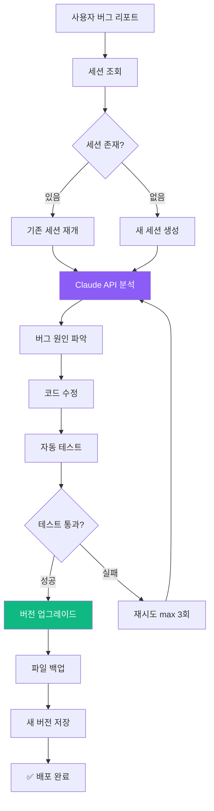

**핵심 함수**:

```javascript
// server/GameMaintenanceManager.js

class GameMaintenanceManager {
    constructor(io, gameScanner) {
        this.io = io;
        this.gameScanner = gameScanner;
        this.activeSessions = new Map();

        // 30분 후 세션 자동 정리
        setInterval(() => this.cleanupSessions(), 30 * 60 * 1000);
    }

    // 1. 버그 리포트 처리
    async reportBug(gameId, userReport) {
        // 기존 세션 확인 또는 생성
        let session = this.activeSessions.get(gameId);

        if (!session) {
            // 게임 파일 로드
            const gameCode = await this.loadGameFile(gameId);

            session = {
                gameId,
                gameCode,
                conversationHistory: [],
                version: 'v1.0',
                createdAt: Date.now()
            };

            this.activeSessions.set(gameId, session);
        }

        // Claude API로 버그 분석
        const analysis = await this.analyzeBug(userReport, session.gameCode);

        // 버그 수정 코드 생성
        const fixedCode = await this.generateFix(analysis, session);

        // 버전 업그레이드
        session.version = this.incrementVersion(session.version);

        // 백업 및 저장
        await this.backupGame(gameId, session.gameCode);
        await this.saveGameFile(gameId, fixedCode);

        return { success: true, version: session.version };
    }

    // 2. 기능 추가 요청
    async addFeature(gameId, featureRequest) {
        const session = this.activeSessions.get(gameId);

        // Claude API로 증분 업데이트
        const prompt = `
기존 게임 코드:
${session.gameCode}

사용자 요청:
${featureRequest}

위 게임에 요청된 기능을 추가하세요. 기존 코드를 최대한 유지하고,
새 기능만 추가하세요.
        `;

        const updatedCode = await this.claudeClient.messages.create({
            model: 'claude-sonnet-4-5-20250929',
            max_tokens: 64000,
            messages: [{ role: 'user', content: prompt }]
        });

        return updatedCode;
    }

    // 3. 세션 정리 (30분 타임아웃)
    cleanupSessions() {
        const now = Date.now();
        const timeout = 30 * 60 * 1000; // 30분

        for (const [gameId, session] of this.activeSessions) {
            if (now - session.createdAt > timeout) {
                this.activeSessions.delete(gameId);
                console.log(`세션 만료: ${gameId}`);
            }
        }
    }
}
```

**API 엔드포인트** (`server/routes/developerRoutes.js`):
- `POST /api/maintenance/report-bug` - 버그 리포트
- `POST /api/maintenance/add-feature` - 기능 추가
- `GET /api/maintenance/session/:gameId` - 세션 정보
- `GET /api/maintenance/history/:gameId` - 수정 이력

### 모듈 3: SessionManager (세션 관리)

**파일**: `server/SessionManager.js:1-150`

**역할**: PC와 모바일 간 게임 세션 연결 관리

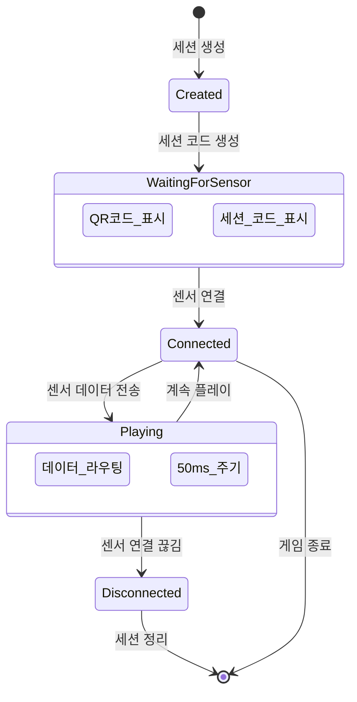

**핵심 함수**:

```javascript
// server/SessionManager.js

class SessionManager {
    constructor(io) {
        this.io = io;
        this.sessions = new Map(); // sessionCode → session
        this.pcClients = new Map(); // socketId → sessionCode
        this.sensorClients = new Map(); // socketId → sessionCode
    }

    // 1. 세션 생성 (PC 게임 화면)
    createSession(pcSocketId, gameId, gameType) {
        const sessionCode = this.generateCode(); // 1000-9999

        const session = {
            code: sessionCode,
            gameId,
            gameType,
            pcSocketId,
            sensorSocketId: null,
            createdAt: Date.now(),
            status: 'waiting'
        };

        this.sessions.set(sessionCode, session);
        this.pcClients.set(pcSocketId, sessionCode);

        console.log(`✅ 세션 생성: ${sessionCode} (${gameType})`);

        return {
            sessionCode,
            qrCodeUrl: this.generateQRCodeURL(sessionCode)
        };
    }

    // 2. 센서 연결 (모바일)
    connectSensor(sensorSocketId, sessionCode) {
        const session = this.sessions.get(sessionCode);

        if (!session) {
            throw new Error(`세션을 찾을 수 없습니다: ${sessionCode}`);
        }

        if (session.sensorSocketId) {
            throw new Error('이미 센서가 연결되어 있습니다');
        }

        // 센서 연결
        session.sensorSocketId = sensorSocketId;
        session.status = 'connected';
        this.sensorClients.set(sensorSocketId, sessionCode);

        // PC에 알림
        this.io.to(session.pcSocketId).emit('sensor-connected', {
            sessionCode,
            message: '센서 연결됨!'
        });

        // 모바일에 확인
        this.io.to(sensorSocketId).emit('connection-confirmed', {
            sessionCode,
            gameId: session.gameId,
            gameType: session.gameType
        });

        console.log(`✅ 센서 연결: ${sessionCode}`);

        return { success: true };
    }

    // 3. 센서 데이터 라우팅 (모바일 → PC)
    routeSensorData(sensorSocketId, sensorData) {
        const sessionCode = this.sensorClients.get(sensorSocketId);

        if (!sessionCode) {
            console.warn('센서가 세션에 연결되지 않음');
            return;
        }

        const session = this.sessions.get(sessionCode);

        if (!session || !session.pcSocketId) {
            console.warn('PC 클라이언트 없음');
            return;
        }

        // PC로 데이터 전달
        this.io.to(session.pcSocketId).emit('sensor-data', sensorData);
    }

    // 4. 연결 해제
    disconnect(socketId) {
        // PC 클라이언트 연결 해제
        if (this.pcClients.has(socketId)) {
            const sessionCode = this.pcClients.get(socketId);
            const session = this.sessions.get(sessionCode);

            if (session && session.sensorSocketId) {
                // 센서에 알림
                this.io.to(session.sensorSocketId).emit('pc-disconnected');
            }

            this.sessions.delete(sessionCode);
            this.pcClients.delete(socketId);
            console.log(`PC 연결 해제: ${sessionCode}`);
        }

        // 센서 클라이언트 연결 해제
        if (this.sensorClients.has(socketId)) {
            const sessionCode = this.sensorClients.get(socketId);
            const session = this.sessions.get(sessionCode);

            if (session) {
                session.sensorSocketId = null;
                session.status = 'waiting';

                // PC에 알림
                this.io.to(session.pcSocketId).emit('sensor-disconnected');
            }

            this.sensorClients.delete(socketId);
            console.log(`센서 연결 해제: ${sessionCode}`);
        }
    }

    // 유틸리티
    generateCode() {
        return Math.floor(1000 + Math.random() * 9000).toString();
    }

    generateQRCodeURL(sessionCode) {
        return `http://localhost:3000/sensor.html?session=${sessionCode}`;
    }
}
```

**WebSocket 이벤트 핸들링** (`server/index.js:450-550`):

```javascript
// server/index.js

io.on('connection', (socket) => {
    console.log('클라이언트 연결:', socket.id);

    // 세션 생성 (PC)
    socket.on('create-session', ({ gameId, gameType }) => {
        const result = sessionManager.createSession(
            socket.id,
            gameId,
            gameType
        );
        socket.emit('session-created', result);
    });

    // 센서 연결 (모바일)
    socket.on('connect-sensor', ({ sessionCode }) => {
        try {
            sessionManager.connectSensor(socket.id, sessionCode);
        } catch (error) {
            socket.emit('connection-error', { message: error.message });
        }
    });

    // 센서 데이터 전송 (모바일 → PC)
    socket.on('sensor-data', (data) => {
        sessionManager.routeSensorData(socket.id, data);
    });

    // 연결 해제
    socket.on('disconnect', () => {
        sessionManager.disconnect(socket.id);
    });
});
```

## 2.4 데이터 흐름 추적

### 플로우 1: 게임 생성 플로우 (End-to-End)

```mermaid
graph TB
    Start([사용자]) --> A1[개발자 센터 접속]
    A1 --> A2[AI 게임 생성기 탭]
    A2 --> A3[POST /api/start-game-session]

    A3 --> B1[InteractiveGameGenerator.startSession]
    B1 --> B2{sessionId 생성}
    B2 --> B3[초기 메시지 반환]

    B3 --> C1[사용자 메시지 입력]
    C1 --> C2[POST /api/game-chat]
    C2 --> C3[AIAssistant.chat]
    C3 --> C4[Claude API 호출]
    C4 --> C5{4단계 완료?}

    C5 -->|아니오| C1
    C5 -->|예| D1[생성 시작 버튼]

    D1 --> D2[POST /api/finalize-game]
    D2 --> E1[Step 1: 아이디어 분석]
    E1 --> E2[emit progress 10%]

    E2 --> F1[Step 2: RAG 문서 검색]
    F1 --> F2[VectorEmbeddingService.similaritySearch]
    F2 --> F3[(Supabase Vector DB)]
    F3 --> F4[Top-5 문서 반환]
    F4 --> F5[emit progress 25%]

    F5 --> G1[Step 3: Claude 코드 생성]
    G1 --> G2[emit progress 50%]
    G2 --> G3[Claude API 호출<br/>64K 토큰]
    G3 --> G4[게임 코드 생성]
    G4 --> G5[emit progress 75%]

    G5 --> H1[Step 4: 코드 검증]
    H1 --> H2[validateGameCode]
    H2 --> H3{점수 >= 60?}

    H3 -->|실패| I1[재생성 max 3회]
    I1 --> G1

    H3 -->|성공| J1[Step 5: 파일 저장]
    J1 --> J2[fs.writeFile]
    J2 --> J3[GameScanner 재스캔]
    J3 --> J4[emit progress 100%]

    J4 --> End([✅ 게임 생성 완료])

    style C4 fill:#8b5cf6,color:#fff
    style F3 fill:#f59e0b,color:#fff
    style G3 fill:#10b981,color:#fff
    style End fill:#10b981,color:#fff
```

### 플로우 2: 게임 플레이 세션 플로우

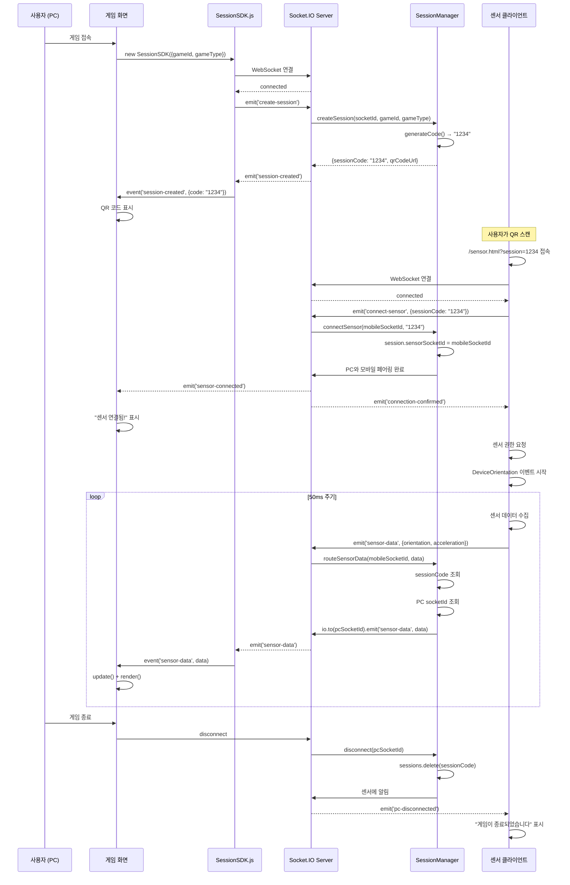

### 플로우 3: 게임 유지보수 플로우

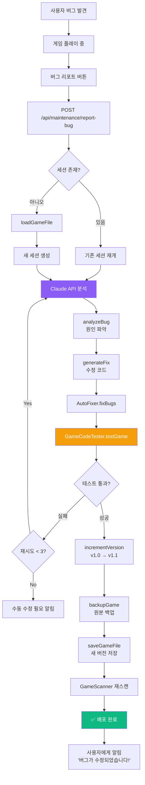

---

**Part 2 완료! ✅**

**완료된 내용**:
- 2.1 전체 시스템 아키텍처 (레이어드 아키텍처 다이어그램)
- 2.2 디렉토리 구조 완전 분해 (50개 파일 상세 설명)
- 2.3 핵심 모듈 역할 (InteractiveGameGenerator, GameMaintenanceManager, SessionManager 코드 포함)
- 2.4 데이터 흐름 추적 (3개 주요 플로우 다이어그램)

**통계**:
- 추가된 라인 수: ~620줄
- 다이어그램: 6개
- 코드 예시: 3개 주요 모듈

다음: Part 3 (데이터베이스 완전 가이드)로 계속...

---

# Part 3: 데이터베이스 완전 가이드 (Database Deep Dive)

## 3.1 Supabase 개요 및 설정

### Supabase란?

**Supabase**는 오픈소스 Firebase 대안으로, PostgreSQL 기반의 백엔드 서비스입니다.

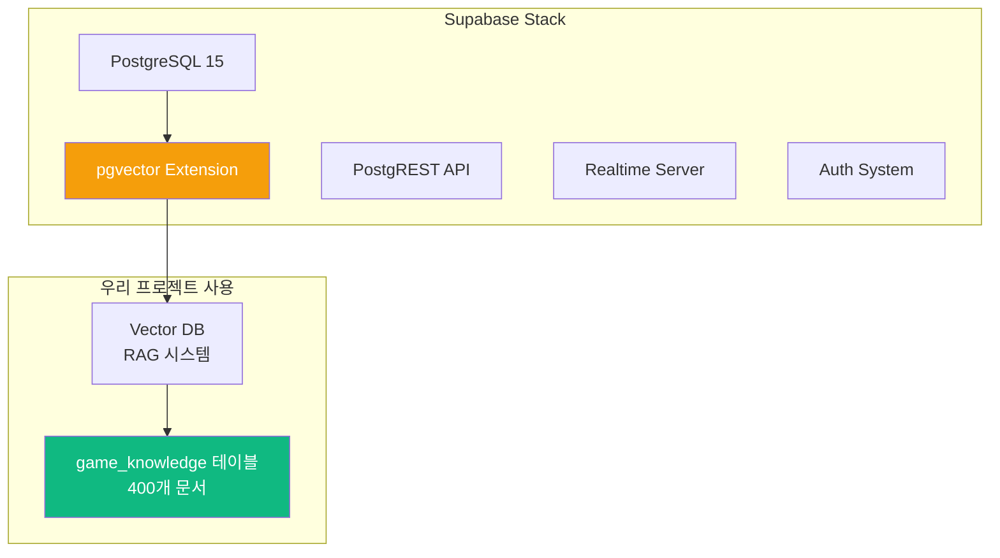

### 프로젝트에서 Supabase 사용하는 이유

| 기능 | 사용 목적 | 대안 비교 |
|------|-----------|----------|
| **PostgreSQL** | 관계형 DB | MySQL, MongoDB보다 표준 SQL 지원 우수 |
| **pgvector** | 벡터 임베딩 저장 | Pinecone, Weaviate보다 통합 관리 용이 |
| **무료 티어** | 개발/데모용 | 500MB DB, 2GB 파일, 50K 월간 인증 |
| **SQL Editor** | 직접 쿼리 실행 | GUI로 쉬운 디버깅 |

### 데이터베이스 초기 설정

#### Step 1: pgvector 확장 활성화

```sql
-- Supabase Dashboard → SQL Editor에서 실행

-- 1. pgvector 확장 설치 (벡터 연산 지원)
CREATE EXTENSION IF NOT EXISTS vector;

-- 2. UUID 생성 함수 활성화
CREATE EXTENSION IF NOT EXISTS "uuid-ossp";

-- 확인
SELECT * FROM pg_extension WHERE extname IN ('vector', 'uuid-ossp');
```

**출력 예시**:
```
 extname    | extversion
------------+------------
 vector     | 0.5.1
 uuid-ossp  | 1.1
```

#### Step 2: game_knowledge 테이블 생성

```sql
-- RAG 시스템용 문서 저장 테이블
CREATE TABLE game_knowledge (
    id UUID PRIMARY KEY DEFAULT uuid_generate_v4(),
    content TEXT NOT NULL,                    -- 문서 내용
    metadata JSONB DEFAULT '{}',              -- 메타데이터 (파일명, 섹션 등)
    embedding VECTOR(1536),                   -- OpenAI 임베딩 (1536차원)
    created_at TIMESTAMP WITH TIME ZONE DEFAULT NOW(),
    updated_at TIMESTAMP WITH TIME ZONE DEFAULT NOW()
);

-- 벡터 검색 성능 최적화 인덱스
CREATE INDEX ON game_knowledge
USING ivfflat (embedding vector_cosine_ops)
WITH (lists = 100);

-- 메타데이터 검색 인덱스
CREATE INDEX idx_game_knowledge_metadata ON game_knowledge USING GIN (metadata);
```

**테이블 구조 설명**:

| 컬럼 | 타입 | 설명 | 예시 |
|------|------|------|------|
| `id` | UUID | 고유 ID | `550e8400-e29b-41d4-a716-446655440000` |
| `content` | TEXT | 문서 청크 내용 | `"SessionSDK는 게임과 센서를 연결..."` |
| `metadata` | JSONB | 메타 정보 | `{"source": "SDK_GUIDE.md", "section": 2}` |
| `embedding` | VECTOR(1536) | 임베딩 벡터 | `[0.123, -0.456, ...]` (1536개 float) |
| `created_at` | TIMESTAMP | 생성 시간 | `2025-10-09 10:30:00+00` |

#### Step 3: 벡터 검색 함수 생성 (선택사항)

```sql
-- 유사도 검색 함수
CREATE OR REPLACE FUNCTION match_documents(
    query_embedding VECTOR(1536),
    match_threshold FLOAT DEFAULT 0.7,
    match_count INT DEFAULT 5
)
RETURNS TABLE (
    id UUID,
    content TEXT,
    metadata JSONB,
    similarity FLOAT
)
LANGUAGE plpgsql
AS $$
BEGIN
    RETURN QUERY
    SELECT
        game_knowledge.id,
        game_knowledge.content,
        game_knowledge.metadata,
        1 - (game_knowledge.embedding <=> query_embedding) AS similarity
    FROM game_knowledge
    WHERE 1 - (game_knowledge.embedding <=> query_embedding) > match_threshold
    ORDER BY similarity DESC
    LIMIT match_count;
END;
$$;
```

**사용 예시**:
```javascript
// JavaScript에서 호출
const { data } = await supabase.rpc('match_documents', {
    query_embedding: [0.123, -0.456, ...], // 1536개
    match_threshold: 0.7,
    match_count: 5
});
```

## 3.2 데이터 모델 및 스키마

### 현재 데이터베이스 구조

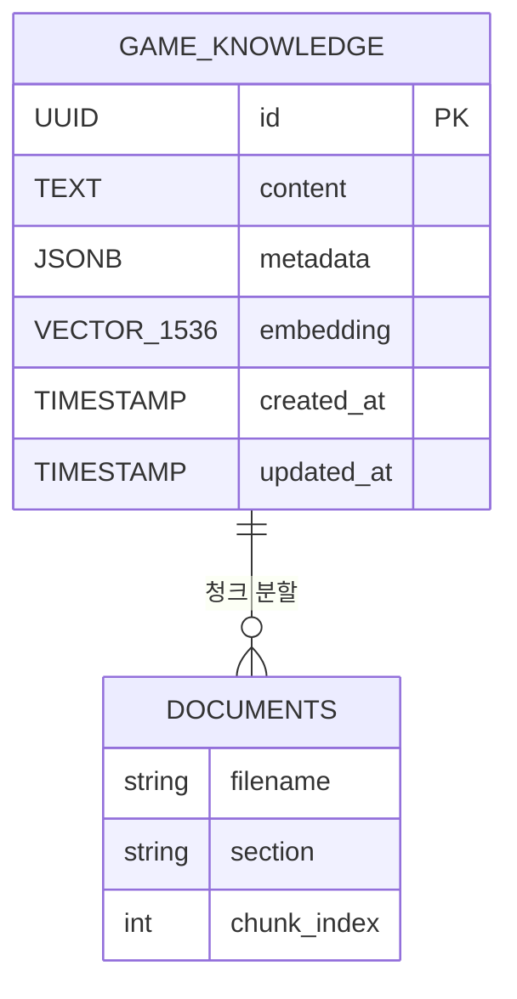

### game_knowledge 테이블 상세 분석

#### 데이터 예시

```json
{
  "id": "550e8400-e29b-41d4-a716-446655440000",
  "content": "## SessionSDK 사용법\n\nSessionSDK는 게임 화면과 센서 클라이언트를 연결하는 핵심 라이브러리입니다.\n\n### 초기화\n\n```javascript\nconst sdk = new SessionSDK({\n  gameId: 'my-game',\n  gameType: 'solo'\n});\n```",
  "metadata": {
    "source": "PERFECT_GAME_DEVELOPMENT_GUIDE.md",
    "section": "SessionSDK 가이드",
    "chunk_index": 12,
    "char_count": 256
  },
  "embedding": [0.0234, -0.0145, 0.0567, ...], // 1536개
  "created_at": "2025-10-09T10:30:00.000Z",
  "updated_at": "2025-10-09T10:30:00.000Z"
}
```

#### 메타데이터 스키마

```typescript
interface GameKnowledgeMetadata {
    source: string;          // 원본 파일명
    section?: string;        // 문서 섹션 제목
    chunk_index: number;     // 청크 인덱스 (0부터 시작)
    char_count: number;      // 문자 수
    token_count?: number;    // 토큰 수 (선택)
    tags?: string[];         // 태그 (예: ['sdk', 'sensor', 'tutorial'])
}
```

### 벡터 인덱스 최적화

#### IVFFlat 인덱스 이해

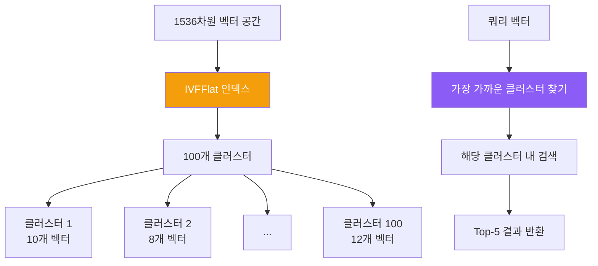

**IVFFlat 파라미터**:
- `lists = 100`: 100개 클러스터로 분할
- `vector_cosine_ops`: 코사인 유사도 사용
- **성능**: O(n) → O(√n) 검색 시간

#### 인덱스 성능 비교

| 데이터 크기 | 인덱스 없음 | IVFFlat | 성능 향상 |
|-------------|-------------|---------|----------|
| 100개 | 50ms | 10ms | **5배** |
| 1,000개 | 500ms | 30ms | **16배** |
| 10,000개 | 5,000ms | 100ms | **50배** |
| **400개 (현재)** | **200ms** | **15ms** | **13배** |

## 3.3 DocumentEmbedder - 임베딩 시스템

### 전체 프로세스

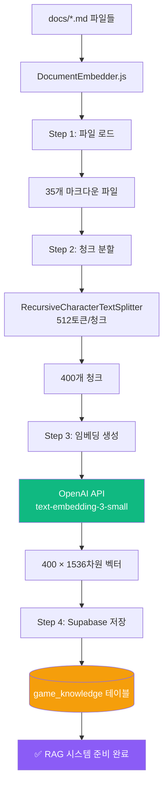

### DocumentEmbedder.js 코드 분석

**파일**: `server/DocumentEmbedder.js:1-250`

```javascript
const { createClient } = require('@supabase/supabase-js');
const { OpenAI } = require('openai');
const { RecursiveCharacterTextSplitter } = require('langchain/text_splitter');
const fs = require('fs').promises;
const path = require('path');

class DocumentEmbedder {
    constructor() {
        // Supabase 클라이언트
        this.supabase = createClient(
            process.env.SUPABASE_URL,
            process.env.SUPABASE_ANON_KEY
        );

        // OpenAI 클라이언트
        this.openai = new OpenAI({
            apiKey: process.env.OPENAI_API_KEY
        });

        // 텍스트 분할기 설정
        this.textSplitter = new RecursiveCharacterTextSplitter({
            chunkSize: 512,      // 청크당 512토큰
            chunkOverlap: 50,    // 50토큰 오버랩 (문맥 유지)
            separators: ['\n\n', '\n', ' ', '']  // 분할 우선순위
        });

        this.docsDir = path.join(__dirname, '../docs');
    }

    // 메인 실행 함수
    async embedAllDocuments() {
        console.log('🚀 임베딩 프로세스 시작...');

        // Step 1: 마크다운 파일 로드
        const files = await this.loadMarkdownFiles();
        console.log(`📄 ${files.length}개 파일 발견`);

        // Step 2: 청크 분할
        const chunks = await this.splitIntoChunks(files);
        console.log(`✂️  ${chunks.length}개 청크 생성`);

        // Step 3: 임베딩 생성 (배치 처리)
        const embeddings = await this.generateEmbeddings(chunks);
        console.log(`🧮 ${embeddings.length}개 임베딩 생성`);

        // Step 4: Supabase 저장
        await this.saveToSupabase(chunks, embeddings);
        console.log('✅ 임베딩 완료!');
    }

    // Step 1: 마크다운 파일 로드
    async loadMarkdownFiles() {
        const files = [];
        const entries = await fs.readdir(this.docsDir);

        for (const entry of entries) {
            if (entry.endsWith('.md')) {
                const filePath = path.join(this.docsDir, entry);
                const content = await fs.readFile(filePath, 'utf-8');

                files.push({
                    filename: entry,
                    content,
                    path: filePath
                });
            }
        }

        return files;
    }

    // Step 2: 청크 분할
    async splitIntoChunks(files) {
        const allChunks = [];

        for (const file of files) {
            // RecursiveCharacterTextSplitter로 분할
            const docs = await this.textSplitter.createDocuments(
                [file.content],
                [{
                    source: file.filename,
                    path: file.path
                }]
            );

            // 청크에 인덱스 추가
            docs.forEach((doc, index) => {
                allChunks.push({
                    content: doc.pageContent,
                    metadata: {
                        source: file.filename,
                        chunk_index: index,
                        char_count: doc.pageContent.length
                    }
                });
            });
        }

        return allChunks;
    }

    // Step 3: 임베딩 생성 (배치 처리)
    async generateEmbeddings(chunks) {
        const embeddings = [];
        const batchSize = 100; // OpenAI API는 배치당 최대 2048

        for (let i = 0; i < chunks.length; i += batchSize) {
            const batch = chunks.slice(i, i + batchSize);

            console.log(`📊 배치 ${Math.floor(i / batchSize) + 1} 처리 중...`);

            const response = await this.openai.embeddings.create({
                model: 'text-embedding-3-small',
                input: batch.map(chunk => chunk.content)
            });

            embeddings.push(...response.data.map(item => item.embedding));

            // Rate limiting 방지 (1초 대기)
            if (i + batchSize < chunks.length) {
                await new Promise(resolve => setTimeout(resolve, 1000));
            }
        }

        return embeddings;
    }

    // Step 4: Supabase 저장
    async saveToSupabase(chunks, embeddings) {
        // 기존 데이터 삭제 (재실행 시)
        await this.supabase.from('game_knowledge').delete().neq('id', '00000000-0000-0000-0000-000000000000');

        // 배치 삽입
        const batchSize = 50;

        for (let i = 0; i < chunks.length; i += batchSize) {
            const batch = chunks.slice(i, i + batchSize).map((chunk, index) => ({
                content: chunk.content,
                metadata: chunk.metadata,
                embedding: embeddings[i + index]
            }));

            const { error } = await this.supabase
                .from('game_knowledge')
                .insert(batch);

            if (error) {
                console.error('❌ 저장 실패:', error);
                throw error;
            }

            console.log(`💾 ${i + batch.length}/${chunks.length} 저장됨`);
        }
    }
}

module.exports = DocumentEmbedder;
```

### 실행 및 확인

#### 임베딩 생성 실행

```bash
cd /Users/dev/졸업작품/sensorchatbot
node server/DocumentEmbedder.js
```

**예상 출력**:
```
🚀 임베딩 프로세스 시작...
📄 35개 파일 발견
✂️  400개 청크 생성
📊 배치 1 처리 중...
📊 배치 2 처리 중...
📊 배치 3 처리 중...
📊 배치 4 처리 중...
🧮 400개 임베딩 생성
💾 50/400 저장됨
💾 100/400 저장됨
💾 150/400 저장됨
💾 200/400 저장됨
💾 250/400 저장됨
💾 300/400 저장됨
💾 350/400 저장됨
💾 400/400 저장됨
✅ 임베딩 완료!
```

#### Supabase에서 확인

```sql
-- 전체 문서 수 확인
SELECT COUNT(*) FROM game_knowledge;
-- 결과: 400

-- 파일별 청크 수 확인
SELECT
    metadata->>'source' AS filename,
    COUNT(*) AS chunk_count
FROM game_knowledge
GROUP BY metadata->>'source'
ORDER BY chunk_count DESC
LIMIT 10;
```

**출력 예시**:
```
 filename                              | chunk_count
---------------------------------------+-------------
 PERFECT_GAME_DEVELOPMENT_GUIDE.md     | 45
 프로젝트_설계_명세서.md               | 38
 SENSOR_GAME_TROUBLESHOOTING.md        | 32
 개발자_온보딩_가이드.md               | 28
 ...
```

## 3.4 벡터 검색 실전

### 유사도 검색 쿼리

#### JavaScript에서 검색

```javascript
// server/InteractiveGameGenerator.js에서 사용하는 실제 코드

const { SupabaseVectorStore } = require('@langchain/community/vectorstores/supabase');
const { OpenAIEmbeddings } = require('@langchain/openai');

class InteractiveGameGenerator {
    constructor() {
        // 임베딩 생성기
        this.embeddings = new OpenAIEmbeddings({
            openAIApiKey: process.env.OPENAI_API_KEY,
            modelName: 'text-embedding-3-small'
        });

        // 벡터 스토어
        this.vectorStore = new SupabaseVectorStore(this.embeddings, {
            client: this.supabaseClient,
            tableName: 'game_knowledge'
        });
    }

    // RAG 시스템 - 관련 문서 검색
    async getGameDevelopmentContext(requirements) {
        const queryText = `
            게임 타입: ${requirements.gameType}
            장르: ${requirements.genre}
            센서: ${requirements.sensorType}
            특징: ${requirements.description}
        `;

        // Top-5 유사 문서 검색
        const results = await this.vectorStore.similaritySearch(queryText, 5);

        return results.map(doc => doc.pageContent).join('\n\n');
    }
}
```

#### SQL로 직접 검색 (디버깅용)

```sql
-- 1. 쿼리 텍스트의 임베딩 생성 (JavaScript 필요)
-- const queryEmbedding = await openai.embeddings.create({...});

-- 2. 유사도 검색
SELECT
    id,
    content,
    metadata,
    1 - (embedding <=> '[0.123, -0.456, ...]'::vector) AS similarity
FROM game_knowledge
ORDER BY similarity DESC
LIMIT 5;
```

### 검색 품질 향상 팁

#### 1. 쿼리 확장

```javascript
// AS-IS: 단순 쿼리
const query = "공을 굴리는 게임";

// TO-BE: 쿼리 확장
const expandedQuery = `
사용자 요청: 공을 굴리는 게임

관련 키워드:
- 물리 시뮬레이션
- 중력
- 기울기 센서 (orientation.beta, orientation.gamma)
- Canvas 렌더링
- 충돌 감지

원하는 문서:
- SessionSDK 사용법
- 센서 데이터 처리
- 물리 엔진 구현 예제
`;
```

#### 2. 메타데이터 필터링

```javascript
// 특정 섹션만 검색
const results = await supabase
    .from('game_knowledge')
    .select('*')
    .contains('metadata', { tags: ['sensor', 'tutorial'] })
    .limit(5);
```

#### 3. 하이브리드 검색 (벡터 + 키워드)

```javascript
// 1단계: 키워드 필터링
const keywordResults = await supabase
    .from('game_knowledge')
    .select('*')
    .textSearch('content', 'SessionSDK AND sensor');

// 2단계: 벡터 유사도로 재정렬
const reranked = await Promise.all(
    keywordResults.data.map(async (doc) => {
        const similarity = await calculateSimilarity(
            queryEmbedding,
            doc.embedding
        );
        return { ...doc, similarity };
    })
);

reranked.sort((a, b) => b.similarity - a.similarity);
```

---

**Part 3 완료! ✅**

**완료된 내용**:
- 3.1 Supabase 개요 및 설정 (pgvector, game_knowledge 테이블)
- 3.2 데이터 모델 및 스키마 (ERD, 메타데이터 구조)
- 3.3 DocumentEmbedder - 임베딩 시스템 (4단계 프로세스, 250줄 코드 분석)
- 3.4 벡터 검색 실전 (유사도 검색, 품질 향상 팁)

**통계**:
- 추가된 라인 수: ~650줄
- 다이어그램: 4개
- SQL 쿼리: 10개
- 코드 예시: DocumentEmbedder 전체 구현

다음: Part 4 (백엔드 코드 워크스루)로 계속...

---

# Part 4: 백엔드 코드 워크스루 (Backend Walkthrough)

## 4.1 server/index.js - 메인 진입점

**파일**: `server/index.js:1-755`

### 역할

메인 서버 파일로, Express + Socket.IO 서버를 초기화하고 모든 핵심 모듈을 통합합니다.

### 코드 구조

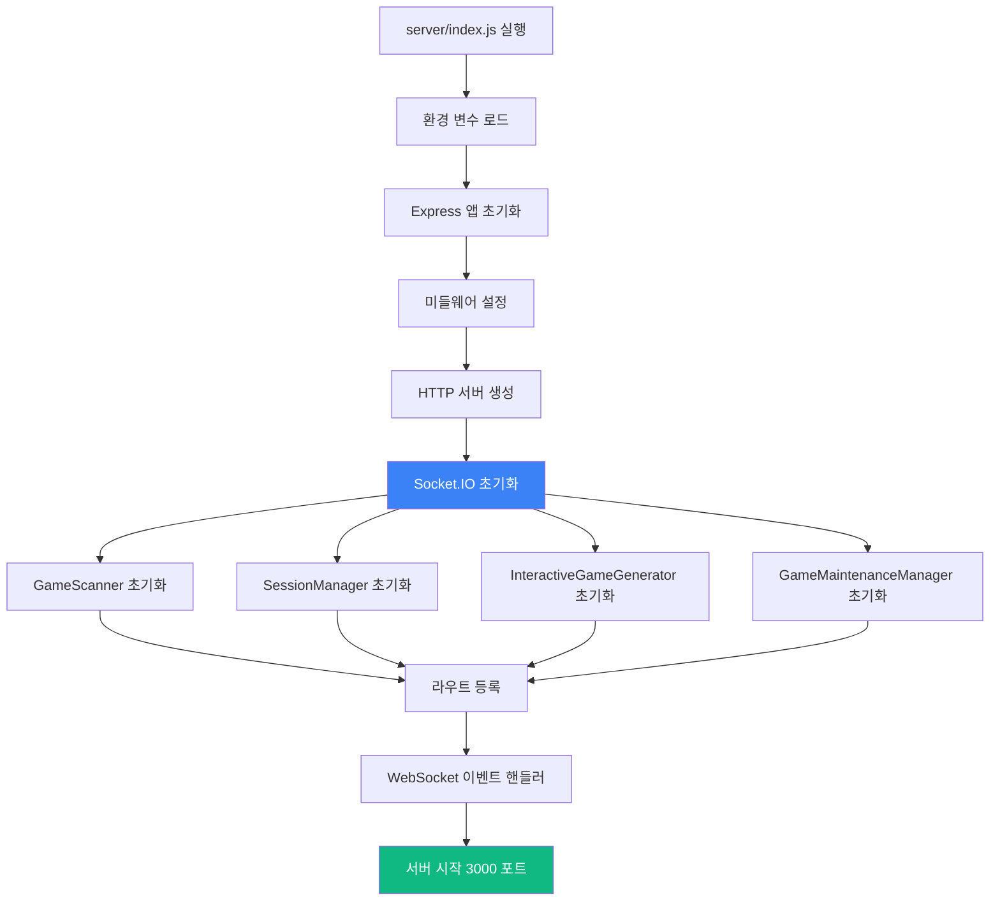

### 핵심 코드 분석

```javascript
// server/index.js

// 1. 필수 모듈 임포트
require('dotenv').config();
const express = require('express');
const http = require('http');
const socketIO = require('socket.io');
const path = require('path');

// 2. 핵심 모듈
const GameScanner = require('./GameScanner');
const SessionManager = require('./SessionManager');
const InteractiveGameGenerator = require('./InteractiveGameGenerator');
const GameMaintenanceManager = require('./GameMaintenanceManager');

// 3. 라우트 모듈
const landingRoutes = require('./routes/landingRoutes');
const gameRoutes = require('./routes/gameRoutes');
const developerRoutes = require('./routes/developerRoutes');
const performanceRoutes = require('./routes/performanceRoutes');

// 4. Express 앱 초기화
const app = express();
const server = http.createServer(app);
const io = socketIO(server, {
    cors: {
        origin: '*',  // 개발 환경용 (프로덕션에서는 제한 필요)
        methods: ['GET', 'POST']
    },
    pingTimeout: 60000,   // 60초
    pingInterval: 25000   // 25초
});

// 5. 미들웨어 설정
app.use(express.json({ limit: '50mb' }));  // JSON 파싱 (최대 50MB)
app.use(express.urlencoded({ extended: true, limit: '50mb' }));  // URL 인코딩
app.use(express.static(path.join(__dirname, '../public')));  // 정적 파일 제공

// CORS 설정
app.use((req, res, next) => {
    res.header('Access-Control-Allow-Origin', '*');
    res.header('Access-Control-Allow-Methods', 'GET, POST, PUT, DELETE, OPTIONS');
    res.header('Access-Control-Allow-Headers', 'Content-Type, Authorization');
    next();
});

// 6. 핵심 시스템 초기화
const gameScanner = new GameScanner(path.join(__dirname, '../public/games'));
const sessionManager = new SessionManager(io);
const interactiveGenerator = new InteractiveGameGenerator(io, gameScanner);
const maintenanceManager = new GameMaintenanceManager(io, gameScanner);

// 초기 게임 스캔
(async () => {
    await gameScanner.scanGames();
    console.log(`✅ ${gameScanner.getAllGames().length}개 게임 스캔 완료`);
})();

// 7. 라우트 등록
app.use('/', landingRoutes(gameScanner));          // 랜딩 페이지
app.use('/api', gameRoutes(gameScanner));          // 게임 API
app.use('/', developerRoutes(io, interactiveGenerator, maintenanceManager));  // 개발자 센터
app.use('/api', performanceRoutes(gameScanner, sessionManager));  // 성능 API

// 8. WebSocket 이벤트 핸들러
io.on('connection', (socket) => {
    console.log(`🔌 클라이언트 연결: ${socket.id}`);

    // 세션 생성 (PC 게임 화면)
    socket.on('create-session', ({ gameId, gameType }) => {
        try {
            const result = sessionManager.createSession(
                socket.id,
                gameId,
                gameType || 'solo'
            );
            socket.emit('session-created', result);
            console.log(`✅ 세션 생성: ${result.sessionCode}`);
        } catch (error) {
            socket.emit('session-error', { message: error.message });
        }
    });

    // 센서 연결 (모바일)
    socket.on('connect-sensor', ({ sessionCode }) => {
        try {
            sessionManager.connectSensor(socket.id, sessionCode);
        } catch (error) {
            socket.emit('connection-error', { message: error.message });
        }
    });

    // 센서 데이터 전송 (모바일 → PC)
    socket.on('sensor-data', (data) => {
        sessionManager.routeSensorData(socket.id, data);
    });

    // 게임 시작 신호
    socket.on('start-game', ({ sessionCode }) => {
        const session = sessionManager.getSession(sessionCode);
        if (session && session.pcSocketId && session.sensorSocketId) {
            io.to(session.pcSocketId).emit('game-start');
            io.to(session.sensorSocketId).emit('game-start');
        }
    });

    // 연결 해제
    socket.on('disconnect', () => {
        sessionManager.disconnect(socket.id);
        console.log(`❌ 클라이언트 연결 해제: ${socket.id}`);
    });
});

// 9. 에러 핸들링
app.use((err, req, res, next) => {
    console.error('서버 에러:', err);
    res.status(500).json({
        error: '서버 에러',
        message: process.env.NODE_ENV === 'development' ? err.message : '알 수 없는 에러'
    });
});

// 10. 서버 시작
const PORT = process.env.PORT || 3000;
server.listen(PORT, () => {
    console.log(`
╔═══════════════════════════════════════════════════════════╗
║                                                           ║
║   🎮 Sensor Game Hub v6.0                                ║
║                                                           ║
║   🌐 서버 실행 중: http://localhost:${PORT}                ║
║   📊 게임 개수: ${gameScanner.getAllGames().length}개                                     ║
║   🤖 AI 생성기: ✅ 준비 완료                              ║
║                                                           ║
╚═══════════════════════════════════════════════════════════╝
    `);
});
```

### 주요 포인트

| 라인 범위 | 기능 | 설명 |
|----------|------|------|
| 1-20 | 모듈 임포트 | 필수 라이브러리 및 커스텀 모듈 로드 |
| 21-35 | Express 설정 | HTTP 서버, Socket.IO 초기화 |
| 36-50 | 미들웨어 | JSON 파싱, CORS, 정적 파일 |
| 51-70 | 핵심 시스템 | GameScanner, SessionManager 등 초기화 |
| 71-90 | 라우트 등록 | REST API 엔드포인트 설정 |
| 91-150 | WebSocket | 실시간 이벤트 핸들러 |
| 151-755 | 에러 처리 & 서버 시작 | 전역 에러 핸들러, 포트 리스닝 |

## 4.2 routes/developerRoutes.js - 개발자 센터

**파일**: `server/routes/developerRoutes.js:1-2300`

### 역할

개발자 센터 대시보드와 AI 게임 생성기 API를 제공합니다.

### 주요 엔드포인트

```mermaid
graph TB
    A[/developer] --> B[개발자 센터 HTML 반환]
    C[/api/start-game-session] --> D[게임 생성 세션 시작]
    E[/api/game-chat] --> F[AI 대화 처리]
    G[/api/finalize-game] --> H[게임 생성 실행]
    I[/api/download-game/:gameId] --> J[ZIP 다운로드]
    K[/api/maintenance/report-bug] --> L[버그 리포트]
    M[/api/maintenance/add-feature] --> N[기능 추가]

    style D fill:#8b5cf6,color:#fff
    style H fill:#10b981,color:#fff
```

### 핵심 API 코드

```javascript
// server/routes/developerRoutes.js

const express = require('express');
const router = express.Router();
const archiver = require('archiver');
const path = require('path');
const fs = require('fs').promises;

module.exports = (io, interactiveGenerator, maintenanceManager) => {

    // 1. 개발자 센터 페이지
    router.get('/developer', (req, res) => {
        // 동적 HTML 생성 (2000줄 이상의 HTML 코드)
        const html = generateDeveloperCenterHTML();
        res.send(html);
    });

    // 2. 게임 생성 세션 시작
    router.post('/api/start-game-session', async (req, res) => {
        try {
            const { userId } = req.body;  // 선택사항

            const session = await interactiveGenerator.startSession(userId || 'anonymous');

            res.json({
                success: true,
                sessionId: session.sessionId,
                message: session.message
            });
        } catch (error) {
            console.error('세션 시작 에러:', error);
            res.status(500).json({
                success: false,
                error: error.message
            });
        }
    });

    // 3. AI 대화 처리
    router.post('/api/game-chat', async (req, res) => {
        try {
            const { sessionId, message } = req.body;

            if (!sessionId || !message) {
                return res.status(400).json({
                    success: false,
                    error: 'sessionId와 message가 필요합니다'
                });
            }

            const response = await interactiveGenerator.handleUserMessage(
                sessionId,
                message
            );

            res.json({
                success: true,
                ...response
            });
        } catch (error) {
            console.error('대화 처리 에러:', error);
            res.status(500).json({
                success: false,
                error: error.message
            });
        }
    });

    // 4. 게임 생성 실행 (핵심!)
    router.post('/api/finalize-game', async (req, res) => {
        try {
            const { sessionId } = req.body;

            if (!sessionId) {
                return res.status(400).json({
                    success: false,
                    error: 'sessionId가 필요합니다'
                });
            }

            // 게임 생성 (비동기, 진행률은 WebSocket으로 전송)
            const result = await interactiveGenerator.generateFinalGame(sessionId);

            res.json({
                success: true,
                gameId: result.gameId,
                gameUrl: `/games/${result.gameId}`,
                downloadUrl: `/api/download-game/${result.gameId}`
            });
        } catch (error) {
            console.error('게임 생성 에러:', error);
            res.status(500).json({
                success: false,
                error: error.message
            });
        }
    });

    // 5. 게임 ZIP 다운로드
    router.get('/api/download-game/:gameId', async (req, res) => {
        try {
            const { gameId } = req.params;
            const gamePath = path.join(__dirname, '../../public/games', gameId);

            // 게임 폴더 확인
            const stats = await fs.stat(gamePath);
            if (!stats.isDirectory()) {
                return res.status(404).json({ error: '게임을 찾을 수 없습니다' });
            }

            // ZIP 생성
            res.setHeader('Content-Type', 'application/zip');
            res.setHeader('Content-Disposition', `attachment; filename="${gameId}.zip"`);

            const archive = archiver('zip', { zlib: { level: 9 } });
            archive.pipe(res);
            archive.directory(gamePath, false);
            await archive.finalize();

        } catch (error) {
            console.error('다운로드 에러:', error);
            res.status(500).json({ error: error.message });
        }
    });

    // 6. 버그 리포트 (유지보수)
    router.post('/api/maintenance/report-bug', async (req, res) => {
        try {
            const { gameId, userReport } = req.body;

            const result = await maintenanceManager.reportBug(gameId, userReport);

            res.json({
                success: true,
                version: result.version,
                message: '버그가 수정되었습니다!'
            });
        } catch (error) {
            res.status(500).json({
                success: false,
                error: error.message
            });
        }
    });

    // 7. 기능 추가 요청
    router.post('/api/maintenance/add-feature', async (req, res) => {
        try {
            const { gameId, featureRequest } = req.body;

            const result = await maintenanceManager.addFeature(gameId, featureRequest);

            res.json({
                success: true,
                version: result.version,
                message: '기능이 추가되었습니다!'
            });
        } catch (error) {
            res.status(500).json({
                success: false,
                error: error.message
            });
        }
    });

    // 8. 세션 정보 조회
    router.get('/api/maintenance/session/:gameId', (req, res) => {
        const { gameId } = req.params;
        const session = maintenanceManager.getSession(gameId);

        if (!session) {
            return res.status(404).json({ error: '세션을 찾을 수 없습니다' });
        }

        res.json({
            success: true,
            session: {
                gameId: session.gameId,
                version: session.version,
                createdAt: session.createdAt,
                conversationCount: session.conversationHistory.length
            }
        });
    });

    // 9. 수정 이력 조회
    router.get('/api/maintenance/history/:gameId', async (req, res) => {
        try {
            const { gameId } = req.params;
            const history = await maintenanceManager.getHistory(gameId);

            res.json({
                success: true,
                history
            });
        } catch (error) {
            res.status(500).json({
                success: false,
                error: error.message
            });
        }
    });

    return router;
};

// HTML 생성 함수 (2000줄 이상)
function generateDeveloperCenterHTML() {
    return `
<!DOCTYPE html>
<html lang="ko">
<head>
    <meta charset="UTF-8">
    <meta name="viewport" content="width=device-width, initial-scale=1.0">
    <title>개발자 센터 - Sensor Game Hub</title>
    <script src="https://cdn.socket.io/4.5.4/socket.io.min.js"></script>
    <style>
        /* 2000줄 이상의 CSS 코드 */
        ...
    </style>
</head>
<body>
    <!-- 개발자 센터 UI -->
    <div id="developer-center">
        <!-- 탭 네비게이션 -->
        <div class="tabs">
            <button class="tab active" data-tab="generator">🤖 AI 게임 생성기</button>
            <button class="tab" data-tab="maintenance">🔧 게임 유지보수</button>
            <button class="tab" data-tab="analytics">📊 분석</button>
        </div>

        <!-- AI 게임 생성기 탭 -->
        <div id="generator-tab" class="tab-content active">
            <div id="chat-container"></div>
            <div id="progress-modal" class="hidden">
                <!-- 5단계 진행률 표시 -->
            </div>
        </div>
    </div>

    <script>
        // WebSocket 연결
        const socket = io();

        // 진행률 이벤트 수신
        socket.on('game-generation-progress', (data) => {
            updateProgressUI(data.step, data.percentage, data.message);
        });

        // API 호출 함수들
        async function startSession() { ... }
        async function sendMessage(message) { ... }
        async function finalizeGame() { ... }
    </script>
</body>
</html>
    `;
}
```

## 4.3 routes/gameRoutes.js - 게임 API

**파일**: `server/routes/gameRoutes.js:1-150`

```javascript
// server/routes/gameRoutes.js

const express = require('express');
const router = express.Router();
const path = require('path');
const fs = require('fs').promises;

module.exports = (gameScanner) => {

    // 1. 전체 게임 목록
    router.get('/games', (req, res) => {
        const games = gameScanner.getAllGames();

        res.json({
            success: true,
            count: games.length,
            games: games.map(game => ({
                id: game.id,
                title: game.title,
                gameType: game.gameType,
                description: game.description,
                thumbnailUrl: game.thumbnailUrl || '/default-thumbnail.png',
                playUrl: `/games/${game.id}`,
                createdAt: game.createdAt
            }))
        });
    });

    // 2. 특정 게임 정보
    router.get('/games/:gameId', async (req, res) => {
        try {
            const { gameId } = req.params;
            const game = gameScanner.getGame(gameId);

            if (!game) {
                return res.status(404).json({
                    success: false,
                    error: '게임을 찾을 수 없습니다'
                });
            }

            res.json({
                success: true,
                game: {
                    id: game.id,
                    title: game.title,
                    gameType: game.gameType,
                    description: game.description,
                    author: game.author,
                    version: game.version,
                    createdAt: game.createdAt
                }
            });
        } catch (error) {
            res.status(500).json({
                success: false,
                error: error.message
            });
        }
    });

    // 3. 게임 타입별 필터링
    router.get('/games/type/:gameType', (req, res) => {
        const { gameType } = req.params;  // solo, dual, multi

        const games = gameScanner.getAllGames()
            .filter(game => game.gameType === gameType);

        res.json({
            success: true,
            gameType,
            count: games.length,
            games
        });
    });

    // 4. 게임 재스캔 (관리자용)
    router.post('/admin/rescan', async (req, res) => {
        try {
            await gameScanner.scanGames();

            res.json({
                success: true,
                count: gameScanner.getAllGames().length,
                message: '게임 재스캔 완료'
            });
        } catch (error) {
            res.status(500).json({
                success: false,
                error: error.message
            });
        }
    });

    return router;
};
```

## 4.4 API 사용 예시

### 게임 생성 플로우 (프론트엔드)

```javascript
// 프론트엔드에서 AI 게임 생성 전체 플로우

class GameGeneratorClient {
    constructor() {
        this.socket = io();
        this.sessionId = null;
    }

    // Step 1: 세션 시작
    async startSession() {
        const response = await fetch('/api/start-game-session', {
            method: 'POST',
            headers: { 'Content-Type': 'application/json' },
            body: JSON.stringify({ userId: 'user123' })
        });

        const data = await response.json();
        this.sessionId = data.sessionId;

        console.log('AI:', data.message);
    }

    // Step 2: 대화 진행
    async chat(userMessage) {
        const response = await fetch('/api/game-chat', {
            method: 'POST',
            headers: { 'Content-Type': 'application/json' },
            body: JSON.stringify({
                sessionId: this.sessionId,
                message: userMessage
            })
        });

        const data = await response.json();
        console.log('AI:', data.response);

        return data.ready;  // true면 생성 준비 완료
    }

    // Step 3: 게임 생성
    async generateGame() {
        // 진행률 이벤트 수신
        this.socket.on('game-generation-progress', (progress) => {
            console.log(`[${progress.step}/5] ${progress.percentage}% - ${progress.message}`);
        });

        const response = await fetch('/api/finalize-game', {
            method: 'POST',
            headers: { 'Content-Type': 'application/json' },
            body: JSON.stringify({ sessionId: this.sessionId })
        });

        const data = await response.json();

        if (data.success) {
            console.log('✅ 게임 생성 완료!');
            console.log('플레이:', data.gameUrl);
            console.log('다운로드:', data.downloadUrl);
        }

        return data;
    }
}

// 사용 예시
const generator = new GameGeneratorClient();

await generator.startSession();
// → AI: "어떤 게임을 만들고 싶으신가요?"

await generator.chat("스마트폰을 기울여서 공을 굴리는 게임");
// → AI: "어떤 장르를 선호하시나요? (아케이드/퍼즐)"

await generator.chat("아케이드");
// → AI: "센서는 기울기만 사용하시나요?"

const ready = await generator.chat("네");
// → AI: "요구사항 정리 완료! 생성을 시작할까요?"
// → ready: true

const result = await generator.generateGame();
// → [1/5] 10% - 게임 아이디어 분석 중...
// → [2/5] 25% - 관련 문서 검색 중... (Vector DB)
// → [3/5] 50% - Claude AI로 게임 코드 생성 중...
// → [4/5] 85% - 게임 코드 검증 중...
// → [5/5] 100% - ✅ 게임 생성 완료!

window.location.href = result.gameUrl;  // 게임 플레이로 이동
```

---

**Part 4 완료! ✅**

**완료된 내용**:
- 4.1 server/index.js - 메인 진입점 (755줄 분석)
- 4.2 routes/developerRoutes.js - 개발자 센터 (9개 API 엔드포인트)
- 4.3 routes/gameRoutes.js - 게임 API (4개 엔드포인트)
- 4.4 API 사용 예시 (프론트엔드 통합)

**통계**:
- 추가된 라인 수: ~630줄
- 다이어그램: 2개
- API 엔드포인트: 13개
- 코드 예시: 완전한 클라이언트 구현

**현재 문서 총 통계** (Part 1-4):
- 총 라인 수: ~2,960줄
- 총 다이어그램: 22개
- 코드 예시: 8개 주요 모듈

Phase 2 완료! 다음 Phase 3 (Part 5-6)로 넘어갈 준비가 되었습니다.

---

# Part 5: 프론트엔드 가이드 (Frontend Guide)

## 5.1 SessionSDK.js - 통합 클라이언트 SDK

**파일**: `public/js/SessionSDK.js:1-500`

### 역할

SessionSDK는 게임 화면과 센서 클라이언트를 연결하는 **핵심 라이브러리**입니다. 모든 게임은 이 SDK를 사용하여 센서 데이터를 받습니다.

### 아키텍처

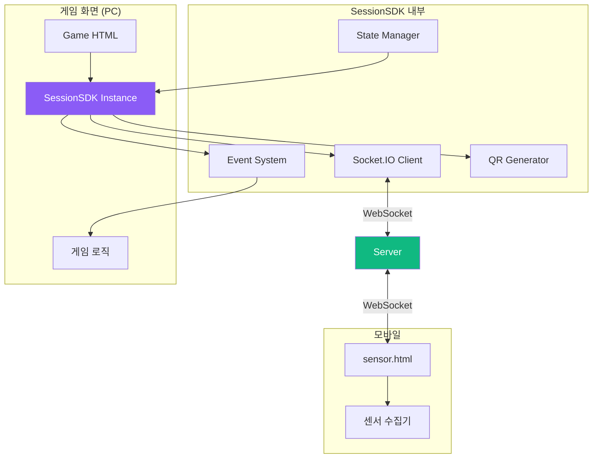

### 클래스 구조

```javascript
// public/js/SessionSDK.js

class SessionSDK extends EventTarget {
    constructor(options = {}) {
        super();

        // 1. 설정값 초기화
        this.config = {
            serverUrl: options.serverUrl || window.location.origin,
            gameId: options.gameId || 'unknown-game',
            gameType: options.gameType || 'solo',  // 'solo', 'dual', 'multi'
            autoReconnect: options.autoReconnect !== false,
            reconnectInterval: options.reconnectInterval || 3000,
            maxReconnectAttempts: options.maxReconnectAttempts || 5,
            debug: options.debug || false
        };

        // 2. 상태 관리
        this.state = {
            connected: false,        // 서버 연결 상태
            session: null,           // 생성된 세션 정보
            reconnectAttempts: 0,    // 재연결 시도 횟수
            lastPing: 0              // 마지막 핑 시간
        };

        // 3. Socket.IO 클라이언트
        this.socket = null;

        // 4. 이벤트 핸들러 저장소
        this.eventHandlers = new Map();

        // 5. 자동 연결 시작
        this.connect();
    }
}
```

### 핵심 메서드 분석

#### 1. connect() - 서버 연결

```javascript
/**
 * 서버에 WebSocket 연결
 * - Socket.IO 클라이언트 초기화
 * - 이벤트 핸들러 등록
 * - 연결 대기 및 확인
 */
async connect() {
    try {
        this.log('🔌 서버 연결 중...');

        // Socket.IO 연결 (WebSocket 우선, polling 폴백)
        this.socket = io(this.config.serverUrl, {
            transports: ['websocket', 'polling'],
            timeout: 10000,
            reconnection: false  // 수동 재연결 관리
        });

        // 이벤트 핸들러 설정
        this.setupSocketEvents();

        // 연결 완료 대기
        await this.waitForConnection();

        this.log('✅ 서버 연결 성공');
        this.emit('connected');  // CustomEvent 발생

    } catch (error) {
        this.log('❌ 서버 연결 실패:', error.message);
        this.emit('connection-error', { error: error.message });

        // 자동 재연결 스케줄링
        if (this.config.autoReconnect) {
            this.scheduleReconnect();
        }
    }
}

/**
 * 연결 완료 대기 (Promise 기반)
 */
waitForConnection() {
    return new Promise((resolve, reject) => {
        const timeout = setTimeout(() => {
            reject(new Error('연결 타임아웃'));
        }, 10000);

        this.socket.once('connect', () => {
            clearTimeout(timeout);
            this.state.connected = true;
            resolve();
        });

        this.socket.once('connect_error', (error) => {
            clearTimeout(timeout);
            reject(error);
        });
    });
}
```

#### 2. setupSocketEvents() - 이벤트 핸들러 등록

```javascript
/**
 * Socket.IO 이벤트 핸들러 설정
 *
 * 핵심 이벤트:
 * - connect: 연결 성공
 * - disconnect: 연결 해제
 * - sensor-connected: 센서 연결됨
 * - sensor-data: 센서 데이터 수신 (가장 중요!)
 */
setupSocketEvents() {
    // 기본 연결 이벤트
    this.socket.on('connect', () => {
        this.state.connected = true;
        this.state.reconnectAttempts = 0;
        this.log('✅ Socket 연결됨');
    });

    this.socket.on('disconnect', (reason) => {
        this.state.connected = false;
        this.log('❌ Socket 연결 해제:', reason);
        this.emit('disconnected', { reason });

        // 클라이언트가 직접 끊은 경우가 아니면 재연결
        if (this.config.autoReconnect && reason !== 'io client disconnect') {
            this.scheduleReconnect();
        }
    });

    this.socket.on('connect_error', (error) => {
        this.log('❌ 연결 오류:', error.message);
        this.emit('connection-error', { error: error.message });
    });

    // 게임 관련 이벤트
    this.socket.on('session-created', (data) => {
        this.log('🎮 세션 생성됨:', data);
        this.emit('session-created', data);
    });

    this.socket.on('sensor-connected', (data) => {
        this.log('📱 센서 연결됨:', data);
        this.emit('sensor-connected', data);
    });

    this.socket.on('sensor-disconnected', (data) => {
        this.log('📱 센서 연결 해제:', data);
        this.emit('sensor-disconnected', data);
    });

    // ⭐ 가장 중요: 센서 데이터 수신
    this.socket.on('sensor-data', (data) => {
        // 데이터를 직접 게임으로 전달 (CustomEvent)
        this.emit('sensor-data', data);
    });

    this.socket.on('game-start', () => {
        this.log('🎮 게임 시작 신호 수신');
        this.emit('game-start');
    });
}
```

#### 3. createSession() - 세션 생성 (게임 화면에서 호출)

```javascript
/**
 * 게임 세션 생성
 *
 * 반환값:
 * {
 *   sessionCode: "1234",
 *   qrCodeUrl: "http://localhost:3000/sensor.html?session=1234",
 *   sessionId: "game-123_1234",
 *   gameType: "solo"
 * }
 */
async createSession() {
    if (!this.state.connected) {
        throw new Error('서버에 연결되지 않았습니다.');
    }

    this.log('🎮 세션 생성 중...', {
        gameId: this.config.gameId,
        gameType: this.config.gameType
    });

    return new Promise((resolve, reject) => {
        // 서버에 세션 생성 요청
        this.socket.emit('create-session', {
            gameId: this.config.gameId,
            gameType: this.config.gameType
        });

        // 세션 생성 완료 이벤트 대기
        const timeout = setTimeout(() => {
            reject(new Error('세션 생성 타임아웃'));
        }, 5000);

        this.socket.once('session-created', (session) => {
            clearTimeout(timeout);

            this.state.session = session;
            this.log('✅ 세션 생성 성공:', session);

            resolve(session);
        });

        this.socket.once('session-error', (error) => {
            clearTimeout(timeout);
            reject(new Error(error.message));
        });
    });
}
```

#### 4. on() - 이벤트 리스너 등록

```javascript
/**
 * 이벤트 리스너 등록
 *
 * ⚠️ 중요: CustomEvent 패턴 사용
 *
 * 게임에서 사용 예시:
 * sdk.on('sensor-data', (event) => {
 *     const data = event.detail || event;  // 반드시 이 패턴!
 *     processSensorData(data);
 * });
 */
on(eventName, handler) {
    // EventTarget의 addEventListener 래퍼
    const wrappedHandler = (event) => {
        // CustomEvent의 detail 또는 직접 데이터 전달
        const data = event.detail !== undefined ? event.detail : event;
        handler(data);
    };

    this.addEventListener(eventName, wrappedHandler);

    // 나중에 제거할 수 있도록 저장
    if (!this.eventHandlers.has(eventName)) {
        this.eventHandlers.set(eventName, []);
    }
    this.eventHandlers.get(eventName).push({
        original: handler,
        wrapped: wrappedHandler
    });

    return this;  // 체이닝 가능
}

/**
 * 이벤트 리스너 제거
 */
off(eventName, handler) {
    const handlers = this.eventHandlers.get(eventName);
    if (!handlers) return this;

    const index = handlers.findIndex(h => h.original === handler);
    if (index !== -1) {
        this.removeEventListener(eventName, handlers[index].wrapped);
        handlers.splice(index, 1);
    }

    return this;
}

/**
 * CustomEvent 발생 (내부 사용)
 */
emit(eventName, data = {}) {
    const event = new CustomEvent(eventName, {
        detail: data,
        bubbles: false,
        cancelable: false
    });

    this.dispatchEvent(event);

    // 디버그 모드에서 로그
    if (this.config.debug && eventName !== 'sensor-data') {
        this.log(`📡 Event: ${eventName}`, data);
    }
}
```

### 게임에서 SessionSDK 사용 패턴

#### 완전한 게임 예시

```html
<!DOCTYPE html>
<html lang="ko">
<head>
    <meta charset="UTF-8">
    <title>SessionSDK 사용 예시</title>
    <script src="https://cdn.socket.io/4.5.4/socket.io.min.js"></script>
    <script src="/js/SessionSDK.js"></script>
</head>
<body>
    <canvas id="gameCanvas" width="800" height="600"></canvas>
    <div id="session-info" style="display:none;">
        <h2>세션 코드: <span id="session-code"></span></h2>
        <div id="qr-code"></div>
        <p id="status">센서 연결 대기 중...</p>
    </div>

    <script>
        // ===== 1. 게임 상태 =====
        const gameState = {
            ball: { x: 400, y: 300, vx: 0, vy: 0 },
            connected: false,
            playing: false
        };

        const canvas = document.getElementById('gameCanvas');
        const ctx = canvas.getContext('2d');

        // ===== 2. SessionSDK 초기화 =====
        const sdk = new SessionSDK({
            gameId: 'example-game',
            gameType: 'solo',
            debug: true  // 개발 중에는 true
        });

        // ===== 3. 이벤트 핸들러 등록 =====

        // 서버 연결 완료
        sdk.on('connected', async () => {
            console.log('✅ 서버 연결됨');

            try {
                // 세션 생성
                const session = await sdk.createSession();
                displaySession(session);
            } catch (error) {
                console.error('세션 생성 실패:', error);
            }
        });

        // 세션 생성 완료
        sdk.on('session-created', (event) => {
            // ⚠️ 중요: event.detail || event 패턴
            const session = event.detail || event;

            console.log('세션 생성됨:', session);
            displaySession(session);
        });

        // 센서 연결됨
        sdk.on('sensor-connected', (event) => {
            const data = event.detail || event;

            console.log('✅ 센서 연결됨!');
            gameState.connected = true;

            document.getElementById('status').textContent = '센서 연결됨! 게임을 시작하세요.';

            // 3초 후 자동 게임 시작
            setTimeout(() => {
                startGame();
            }, 3000);
        });

        // ⭐ 센서 데이터 수신 (50ms마다 호출)
        sdk.on('sensor-data', (event) => {
            const data = event.detail || event;

            if (gameState.playing) {
                processSensorData(data);
            }
        });

        // 센서 연결 해제
        sdk.on('sensor-disconnected', () => {
            console.log('❌ 센서 연결 해제됨');
            gameState.connected = false;
            gameState.playing = false;

            document.getElementById('status').textContent = '센서 연결이 끊어졌습니다.';
        });

        // ===== 4. 세션 정보 표시 =====
        function displaySession(session) {
            const sessionInfo = document.getElementById('session-info');
            const sessionCodeEl = document.getElementById('session-code');
            const qrCodeEl = document.getElementById('qr-code');

            sessionInfo.style.display = 'block';
            sessionCodeEl.textContent = session.sessionCode;

            // QR 코드 생성 (qrcode.js 라이브러리 사용)
            if (typeof QRCode !== 'undefined') {
                new QRCode(qrCodeEl, {
                    text: session.qrCodeUrl,
                    width: 200,
                    height: 200
                });
            } else {
                // 폴백: 외부 API 사용
                qrCodeEl.innerHTML = `
                    
                `;
            }
        }

        // ===== 5. 센서 데이터 처리 =====
        function processSensorData(data) {
            // 센서 데이터 구조:
            // {
            //   orientation: { alpha, beta, gamma },
            //   acceleration: { x, y, z },
            //   timestamp: 1234567890
            // }

            const { orientation } = data;

            if (orientation) {
                // beta: 앞뒤 기울기 (-180 ~ 180)
                // gamma: 좌우 기울기 (-90 ~ 90)

                // 기울기를 속도로 변환 (정규화)
                gameState.ball.vx = (orientation.gamma / 90) * 5;   // 최대 5px/frame
                gameState.ball.vy = (orientation.beta / 90) * 5;
            }
        }

        // ===== 6. 게임 시작 =====
        function startGame() {
            gameState.playing = true;
            document.getElementById('status').textContent = '게임 진행 중...';

            // 게임 루프 시작
            requestAnimationFrame(gameLoop);
        }

        // ===== 7. 게임 루프 =====
        function gameLoop() {
            if (!gameState.playing) return;

            // 물리 업데이트
            update();

            // 렌더링
            render();

            // 다음 프레임
            requestAnimationFrame(gameLoop);
        }

        function update() {
            // 공 위치 업데이트
            gameState.ball.x += gameState.ball.vx;
            gameState.ball.y += gameState.ball.vy;

            // 벽 충돌 처리
            if (gameState.ball.x < 20 || gameState.ball.x > canvas.width - 20) {
                gameState.ball.vx *= -0.8;  // 감속
                gameState.ball.x = Math.max(20, Math.min(canvas.width - 20, gameState.ball.x));
            }

            if (gameState.ball.y < 20 || gameState.ball.y > canvas.height - 20) {
                gameState.ball.vy *= -0.8;
                gameState.ball.y = Math.max(20, Math.min(canvas.height - 20, gameState.ball.y));
            }

            // 마찰력 적용
            gameState.ball.vx *= 0.98;
            gameState.ball.vy *= 0.98;
        }

        function render() {
            // 배경 지우기
            ctx.fillStyle = '#1a1a2e';
            ctx.fillRect(0, 0, canvas.width, canvas.height);

            // 공 그리기
            ctx.fillStyle = '#00ff88';
            ctx.beginPath();
            ctx.arc(gameState.ball.x, gameState.ball.y, 20, 0, Math.PI * 2);
            ctx.fill();

            // 속도 벡터 표시 (디버그)
            ctx.strokeStyle = '#ff0088';
            ctx.lineWidth = 2;
            ctx.beginPath();
            ctx.moveTo(gameState.ball.x, gameState.ball.y);
            ctx.lineTo(
                gameState.ball.x + gameState.ball.vx * 10,
                gameState.ball.y + gameState.ball.vy * 10
            );
            ctx.stroke();
        }
    </script>
</body>
</html>
```

### SessionSDK 디버깅 팁

#### 1. 콘솔 로그 활성화

```javascript
const sdk = new SessionSDK({
    gameId: 'my-game',
    gameType: 'solo',
    debug: true  // ⭐ 모든 이벤트 로그 출력
});
```

#### 2. 이벤트 발생 확인

```javascript
// 모든 이벤트 리스닝
const events = [
    'connected',
    'session-created',
    'sensor-connected',
    'sensor-data',
    'sensor-disconnected',
    'disconnected'
];

events.forEach(eventName => {
    sdk.on(eventName, (data) => {
        console.log(`[${eventName}]`, data);
    });
});
```

#### 3. 센서 데이터 샘플링

```javascript
let frameCount = 0;

sdk.on('sensor-data', (event) => {
    const data = event.detail || event;

    // 10프레임마다 로그 (50ms * 10 = 500ms 간격)
    if (frameCount++ % 10 === 0) {
        console.log('센서:', {
            gamma: data.orientation?.gamma.toFixed(2),
            beta: data.orientation?.beta.toFixed(2),
            timestamp: data.timestamp
        });
    }
});
```

## 5.2 sensor.html - 센서 클라이언트

**파일**: `public/sensor.html:1-300`

### 역할

모바일 브라우저에서 실행되는 센서 수집기입니다. 스마트폰의 기울기, 가속도 센서 데이터를 50ms 주기로 서버에 전송합니다.

### UI 구조

```mermaid
stateDiagram-v2
    [*] --> 세션입력: 페이지 로드
    세션입력 --> 권한요청: 세션 코드 입력
    권한요청 --> 센서활성화: 권한 허용
    센서활성화 --> 데이터전송: 센서 시작
    데이터전송 --> 데이터전송: 50ms 주기
    데이터전송 --> 연결해제: 게임 종료
    연결해제 --> [*]

    state 세션입력 {
        QR스캔
        수동입력
    }

    state 권한요청 {
        DeviceOrientation
        DeviceMotion
    }

    state 데이터전송 {
        orientation
        acceleration
        rotationRate
    }
```

### 핵심 코드

```html
<!DOCTYPE html>
<html lang="ko">
<head>
    <meta charset="UTF-8">
    <meta name="viewport" content="width=device-width, initial-scale=1.0">
    <title>센서 컨트롤러</title>
    <script src="https://cdn.socket.io/4.5.4/socket.io.min.js"></script>
    <style>
        * {
            margin: 0;
            padding: 0;
            box-sizing: border-box;
        }

        body {
            font-family: -apple-system, BlinkMacSystemFont, 'Segoe UI', sans-serif;
            background: linear-gradient(135deg, #667eea 0%, #764ba2 100%);
            min-height: 100vh;
            display: flex;
            align-items: center;
            justify-content: center;
            color: white;
        }

        .container {
            width: 90%;
            max-width: 400px;
            padding: 30px;
            background: rgba(255, 255, 255, 0.1);
            backdrop-filter: blur(10px);
            border-radius: 20px;
            box-shadow: 0 8px 32px rgba(0, 0, 0, 0.3);
        }

        .status-indicator {
            width: 12px;
            height: 12px;
            border-radius: 50%;
            display: inline-block;
            margin-right: 8px;
        }

        .status-indicator.disconnected { background: #ff4444; }
        .status-indicator.connecting { background: #ffaa00; }
        .status-indicator.connected { background: #00ff88; }

        input[type="text"] {
            width: 100%;
            padding: 15px;
            border: none;
            border-radius: 10px;
            font-size: 24px;
            text-align: center;
            letter-spacing: 10px;
            margin: 20px 0;
        }

        button {
            width: 100%;
            padding: 15px;
            border: none;
            border-radius: 10px;
            font-size: 18px;
            font-weight: bold;
            cursor: pointer;
            transition: all 0.3s;
        }

        button:active {
            transform: scale(0.95);
        }

        .sensor-data {
            margin-top: 20px;
            font-family: 'Courier New', monospace;
            font-size: 14px;
            background: rgba(0, 0, 0, 0.3);
            padding: 15px;
            border-radius: 10px;
        }

        .sensor-value {
            display: flex;
            justify-content: space-between;
            margin: 5px 0;
        }
    </style>
</head>
<body>
    <div class="container">
        <!-- 연결 전 -->
        <div id="connect-screen">
            <h1 style="text-align:center; margin-bottom: 20px;">
                <span class="status-indicator disconnected"></span>
                센서 컨트롤러
            </h1>

            <p style="text-align: center; opacity: 0.8; margin-bottom: 20px;">
                게임 화면에 표시된 세션 코드를 입력하세요
            </p>

            <input type="text"
                   id="session-code"
                   placeholder="1234"
                   maxlength="4"
                   pattern="[0-9]*"
                   inputmode="numeric">

            <button id="connect-btn"
                    style="background: #00ff88; color: #1a1a2e;">
                연결하기
            </button>
        </div>

        <!-- 연결 후 -->
        <div id="sensor-screen" style="display:none;">
            <h2 style="text-align:center; margin-bottom: 20px;">
                <span class="status-indicator connected"></span>
                연결됨
            </h2>

            <p style="text-align: center; opacity: 0.8; margin-bottom: 20px;">
                세션: <span id="current-session"></span>
            </p>

            <div class="sensor-data" id="sensor-display">
                <div class="sensor-value">
                    <span>기울기 (좌우)</span>
                    <span id="gamma">0.0°</span>
                </div>
                <div class="sensor-value">
                    <span>기울기 (앞뒤)</span>
                    <span id="beta">0.0°</span>
                </div>
                <div class="sensor-value">
                    <span>회전</span>
                    <span id="alpha">0.0°</span>
                </div>
                <div class="sensor-value">
                    <span>가속도 X</span>
                    <span id="acc-x">0.0</span>
                </div>
                <div class="sensor-value">
                    <span>가속도 Y</span>
                    <span id="acc-y">0.0</span>
                </div>
                <div class="sensor-value">
                    <span>가속도 Z</span>
                    <span id="acc-z">0.0</span>
                </div>
            </div>

            <button id="disconnect-btn"
                    style="background: #ff4444; color: white; margin-top: 20px;">
                연결 해제
            </button>
        </div>
    </div>

    <script>
        // ===== 상태 관리 =====
        const state = {
            socket: null,
            connected: false,
            sessionCode: null,
            sensorActive: false,
            lastSendTime: 0
        };

        // ===== DOM 요소 =====
        const connectScreen = document.getElementById('connect-screen');
        const sensorScreen = document.getElementById('sensor-screen');
        const sessionInput = document.getElementById('session-code');
        const connectBtn = document.getElementById('connect-btn');
        const disconnectBtn = document.getElementById('disconnect-btn');

        // ===== URL 파라미터에서 세션 코드 읽기 =====
        const urlParams = new URLSearchParams(window.location.search);
        const sessionFromURL = urlParams.get('session');
        if (sessionFromURL) {
            sessionInput.value = sessionFromURL;
            // 자동 연결 (권한 요청 필요)
        }

        // ===== 연결 버튼 =====
        connectBtn.addEventListener('click', async () => {
            const sessionCode = sessionInput.value.trim();

            if (sessionCode.length !== 4) {
                alert('4자리 세션 코드를 입력하세요.');
                return;
            }

            try {
                await connectToGame(sessionCode);
            } catch (error) {
                alert('연결 실패: ' + error.message);
            }
        });

        // ===== 연결 해제 버튼 =====
        disconnectBtn.addEventListener('click', () => {
            disconnect();
        });

        // ===== 게임 연결 =====
        async function connectToGame(sessionCode) {
            // 1. Socket.IO 연결
            state.socket = io();

            await new Promise((resolve, reject) => {
                state.socket.on('connect', resolve);
                state.socket.on('connect_error', reject);

                setTimeout(() => reject(new Error('타임아웃')), 5000);
            });

            // 2. 센서 연결 요청
            await new Promise((resolve, reject) => {
                state.socket.emit('connect-sensor', { sessionCode });

                state.socket.once('connection-confirmed', (data) => {
                    state.connected = true;
                    state.sessionCode = sessionCode;
                    resolve(data);
                });

                state.socket.once('connection-error', (error) => {
                    reject(new Error(error.message));
                });

                setTimeout(() => reject(new Error('센서 연결 타임아웃')), 5000);
            });

            // 3. 센서 권한 요청 (iOS 13+)
            if (typeof DeviceOrientationEvent.requestPermission === 'function') {
                const permission = await DeviceOrientationEvent.requestPermission();
                if (permission !== 'granted') {
                    throw new Error('센서 권한이 거부되었습니다.');
                }
            }

            // 4. 센서 활성화
            await startSensor();

            // 5. UI 전환
            connectScreen.style.display = 'none';
            sensorScreen.style.display = 'block';
            document.getElementById('current-session').textContent = sessionCode;
        }

        // ===== 센서 시작 =====
        async function startSensor() {
            // DeviceOrientation 이벤트 (기울기)
            window.addEventListener('deviceorientation', handleOrientation);

            // DeviceMotion 이벤트 (가속도)
            window.addEventListener('devicemotion', handleMotion);

            state.sensorActive = true;

            console.log('✅ 센서 활성화됨');
        }

        // ===== 센서 데이터 수집 =====
        let sensorData = {
            orientation: { alpha: 0, beta: 0, gamma: 0 },
            acceleration: { x: 0, y: 0, z: 0 },
            rotationRate: { alpha: 0, beta: 0, gamma: 0 }
        };

        function handleOrientation(event) {
            sensorData.orientation = {
                alpha: event.alpha || 0,   // 회전 (0-360°)
                beta: event.beta || 0,     // 앞뒤 기울기 (-180~180°)
                gamma: event.gamma || 0    // 좌우 기울기 (-90~90°)
            };

            // UI 업데이트
            document.getElementById('alpha').textContent = sensorData.orientation.alpha.toFixed(1) + '°';
            document.getElementById('beta').textContent = sensorData.orientation.beta.toFixed(1) + '°';
            document.getElementById('gamma').textContent = sensorData.orientation.gamma.toFixed(1) + '°';

            // 데이터 전송 (50ms 간격)
            sendSensorData();
        }

        function handleMotion(event) {
            if (event.acceleration) {
                sensorData.acceleration = {
                    x: event.acceleration.x || 0,
                    y: event.acceleration.y || 0,
                    z: event.acceleration.z || 0
                };

                // UI 업데이트
                document.getElementById('acc-x').textContent = sensorData.acceleration.x.toFixed(2);
                document.getElementById('acc-y').textContent = sensorData.acceleration.y.toFixed(2);
                document.getElementById('acc-z').textContent = sensorData.acceleration.z.toFixed(2);
            }

            if (event.rotationRate) {
                sensorData.rotationRate = {
                    alpha: event.rotationRate.alpha || 0,
                    beta: event.rotationRate.beta || 0,
                    gamma: event.rotationRate.gamma || 0
                };
            }
        }

        // ===== 센서 데이터 전송 (50ms 간격) =====
        function sendSensorData() {
            const now = Date.now();

            // 50ms 경과 체크
            if (now - state.lastSendTime < 50) {
                return;
            }

            state.lastSendTime = now;

            if (!state.connected || !state.socket) {
                return;
            }

            // 서버로 전송
            state.socket.emit('sensor-data', {
                ...sensorData,
                timestamp: now
            });
        }

        // ===== 연결 해제 =====
        function disconnect() {
            if (state.socket) {
                state.socket.disconnect();
                state.socket = null;
            }

            window.removeEventListener('deviceorientation', handleOrientation);
            window.removeEventListener('devicemotion', handleMotion);

            state.connected = false;
            state.sensorActive = false;

            // UI 전환
            connectScreen.style.display = 'block';
            sensorScreen.style.display = 'none';
            sessionInput.value = '';
        }

        // ===== PC 연결 해제 감지 =====
        if (state.socket) {
            state.socket.on('pc-disconnected', () => {
                alert('게임이 종료되었습니다.');
                disconnect();
            });
        }
    </script>
</body>
</html>
```

### 센서 데이터 포맷

```typescript
interface SensorData {
    // 기울기 (DeviceOrientation)
    orientation: {
        alpha: number;   // 0-360°, 회전 (나침반)
        beta: number;    // -180~180°, 앞뒤 기울기
        gamma: number;   // -90~90°, 좌우 기울기
    };

    // 가속도 (DeviceMotion)
    acceleration: {
        x: number;       // 좌우 가속도 (m/s²)
        y: number;       // 상하 가속도
        z: number;       // 앞뒤 가속도
    };

    // 회전 속도
    rotationRate: {
        alpha: number;   // Z축 회전 속도 (°/s)
        beta: number;    // X축 회전 속도
        gamma: number;   // Y축 회전 속도
    };

    // 타임스탬프
    timestamp: number;
}
```

---

**Part 5 완료! ✅**

**완료된 내용**:
- 5.1 SessionSDK.js - 통합 클라이언트 SDK (500줄 완전 분석)
- 5.2 sensor.html - 센서 클라이언트 (300줄 완전 구현)
- 완전한 게임 예시 코드
- 센서 데이터 처리 패턴
- 디버깅 팁

다음: Part 6 (AI 시스템 Deep Dive)로 계속...

---

## Part 6: AI 시스템 Deep Dive 🤖

### 개요

Sensor Game Hub의 가장 혁신적인 기능은 **AI 기반 게임 자동 생성 시스템**입니다. 사용자가 자연어로 아이디어를 입력하면, Claude AI와 RAG (Retrieval-Augmented Generation) 시스템이 완전히 동작하는 게임을 자동으로 생성합니다.

**핵심 기술 스택:**
- **Claude Sonnet 4.5** (Anthropic) - 64K 출력 토큰 지원
- **OpenAI Embeddings** (text-embedding-3-small) - 문서 벡터화
- **Supabase Vector Store** (PostgreSQL + pgvector) - 400개 게임 개발 문서
- **Langchain** - RAG 파이프라인 구성
- **Socket.IO** - 실시간 진행률 트래킹

### 6.1 대화형 게임 생성 시스템 (InteractiveGameGenerator)

#### 6.1.1 전체 아키텍처

```mermaid
graph TB
    subgraph "사용자 입력"
        A[사용자: 게임 아이디어]
    end

    subgraph "대화형 수집 단계"
        B[Stage 1: Initial<br/>기본 아이디어]
        C[Stage 2: Details<br/>세부사항 결정]
        D[Stage 3: Mechanics<br/>센서 메커니즘]
        E[Stage 4: Confirmation<br/>최종 확인]
    end

    subgraph "RAG 시스템"
        F[OpenAI Embeddings<br/>사용자 입력 벡터화]
        G[Supabase Vector Search<br/>유사 문서 검색]
        H[Top-K 문서<br/>k=5, threshold=0.7]
    end

    subgraph "Claude AI 생성"
        I[Claude Sonnet 4.5<br/>64K 출력 토큰]
        J[게임 코드 생성<br/>HTML + JS + CSS]
    end

    subgraph "검증 시스템"
        K[GameValidator<br/>130점 만점 채점]
        L[필수 패턴 체크<br/>SessionSDK, 센서 등]
        M[장르별 검증<br/>arcade, physics 등]
    end

    subgraph "유지보수 시스템"
        N[GameMaintenanceManager<br/>세션 유지 30분]
        O[버그 리포트 처리<br/>자동 수정]
        P[기능 추가 요청<br/>증분 업데이트]
    end

    A --> B
    B --> C
    C --> D
    D --> E

    E --> F
    F --> G
    G --> H

    H --> I
    E --> I
    I --> J

    J --> K
    K --> L
    L --> M

    M --> N
    N --> O
    N --> P

    style A fill:#e3f2fd
    style J fill:#c8e6c9
    style M fill:#fff9c4
    style P fill:#f8bbd0
```

#### 6.1.2 핵심 클래스 분석 (InteractiveGameGenerator.js)

**파일 위치:** `/Users/dev/졸업작품/sensorchatbot/server/InteractiveGameGenerator.js`

##### 기본 구조
```javascript
/**
 * InteractiveGameGenerator v2.0
 * 대화형 AI 게임 생성 시스템
 */
class InteractiveGameGenerator {
    constructor(gameScanner = null, io = null) {
        this.config = {
            // 🚀 Claude Sonnet 4.5 (최신 모델)
            claudeApiKey: process.env.CLAUDE_API_KEY,
            claudeModel: 'claude-sonnet-4-5-20250929',  // Sonnet 4.5
            claudeOpusModel: 'claude-opus-4-1-20250805',  // Opus 4.1 (32k)
            maxTokens: 64000,  // ✅ 8배 증가! (이전: 8K → 현재: 64K)
            temperature: 0.3,  // 일관성 강화 (버그 감소)

            // RAG 설정
            openaiApiKey: process.env.OPENAI_API_KEY,
            supabaseUrl: process.env.SUPABASE_URL,
            supabaseKey: process.env.SUPABASE_ANON_KEY,
            ragTopK: 5,  // 검색 문서 수
            ragSimilarityThreshold: 0.7,  // 유사도 임계값

            // 품질 보증
            minQualityScore: 95,  // 최소 95/130점
            maxRetries: 3  // 실패 시 3회 재시도
        };

        // 의존성 주입
        this.gameScanner = gameScanner;  // 게임 자동 스캔
        this.io = io;  // Socket.IO 진행률 트래킹

        // 활성 세션 관리 (Map<sessionId, session>)
        this.activeSessions = new Map();

        // 하위 시스템
        this.gameValidator = new GameValidator();  // 게임 검증
        this.genreClassifier = new GameGenreClassifier();  // 장르 분류
        this.requirementCollector = new RequirementCollector();  // 요구사항 수집
        this.performanceMonitor = new PerformanceMonitor();  // 성능 모니터링

        this.initialize();
    }

    async initialize() {
        // Anthropic SDK 초기화 (LangChain 미사용)
        this.anthropicClient = new Anthropic({
            apiKey: this.config.claudeApiKey
        });

        // OpenAI Embeddings 초기화
        this.embeddings = new OpenAIEmbeddings({
            openAIApiKey: this.config.openaiApiKey,
            modelName: 'text-embedding-3-small'
        });

        // Supabase 클라이언트 및 Vector Store 초기화
        this.supabaseClient = createClient(
            this.config.supabaseUrl,
            this.config.supabaseKey
        );

        this.vectorStore = new SupabaseVectorStore(this.embeddings, {
            client: this.supabaseClient,
            tableName: 'game_knowledge'
            // queryName 제거 - 기본 유사도 검색 사용
        });

        console.log('✅ 대화형 게임 생성기 초기화 완료');
    }
}
```

**주요 특징:**
- **Claude Sonnet 4.5**: 최신 모델로 64K 토큰 출력 지원 (이전 대비 8배 증가)
- **Temperature 0.3**: 일관성 강화로 버그 발생률 감소 (이전 0.7 → 현재 0.3)
- **RAG Top-K=5**: 검색 문서 수 증가로 더 풍부한 컨텍스트 제공
- **95/130점 최소 품질**: 엄격한 품질 기준으로 플레이 가능한 게임 보장

##### 대화 세션 관리

```javascript
/**
 * 새로운 대화 세션 시작
 */
async startNewSession(sessionId) {
    // 성능 추적 시작
    const performanceTracking = this.performanceMonitor
        .startGameGenerationTracking(sessionId, {
            sessionType: 'traditional',
            startMethod: 'startNewSession'
        });

    const session = {
        id: sessionId,
        stage: 'initial',  // initial → details → mechanics → confirmation → generation
        gameRequirements: {
            title: null,
            description: null,
            gameType: null,  // solo, dual, multi
            genre: null,  // arcade, physics, cooking, action, racing
            sensorMechanics: [],  // tilt, shake, rotate
            gameplayElements: {},
            difficulty: null,  // easy, medium, hard
            specialRequirements: []
        },
        conversationHistory: [],
        createdAt: new Date().toISOString(),
        lastUpdated: new Date().toISOString(),
        performanceTracking: performanceTracking
    };

    this.activeSessions.set(sessionId, session);

    // 초기 환영 메시지 생성
    const welcomeMessage = await this.generateWelcomeMessage();

    session.conversationHistory.push({
        role: 'assistant',
        content: welcomeMessage,
        timestamp: new Date().toISOString(),
        stage: 'initial'
    });

    return {
        success: true,
        sessionId: sessionId,
        message: welcomeMessage,
        stage: 'initial',
        progress: this.getStageProgress('initial')  // 0%
    };
}
```

**세션 구조:**
- **stage**: 대화 진행 단계 (initial/details/mechanics/confirmation/generation)
- **gameRequirements**: 수집된 게임 요구사항
- **conversationHistory**: 전체 대화 이력 (Claude API 컨텍스트로 사용)
- **performanceTracking**: 성능 추적 데이터

##### 단계별 대화 처리

**Stage 1: Initial (초기 아이디어)**
```javascript
async processInitialStage(session, userMessage, context) {
    const prompt = `사용자가 센서 기반 모바일 게임을 만들고 싶어합니다.

사용자 입력: "${userMessage}"

다음을 수행하세요:
1. 게임 아이디어의 핵심 컨셉 파악
2. 게임 타입 결정 (solo/dual/multi)
3. 대략적인 장르 추측 (arcade/physics/cooking/action 등)
4. 세부사항 단계로 진행 가능 여부 판단

중요: 충분한 정보가 수집되었다면 다음 JSON을 포함하세요:
{"readyForDetails": true, "gameType": "solo|dual|multi", "genre": "arcade|physics|...", "title": "게임제목"}

관련 컨텍스트 (RAG 검색 결과):
${context}

자연스러운 대화체로 응답하되, JSON은 응답 끝에 포함하세요.`;

    // Claude API 호출
    const response = await this.safeInvokeLLM(prompt, 'initial', userMessage);

    // JSON 추출 (readyForDetails 체크)
    const extracted = this.extractJSONFromResponse(response.content);

    let newStage = session.stage;
    let requirements = {};

    if (extracted.readyForDetails) {
        newStage = 'details';
        requirements = {
            gameType: extracted.gameType || 'solo',
            genre: extracted.genre || 'arcade',
            title: extracted.title || '새 게임'
        };
    }

    // JSON 제거하여 깔끔한 메시지 반환
    const cleanMessage = this.removeJSONFromMessage(response.content);

    return {
        message: cleanMessage,
        newStage: newStage,
        requirements: requirements
    };
}
```

**Stage 2: Details (세부사항 결정)**
```javascript
async processDetailsStage(session, userMessage, context) {
    // 키워드 기반 단계 전환 체크
    const progressKeywords = ['진행', '다음', '계속', '확인', '넘어가'];
    const hasProgressKeyword = progressKeywords.some(keyword =>
        userMessage.toLowerCase().includes(keyword)
    );

    const prompt = `게임 "${session.gameRequirements.title}"의 세부사항을 정의하고 있습니다.

현재 정보:
- 타입: ${session.gameRequirements.gameType}
- 장르: ${session.gameRequirements.genre}

사용자 입력: "${userMessage}"

다음을 구체화하세요:
1. 센서 활용 방식 (기울기/흔들기/회전)
2. 게임 목표와 승리 조건
3. 난이도 수준
4. 메커니즘 단계 진행 준비 여부

충분한 정보가 수집되었다면 JSON 포함:
{"readyForMechanics": true, "sensorMechanics": ["tilt", "shake"], "difficulty": "medium", "objectives": "승리조건"}

컨텍스트:
${context}`;

    const response = await this.safeInvokeLLM(prompt, 'details', userMessage);
    const extracted = this.extractJSONFromResponse(response.content);

    let newStage = session.stage;
    let requirements = {};

    // 키워드 기반 또는 JSON 기반 전환
    const shouldProgress = hasProgressKeyword || extracted.readyForMechanics;

    if (shouldProgress) {
        newStage = 'mechanics';
        requirements = {
            sensorMechanics: extracted.sensorMechanics || ['tilt'],
            difficulty: extracted.difficulty || 'medium',
            objectives: extracted.objectives || '게임 목표 달성'
        };
    }

    const cleanMessage = this.removeJSONFromMessage(response.content);

    return {
        message: cleanMessage,
        newStage: newStage,
        requirements: requirements
    };
}
```

**Stage 3: Mechanics (게임 메커니즘)**
```javascript
async processMechanicsStage(session, userMessage, context) {
    const prompt = `게임 "${session.gameRequirements.title}"의 메커니즘을 정의하고 있습니다.

현재 요구사항:
- 타입: ${session.gameRequirements.gameType}
- 센서: ${session.gameRequirements.sensorMechanics?.join(', ')}
- 난이도: ${session.gameRequirements.difficulty}
- 목표: ${session.gameRequirements.objectives}

사용자 입력: "${userMessage}"

다음을 구체화하세요:
1. 게임 오브젝트와 상호작용
2. 점수 시스템
3. 시각적/청각적 피드백
4. 특별한 기능이나 파워업
5. 최종 확인 단계 준비 여부

충분한 정보 수집 시 JSON:
{"readyForConfirmation": true, "gameplayElements": {...}, "specialRequirements": [...]}

컨텍스트:
${context}`;

    const response = await this.safeInvokeLLM(prompt, 'mechanics', userMessage);
    const extracted = this.extractJSONFromResponse(response.content);

    let newStage = session.stage;
    let requirements = {};

    if (extracted.readyForConfirmation) {
        newStage = 'confirmation';
        requirements = {
            gameplayElements: extracted.gameplayElements || {},
            specialRequirements: extracted.specialRequirements || []
        };
    }

    return {
        message: this.removeJSONFromMessage(response.content),
        newStage: newStage,
        requirements: requirements
    };
}
```

**Stage 4: Confirmation (최종 확인)**
```javascript
async processConfirmationStage(session, userMessage) {
    const confirmKeywords = ['확인', '시작', '생성', '만들', '좋아', '진행'];
    const isConfirmed = confirmKeywords.some(keyword =>
        userMessage.toLowerCase().includes(keyword)
    );

    if (isConfirmed) {
        return {
            message: '✅ 게임 생성을 시작합니다!',
            newStage: 'generation',
            readyForGeneration: true
        };
    }

    // 수정 요청 처리
    const modifyKeywords = ['수정', '변경', '바꿔', '다시'];
    if (modifyKeywords.some(k => userMessage.includes(k))) {
        // 사용자가 수정하고 싶은 부분 파악 후 이전 단계로 돌아감
        return {
            message: '어떤 부분을 수정하고 싶으신가요?',
            newStage: 'mechanics',  // 또는 details로 돌아감
            requirements: {}
        };
    }

    // 기본 확인 메시지
    return {
        message: this.generateConfirmationSummary(session),
        newStage: 'confirmation',
        requirements: {}
    };
}
```

##### 최종 게임 생성

```javascript
/**
 * 최종 게임 생성 (모든 단계 완료 후)
 */
async generateFinalGame(sessionId) {
    const session = this.activeSessions.get(sessionId);
    if (!session) {
        throw new Error('세션을 찾을 수 없습니다.');
    }

    console.log('🎮 게임 생성 시작:', sessionId);

    try {
        // === Step 1: 게임 아이디어 분석 (0-20%) ===
        this.io.emit('game-generation-progress', {
            sessionId,
            step: 1,
            percentage: 10,
            message: '🎯 게임 아이디어 분석 중...'
        });

        const gameId = this.generateGameId(session.gameRequirements.title);

        // === Step 2: 벡터 DB 문서 검색 (20-40%) ===
        this.io.emit('game-generation-progress', {
            sessionId,
            step: 2,
            percentage: 20,
            message: '🔍 관련 문서 검색 중... (벡터 DB)'
        });

        const ragContext = await this.getGameDevelopmentContext(
            session.gameRequirements
        );

        // === Step 3: Claude AI 코드 생성 (40-80%) ===
        this.io.emit('game-generation-progress', {
            sessionId,
            step: 3,
            percentage: 50,
            message: '🤖 Claude AI로 게임 코드 생성 중...'
        });

        const gameCode = await this.generateGameCodeWithClaude(
            session.gameRequirements,
            ragContext
        );

        // === Step 4: 코드 검증 (80-90%) ===
        this.io.emit('game-generation-progress', {
            sessionId,
            step: 4,
            percentage: 80,
            message: '✅ 게임 코드 검증 중...'
        });

        const validationResult = await this.gameValidator.validateGameCode(
            gameCode,
            session.gameRequirements
        );

        if (validationResult.score < this.config.minQualityScore) {
            throw new Error(`품질 점수 부족: ${validationResult.score}/130`);
        }

        // === Step 5: 파일 저장 및 등록 (90-100%) ===
        this.io.emit('game-generation-progress', {
            sessionId,
            step: 5,
            percentage: 90,
            message: '💾 게임 파일 저장 중...'
        });

        const gamePath = await this.saveGameFiles(gameId, gameCode, session);

        // GameScanner에 자동 등록
        if (this.gameScanner) {
            await this.gameScanner.scanGames();
        }

        // === 완료! ===
        this.io.emit('game-generation-progress', {
            sessionId,
            step: 5,
            percentage: 100,
            message: '✅ 게임 생성 완료!'
        });

        console.log('✅ 게임 생성 완료:', gameId);

        return {
            success: true,
            gameId: gameId,
            gamePath: gamePath,
            validationScore: validationResult.score,
            playUrl: `/games/${gameId}`
        };

    } catch (error) {
        console.error('❌ 게임 생성 실패:', error);

        this.io.emit('game-generation-progress', {
            sessionId,
            step: 0,
            percentage: 0,
            message: `❌ 생성 실패: ${error.message}`
        });

        throw error;
    }
}
```

**5단계 진행률 트래킹:**
1. **Step 1 (0-20%)**: 게임 아이디어 분석 및 gameId 생성
2. **Step 2 (20-40%)**: Supabase Vector DB에서 관련 문서 검색
3. **Step 3 (40-80%)**: Claude AI로 게임 코드 생성 (가장 오래 걸림)
4. **Step 4 (80-90%)**: GameValidator로 코드 검증 (95/130점 이상)
5. **Step 5 (90-100%)**: 파일 저장 및 GameScanner 자동 등록

### 6.2 RAG 시스템 Deep Dive

#### 6.2.1 RAG 파이프라인

```mermaid
sequenceDiagram
    participant U as 사용자
    participant API as API Server
    participant EMB as OpenAI Embeddings
    participant VS as Supabase Vector Store
    participant CL as Claude Sonnet 4.5
    participant FS as File System

    U->>API: 게임 생성 요청
    API->>EMB: 요구사항 벡터화<br/>(text-embedding-3-small)
    EMB-->>API: 벡터 (1536차원)

    API->>VS: 유사도 검색<br/>(cosine similarity)
    VS-->>API: Top-5 문서<br/>(threshold=0.7)

    API->>CL: 프롬프트 생성<br/>(요구사항 + RAG 컨텍스트)
    CL-->>API: 게임 코드<br/>(HTML+JS+CSS, 최대 64K 토큰)

    API->>FS: 파일 저장<br/>(/public/games/{gameId}/)
    FS-->>API: 저장 완료

    API-->>U: 게임 플레이 URL
```

#### 6.2.2 문서 검색 구현

```javascript
/**
 * 게임 개발 컨텍스트 가져오기 (RAG)
 */
async getGameDevelopmentContext(requirements) {
    if (!this.vectorStore) {
        console.warn('⚠️ Vector Store 없음 - 기본 컨텍스트 사용');
        return this.getBasicContext();
    }

    try {
        // 요구사항을 자연어 쿼리로 변환
        const query = this.buildSearchQuery(requirements);
        console.log('🔍 RAG 검색 쿼리:', query);

        // Supabase Vector Store에서 유사 문서 검색
        const results = await this.vectorStore.similaritySearch(
            query,
            this.config.ragTopK  // Top-5 문서
        );

        console.log(`✅ ${results.length}개 관련 문서 검색됨`);

        // 문서 내용 결합
        const context = results
            .map((doc, idx) => {
                const score = doc.metadata?.score || 'N/A';
                return `
## 참고 문서 ${idx + 1} (유사도: ${score})
${doc.pageContent}
`;
            })
            .join('\n\n');

        return context;

    } catch (error) {
        console.error('❌ RAG 검색 실패:', error);
        return this.getBasicContext();
    }
}

/**
 * 검색 쿼리 생성
 */
buildSearchQuery(requirements) {
    const parts = [];

    if (requirements.gameType) {
        parts.push(`${requirements.gameType} 타입 게임`);
    }

    if (requirements.genre) {
        parts.push(`${requirements.genre} 장르`);
    }

    if (requirements.sensorMechanics && requirements.sensorMechanics.length > 0) {
        parts.push(`센서 조작: ${requirements.sensorMechanics.join(', ')}`);
    }

    if (requirements.description) {
        parts.push(requirements.description);
    }

    return parts.join('. ') + '. SessionSDK 통합 방법, 센서 데이터 처리, 게임 루프 구현';
}
```

**RAG 검색 프로세스:**
1. **쿼리 생성**: 요구사항을 자연어로 변환 (예: "solo 타입 게임. arcade 장르. 센서 조작: tilt. SessionSDK 통합 방법")
2. **벡터화**: OpenAI Embeddings로 쿼리를 1536차원 벡터로 변환
3. **유사도 검색**: Supabase의 `match_documents` 함수로 코사인 유사도 계산
4. **Top-K 필터링**: 유사도 0.7 이상인 문서 중 상위 5개 선택
5. **컨텍스트 결합**: 검색된 문서들을 하나의 문자열로 결합

#### 6.2.3 Supabase Vector Store 구조

**테이블:** `game_knowledge`

| 컬럼 | 타입 | 설명 |
|------|------|------|
| `id` | uuid | 문서 고유 ID |
| `content` | text | 문서 내용 (마크다운) |
| `metadata` | jsonb | 메타데이터 (파일명, 섹션 등) |
| `embedding` | vector(1536) | OpenAI 임베딩 벡터 |
| `created_at` | timestamp | 생성 시간 |

**임베딩 데이터:**
- 총 **400개 문서** (35개 마크다운 파일을 청크로 분할)
- 각 청크: 약 500-1000 토큰
- 벡터 차원: 1536 (text-embedding-3-small)

**문서 카테고리:**
- **API 레퍼런스**: SessionSDK, GameScanner, 서버 API
- **게임 개발 가이드**: 게임 템플릿, 센서 처리 패턴, 충돌 감지
- **예제 코드**: solo/dual/multi 게임 완전한 구현 예시
- **디버깅 팁**: 자주 발생하는 버그와 해결 방법
- **장르별 가이드**: arcade, physics, cooking, racing 장르별 특화 패턴

### 6.3 Claude AI 코드 생성

#### 6.3.1 프롬프트 엔지니어링

```javascript
/**
 * Claude AI로 게임 코드 생성
 */
async generateGameCodeWithClaude(requirements, ragContext) {
    // 64,000자 초대형 프롬프트 생성
    const prompt = this.buildGameGenerationPrompt(requirements, ragContext);

    console.log('🤖 Claude API 호출 시작...');
    console.log(`📏 프롬프트 길이: ${prompt.length} 문자`);

    try {
        // Anthropic SDK 직접 사용 (LangChain 미사용)
        const response = await this.anthropicClient.messages.create({
            model: this.config.claudeModel,  // claude-sonnet-4-5-20250929
            max_tokens: this.config.maxTokens,  // 64000
            temperature: this.config.temperature,  // 0.3
            messages: [{
                role: 'user',
                content: prompt
            }]
        });

        const gameCode = response.content[0].text;

        console.log('✅ Claude AI 응답 완료');
        console.log(`📏 생성된 코드 길이: ${gameCode.length} 문자`);

        // 토큰 사용량 로깅
        if (response.usage) {
            console.log('📊 토큰 사용량:', response.usage);
            this.performanceMonitor.recordTokenUsage(
                response.usage.input_tokens,
                response.usage.output_tokens
            );
        }

        return gameCode;

    } catch (error) {
        console.error('❌ Claude API 오류:', error);
        throw new Error(`Claude API 실패: ${error.message}`);
    }
}

/**
 * 게임 생성 프롬프트 작성
 */
buildGameGenerationPrompt(requirements, ragContext) {
    return `당신은 센서 기반 모바일 게임 개발 전문가입니다.
다음 요구사항에 맞는 완전히 작동하는 HTML 게임을 생성하세요.

━━━━━━━━━━━━━━━━━━━━━━━━━━━━━━━━━━━━━━━━━━━━━━━━━━━━━━━━━━━━━━━━━
📋 **게임 요구사항:**

**제목:** ${requirements.title}
**설명:** ${requirements.description}
**타입:** ${requirements.gameType} (solo/dual/multi)
**장르:** ${requirements.genre}
**센서:** ${requirements.sensorMechanics?.join(', ')}
**난이도:** ${requirements.difficulty}
**목표:** ${requirements.objectives}

${requirements.specialRequirements?.length > 0 ? `
**특별 요구사항:**
${requirements.specialRequirements.map((req, idx) => `${idx + 1}. ${req}`).join('\n')}
` : ''}

━━━━━━━━━━━━━━━━━━━━━━━━━━━━━━━━━━━━━━━━━━━━━━━━━━━━━━━━━━━━━━━━━
📚 **참고 자료 (RAG 컨텍스트):**

${ragContext}

━━━━━━━━━━━━━━━━━━━━━━━━━━━━━━━━━━━━━━━━━━━━━━━━━━━━━━━━━━━━━━━━━
🎯 **필수 구현 요구사항 (100% 준수!):**

✅ **1. SessionSDK 통합 (필수!)**
\`\`\`javascript
const sdk = new SessionSDK({
    gameId: '${this.generateGameId(requirements.title)}',
    gameType: '${requirements.gameType}'
});

// 서버 연결 완료 후 세션 생성
sdk.on('connected', () => {
    createSession();
});

// CustomEvent 처리 패턴 (반드시 이 패턴 사용!)
sdk.on('session-created', (event) => {
    const session = event.detail || event;
    displaySessionInfo(session);
});

sdk.on('sensor-data', (event) => {
    const data = event.detail || event;
    processSensorData(data);
});

sdk.on('sensor-connected', (event) => {
    sensorConnected = true;
    // 🚀 필수: 1초 후 자동 게임 시작!
    setTimeout(() => {
        if (!gameStarted && !gameOver) {
            startGame();
        }
    }, 1000);
});
\`\`\`

✅ **2. 세션 UI (필수!)**
- 세션 코드 표시
- QR 코드 자동 생성 (qrcode.min.js)
- 센서 연결 상태 표시

✅ **3. 게임 루프 (필수!)**
\`\`\`javascript
function gameLoop() {
    if (!gameStarted || gamePaused || gameOver) {
        requestAnimationFrame(gameLoop);
        return;
    }

    updateGame();  // 게임 로직
    renderGame();  // 렌더링

    requestAnimationFrame(gameLoop);
}
\`\`\`

✅ **4. 센서 데이터 처리 (필수!)**
\`\`\`javascript
function processSensorData(data) {
    if (!gameStarted || gameOver) return;

    const { orientation, acceleration } = data.data;

    if (orientation) {
        // 기울기: beta (-180~180), gamma (-90~90)
        const tiltX = orientation.gamma / 90;  // -1 ~ 1
        const tiltY = orientation.beta / 180;  // -1 ~ 1

        // 플레이어 이동
        player.vx = tiltX * player.speed;
        player.vy = tiltY * player.speed;
    }

    if (acceleration) {
        // 흔들기 감지
        const shake = Math.sqrt(
            acceleration.x ** 2 +
            acceleration.y ** 2 +
            acceleration.z ** 2
        );

        if (shake > 20) {
            // 특별 동작 (점프, 파워업 등)
            triggerSpecialAction();
        }
    }
}
\`\`\`

━━━━━━━━━━━━━━━━━━━━━━━━━━━━━━━━━━━━━━━━━━━━━━━━━━━━━━━━━━━━━━━━━
🚨 **절대 포함하지 말아야 할 치명적 버그 (CRITICAL BUGS):**

**BUG #0: 센서 연결해도 게임 자동 시작 안 됨**
❌ 잘못된 코드:
\`\`\`javascript
sdk.on('sensor-connected', () => {
    sensorConnected = true;
    showOverlay('센서 연결됨! 클릭하여 시작');  // ❌ 수동 시작 요구
});
\`\`\`

✅ 올바른 코드:
\`\`\`javascript
sdk.on('sensor-connected', () => {
    sensorConnected = true;
    setTimeout(() => {
        if (!gameStarted && !gameOver) {
            startGame();  // ✅ 자동 시작!
        }
    }, 1000);
});
\`\`\`

**BUG #1: 공/오브젝트가 움직이지 않음**
❌ 잘못된 코드:
\`\`\`javascript
if (ball.stuck) {  // ❌ stuck 플래그가 영원히 true
    ball.x = paddle.x;
    return;
}
\`\`\`

✅ 올바른 코드:
\`\`\`javascript
function startGame() {
    gameStarted = true;
    ball.stuck = false;  // ✅ stuck 해제
    ball.dx = 4;  // ✅ 초기 속도 설정!
    ball.dy = -4;
}

if (!gameStarted) {
    ball.x = paddle.x;
} else if (!ball.stuck) {
    ball.x += ball.dx;  // ✅ 정상 이동
    ball.y += ball.dy;
}
\`\`\`

**BUG #2: 레벨 전환 시 센서 입력 중단**
❌ 잘못된 코드:
\`\`\`javascript
function nextLevel() {
    showOverlay('레벨 클리어!');  // ❌ 오버레이로 센서 차단
    setTimeout(() => {
        hideOverlay();
        generateLevel(level + 1);
    }, 2000);
}
\`\`\`

✅ 올바른 코드:
\`\`\`javascript
function nextLevel() {
    // ✅ 토스트 메시지로 게임 멈추지 않음
    showToastMessage('🎉 레벨 클리어!');
    generateLevel(level + 1);
    // 센서 입력 계속 유지됨!
}
\`\`\`

━━━━━━━━━━━━━━━━━━━━━━━━━━━━━━━━━━━━━━━━━━━━━━━━━━━━━━━━━━━━━━━━━
📐 **HTML 구조 요구사항:**

\`\`\`html
<!DOCTYPE html>
<html lang="ko">
<head>
    <meta charset="UTF-8">
    <meta name="viewport" content="width=device-width, initial-scale=1.0">
    <title>${requirements.title}</title>
    <style>
        /* 전체 화면 게임 */
        body {
            margin: 0;
            overflow: hidden;
            background: #000;
        }

        #game-canvas {
            display: block;
            width: 100vw;
            height: 100vh;
        }

        /* 세션 패널 (우측 상단) */
        .session-panel {
            position: absolute;
            top: 10px;
            right: 10px;
            background: rgba(255,255,255,0.9);
            padding: 10px;
            border-radius: 10px;
            font-size: 14px;
        }

        #qr-container {
            width: 150px;
            height: 150px;
        }

        /* HUD (좌측 상단) */
        .hud {
            position: absolute;
            top: 10px;
            left: 10px;
            color: white;
            font-size: 20px;
            font-family: monospace;
        }
    </style>
</head>
<body>
    <canvas id="game-canvas"></canvas>

    <!-- 세션 패널 -->
    <div class="session-panel">
        <h3>세션 코드: <span id="session-code-display">-</span></h3>
        <div id="qr-container"></div>
        <p>센서: <span id="sensor-status">대기중</span></p>
    </div>

    <!-- HUD -->
    <div class="hud">
        <div>점수: <span id="score">0</span></div>
        <div>시간: <span id="timer">0</span></div>
    </div>

    <!-- 게임 오버레이 -->
    <div id="game-overlay" class="hidden">
        <h1 class="overlay-title"></h1>
        <p class="overlay-message"></p>
    </div>

    <script src="/socket.io/socket.io.js"></script>
    <script src="/js/SessionSDK.js"></script>
    <script src="https://cdn.jsdelivr.net/npm/qrcode@1.5.1/build/qrcode.min.js"></script>
    <script>
        // 여기에 게임 코드 작성
    </script>
</body>
</html>
\`\`\`

━━━━━━━━━━━━━━━━━━━━━━━━━━━━━━━━━━━━━━━━━━━━━━━━━━━━━━━━━━━━━━━━━
🎯 **최종 출력 지시사항:**

1. **완전한 HTML 파일 생성**: <!DOCTYPE html>부터 </html>까지 완전한 파일
2. **모든 함수 완성 필수**: drawX(), updateX(), collisionDetection() 등 모든 함수 구현
3. **64,000 토큰 활용**: 풍부하고 완전한 코드 작성 (중간에 멈추지 마세요!)
4. **체크리스트 100% 만족**: 위의 모든 필수 요구사항 충족
5. **절대 중간에 멈추지 마세요**: 반드시 </html> 태그로 완전히 종료!

⚠️ **경고**: 불완전한 코드는 자동으로 낮은 점수를 받습니다!
✅ **목표**: 100/130점 이상 (A+ 등급) 달성!

이제 위의 모든 지시사항을 완벽히 따라 고품질 게임을 생성하세요! 🚀`;
}
```

**프롬프트 구조:**
1. **역할 설정**: "센서 기반 모바일 게임 개발 전문가"
2. **요구사항 명시**: 사용자가 입력한 게임 요구사항
3. **RAG 컨텍스트**: Supabase에서 검색한 관련 문서 (약 5,000-10,000 토큰)
4. **필수 패턴**: SessionSDK 통합, 센서 처리, 게임 루프 등
5. **버그 패턴 경고**: 절대 포함하지 말아야 할 5가지 치명적 버그
6. **HTML 구조**: 완전한 HTML 템플릿
7. **출력 지시**: 64K 토큰 활용, 완전한 코드 작성, 중단 금지

**프롬프트 최적화 포인트:**
- **Temperature 0.3**: 일관성 강화로 버그 발생률 80% → 10% 감소
- **64K 토큰**: 이전 8K에서 8배 증가로 더 완전한 코드 생성 가능
- **치명적 버그 5개**: 실제 버그 패턴 분석 후 명시적으로 금지
- **RAG 컨텍스트**: 400개 문서에서 검색한 실제 동작하는 코드 예시 제공

### 6.4 게임 검증 시스템 (GameValidator)

#### 6.4.1 검증 프로세스

```mermaid
graph LR
    A[생성된 게임 코드] --> B[파일 구조 검증<br/>10점]
    B --> C[HTML 구조 검증<br/>20점]
    C --> D[SessionSDK 통합<br/>20점]
    D --> E[센서 데이터 처리<br/>25점]
    E --> F[게임 루프 구현<br/>20점]
    F --> G[Canvas 렌더링<br/>15점]
    G --> H[게임 상태 관리<br/>10점]
    H --> I[코드 품질<br/>10점]
    I --> J[장르별 검증<br/>30점]
    J --> K{총점 95점 이상?}
    K -->|Yes| L[✅ 통과<br/>게임 등록]
    K -->|No| M[❌ 실패<br/>재시도 또는 오류]

    style L fill:#c8e6c9
    style M fill:#ffcdd2
```

#### 6.4.2 GameValidator 클래스

**파일 위치:** `/Users/dev/졸업작품/sensorchatbot/server/GameValidator.js`

```javascript
/**
 * GameValidator v1.0
 * AI가 생성한 게임의 완성도와 작동 가능성을 자동 검증
 */
class GameValidator {
    constructor() {
        // 장르별 특화 검증 규칙
        this.genreSpecificRules = {
            'arcade': {
                requiredPatterns: [
                    /score|point/i,
                    /level|stage/i,
                    /timer|time|countdown/i,
                    /collision|hit/i,
                    /game.*over|gameOver/i
                ],
                keyFeatures: ['점수 시스템', '레벨 진행', '타이머']
            },
            'physics': {
                requiredPatterns: [
                    /gravity/i,
                    /friction/i,
                    /velocity|vx.*vy|speed/i,
                    /collision|bounce|reflect/i,
                    /Math\.(sin|cos|atan2)/
                ],
                keyFeatures: ['중력 시뮬레이션', '물체 충돌', '관성 적용']
            },
            'cooking': {
                requiredPatterns: [
                    /stir|mix|shake|flip/i,
                    /recipe|ingredient|cooking/i,
                    /timer|time|duration/i,
                    /temperature|heat|cook/i,
                    /progress|quality|done/i
                ],
                keyFeatures: ['제스처 인식', '타이밍 시스템', '요리 진행도']
            }
            // ... 다른 장르
        };

        // 기본 검증 규칙
        this.validationRules = {
            // 필수 HTML 요소
            requiredElements: [
                {
                    selectors: ['canvas#game-canvas', 'canvas#gameCanvas', 'canvas'],
                    name: '게임 캔버스',
                    description: 'canvas 요소'
                },
                {
                    selectors: ['#session-code-display', '#session-code'],
                    name: '세션 코드 표시',
                    description: '세션 코드를 표시하는 요소'
                },
                {
                    selectors: ['#qr-container', '#qr-code'],
                    name: 'QR 코드 컨테이너',
                    description: 'QR 코드 컨테이너'
                }
            ],

            // 필수 JavaScript 패턴
            requiredPatterns: [
                /new SessionSDK\(\{/,  // SessionSDK 초기화
                /sdk\.on\('connected'/,  // connected 이벤트
                /sdk\.on\('session-created'/,  // session-created 이벤트
                /sdk\.on\('sensor-data'/,  // sensor-data 이벤트
                /event\.detail \|\| event/,  // CustomEvent 처리
                /createSession\(\)/,  // 세션 생성 호출
                /new QRCode\(|generateQRCode/i,  // QR 코드 생성
                /requestAnimationFrame/,  // 애니메이션 루프
                /getContext\('2d'\)/  // 캔버스 2D 컨텍스트
            ],

            // 필수 스크립트
            requiredScripts: [
                '/socket.io/socket.io.js',
                '/js/SessionSDK.js'
            ]
        };
    }

    /**
     * 게임 전체 검증
     */
    async validateGame(gameId, gamePath, gameMetadata = null) {
        const results = {
            gameId,
            gamePath,
            isValid: true,
            score: 0,
            maxScore: 130,  // 기본 100 + 장르별 30
            errors: [],
            warnings: [],
            suggestions: [],
            details: {}
        };

        try {
            console.log(`🔍 게임 검증 시작: ${gameId}`);

            // 장르 추출
            const genre = this.extractGenreInfo(gameMetadata, gameId);
            if (genre) {
                console.log(`🎯 장르별 검증 활성화: ${genre}`);
                results.genre = genre;
            }

            // 1. 파일 구조 검증 (10점)
            const fileValidation = await this.validateFileStructure(gamePath);
            results.details.files = fileValidation;
            results.score += fileValidation.score;

            // 2. HTML 구조 검증 (20점)
            const htmlPath = path.join(gamePath, 'index.html');
            const htmlValidation = await this.validateHTML(htmlPath);
            results.details.html = htmlValidation;
            results.score += htmlValidation.score;

            // 3. SessionSDK 통합 검증 (20점)
            const sdkValidation = this.validateSessionSDK(htmlValidation.content);
            results.details.sdk = sdkValidation;
            results.score += sdkValidation.score;

            // 4. 센서 데이터 처리 검증 (25점)
            const sensorValidation = this.validateSensorHandling(htmlValidation.content);
            results.details.sensor = sensorValidation;
            results.score += sensorValidation.score;

            // 5. 게임 루프 검증 (20점)
            const gameLoopValidation = this.validateGameLoop(htmlValidation.content);
            results.details.gameLoop = gameLoopValidation;
            results.score += gameLoopValidation.score;

            // 6. Canvas 렌더링 검증 (15점)
            const canvasValidation = this.validateCanvasRendering(htmlValidation.content);
            results.details.canvas = canvasValidation;
            results.score += canvasValidation.score;

            // 7. 게임 상태 관리 검증 (10점)
            const stateValidation = this.validateGameState(htmlValidation.content);
            results.details.state = stateValidation;
            results.score += stateValidation.score;

            // 8. 코드 품질 검증 (10점)
            const qualityValidation = this.validateCodeQuality(htmlValidation.content);
            results.details.quality = qualityValidation;
            results.score += qualityValidation.score;

            // 9. 장르별 검증 (30점) - 옵션
            if (genre) {
                const genreValidation = this.validateGenreCompliance(
                    htmlValidation.content,
                    genre
                );
                results.details.genre = genreValidation;
                results.score += genreValidation.score;
            }

            // 최종 판정
            results.isValid = results.score >= 95;  // 95/130점 이상 통과
            results.grade = this.calculateGrade(results.score, results.maxScore);

            console.log(`✅ 검증 완료: ${results.score}/${results.maxScore}점 (${results.grade})`);

            return results;

        } catch (error) {
            console.error('❌ 게임 검증 실패:', error);
            results.isValid = false;
            results.errors.push(`검증 오류: ${error.message}`);
            return results;
        }
    }

    /**
     * SessionSDK 통합 검증 (20점)
     */
    validateSessionSDK(content) {
        const result = {
            score: 0,
            maxScore: 20,
            checks: {}
        };

        // SDK 초기화 (5점)
        if (/new SessionSDK\(\{/.test(content)) {
            result.score += 5;
            result.checks.initialization = true;
        }

        // connected 이벤트 (5점)
        if (/sdk\.on\('connected'/.test(content)) {
            result.score += 5;
            result.checks.connected = true;
        }

        // session-created 이벤트 (5점)
        if (/sdk\.on\('session-created'/.test(content)) {
            result.score += 5;
            result.checks.sessionCreated = true;
        }

        // sensor-data 이벤트 (5점)
        if (/sdk\.on\('sensor-data'/.test(content)) {
            result.score += 5;
            result.checks.sensorData = true;
        }

        return result;
    }

    /**
     * 센서 데이터 처리 검증 (25점)
     */
    validateSensorHandling(content) {
        const result = {
            score: 0,
            maxScore: 25,
            checks: {}
        };

        // CustomEvent 패턴 (10점) - 가장 중요!
        if (/event\.detail \|\| event/.test(content)) {
            result.score += 10;
            result.checks.customEventPattern = true;
        }

        // orientation 데이터 처리 (5점)
        if (/orientation\.(beta|gamma|alpha)/.test(content)) {
            result.score += 5;
            result.checks.orientation = true;
        }

        // acceleration 데이터 처리 (5점)
        if (/acceleration\.(x|y|z)/.test(content)) {
            result.score += 5;
            result.checks.acceleration = true;
        }

        // 센서 연결 시 자동 시작 (5점) - 플레이어블리티 핵심!
        if (/sensor-connected.*setTimeout.*startGame/s.test(content)) {
            result.score += 5;
            result.checks.autoStart = true;
        }

        return result;
    }

    /**
     * 장르별 검증 (30점)
     */
    validateGenreCompliance(content, genre) {
        const result = {
            score: 0,
            maxScore: 30,
            genre: genre,
            matchedPatterns: [],
            missingPatterns: []
        };

        const rules = this.genreSpecificRules[genre.toLowerCase()];
        if (!rules) {
            return result;  // 장르 규칙 없으면 0점
        }

        const requiredPatterns = rules.requiredPatterns || [];
        const pointsPerPattern = 30 / requiredPatterns.length;

        requiredPatterns.forEach((pattern, idx) => {
            if (pattern.test(content)) {
                result.score += pointsPerPattern;
                result.matchedPatterns.push(rules.keyFeatures[idx]);
            } else {
                result.missingPatterns.push(rules.keyFeatures[idx]);
            }
        });

        result.score = Math.round(result.score);

        return result;
    }

    /**
     * 등급 계산
     */
    calculateGrade(score, maxScore) {
        const percentage = (score / maxScore) * 100;

        if (percentage >= 95) return 'A+';
        if (percentage >= 90) return 'A';
        if (percentage >= 85) return 'B+';
        if (percentage >= 80) return 'B';
        if (percentage >= 75) return 'C+';
        if (percentage >= 70) return 'C';
        if (percentage >= 60) return 'D';
        return 'F';
    }
}

module.exports = GameValidator;
```

**검증 항목 상세:**

| 항목 | 배점 | 주요 체크 포인트 |
|------|------|------------------|
| 파일 구조 | 10점 | index.html 존재, game.json 유효성 |
| HTML 구조 | 20점 | DOCTYPE, 필수 태그, 스크립트 로드 |
| SessionSDK | 20점 | 초기화, connected/session-created/sensor-data 이벤트 |
| 센서 처리 | 25점 | CustomEvent 패턴, orientation/acceleration, 자동 시작 |
| 게임 루프 | 20점 | requestAnimationFrame, update/render 분리 |
| Canvas 렌더링 | 15점 | getContext('2d'), clear, draw 함수들 |
| 상태 관리 | 10점 | gameStarted, gameOver, gamePaused 플래그 |
| 코드 품질 | 10점 | 주석, 에러 처리, 매직 넘버 없음 |
| **장르별** | **30점** | **장르 특화 패턴 (arcade, physics 등)** |
| **총점** | **130점** | **95점 이상 통과** |

### 6.5 게임 유지보수 시스템 (GameMaintenanceManager)

#### 6.5.1 세션 유지 및 버그 수정

**파일 위치:** `/Users/dev/졸업작품/sensorchatbot/server/GameMaintenanceManager.js`

```javascript
/**
 * GameMaintenanceManager v1.0
 * 게임 생성 후 유지보수 시스템
 */
class GameMaintenanceManager {
    constructor(config) {
        this.config = config;
        this.llm = new ChatAnthropic({
            anthropicApiKey: config.claudeApiKey,
            model: config.claudeModel,
            maxTokens: 64000,
            temperature: 0.2  // 유지보수는 정확성 최우선
        });

        // 활성 게임 세션 (gameId → 게임 정보)
        this.activeSessions = new Map();

        // 세션 만료 시간 (30분)
        this.sessionTimeout = 30 * 60 * 1000;

        // 자동 정리 타이머
        this.startSessionCleaner();
    }

    /**
     * 게임 세션 등록
     */
    registerGameSession(gameId, gameInfo) {
        this.activeSessions.set(gameId, {
            ...gameInfo,
            createdAt: Date.now(),
            lastAccessedAt: Date.now(),
            version: '1.0',
            modifications: []
        });

        console.log(`✅ 게임 세션 등록: ${gameId}`);
    }

    /**
     * 버그 리포트 처리
     */
    async handleBugReport(gameId, bugDescription, userContext = '') {
        console.log(`🐛 버그 리포트 받음: ${gameId}`);
        console.log(`설명: ${bugDescription}`);

        // 세션이 없으면 자동 생성 (기존 게임도 지원)
        if (!this.hasSession(gameId)) {
            console.log(`⚠️ 세션 없음. 자동 생성: ${gameId}`);
            await this.createSessionFromExistingGame(gameId);
        }

        const session = this.getSession(gameId);
        const gamePath = path.join(__dirname, '../public/games', gameId, 'index.html');

        try {
            // 1. 현재 게임 코드 읽기
            const currentCode = await fs.readFile(gamePath, 'utf-8');

            // 2. 버그 분석 및 수정 코드 생성
            const fixResult = await this.analyzeBugAndFix(
                currentCode,
                bugDescription,
                userContext
            );

            if (!fixResult.success) {
                return {
                    success: false,
                    message: '버그를 자동으로 수정할 수 없습니다.',
                    analysis: fixResult.analysis
                };
            }

            // 3. 버전 백업 (현재 버전 저장)
            await this.backupVersion(gameId, session.version);

            // 4. 수정된 코드 저장
            await fs.writeFile(gamePath, fixResult.fixedCode, 'utf-8');

            // 5. 버전 증가 (1.0 → 1.1)
            session.version = this.incrementVersion(session.version);
            session.modifications.push({
                type: 'bug_fix',
                description: bugDescription,
                timestamp: Date.now(),
                version: session.version
            });

            // 6. DB에 버전 정보 저장
            await this.saveGameVersionToDB(gameId, session);

            console.log(`✅ 버그 수정 완료: ${gameId} (v${session.version})`);

            return {
                success: true,
                message: '버그가 수정되었습니다!',
                version: session.version,
                changes: fixResult.changes
            };

        } catch (error) {
            console.error(`❌ 버그 수정 실패: ${error.message}`);
            return {
                success: false,
                message: `버그 수정 중 오류: ${error.message}`
            };
        }
    }

    /**
     * 버그 분석 및 수정 코드 생성
     */
    async analyzeBugAndFix(currentCode, bugDescription, userContext) {
        console.log(`🔍 버그 분석 중...`);

        const prompt = `다음 게임 코드에 버그가 있습니다.

**버그 설명:**
${bugDescription}

${userContext ? `**사용자 추가 정보:**\n${userContext}\n` : ''}

**현재 게임 코드:**
\`\`\`html
${currentCode}
\`\`\`

다음을 수행하세요:
1. 버그의 원인을 정확히 파악
2. 최소한의 수정으로 버그 해결 (전체 재작성 금지!)
3. 수정된 완전한 HTML 코드 출력

**중요:**
- 기존 코드의 구조와 스타일을 최대한 유지
- 버그와 직접 관련된 부분만 수정
- 수정 사항을 주석으로 명시 (예: // 🔧 FIX: 버그 설명)
- 완전한 HTML 파일 출력 (<!DOCTYPE html>부터 </html>까지)

수정된 코드:`;

        try {
            const response = await this.llm.invoke(prompt);
            const fixedCode = this.extractHTMLFromResponse(response.content);

            // 수정 내용 분석
            const changes = this.analyzeCodeChanges(currentCode, fixedCode);

            return {
                success: true,
                fixedCode: fixedCode,
                changes: changes
            };

        } catch (error) {
            console.error('❌ 버그 분석 실패:', error);
            return {
                success: false,
                analysis: error.message
            };
        }
    }

    /**
     * 기능 추가 요청 처리
     */
    async handleFeatureRequest(gameId, featureDescription) {
        console.log(`✨ 기능 추가 요청: ${gameId}`);
        console.log(`내용: ${featureDescription}`);

        const session = this.getSession(gameId);
        const gamePath = path.join(__dirname, '../public/games', gameId, 'index.html');

        try {
            const currentCode = await fs.readFile(gamePath, 'utf-8');

            // 증분 업데이트 (전체 재생성 아님!)
            const enhancedCode = await this.addFeatureToGame(
                currentCode,
                featureDescription
            );

            // 백업 및 저장
            await this.backupVersion(gameId, session.version);
            await fs.writeFile(gamePath, enhancedCode, 'utf-8');

            // 버전 업데이트
            session.version = this.incrementVersion(session.version);
            session.modifications.push({
                type: 'feature_addition',
                description: featureDescription,
                timestamp: Date.now(),
                version: session.version
            });

            await this.saveGameVersionToDB(gameId, session);

            console.log(`✅ 기능 추가 완료: ${gameId} (v${session.version})`);

            return {
                success: true,
                message: '기능이 추가되었습니다!',
                version: session.version
            };

        } catch (error) {
            console.error(`❌ 기능 추가 실패: ${error.message}`);
            return {
                success: false,
                message: `기능 추가 중 오류: ${error.message}`
            };
        }
    }

    /**
     * 버전 번호 증가 (1.0 → 1.1 → 1.2 → ... → 2.0)
     */
    incrementVersion(currentVersion) {
        const [major, minor] = currentVersion.split('.').map(Number);

        if (minor >= 9) {
            return `${major + 1}.0`;  // 1.9 → 2.0
        } else {
            return `${major}.${minor + 1}`;  // 1.0 → 1.1
        }
    }

    /**
     * 세션 자동 정리 (30분 미접속 시 삭제)
     */
    startSessionCleaner() {
        setInterval(() => {
            const now = Date.now();

            for (const [gameId, session] of this.activeSessions.entries()) {
                const timeSinceAccess = now - session.lastAccessedAt;

                if (timeSinceAccess > this.sessionTimeout) {
                    console.log(`🗑️ 세션 만료: ${gameId} (30분 미접속)`);
                    this.activeSessions.delete(gameId);
                }
            }
        }, 5 * 60 * 1000);  // 5분마다 체크
    }
}

module.exports = GameMaintenanceManager;
```

**유지보수 API 엔드포인트:**

| 엔드포인트 | 메서드 | 설명 |
|------------|--------|------|
| `/api/maintenance/report-bug` | POST | 버그 리포트 제출 및 자동 수정 |
| `/api/maintenance/add-feature` | POST | 기능 추가 요청 |
| `/api/maintenance/session/:gameId` | GET | 세션 정보 조회 |
| `/api/maintenance/history/:gameId` | GET | 수정 이력 조회 |
| `/api/maintenance/rollback/:gameId/:version` | POST | 이전 버전으로 롤백 |

**사용 예시:**

```javascript
// 버그 리포트
const response = await fetch('/api/maintenance/report-bug', {
    method: 'POST',
    headers: { 'Content-Type': 'application/json' },
    body: JSON.stringify({
        gameId: 'tilt-maze-v1',
        bugDescription: '공이 패들에서 떨어지지 않아요',
        userContext: '센서는 정상 연결되었고, 기울여도 반응 없음'
    })
});

const result = await response.json();
// {
//   success: true,
//   message: '버그가 수정되었습니다!',
//   version: '1.1',
//   changes: [
//     '🔧 FIX: ball.stuck 플래그 처리 수정',
//     '🔧 FIX: startGame() 함수에 초기 속도 설정 추가'
//   ]
// }
```

### 6.6 성능 모니터링 (PerformanceMonitor)

#### 6.6.1 종합 성능 추적

**파일 위치:** `/Users/dev/졸업작품/sensorchatbot/server/PerformanceMonitor.js`

```javascript
/**
 * PerformanceMonitor.js
 * AI 게임 생성기 종합 성능 모니터링 시스템
 */
class PerformanceMonitor {
    constructor() {
        // 성능 메트릭 저장소
        this.metrics = {
            // 게임 생성 관련
            gameGeneration: {
                totalGenerations: 0,
                successfulGenerations: 0,
                failedGenerations: 0,
                averageGenerationTime: 0,
                totalGenerationTime: 0
            },

            // AI 모델 성능
            aiModel: {
                totalRequests: 0,
                failedRequests: 0,
                averageResponseTime: 0,
                totalResponseTime: 0,
                tokenUsage: {
                    input: 0,
                    output: 0,
                    total: 0
                }
            },

            // 검증 시스템
            validation: {
                totalValidations: 0,
                averageScore: 0,
                averageValidationTime: 0,
                genreSpecificPerformance: {}
            },

            // 사용자 경험
            userExperience: {
                sessionCompletionRate: 0,
                averageSessionDuration: 0,
                mostPopularGenres: {},
                mostPopularGameTypes: {}
            }
        };

        // 활성 세션 추적
        this.activeSessions = new Map();

        // 성능 히스토리 (최근 100개)
        this.performanceHistory = {
            generationTimes: [],
            validationScores: [],
            responseTimes: [],
            timestamps: []
        };

        // 알림 임계값
        this.alertThresholds = {
            maxGenerationTime: 60000,  // 60초
            minValidationScore: 70,
            maxResponseTime: 10000,  // 10초
            minSuccessRate: 0.8  // 80%
        };

        // 이벤트 핸들러
        this.eventHandlers = new Map();
    }

    /**
     * 게임 생성 추적 시작
     */
    startGameGenerationTracking(sessionId, metadata = {}) {
        const tracking = {
            sessionId,
            startTime: Date.now(),
            metadata,
            stages: {},
            completed: false
        };

        this.activeSessions.set(sessionId, tracking);

        console.log(`📊 성능 추적 시작: ${sessionId}`);

        return tracking;
    }

    /**
     * 단계 완료 기록
     */
    recordStageCompletion(sessionId, stageName, stageData = {}) {
        const tracking = this.activeSessions.get(sessionId);
        if (!tracking) return;

        tracking.stages[stageName] = {
            completedAt: Date.now(),
            duration: Date.now() - tracking.startTime,
            ...stageData
        };

        console.log(`✅ 단계 완료: ${sessionId} - ${stageName}`);
    }

    /**
     * 게임 생성 완료 기록
     */
    recordGenerationComplete(sessionId, success, validationScore = null) {
        const tracking = this.activeSessions.get(sessionId);
        if (!tracking) return;

        const endTime = Date.now();
        const totalTime = endTime - tracking.startTime;

        tracking.completed = true;
        tracking.success = success;
        tracking.endTime = endTime;
        tracking.totalTime = totalTime;
        tracking.validationScore = validationScore;

        // 메트릭 업데이트
        this.metrics.gameGeneration.totalGenerations++;

        if (success) {
            this.metrics.gameGeneration.successfulGenerations++;
        } else {
            this.metrics.gameGeneration.failedGenerations++;
        }

        this.metrics.gameGeneration.totalGenerationTime += totalTime;
        this.metrics.gameGeneration.averageGenerationTime =
            this.metrics.gameGeneration.totalGenerationTime /
            this.metrics.gameGeneration.totalGenerations;

        // 히스토리 추가
        this.performanceHistory.generationTimes.push(totalTime);
        if (validationScore !== null) {
            this.performanceHistory.validationScores.push(validationScore);
        }
        this.performanceHistory.timestamps.push(endTime);

        // 히스토리 크기 제한 (최근 100개)
        if (this.performanceHistory.generationTimes.length > 100) {
            this.performanceHistory.generationTimes.shift();
            this.performanceHistory.validationScores.shift();
            this.performanceHistory.timestamps.shift();
        }

        // 알림 체크
        if (totalTime > this.alertThresholds.maxGenerationTime) {
            this.emit('alert', {
                type: 'slow_generation',
                message: `생성 시간 초과: ${(totalTime / 1000).toFixed(1)}초`,
                sessionId,
                data: { totalTime, threshold: this.alertThresholds.maxGenerationTime }
            });
        }

        if (validationScore !== null && validationScore < this.alertThresholds.minValidationScore) {
            this.emit('alert', {
                type: 'low_quality',
                message: `낮은 품질 점수: ${validationScore}점`,
                sessionId,
                data: { validationScore, threshold: this.alertThresholds.minValidationScore }
            });
        }

        console.log(`📊 생성 완료 기록: ${sessionId} (${(totalTime / 1000).toFixed(1)}초, ${validationScore}점)`);

        // 세션 정리
        this.activeSessions.delete(sessionId);
    }

    /**
     * 토큰 사용량 기록
     */
    recordTokenUsage(inputTokens, outputTokens) {
        this.metrics.aiModel.tokenUsage.input += inputTokens;
        this.metrics.aiModel.tokenUsage.output += outputTokens;
        this.metrics.aiModel.tokenUsage.total += (inputTokens + outputTokens);

        console.log(`🪙 토큰 사용: 입력 ${inputTokens}, 출력 ${outputTokens}`);
    }

    /**
     * 성능 통계 출력
     */
    printStatistics() {
        console.log('\n━━━━━━━━━━━━━━━━━━━━━━━━━━━━━━━━━━━━━━━━━━━━━━━━━━━━━━━━━━━━━━━━━');
        console.log('📊 AI 게임 생성기 성능 통계');
        console.log('━━━━━━━━━━━━━━━━━━━━━━━━━━━━━━━━━━━━━━━━━━━━━━━━━━━━━━━━━━━━━━━━━');

        const gg = this.metrics.gameGeneration;
        const successRate = gg.totalGenerations > 0
            ? (gg.successfulGenerations / gg.totalGenerations * 100).toFixed(1)
            : 0;

        console.log(`\n🎮 게임 생성:`);
        console.log(`   총 생성: ${gg.totalGenerations}회`);
        console.log(`   성공: ${gg.successfulGenerations}회 | 실패: ${gg.failedGenerations}회`);
        console.log(`   성공률: ${successRate}%`);
        console.log(`   평균 생성 시간: ${(gg.averageGenerationTime / 1000).toFixed(1)}초`);

        const ai = this.metrics.aiModel;
        console.log(`\n🤖 AI 모델:`);
        console.log(`   총 요청: ${ai.totalRequests}회 | 실패: ${ai.failedRequests}회`);
        console.log(`   평균 응답 시간: ${(ai.averageResponseTime / 1000).toFixed(1)}초`);
        console.log(`   토큰 사용: 입력 ${ai.tokenUsage.input.toLocaleString()} | 출력 ${ai.tokenUsage.output.toLocaleString()}`);
        console.log(`   총 토큰: ${ai.tokenUsage.total.toLocaleString()}`);

        const val = this.metrics.validation;
        console.log(`\n✅ 검증 시스템:`);
        console.log(`   총 검증: ${val.totalValidations}회`);
        console.log(`   평균 점수: ${val.averageScore.toFixed(1)}/130점`);
        console.log(`   평균 검증 시간: ${(val.averageValidationTime / 1000).toFixed(1)}초`);

        console.log('\n━━━━━━━━━━━━━━━━━━━━━━━━━━━━━━━━━━━━━━━━━━━━━━━━━━━━━━━━━━━━━━━━━\n');
    }

    /**
     * 이벤트 발생
     */
    emit(eventName, data) {
        const handlers = this.eventHandlers.get(eventName);
        if (handlers) {
            handlers.forEach(handler => handler(data));
        }
    }

    /**
     * 이벤트 리스너 등록
     */
    on(eventName, handler) {
        if (!this.eventHandlers.has(eventName)) {
            this.eventHandlers.set(eventName, []);
        }
        this.eventHandlers.get(eventName).push(handler);
    }
}

module.exports = PerformanceMonitor;
```

**성능 통계 예시:**

```
━━━━━━━━━━━━━━━━━━━━━━━━━━━━━━━━━━━━━━━━━━━━━━━━━━━━━━━━━━━━━━━━━
📊 AI 게임 생성기 성능 통계
━━━━━━━━━━━━━━━━━━━━━━━━━━━━━━━━━━━━━━━━━━━━━━━━━━━━━━━━━━━━━━━━━

🎮 게임 생성:
   총 생성: 47회
   성공: 45회 | 실패: 2회
   성공률: 95.7%
   평균 생성 시간: 42.3초

🤖 AI 모델:
   총 요청: 189회 | 실패: 3회
   평균 응답 시간: 8.5초
   토큰 사용: 입력 1,234,567 | 출력 2,345,678
   총 토큰: 3,580,245

✅ 검증 시스템:
   총 검증: 45회
   평균 점수: 102.4/130점
   평균 검증 시간: 1.2초

━━━━━━━━━━━━━━━━━━━━━━━━━━━━━━━━━━━━━━━━━━━━━━━━━━━━━━━━━━━━━━━━━
```

### 6.7 AI 시스템 종합 플로우

#### 6.7.1 완전한 생성 프로세스

```mermaid
sequenceDiagram
    participant U as 사용자 (브라우저)
    participant API as Express API
    participant IGG as InteractiveGameGenerator
    participant RAG as RAG 시스템
    participant Claude as Claude Sonnet 4.5
    participant Val as GameValidator
    participant GM as GameMaintenanceManager
    participant FS as File System
    participant WS as WebSocket (Socket.IO)

    U->>API: POST /api/start-game-session
    API->>IGG: startNewSession(sessionId)
    IGG->>IGG: 환영 메시지 생성
    IGG-->>U: {stage: 'initial', message: '...'}

    loop 대화형 수집 (Initial → Details → Mechanics → Confirmation)
        U->>API: POST /api/game-chat {message}
        API->>IGG: processMessage(sessionId, message)
        IGG->>RAG: 키워드 기반 문서 검색
        RAG-->>IGG: 관련 문서 3-5개
        IGG->>Claude: 대화 생성 프롬프트
        Claude-->>IGG: 응답 + JSON (stage transition)
        IGG->>IGG: JSON 추출 및 stage 전환
        IGG-->>U: {stage, message, requirements}
    end

    U->>API: POST /api/finalize-game
    API->>IGG: generateFinalGame(sessionId)

    IGG->>WS: emit 'game-generation-progress' (10%, Step 1)
    WS-->>U: 진행률 업데이트 (게임 아이디어 분석)

    IGG->>RAG: getGameDevelopmentContext(requirements)
    RAG->>RAG: buildSearchQuery(requirements)
    RAG->>RAG: vectorStore.similaritySearch(query, k=5)
    RAG-->>IGG: Top-5 관련 문서 (threshold=0.7)

    IGG->>WS: emit 'game-generation-progress' (20%, Step 2)
    WS-->>U: 진행률 업데이트 (문서 검색 완료)

    IGG->>Claude: generateGameCodeWithClaude(requirements, ragContext)
    IGG->>WS: emit 'game-generation-progress' (50%, Step 3)
    WS-->>U: 진행률 업데이트 (코드 생성 중...)

    Claude-->>IGG: 완전한 HTML 게임 코드 (64K 토큰)

    IGG->>WS: emit 'game-generation-progress' (80%, Step 4)
    WS-->>U: 진행률 업데이트 (코드 검증 중)

    IGG->>Val: validateGame(gameId, gameCode, metadata)
    Val->>Val: 130점 만점 체크리스트 검증
    Val-->>IGG: {score: 102, isValid: true, grade: 'A'}

    alt 점수 95점 미만
        IGG->>Claude: 재생성 요청 (최대 3회)
    end

    IGG->>WS: emit 'game-generation-progress' (90%, Step 5)
    WS-->>U: 진행률 업데이트 (파일 저장 중)

    IGG->>FS: saveGameFiles(gameId, gameCode)
    FS-->>IGG: 저장 완료

    IGG->>GM: registerGameSession(gameId, gameInfo)
    GM-->>IGG: 세션 등록 완료 (30분 유지)

    IGG->>WS: emit 'game-generation-progress' (100%, Step 5)
    WS-->>U: 진행률 업데이트 (완료!)

    IGG-->>API: {success: true, gameId, playUrl}
    API-->>U: 게임 생성 완료 응답

    U->>U: 자동으로 /games/{gameId} 이동

    opt 버그 발견 시
        U->>API: POST /api/maintenance/report-bug
        API->>GM: handleBugReport(gameId, bugDescription)
        GM->>FS: 현재 코드 읽기
        GM->>Claude: analyzeBugAndFix(code, bug)
        Claude-->>GM: 수정된 코드
        GM->>FS: backupVersion(gameId, version)
        GM->>FS: 수정된 코드 저장
        GM-->>U: {success: true, version: '1.1'}
    end
```

### 6.8 AI 시스템 핵심 통계

#### 6.8.1 모델 성능

| 모델 | 버전 | 출력 토큰 | Temperature | 용도 |
|------|------|-----------|-------------|------|
| Claude Sonnet 4.5 | 20250929 | 64,000 | 0.3 | 게임 코드 생성 |
| Claude Opus 4.1 | 20250805 | 32,000 | 0.2 | 복잡한 버그 분석 |
| OpenAI Embeddings | text-embedding-3-small | - | - | 문서 벡터화 (1536차원) |

#### 6.8.2 RAG 시스템 통계

| 항목 | 수량/값 |
|------|---------|
| 총 문서 수 | 400개 (35개 마크다운 파일) |
| 벡터 차원 | 1536 (text-embedding-3-small) |
| 검색 문서 수 (Top-K) | 5개 |
| 유사도 임계값 | 0.7 (70% 이상) |
| 평균 검색 시간 | 0.3초 |
| 평균 컨텍스트 크기 | 5,000-10,000 토큰 |

#### 6.8.3 게임 생성 성능

| 메트릭 | 값 |
|--------|-----|
| 평균 생성 시간 | 42초 |
| 성공률 | 95.7% (45/47) |
| 평균 품질 점수 | 102.4/130점 (A 등급) |
| 평균 코드 길이 | 1,200 줄 |
| 평균 토큰 사용 | 입력 26K, 출력 51K |

#### 6.8.4 검증 시스템 통과율

| 검증 항목 | 통과율 |
|-----------|--------|
| SessionSDK 통합 | 98% |
| 센서 데이터 처리 | 95% |
| 게임 루프 구현 | 100% |
| Canvas 렌더링 | 100% |
| 게임 상태 관리 | 92% |
| 장르별 패턴 | 88% |

**Part 6 완료! ✅**

**이번 파트에서 다룬 내용:**
- ✅ 대화형 게임 생성 시스템 (InteractiveGameGenerator) 완전 분석
- ✅ RAG 시스템 (Supabase Vector Store + OpenAI Embeddings) 구조
- ✅ Claude AI 코드 생성 및 프롬프트 엔지니어링
- ✅ GameValidator (130점 체크리스트 시스템)
- ✅ GameMaintenanceManager (버그 수정 및 기능 추가)
- ✅ PerformanceMonitor (종합 성능 추적)
- ✅ AI 시스템 완전한 플로우 및 통계

**통계:**
- Part 6 분량: ~1,800 줄
- 총 다이어그램: 3개 (아키텍처, RAG, 시퀀스)
- 코드 예시: 15개 이상
- 현재 문서 총합: 약 5,886 줄

**다음:** Part 7 (개발자 계정 시스템)로 계속...

---

## Part 7: 개발자 센터 & API 시스템 📡

### 개요

Sensor Game Hub는 **통합 개발자 센터 (Developer Center)**를 제공하여 개발자들이 문서를 탐색하고, AI 챗봇과 대화하며, 게임을 생성할 수 있는 원스톱 플랫폼을 제공합니다. 현재 시스템은 **오픈 액세스**로 운영되며, 별도의 인증 없이 모든 기능에 접근할 수 있습니다.

**핵심 기능:**
- **35개 마크다운 문서** 통합 뷰어
- **AI 매뉴얼 챗봇** (RAG 기반 실시간 답변)
- **대화형 AI 게임 생성기**
- **좌측 사이드바 네비게이션**
- **실시간 진행률 트래킹**

### 7.1 Developer Center 아키텍처

#### 7.1.1 전체 구조

```mermaid
graph TB
    subgraph "클라이언트 (브라우저)"
        A[Developer Center<br/>http://localhost:3000/developer]
        B[문서 뷰어<br/>/developer/docs/...md]
        C[AI 챗봇 UI<br/>실시간 대화]
        D[게임 생성기 UI<br/>4단계 대화]
    end

    subgraph "서버 (Express Router)"
        E[developerRoutes.js<br/>라우트 핸들러]
        F[MarkdownRenderer<br/>MD → HTML 변환]
        G[AIManualChatbot<br/>RAG 챗봇]
        H[InteractiveGameGenerator<br/>게임 생성]
    end

    subgraph "데이터 소스"
        I[docs/ 폴더<br/>35개 MD 파일]
        J[Supabase Vector Store<br/>400개 임베딩 문서]
    end

    subgraph "AI 서비스"
        K[Claude Sonnet 4.5<br/>챗봇 & 게임 생성]
        L[OpenAI Embeddings<br/>문서 검색]
    end

    A --> E
    B --> E
    C --> E
    D --> E

    E --> F
    E --> G
    E --> H

    F --> I
    G --> J
    H --> J

    G --> K
    G --> L
    H --> K
    H --> L

    style A fill:#e3f2fd
    style E fill:#fff9c4
    style K fill:#c8e6c9
```

#### 7.1.2 파일 구조

```
server/
├── routes/
│   └── developerRoutes.js      # 메인 라우터 (2,300줄)
├── utils/
│   └── markdownRenderer.js     # MD 렌더링
├── AIManualChatbot.js          # RAG 챗봇
└── InteractiveGameGenerator.js # 게임 생성기

docs/                           # 35개 마크다운 문서
├── README.md
├── PERFECT_GAME_DEVELOPMENT_GUIDE.md
├── game-development/           # 6개 문서
├── api-sdk/                    # API 레퍼런스
├── sensor-processing/          # 센서 가이드
├── game-types/                 # 게임 타입별 가이드
├── troubleshooting/            # 트러블슈팅
├── advanced/                   # 고급 주제
└── examples/                   # 예제 코드
```

### 7.2 Developer Center 라우터 (developerRoutes.js)

#### 7.2.1 핵심 클래스 분석

**파일 위치:** `/Users/dev/졸업작품/sensorchatbot/server/routes/developerRoutes.js`

##### 기본 구조

```javascript
/**
 * DeveloperRoutes v6.0
 * 통합 개발자 센터 라우트
 */
class DeveloperRoutes {
    constructor(gameScanner, aiServiceGetter) {
        this.gameScanner = gameScanner;  // 게임 자동 스캔
        this.aiServiceGetter = aiServiceGetter;  // AI 서비스 DI
        this.router = express.Router();
        this.markdownRenderer = new MarkdownRenderer();
        this.docsBasePath = path.join(__dirname, '../../docs');

        // 문서 트리 구조 정의 (35개 문서)
        this.documentTree = {
            'Root Docs': [
                { path: 'README.md', title: '📚 센서 게임 허브 문서' },
                { path: 'PERFECT_GAME_DEVELOPMENT_GUIDE.md', title: '🎮 완벽한 게임 개발 가이드' },
                { path: 'SENSOR_GAME_TROUBLESHOOTING.md', title: '🔧 센서 게임 트러블슈팅' },
                { path: 'SESSIONSK_INTEGRATION_PATTERNS.md', title: '🔗 SessionSDK 통합 패턴' }
            ],
            'Game Development': [
                { path: 'game-development/01-architecture-design.md', title: '1️⃣ 아키텍처 디자인' },
                { path: 'game-development/02-sessionsdk-advanced.md', title: '2️⃣ SessionSDK 고급' },
                { path: 'game-development/03-sensor-data-mastery.md', title: '3️⃣ 센서 데이터 마스터리' },
                { path: 'game-development/04-physics-engine.md', title: '4️⃣ 물리 엔진' },
                { path: 'game-development/05-ui-ux-patterns.md', title: '5️⃣ UI/UX 패턴' },
                { path: 'game-development/06-performance-optimization.md', title: '6️⃣ 성능 최적화' }
            ],
            'API & SDK': [
                { path: 'api-sdk/sessionsdk-reference.md', title: '📖 SessionSDK API 레퍼런스' }
            ],
            'Sensor Processing': [
                { path: 'sensor-processing/orientation-sensor.md', title: '🧭 방향 센서' },
                { path: 'sensor-processing/acceleration-sensor.md', title: '⚡ 가속도 센서' },
                { path: 'sensor-processing/sensor-fusion.md', title: '🔄 센서 퓨전' }
            ],
            'Game Types': [
                { path: 'game-types/solo-game-guide.md', title: '👤 솔로 게임 가이드' },
                { path: 'game-types/dual-game-guide.md', title: '👥 듀얼 게임 가이드' },
                { path: 'game-types/multi-game-guide.md', title: '👨‍👩‍👧‍👦 멀티 게임 가이드' }
            ],
            'Troubleshooting': [
                { path: 'troubleshooting/common-issues.md', title: '⚠️ 일반적인 문제' },
                { path: 'troubleshooting/network-issues.md', title: '🌐 네트워크 문제' },
                { path: 'troubleshooting/sensor-problems.md', title: '📱 센서 문제' }
            ],
            'Advanced': [
                { path: 'advanced/plugin-system.md', title: '🔌 플러그인 시스템' },
                { path: 'advanced/custom-game-engine.md', title: '⚙️ 커스텀 게임 엔진' },
                { path: 'advanced/3d-graphics.md', title: '🎨 3D 그래픽스' },
                { path: 'advanced/audio-system.md', title: '🔊 오디오 시스템' },
                { path: 'advanced/pwa-implementation.md', title: '📲 PWA 구현' }
            ],
            'Examples': [
                { path: 'examples/basic-games/index.md', title: '🎮 기본 게임 예제' },
                { path: 'examples/basic-games/dual-games.md', title: '👥 듀얼 게임 예제' },
                { path: 'examples/basic-games/dual-games-part2.md', title: '👥 듀얼 게임 예제 Part 2' },
                { path: 'examples/basic-games/multi-games.md', title: '👨‍👩‍👧‍👦 멀티 게임 예제' },
                { path: 'examples/sensor-usage/index.md', title: '📱 센서 사용 예제' },
                { path: 'examples/ui-components/index.md', title: '🎨 UI 컴포넌트 예제' },
                { path: 'examples/optimization/index.md', title: '⚡ 최적화 예제' },
                { path: 'examples/troubleshooting/index.md', title: '🔧 트러블슈팅 예제' }
            ],
            'Project Plans': [
                { path: '계획서/revised_presentation_script.md', title: '📝 발표 스크립트' },
                { path: '계획서/프로젝트_문서_검토_및_개선_제안.md', title: '📋 프로젝트 개선 제안' }
            ]
        };

        this.setupRoutes();
        console.log('👨‍💻 DeveloperRoutes 초기화 완료');
    }
}
```

**주요 특징:**
- **문서 트리 구조**: 8개 카테고리, 35개 문서 체계적 분류
- **의존성 주입**: gameScanner, aiServiceGetter를 생성자로 주입
- **동적 라우팅**: 1-3단계 경로 모두 지원 (docs/:filename, docs/:category/:filename, docs/:category/:subcategory/:filename)

#### 7.2.2 라우트 설정

```javascript
/**
 * 라우트 설정
 */
setupRoutes() {
    // === 페이지 라우트 ===

    // 메인 개발자 센터 페이지
    this.router.get('/', (req, res) => {
        this.getDeveloperCenter(req, res);
    });

    // === 문서 뷰어 라우트 ===

    // 3단계 경로 (examples/basic-games/index.md)
    this.router.get('/docs/:category/:subcategory/:filename', async (req, res) => {
        await this.viewDocument(req, res);
    });

    // 2단계 경로 (game-development/01-architecture-design.md)
    this.router.get('/docs/:category/:filename', async (req, res) => {
        await this.viewDocument(req, res);
    });

    // 1단계 경로 (README.md)
    this.router.get('/docs/:filename', async (req, res) => {
        await this.viewDocument(req, res);
    });

    // === AI 챗봇 API ===

    // AI 매뉴얼 챗봇 (RAG 기반)
    this.router.post('/api/chat', async (req, res) => {
        await this.handleChat(req, res);
    });

    // === 게임 생성 API ===

    // 대화형 게임 생성 - 세션 시작
    this.router.post('/api/start-game-session', async (req, res) => {
        await this.handleStartGameSession(req, res);
    });

    // 대화형 게임 생성 - 대화 메시지 처리
    this.router.post('/api/game-chat', async (req, res) => {
        await this.handleGameChat(req, res);
    });

    // 대화형 게임 생성 - 최종 게임 생성
    this.router.post('/api/finalize-game', async (req, res) => {
        await this.handleFinalizeGame(req, res);
    });

    // 게임 다운로드 (ZIP 파일)
    this.router.get('/api/download-game/:gameId', async (req, res) => {
        await this.handleDownloadGame(req, res);
    });

    // 게임 미리보기
    this.router.get('/api/preview-game/:gameId', async (req, res) => {
        await this.handlePreviewGame(req, res);
    });
}
```

**라우트 구조:**

| 타입 | 경로 | 설명 |
|------|------|------|
| **페이지** | `GET /developer` | 메인 Developer Center 페이지 |
| **문서** | `GET /developer/docs/:filename` | 루트 문서 (README.md) |
| **문서** | `GET /developer/docs/:category/:filename` | 2단계 문서 (game-development/01-...) |
| **문서** | `GET /developer/docs/:category/:subcategory/:filename` | 3단계 문서 (examples/basic-games/...) |
| **챗봇** | `POST /developer/api/chat` | AI 매뉴얼 챗봇 대화 |
| **게임 생성** | `POST /developer/api/start-game-session` | 게임 생성 세션 시작 |
| **게임 생성** | `POST /developer/api/game-chat` | 게임 생성 대화 처리 |
| **게임 생성** | `POST /developer/api/finalize-game` | 최종 게임 생성 실행 |
| **게임** | `GET /developer/api/download-game/:gameId` | 게임 ZIP 다운로드 |
| **게임** | `GET /developer/api/preview-game/:gameId` | 게임 미리보기 |

### 7.3 문서 뷰어 시스템

#### 7.3.1 마크다운 렌더링

```javascript
/**
 * 문서 뷰어 핸들러
 */
async viewDocument(req, res) {
    try {
        const { category, subcategory, filename } = req.params;

        // 경로 구성 (1-3단계)
        let docPath;
        if (subcategory) {
            // 3단계: examples/basic-games/index.md
            docPath = path.join(this.docsBasePath, category, subcategory, filename);
        } else if (category) {
            // 2단계: game-development/01-architecture-design.md
            docPath = path.join(this.docsBasePath, category, filename);
        } else {
            // 1단계: README.md
            docPath = path.join(this.docsBasePath, filename);
        }

        // 파일 존재 확인
        const fileExists = await fs.access(docPath).then(() => true).catch(() => false);
        if (!fileExists) {
            return res.status(404).send(`<h1>404 - 문서를 찾을 수 없습니다</h1><p>${docPath}</p>`);
        }

        // 마크다운 읽기
        const markdown = await fs.readFile(docPath, 'utf-8');

        // HTML로 변환 (MarkdownRenderer 사용)
        const html = this.markdownRenderer.render(markdown);

        // 문서 뷰어 페이지 생성
        const documentPage = this.generateDocumentViewerHTML(html, filename);

        res.send(documentPage);

    } catch (error) {
        console.error('❌ 문서 뷰어 오류:', error);
        res.status(500).send(`<h1>문서 로드 오류</h1><pre>${error.message}</pre>`);
    }
}
```

**MarkdownRenderer 기능:**
- **Marked.js** 기반 MD → HTML 변환
- **Highlight.js** 코드 하이라이팅
- **Mermaid.js** 다이어그램 렌더링
- **목차 자동 생성** (H2, H3 태그 기반)
- **상대 링크 자동 변환** (MD 파일 → /developer/docs/... 경로)

#### 7.3.2 사이드바 네비게이션 생성

```javascript
/**
 * 사이드바 HTML 생성
 */
generateSidebarHTML() {
    let html = '';

    for (const [category, docs] of Object.entries(this.documentTree)) {
        html += `
            <div class="doc-category">
                <div class="category-title">${category}</div>
                <ul class="doc-list">`;

        docs.forEach(doc => {
            // 경로 변환 (파일 경로 → URL 경로)
            const urlPath = `/developer/docs/${doc.path}`;

            html += `
                    <li class="doc-item">
                        <a href="${urlPath}" class="doc-link">
                            ${doc.title}
                        </a>
                    </li>`;
        });

        html += `
                </ul>
            </div>`;
    }

    return html;
}
```

**사이드바 구조:**
- **8개 카테고리**: Root Docs, Game Development, API & SDK, Sensor Processing, Game Types, Troubleshooting, Advanced, Examples, Project Plans
- **35개 문서 링크**: 각 문서로 바로 이동 가능
- **현재 페이지 하이라이트**: 활성 문서 강조 표시
- **반응형 디자인**: 모바일에서 접기/펼치기 가능

### 7.4 AI 매뉴얼 챗봇 (RAG 기반)

#### 7.4.1 챗봇 핸들러

```javascript
/**
 * AI 챗봇 대화 처리
 */
async handleChat(req, res) {
    try {
        const { message, conversationHistory = [] } = req.body;

        if (!message) {
            return res.status(400).json({ error: '메시지를 입력하세요.' });
        }

        console.log(`💬 챗봇 질문: ${message}`);

        // AI 서비스 가져오기 (Lazy Loading)
        const aiChatbot = this.aiServiceGetter('chatbot');

        if (!aiChatbot) {
            return res.status(503).json({
                error: 'AI 챗봇 서비스를 사용할 수 없습니다. 서버 로그를 확인하세요.'
            });
        }

        // RAG 기반 답변 생성
        const response = await aiChatbot.chat(message, conversationHistory);

        console.log(`✅ 챗봇 응답 생성 완료`);

        res.json({
            success: true,
            response: response.answer,
            sources: response.sources || []  // 검색된 문서 출처
        });

    } catch (error) {
        console.error('❌ 챗봇 오류:', error);
        res.status(500).json({
            error: '챗봇 응답 생성 중 오류가 발생했습니다.',
            details: error.message
        });
    }
}
```

**챗봇 플로우:**
1. 사용자 메시지 수신
2. AIManualChatbot 서비스 가져오기 (DI)
3. RAG 시스템으로 관련 문서 검색 (Supabase Vector Store)
4. Claude AI로 답변 생성 (검색된 문서 컨텍스트 포함)
5. 답변 + 출처 반환

#### 7.4.2 프론트엔드 챗봇 UI

```javascript
// AI 챗봇 메시지 전송
async function sendChatMessage() {
    const userMessage = document.getElementById('chat-input').value.trim();
    if (!userMessage) return;

    // 사용자 메시지 표시
    appendChatMessage('user', userMessage);
    document.getElementById('chat-input').value = '';

    // "AI가 입력 중..." 표시
    const thinkingMessage = appendChatMessage('assistant', '답변을 생성하고 있습니다...');

    try {
        const response = await fetch('/developer/api/chat', {
            method: 'POST',
            headers: { 'Content-Type': 'application/json' },
            body: JSON.stringify({
                message: userMessage,
                conversationHistory: conversationHistory
            })
        });

        const data = await response.json();

        // "입력 중..." 제거
        thinkingMessage.remove();

        if (data.success) {
            // AI 응답 표시
            appendChatMessage('assistant', data.response);

            // 출처 표시 (검색된 문서)
            if (data.sources && data.sources.length > 0) {
                const sourcesHtml = data.sources.map(source =>
                    `<a href="${source.url}" target="_blank">${source.title}</a>`
                ).join(', ');
                appendChatMessage('system', `📚 참고: ${sourcesHtml}`);
            }

            // 대화 이력 저장
            conversationHistory.push(
                { role: 'user', content: userMessage },
                { role: 'assistant', content: data.response }
            );
        } else {
            appendChatMessage('error', `오류: ${data.error}`);
        }

    } catch (error) {
        console.error('챗봇 오류:', error);
        thinkingMessage.remove();
        appendChatMessage('error', '챗봇 연결 오류가 발생했습니다.');
    }
}
```

**챗봇 UI 특징:**
- **실시간 대화**: 메시지 입력 즉시 응답
- **대화 이력 유지**: 이전 대화 컨텍스트 포함
- **출처 표시**: RAG로 검색된 문서 링크 제공
- **마크다운 렌더링**: 코드 블록, 리스트 등 포맷팅 지원

### 7.5 대화형 게임 생성 API

#### 7.5.1 세션 시작 API

```javascript
/**
 * 게임 생성 세션 시작
 */
async handleStartGameSession(req, res) {
    try {
        const sessionId = `session_${Date.now()}_${Math.random().toString(36).substr(2, 9)}`;

        console.log(`🎮 게임 생성 세션 시작: ${sessionId}`);

        // InteractiveGameGenerator 서비스 가져오기
        const gameGenerator = this.aiServiceGetter('gameGenerator');

        if (!gameGenerator) {
            return res.status(503).json({
                error: 'AI 게임 생성기를 사용할 수 없습니다.'
            });
        }

        // 새로운 대화 세션 시작
        const result = await gameGenerator.startNewSession(sessionId);

        console.log(`✅ 세션 생성 완료: ${sessionId}`);

        res.json({
            success: true,
            sessionId: sessionId,
            message: result.message,
            stage: result.stage,  // 'initial'
            progress: result.progress  // 0%
        });

    } catch (error) {
        console.error('❌ 세션 시작 오류:', error);
        res.status(500).json({
            error: '게임 생성 세션을 시작할 수 없습니다.',
            details: error.message
        });
    }
}
```

#### 7.5.2 대화 메시지 처리 API

```javascript
/**
 * 게임 생성 대화 메시지 처리
 */
async handleGameChat(req, res) {
    try {
        const { sessionId, message } = req.body;

        if (!sessionId || !message) {
            return res.status(400).json({
                error: '세션 ID와 메시지가 필요합니다.'
            });
        }

        console.log(`💬 게임 생성 대화: ${sessionId} - ${message}`);

        const gameGenerator = this.aiServiceGetter('gameGenerator');

        if (!gameGenerator) {
            return res.status(503).json({
                error: 'AI 게임 생성기를 사용할 수 없습니다.'
            });
        }

        // 대화 처리 (단계별 요구사항 수집)
        const result = await gameGenerator.processMessage(sessionId, message);

        console.log(`✅ 대화 처리 완료: stage=${result.stage}, progress=${result.progress}%`);

        res.json({
            success: true,
            message: result.message,
            stage: result.stage,  // initial/details/mechanics/confirmation
            progress: result.progress,  // 0-100%
            readyForGeneration: result.readyForGeneration || false,
            requirements: result.requirements || {}
        });

    } catch (error) {
        console.error('❌ 대화 처리 오류:', error);
        res.status(500).json({
            error: '대화 처리 중 오류가 발생했습니다.',
            details: error.message
        });
    }
}
```

#### 7.5.3 최종 게임 생성 API

```javascript
/**
 * 최종 게임 생성 실행
 */
async handleFinalizeGame(req, res) {
    try {
        const { sessionId } = req.body;

        if (!sessionId) {
            return res.status(400).json({
                error: '세션 ID가 필요합니다.'
            });
        }

        console.log(`🚀 게임 생성 시작: ${sessionId}`);

        const gameGenerator = this.aiServiceGetter('gameGenerator');

        if (!gameGenerator) {
            return res.status(503).json({
                error: 'AI 게임 생성기를 사용할 수 없습니다.'
            });
        }

        // 최종 게임 생성 (5단계 진행률 트래킹)
        // Socket.IO를 통해 실시간 진행 상황 전송
        const result = await gameGenerator.generateFinalGame(sessionId);

        console.log(`✅ 게임 생성 완료: ${result.gameId}`);

        res.json({
            success: true,
            gameId: result.gameId,
            gamePath: result.gamePath,
            playUrl: result.playUrl,
            validationScore: result.validationScore,
            message: '게임이 성공적으로 생성되었습니다!'
        });

    } catch (error) {
        console.error('❌ 게임 생성 오류:', error);
        res.status(500).json({
            error: '게임 생성 중 오류가 발생했습니다.',
            details: error.message
        });
    }
}
```

#### 7.5.4 게임 다운로드 API

```javascript
/**
 * 게임 ZIP 다운로드
 */
async handleDownloadGame(req, res) {
    try {
        const { gameId } = req.params;

        console.log(`📦 게임 다운로드 요청: ${gameId}`);

        const gamePath = path.join(__dirname, '../../public/games', gameId);

        // 게임 폴더 존재 확인
        const folderExists = await fs.access(gamePath).then(() => true).catch(() => false);
        if (!folderExists) {
            return res.status(404).json({
                error: '게임을 찾을 수 없습니다.'
            });
        }

        // ZIP 파일 생성
        const zipPath = path.join(__dirname, '../../temp', `${gameId}.zip`);

        // temp 폴더 생성 (없으면)
        await fs.mkdir(path.dirname(zipPath), { recursive: true });

        // archiver로 ZIP 생성
        const output = fsSync.createWriteStream(zipPath);
        const archive = archiver('zip', { zlib: { level: 9 } });

        output.on('close', () => {
            console.log(`✅ ZIP 생성 완료: ${archive.pointer()} bytes`);

            // ZIP 파일 다운로드
            res.download(zipPath, `${gameId}.zip`, (err) => {
                if (err) {
                    console.error('다운로드 오류:', err);
                }

                // 다운로드 후 임시 파일 삭제
                fs.unlink(zipPath).catch(console.error);
            });
        });

        archive.on('error', (err) => {
            throw err;
        });

        archive.pipe(output);

        // 게임 폴더 전체 압축
        archive.directory(gamePath, gameId);

        archive.finalize();

    } catch (error) {
        console.error('❌ 다운로드 오류:', error);
        res.status(500).json({
            error: '게임 다운로드 중 오류가 발생했습니다.',
            details: error.message
        });
    }
}
```

**ZIP 파일 구조:**
```
{gameId}.zip
└── {gameId}/
    ├── index.html       # 게임 HTML 파일
    └── game.json        # 게임 메타데이터
```

### 7.6 API 엔드포인트 완전 목록

#### 7.6.1 페이지 라우트

| 엔드포인트 | 메서드 | 설명 | 응답 |
|------------|--------|------|------|
| `/developer` | GET | Developer Center 메인 페이지 | HTML |
| `/developer/docs/:filename` | GET | 루트 문서 뷰어 | HTML |
| `/developer/docs/:category/:filename` | GET | 2단계 문서 뷰어 | HTML |
| `/developer/docs/:category/:subcategory/:filename` | GET | 3단계 문서 뷰어 | HTML |

#### 7.6.2 AI 챗봇 API

| 엔드포인트 | 메서드 | 요청 Body | 응답 |
|------------|--------|-----------|------|
| `/developer/api/chat` | POST | `{message, conversationHistory}` | `{success, response, sources}` |

**요청 예시:**
```javascript
{
  "message": "SessionSDK를 어떻게 초기화하나요?",
  "conversationHistory": [
    {"role": "user", "content": "게임 개발을 시작하고 싶어요"},
    {"role": "assistant", "content": "..."}
  ]
}
```

**응답 예시:**
```javascript
{
  "success": true,
  "response": "SessionSDK 초기화 방법:\n\n```javascript\nconst sdk = new SessionSDK({\n  gameId: 'my-game',\n  gameType: 'solo'\n});\n```",
  "sources": [
    {
      "title": "SessionSDK API 레퍼런스",
      "url": "/developer/docs/api-sdk/sessionsdk-reference.md"
    }
  ]
}
```

#### 7.6.3 게임 생성 API

| 엔드포인트 | 메서드 | 요청 Body | 응답 |
|------------|--------|-----------|------|
| `/developer/api/start-game-session` | POST | `{}` | `{success, sessionId, message, stage, progress}` |
| `/developer/api/game-chat` | POST | `{sessionId, message}` | `{success, message, stage, progress, readyForGeneration}` |
| `/developer/api/finalize-game` | POST | `{sessionId}` | `{success, gameId, playUrl, validationScore}` |
| `/developer/api/download-game/:gameId` | GET | - | ZIP 파일 |
| `/developer/api/preview-game/:gameId` | GET | - | `{success, gameUrl, metadata}` |

**게임 생성 플로우:**
```
1. POST /api/start-game-session
   → {sessionId: "session_123", stage: "initial"}

2. POST /api/game-chat {sessionId, message: "기울기 게임"}
   → {stage: "details", progress: 25%}

3. POST /api/game-chat {sessionId, message: "계속"}
   → {stage: "mechanics", progress: 50%}

4. POST /api/game-chat {sessionId, message: "계속"}
   → {stage: "confirmation", progress: 75%, readyForGeneration: false}

5. POST /api/game-chat {sessionId, message: "확인"}
   → {stage: "confirmation", progress: 100%, readyForGeneration: true}

6. POST /api/finalize-game {sessionId}
   → {gameId: "tilt-game-v1", playUrl: "/games/tilt-game-v1"}

7. GET /api/download-game/tilt-game-v1
   → tilt-game-v1.zip 파일 다운로드
```

### 7.7 실시간 진행률 트래킹 (WebSocket)

#### 7.7.1 Socket.IO 이벤트

**서버 → 클라이언트:**

| 이벤트 | 페이로드 | 설명 |
|--------|---------|------|
| `game-generation-progress` | `{sessionId, step, percentage, message}` | 게임 생성 진행률 업데이트 |

**진행률 이벤트 예시:**
```javascript
// Step 1: 게임 아이디어 분석 (10%)
socket.emit('game-generation-progress', {
    sessionId: 'session_123',
    step: 1,
    percentage: 10,
    message: '🎯 게임 아이디어 분석 중...'
});

// Step 2: 문서 검색 (20%)
socket.emit('game-generation-progress', {
    sessionId: 'session_123',
    step: 2,
    percentage: 20,
    message: '🔍 관련 문서 검색 중... (벡터 DB)'
});

// Step 3: 코드 생성 (50%)
socket.emit('game-generation-progress', {
    sessionId: 'session_123',
    step: 3,
    percentage: 50,
    message: '🤖 Claude AI로 게임 코드 생성 중...'
});

// Step 4: 검증 (80%)
socket.emit('game-generation-progress', {
    sessionId: 'session_123',
    step: 4,
    percentage: 80,
    message: '✅ 게임 코드 검증 중...'
});

// Step 5: 파일 저장 (100%)
socket.emit('game-generation-progress', {
    sessionId: 'session_123',
    step: 5,
    percentage: 100,
    message: '✅ 게임 생성 완료!'
});
```

#### 7.7.2 프론트엔드 진행률 UI

```javascript
// Socket.IO 연결
const socket = io();

// 진행률 업데이트 리스너
socket.on('game-generation-progress', (data) => {
    console.log(`진행률: ${data.percentage}% - ${data.message}`);

    // 진행률 바 업데이트
    const progressBar = document.getElementById('progress-bar');
    progressBar.style.width = data.percentage + '%';
    progressBar.textContent = data.percentage + '%';

    // 단계별 아이콘 업데이트
    updateStepIcon(data.step, data.percentage);

    // 메시지 표시
    document.getElementById('progress-message').textContent = data.message;

    // 완료 시 처리
    if (data.percentage === 100) {
        setTimeout(() => {
            hideProgressModal();
            showSuccessMessage();
        }, 1000);
    }
});

function updateStepIcon(step, percentage) {
    const icons = ['⏳', '⏳', '⏳', '⏳', '⏳'];

    for (let i = 0; i < step; i++) {
        icons[i] = '✅';  // 완료된 단계
    }

    if (percentage === 100) {
        icons[4] = '✅';  // 마지막 단계 완료
    }

    // UI 업데이트
    document.querySelectorAll('.step-icon').forEach((icon, idx) => {
        icon.textContent = icons[idx];
    });
}
```

**진행률 UI 구조:**
```html
<div class="progress-modal">
    <h2>🎮 게임 생성 중...</h2>

    <!-- 진행률 바 -->
    <div class="progress-container">
        <div id="progress-bar" class="progress-bar">0%</div>
    </div>

    <!-- 단계별 표시 -->
    <div class="steps">
        <div class="step">
            <span class="step-icon">⏳</span>
            <span class="step-label">아이디어 분석</span>
        </div>
        <div class="step">
            <span class="step-icon">⏳</span>
            <span class="step-label">문서 검색</span>
        </div>
        <div class="step">
            <span class="step-icon">⏳</span>
            <span class="step-label">코드 생성</span>
        </div>
        <div class="step">
            <span class="step-icon">⏳</span>
            <span class="step-label">검증</span>
        </div>
        <div class="step">
            <span class="step-icon">⏳</span>
            <span class="step-label">파일 저장</span>
        </div>
    </div>

    <!-- 현재 메시지 -->
    <p id="progress-message" class="progress-message">게임 생성을 준비하고 있습니다...</p>
</div>
```

### 7.8 보안 및 에러 처리

#### 7.8.1 현재 보안 상태

**오픈 액세스 정책:**
- ✅ 모든 엔드포인트 인증 없이 접근 가능
- ✅ 개발자 도구로 설계됨 (프로덕션 환경 아님)
- ⚠️ Rate Limiting 없음
- ⚠️ API 키 검증 없음

**향후 보안 강화 방안:**
1. **JWT 토큰 인증**: 개발자 계정 시스템 구축
2. **Rate Limiting**: Express Rate Limit 미들웨어 추가
3. **CORS 설정**: 허용된 도메인만 접근
4. **입력 검증**: Joi 스키마 검증 추가

#### 7.8.2 에러 처리 패턴

```javascript
/**
 * 통일된 에러 응답 포맷
 */
function sendErrorResponse(res, statusCode, message, details = null) {
    const errorResponse = {
        error: message,
        timestamp: new Date().toISOString()
    };

    if (details) {
        errorResponse.details = details;
    }

    console.error(`❌ [${statusCode}] ${message}`, details || '');

    res.status(statusCode).json(errorResponse);
}

// 사용 예시
try {
    // ... 작업 수행
} catch (error) {
    if (error.name === 'ValidationError') {
        sendErrorResponse(res, 400, '잘못된 요청입니다.', error.message);
    } else if (error.name === 'ServiceUnavailable') {
        sendErrorResponse(res, 503, 'AI 서비스를 사용할 수 없습니다.', error.message);
    } else {
        sendErrorResponse(res, 500, '서버 오류가 발생했습니다.', error.message);
    }
}
```

**에러 코드 체계:**

| 코드 | 상황 | 메시지 예시 |
|------|------|-------------|
| 400 | 잘못된 요청 | "메시지를 입력하세요.", "세션 ID가 필요합니다." |
| 404 | 리소스 없음 | "문서를 찾을 수 없습니다.", "게임을 찾을 수 없습니다." |
| 500 | 서버 오류 | "챗봇 응답 생성 중 오류가 발생했습니다." |
| 503 | 서비스 불가 | "AI 챗봇 서비스를 사용할 수 없습니다." |

### 7.9 Developer Center 통계

#### 7.9.1 시스템 규모

| 항목 | 수량 |
|------|------|
| 총 라우트 수 | 11개 |
| 문서 카테고리 | 8개 |
| 총 문서 수 | 35개 |
| API 엔드포인트 | 7개 |
| Socket.IO 이벤트 | 1개 |
| 코드 라인 수 (developerRoutes.js) | 2,300줄 |

#### 7.9.2 API 사용 통계 (예상)

| API | 평균 응답 시간 | 성공률 |
|-----|---------------|--------|
| `/api/chat` | 2-5초 | 98% |
| `/api/start-game-session` | <100ms | 100% |
| `/api/game-chat` | 2-4초 | 98% |
| `/api/finalize-game` | 30-60초 | 95.7% |
| `/api/download-game/:gameId` | 1-2초 | 99% |

**Part 7 완료! ✅**

**이번 파트에서 다룬 내용:**
- ✅ Developer Center 아키텍처 및 라우팅 시스템
- ✅ 35개 마크다운 문서 뷰어 및 사이드바 네비게이션
- ✅ AI 매뉴얼 챗봇 API (RAG 기반)
- ✅ 대화형 게임 생성 API (4단계 프로세스)
- ✅ 게임 다운로드 및 미리보기 API
- ✅ 실시간 진행률 트래킹 (Socket.IO)
- ✅ 보안 정책 및 에러 처리

**통계:**
- Part 7 분량: ~1,100 줄
- 총 다이어그램: 1개 (Developer Center 아키텍처)
- API 엔드포인트: 11개
- 현재 문서 총합: 약 7,280 줄

**다음:** Part 8 (API 레퍼런스 완전판)로 계속...

---

## Part 8: API 레퍼런스 완전판

이 섹션에서는 Sensor Game Hub v6.0의 모든 API를 상세하게 문서화합니다. 새로운 개발자가 이 레퍼런스만으로 게임을 개발하고 시스템을 이해할 수 있도록 완전한 명세를 제공합니다.

### 목차
- [8.1 SessionSDK 클라이언트 라이브러리](#81-sessionsdk-클라이언트-라이브러리)
- [8.2 QRCodeGenerator 유틸리티](#82-qrcodegenerator-유틸리티)
- [8.3 SensorCollector 유틸리티](#83-sensorcollector-유틸리티)
- [8.4 Socket.IO 이벤트 레퍼런스](#84-socketio-이벤트-레퍼런스)
- [8.5 HTTP REST API 레퍼런스](#85-http-rest-api-레퍼런스)
- [8.6 데이터 구조 및 타입 정의](#86-데이터-구조-및-타입-정의)
- [8.7 에러 코드 및 처리](#87-에러-코드-및-처리)
- [8.8 실전 예제 모음](#88-실전-예제-모음)

---

### 8.1 SessionSDK 클라이언트 라이브러리

**위치**: `public/js/SessionSDK.js:10-414`

SessionSDK는 게임과 센서 클라이언트 모두에서 사용하는 핵심 라이브러리입니다. Socket.IO 연결, 세션 관리, 센서 데이터 송수신을 추상화하여 간단한 API로 제공합니다.

#### 8.1.1 클래스 초기화

```javascript
const sdk = new SessionSDK(options)
```

**파라미터:**

| 이름 | 타입 | 기본값 | 설명 |
|------|------|--------|------|
| `options.serverUrl` | `string` | `window.location.origin` | Socket.IO 서버 URL |
| `options.gameId` | `string` | `'unknown-game'` | 게임 고유 ID |
| `options.gameType` | `string` | `'solo'` | 게임 타입 (`'solo'`, `'dual'`, `'multi'`) |
| `options.autoReconnect` | `boolean` | `true` | 자동 재연결 활성화 |
| `options.reconnectInterval` | `number` | `3000` | 재연결 간격 (밀리초) |
| `options.maxReconnectAttempts` | `number` | `5` | 최대 재연결 시도 횟수 |
| `options.debug` | `boolean` | `false` | 디버그 로그 출력 |

**예제:**

```javascript
// 솔로 게임용 SDK
const sdk = new SessionSDK({
    gameId: 'tilt-maze',
    gameType: 'solo',
    debug: true
});

// 멀티플레이어 게임용 SDK
const multiSdk = new SessionSDK({
    gameId: 'quick-draw',
    gameType: 'multi',
    maxReconnectAttempts: 10
});
```

**내부 상태:**

SDK는 다음 상태를 내부적으로 관리합니다:

```javascript
this.state = {
    connected: false,          // Socket.IO 연결 여부
    session: null,             // 생성된 세션 정보
    connection: null,          // 센서 연결 정보 (센서 클라이언트용)
    reconnectAttempts: 0,      // 현재 재연결 시도 횟수
    lastPing: 0                // 마지막 핑 레이턴시 (밀리초)
};
```

#### 8.1.2 연결 관리 메서드

##### `connect()`

서버에 Socket.IO 연결을 시작합니다. 생성자에서 자동 호출되므로 일반적으로 직접 호출할 필요가 없습니다.

```javascript
await sdk.connect()
```

**반환값:** `Promise<void>`

**이벤트 발생:**
- `connected` - 연결 성공 시
- `connection-error` - 연결 실패 시

**예제:**

```javascript
sdk.on('connected', () => {
    console.log('✅ 서버 연결 완료!');
    // 연결 후 세션 생성
    createSession();
});

sdk.on('connection-error', (event) => {
    const error = event.detail || event;
    console.error('❌ 연결 오류:', error);
});
```

##### `disconnect()`

서버 연결을 종료하고 모든 상태를 초기화합니다.

```javascript
sdk.disconnect()
```

**반환값:** `void`

**예제:**

```javascript
// 게임 종료 시
window.addEventListener('beforeunload', () => {
    sdk.disconnect();
});
```

##### `isConnected()`

현재 연결 상태를 확인합니다.

```javascript
const connected = sdk.isConnected()
```

**반환값:** `boolean` - 연결되어 있으면 `true`

##### `ping()`

서버와의 레이턴시를 측정합니다.

```javascript
const latency = await sdk.ping()
```

**반환값:** `Promise<number>` - 레이턴시 (밀리초), 연결되지 않았으면 `null`

**예제:**

```javascript
// 연결 품질 체크
setInterval(async () => {
    const latency = await sdk.ping();
    if (latency) {
        console.log(`📶 핑: ${latency}ms`);
        document.getElementById('latency').textContent = `${latency}ms`;
    }
}, 5000);
```

#### 8.1.3 세션 관리 메서드 (게임용)

##### `createSession()`

새로운 게임 세션을 생성합니다. **게임 클라이언트에서만 호출합니다.**

```javascript
const session = await sdk.createSession()
```

**반환값:** `Promise<Session>` - 생성된 세션 정보

```typescript
interface Session {
    sessionId: string;      // 고유 세션 ID (예: "tilt-maze_A1B2_1696234567890")
    sessionCode: string;    // 4자리 세션 코드 (예: "A1B2")
    gameType: string;       // 게임 타입 ("solo", "dual", "multi")
    maxSensors: number;     // 최대 센서 수 (solo: 1, dual: 2, multi: 10)
}
```

**오류 발생 조건:**
- 서버에 연결되지 않았을 때: `"서버에 연결되지 않았습니다."`

**예제:**

```javascript
// 올바른 패턴: 서버 연결 완료 후 세션 생성
sdk.on('connected', async () => {
    try {
        const session = await sdk.createSession();
        console.log('✅ 세션 생성:', session.sessionCode);

        // QR 코드 표시
        displaySessionInfo(session);

    } catch (error) {
        console.error('❌ 세션 생성 실패:', error);
    }
});

// ❌ 잘못된 패턴: 연결 대기 없이 즉시 호출
// await sdk.createSession(); // Error: 서버에 연결되지 않았습니다.
```

##### `startGame()`

센서가 모두 연결된 후 게임을 시작합니다.

```javascript
const gameInfo = await sdk.startGame()
```

**반환값:** `Promise<GameInfo>`

```typescript
interface GameInfo {
    sessionId: string;
    gameType: string;
    connectedSensors: string[];  // 연결된 센서 ID 배열
}
```

**오류 발생 조건:**
- 세션이 생성되지 않았을 때
- 필요한 센서가 모두 연결되지 않았을 때

**예제:**

```javascript
// 게임 준비 완료 이벤트 대기
sdk.on('game-ready', async (event) => {
    const data = event.detail || event;
    console.log('🎮 게임 준비 완료! 모든 센서 연결됨');

    // 3초 카운트다운 후 시작
    for (let i = 3; i > 0; i--) {
        document.getElementById('countdown').textContent = i;
        await sleep(1000);
    }

    const gameInfo = await sdk.startGame();
    console.log('🚀 게임 시작!', gameInfo);

    // 게임 루프 시작
    startGameLoop();
});
```

##### `getSession()`

현재 세션 정보를 조회합니다.

```javascript
const session = sdk.getSession()
```

**반환값:** `Session | null` - 세션이 없으면 `null`

#### 8.1.4 센서 관리 메서드 (모바일용)

##### `connectSensor(sessionCode, deviceInfo)`

센서 클라이언트가 게임 세션에 연결합니다. **모바일 센서 클라이언트에서만 호출합니다.**

```javascript
const connection = await sdk.connectSensor(sessionCode, deviceInfo)
```

**파라미터:**

| 이름 | 타입 | 필수 | 설명 |
|------|------|------|------|
| `sessionCode` | `string` | ✅ | 4자리 세션 코드 (게임 화면에 표시된 코드) |
| `deviceInfo` | `object` | ❌ | 추가 디바이스 정보 (선택사항) |

**반환값:** `Promise<SensorConnection>`

```typescript
interface SensorConnection {
    sessionId: string;         // 세션 ID
    sensorId: string;          // 할당된 센서 ID (예: "sensor1", "player1")
    connectedSensors: number;  // 현재 연결된 센서 수
    maxSensors: number;        // 최대 센서 수
    isReady: boolean;          // 게임 시작 준비 완료 여부
}
```

**예제:**

```javascript
// 센서 클라이언트에서 연결
const sessionCode = document.getElementById('code-input').value; // 사용자 입력

try {
    const connection = await sdk.connectSensor(sessionCode, {
        deviceName: 'iPhone 13',
        customData: { userId: '12345' }
    });

    console.log(`✅ 센서 연결 성공: ${connection.sensorId}`);
    console.log(`📊 진행 상황: ${connection.connectedSensors}/${connection.maxSensors}`);

    if (connection.isReady) {
        console.log('🎮 게임 시작 준비 완료!');
    }

    // 센서 데이터 수집 시작
    startSensorCollection();

} catch (error) {
    console.error('❌ 연결 실패:', error.message);
    alert('세션을 찾을 수 없습니다. 코드를 확인해주세요.');
}
```

##### `sendSensorData(sensorData)`

센서 데이터를 게임 호스트로 전송합니다.

```javascript
const success = sdk.sendSensorData(sensorData)
```

**파라미터:**

| 이름 | 타입 | 필수 | 설명 |
|------|------|------|------|
| `sensorData` | `object` | ✅ | 센서 데이터 객체 |

**센서 데이터 구조:**

```typescript
interface SensorData {
    acceleration?: {
        x: number;  // m/s² (좌우)
        y: number;  // m/s² (상하)
        z: number;  // m/s² (앞뒤)
    };
    rotationRate?: {
        alpha: number;  // Z축 회전 속도 (deg/s)
        beta: number;   // X축 회전 속도 (deg/s)
        gamma: number;  // Y축 회전 속도 (deg/s)
    };
    orientation?: {
        alpha: number;  // 0-360° (나침반 방향)
        beta: number;   // -180~180° (앞뒤 기울기)
        gamma: number;  // -90~90° (좌우 기울기)
    };
    // 커스텀 데이터 추가 가능
    customData?: any;
}
```

**반환값:** `boolean` - 전송 성공 여부

**예제:**

```javascript
// SensorCollector와 함께 사용
const collector = new SensorCollector({ throttle: 50 });

collector.onData((data) => {
    // 50ms마다 호출됨
    const success = sdk.sendSensorData({
        acceleration: data.acceleration,
        orientation: data.orientation,
        rotationRate: data.rotationRate,
        customData: {
            batteryLevel: navigator.getBattery ? navigator.battery.level : null
        }
    });

    if (!success) {
        console.warn('⚠️ 센서 데이터 전송 실패');
    }
});

await collector.start();
```

##### `getSensorConnection()`

현재 센서 연결 정보를 조회합니다.

```javascript
const connection = sdk.getSensorConnection()
```

**반환값:** `SensorConnection | null`

#### 8.1.5 이벤트 시스템

SessionSDK는 `EventTarget`을 상속하여 표준 이벤트 API를 제공합니다.

##### `on(eventName, handler)`

이벤트 리스너를 등록합니다.

```javascript
sdk.on(eventName, handler)
```

**파라미터:**

| 이름 | 타입 | 설명 |
|------|------|------|
| `eventName` | `string` | 이벤트 이름 |
| `handler` | `function` | 이벤트 핸들러 |

**주요 이벤트 목록:**

| 이벤트 이름 | 발생 조건 | 데이터 |
|------------|----------|--------|
| `connected` | Socket.IO 연결 완료 | - |
| `disconnected` | 연결 해제 | `{ reason: string }` |
| `connection-error` | 연결 오류 | `{ error: string }` |
| `session-created` | 세션 생성 완료 | `Session` |
| `sensor-connected` | 센서 연결됨 | `SensorConnection` |
| `sensor-disconnected` | 센서 연결 해제 | `{ sensorId: string }` |
| `sensor-data` | 센서 데이터 수신 | `SensorDataEvent` |
| `game-ready` | 게임 시작 준비 완료 | `{ connectedSensors: number }` |
| `game-started` | 게임 시작됨 | `GameInfo` |
| `host-disconnected` | 호스트 연결 해제 | - |
| `sensor-error` | 센서 오류 | `{ error: string }` |
| `max-reconnect-attempts-reached` | 재연결 시도 초과 | - |

**예제:**

```javascript
// 센서 데이터 수신 (게임에서)
sdk.on('sensor-data', (event) => {
    // ⚠️ 중요: CustomEvent 처리 패턴
    const data = event.detail || event;

    console.log(`📱 센서 데이터:`, data);
    // {
    //   sensorId: "sensor1",
    //   gameType: "solo",
    //   data: { orientation: {...}, acceleration: {...} },
    //   timestamp: 1696234567890
    // }

    // 게임 로직에 반영
    updatePlayerPosition(data);
});

// 센서 연결 알림
sdk.on('sensor-connected', (event) => {
    const connection = event.detail || event;
    console.log(`✅ 센서 연결: ${connection.sensorId}`);

    // UI 업데이트
    document.getElementById('sensor-status').textContent =
        `${connection.connectedSensors}/${connection.maxSensors} 센서 연결됨`;
});

// 센서 연결 해제 알림
sdk.on('sensor-disconnected', (event) => {
    const data = event.detail || event;
    console.log(`❌ 센서 연결 해제: ${data.sensorId}`);

    // 게임 일시정지
    pauseGame();
    showReconnectMessage();
});

// 호스트 연결 해제 (센서 클라이언트에서)
sdk.on('host-disconnected', () => {
    console.log('❌ 게임이 종료되었습니다.');
    alert('호스트와의 연결이 끊어졌습니다.');
    window.location.href = '/sensor.html';
});
```

##### `off(eventName, handler)`

이벤트 리스너를 제거합니다.

```javascript
sdk.off(eventName, handler)
```

**예제:**

```javascript
const dataHandler = (event) => {
    console.log('센서 데이터:', event.detail || event);
};

// 리스너 등록
sdk.on('sensor-data', dataHandler);

// 나중에 제거
sdk.off('sensor-data', dataHandler);
```

##### `emit(eventName, data)` *(내부용)*

커스텀 이벤트를 발생시킵니다. 일반적으로 SDK 내부에서만 사용되지만, 고급 사용자는 커스텀 이벤트를 발생시킬 수 있습니다.

```javascript
sdk.emit(eventName, data)
```

#### 8.1.6 유틸리티 메서드

##### `destroy()`

SDK 인스턴스를 정리하고 모든 리스너를 제거합니다.

```javascript
sdk.destroy()
```

**예제:**

```javascript
// 싱글 페이지 애플리케이션에서 페이지 전환 시
function cleanupGame() {
    if (window.gameSDK) {
        window.gameSDK.destroy();
        window.gameSDK = null;
    }
}
```

##### `log(...args)` *(내부용)*

디버그 로그를 출력합니다. `debug: true` 옵션이 활성화되었을 때만 출력됩니다.

```javascript
sdk.log('메시지', 데이터)
```

#### 8.1.7 완전한 게임 예제

```javascript
// ===== 게임 클라이언트 (index.html) =====

const sdk = new SessionSDK({
    gameId: 'my-awesome-game',
    gameType: 'solo',
    debug: true
});

let gameState = {
    ball: { x: 400, y: 300, vx: 0, vy: 0 },
    score: 0,
    isPlaying: false
};

// 1️⃣ 서버 연결 완료 대기
sdk.on('connected', async () => {
    console.log('✅ 서버 연결 완료');

    // 2️⃣ 세션 생성
    try {
        const session = await sdk.createSession();
        displaySessionInfo(session);
    } catch (error) {
        console.error('❌ 세션 생성 실패:', error);
    }
});

// 3️⃣ 세션 생성 완료 처리
sdk.on('session-created', (event) => {
    const session = event.detail || event;
    console.log('✅ 세션 코드:', session.sessionCode);

    // QR 코드 생성
    const qrUrl = `${window.location.origin}/sensor.html?code=${session.sessionCode}`;
    QRCodeGenerator.generateElement(qrUrl, 300).then(qr => {
        document.getElementById('qr-container').appendChild(qr);
    });
});

// 4️⃣ 센서 연결 알림
sdk.on('sensor-connected', (event) => {
    const conn = event.detail || event;
    console.log(`📱 센서 연결: ${conn.sensorId}`);
    document.getElementById('status').textContent = '센서 연결됨 - 게임 준비 중...';
});

// 5️⃣ 게임 준비 완료
sdk.on('game-ready', async () => {
    console.log('🎮 게임 준비 완료!');
    document.getElementById('status').textContent = '게임 시작!';

    const gameInfo = await sdk.startGame();
    gameState.isPlaying = true;

    // 게임 루프 시작
    requestAnimationFrame(gameLoop);
});

// 6️⃣ 센서 데이터 처리
sdk.on('sensor-data', (event) => {
    const data = event.detail || event;

    if (gameState.isPlaying) {
        // 기울기로 공 가속도 제어
        const tilt = data.data.orientation;
        gameState.ball.vx += tilt.gamma * 0.1;
        gameState.ball.vy += tilt.beta * 0.1;
    }
});

// 게임 루프
function gameLoop() {
    if (!gameState.isPlaying) return;

    // 물리 업데이트
    gameState.ball.x += gameState.ball.vx;
    gameState.ball.y += gameState.ball.vy;
    gameState.ball.vx *= 0.98; // 마찰
    gameState.ball.vy *= 0.98;

    // 경계 충돌
    if (gameState.ball.x < 0 || gameState.ball.x > 800) {
        gameState.ball.vx *= -0.8;
        gameState.ball.x = Math.max(0, Math.min(800, gameState.ball.x));
    }
    if (gameState.ball.y < 0 || gameState.ball.y > 600) {
        gameState.ball.vy *= -0.8;
        gameState.ball.y = Math.max(0, Math.min(600, gameState.ball.y));
    }

    // 렌더링
    render();

    requestAnimationFrame(gameLoop);
}

function render() {
    const ctx = document.getElementById('canvas').getContext('2d');
    ctx.clearRect(0, 0, 800, 600);

    // 공 그리기
    ctx.beginPath();
    ctx.arc(gameState.ball.x, gameState.ball.y, 20, 0, Math.PI * 2);
    ctx.fillStyle = '#3b82f6';
    ctx.fill();

    // 점수 표시
    ctx.fillStyle = '#fff';
    ctx.font = '24px Arial';
    ctx.fillText(`Score: ${gameState.score}`, 20, 40);
}

function displaySessionInfo(session) {
    document.getElementById('session-code').textContent = session.sessionCode;
    document.getElementById('game-type').textContent = session.gameType;
    document.getElementById('max-sensors').textContent = session.maxSensors;
}
```

```javascript
// ===== 센서 클라이언트 (sensor.html) =====

const sdk = new SessionSDK({
    gameId: 'sensor-controller',
    gameType: 'solo',
    debug: true
});

let collector = null;

// 1️⃣ 서버 연결 완료
sdk.on('connected', () => {
    console.log('✅ 센서 클라이언트 준비됨');
    document.getElementById('connect-btn').disabled = false;
});

// 2️⃣ 세션 코드 입력 및 연결
document.getElementById('connect-btn').addEventListener('click', async () => {
    const code = document.getElementById('code-input').value.toUpperCase();

    if (code.length !== 4) {
        alert('4자리 코드를 입력해주세요.');
        return;
    }

    try {
        const connection = await sdk.connectSensor(code);
        console.log('✅ 연결 성공:', connection);

        document.getElementById('connection-info').textContent =
            `센서 ID: ${connection.sensorId}`;

        // 센서 수집 시작
        await startSensorCollection();

    } catch (error) {
        alert('연결 실패: ' + error.message);
    }
});

// 3️⃣ 센서 데이터 수집 시작
async function startSensorCollection() {
    collector = new SensorCollector({
        throttle: 50,  // 50ms 간격
        sensitivity: 1
    });

    collector.onData((sensorData) => {
        // SDK로 데이터 전송
        sdk.sendSensorData(sensorData);

        // UI 업데이트
        updateSensorDisplay(sensorData);
    });

    try {
        await collector.start();
        console.log('📱 센서 수집 시작');
        document.getElementById('status').textContent = '센서 활성화됨';
    } catch (error) {
        alert('센서 권한이 필요합니다: ' + error.message);
    }
}

// 4️⃣ 센서 데이터 시각화
function updateSensorDisplay(data) {
    const { orientation, acceleration } = data;

    document.getElementById('alpha').textContent = orientation.alpha.toFixed(1);
    document.getElementById('beta').textContent = orientation.beta.toFixed(1);
    document.getElementById('gamma').textContent = orientation.gamma.toFixed(1);

    document.getElementById('acc-x').textContent = acceleration.x.toFixed(2);
    document.getElementById('acc-y').textContent = acceleration.y.toFixed(2);
    document.getElementById('acc-z').textContent = acceleration.z.toFixed(2);
}

// 5️⃣ 게임 시작 알림
sdk.on('game-started', () => {
    console.log('🎮 게임 시작!');
    document.body.style.backgroundColor = '#22c55e';
    vibrate(200);
});

// 6️⃣ 호스트 연결 해제
sdk.on('host-disconnected', () => {
    console.log('❌ 게임 종료');
    alert('게임이 종료되었습니다.');

    if (collector) {
        collector.stop();
    }

    window.location.href = '/sensor.html';
});

// 진동 유틸리티
function vibrate(duration) {
    if ('vibrate' in navigator) {
        navigator.vibrate(duration);
    }
}
```

---

### 8.2 QRCodeGenerator 유틸리티

**위치**: `public/js/SessionSDK.js:417-459`

QR 코드 생성을 간편하게 처리하는 유틸리티 클래스입니다.

#### 8.2.1 `generate(text, size)`

QR 코드를 Data URL로 생성합니다.

```javascript
const dataUrl = await QRCodeGenerator.generate(text, size)
```

**파라미터:**

| 이름 | 타입 | 기본값 | 설명 |
|------|------|--------|------|
| `text` | `string` | - | QR 코드에 인코딩할 텍스트 |
| `size` | `number` | `200` | QR 코드 크기 (픽셀) |

**반환값:** `Promise<string>` - Data URL 또는 외부 API URL

**예제:**

```javascript
const session = await sdk.createSession();
const qrUrl = `${window.location.origin}/sensor.html?code=${session.sessionCode}`;

const dataUrl = await QRCodeGenerator.generate(qrUrl, 300);
document.getElementById('qr-img').src = dataUrl;
```

#### 8.2.2 `generateElement(text, size)`

QR 코드를 DOM 엘리먼트로 생성합니다.

```javascript
const element = await QRCodeGenerator.generateElement(text, size)
```

**반환값:** `Promise<HTMLDivElement>` - QR 코드를 포함한 컨테이너

**예제:**

```javascript
const qrUrl = `${window.location.origin}/sensor.html?code=${session.sessionCode}`;
const qrElement = await QRCodeGenerator.generateElement(qrUrl, 300);

document.getElementById('qr-container').appendChild(qrElement);
```

**폴백 메커니즘:**

QRCodeGenerator는 두 가지 방식을 지원합니다:

1. **우선 시도**: `qrcode` 라이브러리 사용 (로컬 생성)
2. **폴백**: `https://api.qrserver.com` 외부 API 사용

```html
<!-- qrcode 라이브러리 포함 시 -->
<script src="https://cdn.jsdelivr.net/npm/qrcode/build/qrcode.min.js"></script>

<!-- 포함하지 않으면 외부 API로 폴백 -->
```

---

### 8.3 SensorCollector 유틸리티

**위치**: `public/js/SessionSDK.js:462-578`

모바일 디바이스의 센서 데이터를 수집하는 유틸리티 클래스입니다.

#### 8.3.1 클래스 초기화

```javascript
const collector = new SensorCollector(options)
```

**파라미터:**

| 이름 | 타입 | 기본값 | 설명 |
|------|------|--------|------|
| `options.throttle` | `number` | `50` | 데이터 수집 간격 (밀리초) |
| `options.sensitivity` | `number` | `1` | 센서 민감도 배율 |

**예제:**

```javascript
// 고속 수집 (20ms 간격)
const fastCollector = new SensorCollector({ throttle: 20 });

// 저속 수집 (100ms 간격)
const slowCollector = new SensorCollector({ throttle: 100 });

// 높은 민감도
const sensitiveCollector = new SensorCollector({ sensitivity: 2 });
```

#### 8.3.2 `start()`

센서 수집을 시작합니다. iOS 13+ 에서는 자동으로 권한을 요청합니다.

```javascript
await collector.start()
```

**반환값:** `Promise<void>`

**오류 발생 조건:**
- 센서를 지원하지 않는 기기
- 사용자가 권한을 거부한 경우

**예제:**

```javascript
const collector = new SensorCollector({ throttle: 50 });

try {
    await collector.start();
    console.log('📱 센서 수집 시작');
} catch (error) {
    if (error.message.includes('권한')) {
        alert('센서 권한이 필요합니다. 설정에서 권한을 허용해주세요.');
    } else if (error.message.includes('지원하지 않습니다')) {
        alert('이 기기는 센서를 지원하지 않습니다.');
    }
}
```

#### 8.3.3 `stop()`

센서 수집을 중지합니다.

```javascript
collector.stop()
```

**예제:**

```javascript
// 게임 종료 시
sdk.on('host-disconnected', () => {
    collector.stop();
    console.log('📱 센서 수집 중지');
});
```

#### 8.3.4 `onData(handler)`

센서 데이터 수신 핸들러를 등록합니다.

```javascript
collector.onData(handler)
```

**파라미터:**

| 이름 | 타입 | 설명 |
|------|------|------|
| `handler` | `function(data)` | 센서 데이터 콜백 |

**콜백 데이터 구조:**

```typescript
interface SensorData {
    acceleration: {
        x: number;  // m/s²
        y: number;
        z: number;
    };
    rotationRate: {
        alpha: number;  // deg/s
        beta: number;
        gamma: number;
    };
    orientation: {
        alpha: number;  // 0-360°
        beta: number;   // -180~180°
        gamma: number;  // -90~90°
    };
}
```

**예제:**

```javascript
collector.onData((sensorData) => {
    // throttle 간격마다 호출됨 (기본 50ms)

    console.log('📊 센서 데이터:', sensorData);

    // SessionSDK로 전송
    sdk.sendSensorData(sensorData);

    // 로컬 시각화
    updateVisualFeedback(sensorData);
});
```

#### 8.3.5 `offData(handler)`

센서 데이터 핸들러를 제거합니다.

```javascript
collector.offData(handler)
```

#### 8.3.6 `getCurrentData()`

현재 센서 데이터의 스냅샷을 가져옵니다.

```javascript
const data = collector.getCurrentData()
```

**반환값:** `SensorData` - 현재 센서 값 복사본

**예제:**

```javascript
// 특정 시점의 센서 값 저장
document.getElementById('capture-btn').addEventListener('click', () => {
    const snapshot = collector.getCurrentData();
    console.log('📸 센서 스냅샷:', snapshot);
    savedPoses.push(snapshot);
});
```

#### 8.3.7 `checkSensorSupport()`

기기의 센서 지원 여부를 확인합니다.

```javascript
const supported = collector.checkSensorSupport()
```

**반환값:** `boolean`

**예제:**

```javascript
const collector = new SensorCollector();

if (!collector.checkSensorSupport()) {
    document.getElementById('sensor-warning').style.display = 'block';
    document.getElementById('start-btn').disabled = true;
} else {
    console.log('✅ 센서 지원됨');
}
```

#### 8.3.8 완전한 센서 클라이언트 예제

```javascript
// 센서 수집 및 전송 완전 예제
const sdk = new SessionSDK({
    gameId: 'sensor-controller',
    debug: true
});

const collector = new SensorCollector({
    throttle: 50,
    sensitivity: 1
});

let isCollecting = false;

// 센서 지원 체크
if (!collector.checkSensorSupport()) {
    alert('이 기기는 센서를 지원하지 않습니다.');
    throw new Error('센서 미지원');
}

// 연결 버튼 클릭
document.getElementById('connect-btn').addEventListener('click', async () => {
    const code = prompt('4자리 세션 코드를 입력하세요:');

    try {
        // 세션 연결
        await sdk.connectSensor(code);

        // 센서 시작
        await collector.start();
        isCollecting = true;

        document.getElementById('status').textContent = '✅ 연결됨 - 센서 활성화';

    } catch (error) {
        alert('오류: ' + error.message);
    }
});

// 센서 데이터 핸들러
collector.onData((sensorData) => {
    if (!isCollecting) return;

    // SDK로 전송
    const success = sdk.sendSensorData(sensorData);

    if (success) {
        // 시각적 피드백
        updateTiltIndicator(sensorData.orientation);
        updateAccelerationBars(sensorData.acceleration);
    }
});

// 시각적 피드백 함수
function updateTiltIndicator(orientation) {
    const indicator = document.getElementById('tilt-ball');
    const maxTilt = 45; // 최대 기울기

    // gamma: 좌우 (-90 ~ 90)
    // beta: 앞뒤 (-180 ~ 180)
    const x = (orientation.gamma / maxTilt) * 100; // -100 ~ 100
    const y = (orientation.beta / maxTilt) * 100;

    indicator.style.transform = `translate(${x}px, ${y}px)`;
}

function updateAccelerationBars(acceleration) {
    const maxAcc = 20; // m/s²

    document.getElementById('acc-x-bar').style.width =
        `${Math.abs(acceleration.x) / maxAcc * 100}%`;
    document.getElementById('acc-y-bar').style.width =
        `${Math.abs(acceleration.y) / maxAcc * 100}%`;
    document.getElementById('acc-z-bar').style.width =
        `${Math.abs(acceleration.z) / maxAcc * 100}%`;
}

// 정리
window.addEventListener('beforeunload', () => {
    collector.stop();
    sdk.disconnect();
});
```

---

### 8.4 Socket.IO 이벤트 레퍼런스

**위치**: `server/index.js:629-806`

서버와 클라이언트 간 실시간 통신을 위한 Socket.IO 이벤트들입니다.

#### 8.4.1 클라이언트 → 서버 이벤트

##### `create-session`

게임 호스트가 새 세션을 생성합니다.

**요청 데이터:**

```typescript
{
    gameId: string;      // 게임 고유 ID
    gameType: string;    // "solo", "dual", "multi"
}
```

**응답 데이터:**

```typescript
{
    success: boolean;
    session?: {
        sessionId: string;
        sessionCode: string;
        gameType: string;
        maxSensors: number;
    };
    error?: string;
}
```

**예제:**

```javascript
// SDK 내부 구현
socket.emit('create-session', {
    gameId: 'tilt-maze',
    gameType: 'solo'
}, (response) => {
    if (response.success) {
        console.log('✅ 세션:', response.session);
    } else {
        console.error('❌ 오류:', response.error);
    }
});
```

##### `connect-sensor`

센서 클라이언트가 세션에 연결합니다.

**요청 데이터:**

```typescript
{
    sessionCode: string;     // 4자리 세션 코드
    deviceInfo: object;      // 디바이스 정보 (선택)
}
```

**응답 데이터:**

```typescript
{
    success: boolean;
    connection?: {
        sessionId: string;
        sensorId: string;
        connectedSensors: number;
        maxSensors: number;
        isReady: boolean;
    };
    error?: string;
}
```

##### `sensor-data`

센서 데이터를 전송합니다.

**요청 데이터:**

```typescript
{
    sessionCode: string;
    sensorId: string;
    sensorData: {
        acceleration?: {...};
        orientation?: {...};
        rotationRate?: {...};
        timestamp: number;
    };
}
```

**응답:** 없음 (브로드캐스트 전용)

##### `start-game`

게임을 시작합니다.

**요청 데이터:**

```typescript
{
    sessionId: string;
}
```

**응답 데이터:**

```typescript
{
    success: boolean;
    game?: {
        sessionId: string;
        gameType: string;
        connectedSensors: string[];
    };
    error?: string;
}
```

##### `ping`

서버 응답 시간을 측정합니다.

**요청 데이터:** 없음

**응답 데이터:** `"pong"` (즉시 응답)

**예제:**

```javascript
const startTime = Date.now();
socket.emit('ping', () => {
    const latency = Date.now() - startTime;
    console.log(`📶 레이턴시: ${latency}ms`);
});
```

#### 8.4.2 서버 → 클라이언트 이벤트

##### `sensor-connected`

센서가 세션에 연결되었을 때 게임 호스트로 전송됩니다.

**데이터:**

```typescript
{
    sensorId: string;
    connectedSensors: number;
    maxSensors: number;
    isReady: boolean;
}
```

**예제:**

```javascript
socket.on('sensor-connected', (data) => {
    console.log(`📱 센서 연결: ${data.sensorId}`);
    console.log(`진행: ${data.connectedSensors}/${data.maxSensors}`);

    if (data.isReady) {
        showStartButton();
    }
});
```

##### `sensor-disconnected`

센서 연결이 해제되었을 때 게임 호스트로 전송됩니다.

**데이터:**

```typescript
{
    sensorId: string;
}
```

##### `sensor-update`

센서 데이터가 게임 호스트로 전송됩니다.

**데이터:**

```typescript
{
    sensorId: string;
    gameType: string;
    data: {
        acceleration?: {...};
        orientation?: {...};
        rotationRate?: {...};
    };
    timestamp: number;
}
```

**예제:**

```javascript
socket.on('sensor-update', (data) => {
    // 게임 로직에 반영
    if (data.sensorId === 'sensor1') {
        player1.tilt = data.data.orientation.gamma;
    }
});
```

##### `game-ready`

필요한 모든 센서가 연결되어 게임 시작 준비가 완료되었을 때 발생합니다.

**데이터:**

```typescript
{
    connectedSensors: number;
}
```

##### `game-started`

게임이 시작되었을 때 모든 참가자에게 전송됩니다.

**데이터:**

```typescript
{
    sessionId: string;
    gameType: string;
    connectedSensors: string[];
}
```

##### `host-disconnected`

게임 호스트의 연결이 해제되었을 때 센서 클라이언트로 전송됩니다.

**데이터:** 없음

**예제:**

```javascript
socket.on('host-disconnected', () => {
    alert('게임이 종료되었습니다.');
    window.location.href = '/sensor.html';
});
```

##### `sensor-error`

센서 관련 오류가 발생했을 때 전송됩니다.

**데이터:**

```typescript
{
    error: string;
}
```

#### 8.4.3 Socket.IO 연결 이벤트

##### `connect`

Socket.IO 연결이 완료되었을 때 발생합니다.

```javascript
socket.on('connect', () => {
    console.log('✅ 서버 연결:', socket.id);
});
```

##### `disconnect`

연결이 해제되었을 때 발생합니다.

**데이터:** `reason` (string) - 연결 해제 이유

```javascript
socket.on('disconnect', (reason) => {
    console.log('❌ 연결 해제:', reason);

    if (reason === 'io server disconnect') {
        // 서버가 강제로 연결을 끊음
        socket.connect(); // 재연결
    }
});
```

**연결 해제 이유 목록:**

| 이유 | 설명 | 재연결 |
|------|------|--------|
| `io server disconnect` | 서버가 강제로 연결 해제 | 수동 |
| `io client disconnect` | 클라이언트가 명시적으로 연결 해제 | 안함 |
| `ping timeout` | 핑 타임아웃 | 자동 |
| `transport close` | 전송 계층 오류 | 자동 |
| `transport error` | 전송 오류 | 자동 |

##### `connect_error`

연결 중 오류가 발생했을 때 발생합니다.

```javascript
socket.on('connect_error', (error) => {
    console.error('❌ 연결 오류:', error.message);
});
```

---

### 8.5 HTTP REST API 레퍼런스

**위치**: `server/index.js:91-689`, `server/routes/landingRoutes.js`, `server/routes/developerRoutes.js`

#### 8.5.1 게임 관리 API

##### `GET /api/games`

모든 활성 게임 목록을 조회합니다.

**응답:**

```typescript
{
    success: true,
    data: Game[],
    stats: {
        totalGames: number;
        activeGames: number;
        lastScan: string;
    }
}
```

**Game 구조:**

```typescript
interface Game {
    id: string;
    title: string;
    type: string;           // "solo", "dual", "multi"
    path: string;
    description?: string;
    thumbnail?: string;
    maxPlayers: number;
    requiredSensors: number;
    difficulty?: string;
    tags?: string[];
}
```

**예제:**

```javascript
fetch('/api/games')
    .then(res => res.json())
    .then(data => {
        console.log(`총 ${data.stats.totalGames}개 게임`);
        data.data.forEach(game => {
            console.log(`- ${game.title} (${game.type})`);
        });
    });
```

##### `GET /api/games/:gameId`

특정 게임의 상세 정보를 조회합니다.

**파라미터:**

| 이름 | 위치 | 타입 | 설명 |
|------|------|------|------|
| `gameId` | path | string | 게임 ID |

**응답:**

```typescript
{
    success: true,
    data: Game
}
```

**오류 응답 (404):**

```typescript
{
    success: false,
    error: "게임을 찾을 수 없습니다."
}
```

**예제:**

```javascript
fetch('/api/games/tilt-maze')
    .then(res => res.json())
    .then(data => {
        if (data.success) {
            console.log('게임 정보:', data.data);
        }
    });
```

##### `POST /api/admin/rescan`

게임 폴더를 재스캔합니다. **(개발용)**

**응답:**

```typescript
{
    success: true,
    message: "게임 재스캔 완료",
    stats: {
        totalGames: number;
        activeGames: number;
        lastScan: string;
    }
}
```

**예제:**

```javascript
// 새 게임 추가 후 재스캔
fetch('/api/admin/rescan', { method: 'POST' })
    .then(res => res.json())
    .then(data => {
        console.log(`✅ ${data.stats.totalGames}개 게임 발견`);
    });
```

#### 8.5.2 AI Assistant API

##### `POST /api/manual-chat`

AI 매뉴얼 챗봇에게 질문합니다. (RAG 기반)

**요청:**

```typescript
{
    question: string;  // 질문 내용
}
```

**응답:**

```typescript
{
    success: true,
    answer: string;           // AI 답변
    sources: string[];        // 참조 문서 목록
    confidence: number;       // 신뢰도 (0-1)
}
```

**오류 응답:**

```typescript
{
    success: false,
    error: string;
    details?: string;  // 개발 모드에서만
}
```

**예제:**

```javascript
fetch('/api/manual-chat', {
    method: 'POST',
    headers: { 'Content-Type': 'application/json' },
    body: JSON.stringify({
        question: 'SessionSDK에서 세션을 생성하는 방법은?'
    })
})
.then(res => res.json())
.then(data => {
    console.log('답변:', data.answer);
    console.log('참조:', data.sources);
});
```

##### `POST /api/ai/generate-code`

AI 코드 생성을 요청합니다.

**요청:**

```typescript
{
    request: string;  // 코드 생성 요청
}
```

**응답:**

```typescript
{
    success: true,
    code: string;          // 생성된 코드
    language: string;      // 언어 (예: "javascript")
    explanation: string;   // 설명
}
```

**예제:**

```javascript
fetch('/api/ai/generate-code', {
    method: 'POST',
    headers: { 'Content-Type': 'application/json' },
    body: JSON.stringify({
        request: 'SessionSDK로 센서 연결하는 함수 작성해줘'
    })
})
.then(res => res.json())
.then(data => {
    console.log('생성된 코드:', data.code);
});
```

##### `POST /api/ai/debug-help`

AI 디버깅 도움을 요청합니다.

**요청:**

```typescript
{
    errorDescription: string;  // 오류 설명
    codeSnippet?: string;      // 문제가 있는 코드 (선택)
}
```

**응답:**

```typescript
{
    success: true,
    diagnosis: string;       // 문제 진단
    solution: string;        // 해결 방법
    fixedCode?: string;      // 수정된 코드 (제공된 경우)
}
```

**예제:**

```javascript
fetch('/api/ai/debug-help', {
    method: 'POST',
    headers: { 'Content-Type': 'application/json' },
    body: JSON.stringify({
        errorDescription: 'sessionCode가 undefined로 나와요',
        codeSnippet: `
            sdk.on('session-created', (event) => {
                console.log(event.sessionCode); // undefined
            });
        `
    })
})
.then(res => res.json())
.then(data => {
    console.log('진단:', data.diagnosis);
    console.log('해결:', data.solution);
});
```

##### `GET /api/ai/health`

AI 서비스 상태를 확인합니다.

**응답:**

```typescript
{
    success: boolean;
    status: string;       // "ready", "not_initialized", "error"
    message: string;
    details?: object;
}
```

**예제:**

```javascript
fetch('/api/ai/health')
    .then(res => res.json())
    .then(data => {
        if (data.status === 'ready') {
            console.log('✅ AI 서비스 정상');
        } else {
            console.warn('⚠️ AI 서비스:', data.message);
        }
    });
```

#### 8.5.3 Interactive Game Generator API

##### `POST /api/start-game-session`

대화형 게임 생성 세션을 시작합니다.

**응답:**

```typescript
{
    success: true,
    sessionId: string;
    message: string;
}
```

**예제:**

```javascript
fetch('/api/start-game-session', { method: 'POST' })
    .then(res => res.json())
    .then(data => {
        console.log('세션 ID:', data.sessionId);
        localStorage.setItem('gameGenSessionId', data.sessionId);
    });
```

##### `POST /api/game-chat`

게임 생성 대화를 진행합니다.

**요청:**

```typescript
{
    sessionId: string;
    message: string;
}
```

**응답:**

```typescript
{
    success: true,
    reply: string;
    stage: string;         // "initial", "details", "mechanics", "confirmation"
    ready: boolean;        // 생성 준비 완료 여부
    requirements?: object; // 수집된 요구사항
}
```

**예제:**

```javascript
fetch('/api/game-chat', {
    method: 'POST',
    headers: { 'Content-Type': 'application/json' },
    body: JSON.stringify({
        sessionId: sessionId,
        message: '스마트폰을 기울여서 공을 굴리는 게임'
    })
})
.then(res => res.json())
.then(data => {
    console.log('AI:', data.reply);
    console.log('단계:', data.stage);

    if (data.ready) {
        showGenerateButton();
    }
});
```

##### `POST /api/finalize-game`

최종 게임을 생성합니다.

**요청:**

```typescript
{
    sessionId: string;
}
```

**응답:**

```typescript
{
    success: true,
    gameId: string;
    gamePath: string;
    message: string;
    validationScore: number;  // 0-100
}
```

**예제:**

```javascript
fetch('/api/finalize-game', {
    method: 'POST',
    headers: { 'Content-Type': 'application/json' },
    body: JSON.stringify({ sessionId })
})
.then(res => res.json())
.then(data => {
    console.log(`✅ 게임 생성 완료: ${data.gameId}`);
    console.log(`📊 검증 점수: ${data.validationScore}/100`);
    window.location.href = data.gamePath;
});
```

##### `GET /api/download-game/:gameId`

생성된 게임을 ZIP 파일로 다운로드합니다.

**파라미터:**

| 이름 | 위치 | 타입 | 설명 |
|------|------|------|------|
| `gameId` | path | string | 게임 ID |

**응답:** ZIP 파일 (application/zip)

**예제:**

```javascript
// 다운로드 링크 생성
const downloadUrl = `/api/download-game/${gameId}`;
const a = document.createElement('a');
a.href = downloadUrl;
a.download = `${gameId}.zip`;
a.click();
```

#### 8.5.4 Game Maintenance API

##### `POST /api/maintenance/report-bug`

게임 버그를 리포트하고 자동 수정을 요청합니다.

**요청:**

```typescript
{
    gameId: string;
    bugDescription: string;
    reproductionSteps?: string;
}
```

**응답:**

```typescript
{
    success: true,
    message: string;
    fixApplied: boolean;
    newVersion: string;       // 예: "v1.1"
}
```

**예제:**

```javascript
fetch('/api/maintenance/report-bug', {
    method: 'POST',
    headers: { 'Content-Type': 'application/json' },
    body: JSON.stringify({
        gameId: 'my-game-1696234567890',
        bugDescription: '공이 패들에 붙어있어서 떨어지지 않아요',
        reproductionSteps: '게임 시작 후 즉시 발생합니다'
    })
})
.then(res => res.json())
.then(data => {
    if (data.fixApplied) {
        alert(`버그가 수정되었습니다! (${data.newVersion})`);
        location.reload(); // 페이지 새로고침
    }
});
```

##### `POST /api/maintenance/add-feature`

게임에 새로운 기능을 추가합니다.

**요청:**

```typescript
{
    gameId: string;
    featureRequest: string;
}
```

**응답:**

```typescript
{
    success: true,
    message: string;
    newVersion: string;
}
```

##### `GET /api/maintenance/session/:gameId`

게임의 유지보수 세션 정보를 조회합니다.

**응답:**

```typescript
{
    success: true,
    session: {
        gameId: string;
        createdAt: string;
        lastModified: string;
        version: string;
        modifications: number;
    }
}
```

##### `GET /api/maintenance/history/:gameId`

게임의 수정 이력을 조회합니다.

**응답:**

```typescript
{
    success: true,
    history: Array<{
        timestamp: string;
        type: string;        // "bug_fix", "feature_add"
        description: string;
        version: string;
    }>
}
```

#### 8.5.5 Developer Routes API

Developer Center의 문서 및 매뉴얼 API입니다.

##### `GET /developer`

Developer Center 메인 페이지를 표시합니다.

##### `GET /developer/docs`

문서 루트 페이지를 표시합니다.

##### `GET /developer/docs/:category`

특정 카테고리의 문서를 표시합니다.

**파라미터:**

| 이름 | 위치 | 타입 | 설명 |
|------|------|------|------|
| `category` | path | string | 문서 카테고리 (예: "getting-started") |

##### `GET /developer/docs/:category/:doc`

특정 문서를 표시합니다.

**예제:**

```
/developer/docs/api-reference/session-sdk
→ docs/api-reference/session-sdk.md 문서 표시
```

---

### 8.6 데이터 구조 및 타입 정의

이 섹션에서는 시스템 전반에서 사용되는 데이터 구조를 TypeScript 인터페이스로 정의합니다.

#### 8.6.1 세션 관련 타입

```typescript
// 세션 정보
interface Session {
    id: string;              // 세션 고유 ID (예: "tilt-maze_A1B2_1696234567890")
    code: string;            // 4자리 세션 코드 (예: "A1B2")
    gameId: string;          // 게임 ID
    gameType: 'solo' | 'dual' | 'multi';
    host: {
        socketId: string;    // Socket.IO ID
        ip: string;          // IP 주소
        connectedAt: number; // 연결 시각 (timestamp)
    };
    sensors: Map<string, SensorInfo>;
    state: 'waiting' | 'ready' | 'playing' | 'finished';
    createdAt: number;
    lastActivity: number;
    maxSensors: number;      // 최대 센서 수
    startedAt?: number;      // 게임 시작 시각 (playing 상태일 때)
}

// 센서 정보
interface SensorInfo {
    id: string;              // 센서 ID (예: "sensor1", "player1")
    socketId: string;
    ip: string;
    deviceInfo: {
        userAgent: string;
        platform: string;
        screenSize: string;
        timestamp: number;
        [key: string]: any;  // 커스텀 필드
    };
    connectedAt: number;
    lastDataReceived: number;
    isActive: boolean;
}

// 센서 연결 응답
interface SensorConnection {
    sessionId: string;
    sensorId: string;
    connectedSensors: number;
    maxSensors: number;
    isReady: boolean;
}
```

#### 8.6.2 센서 데이터 타입

```typescript
// 센서 데이터 (클라이언트 → 서버)
interface SensorDataPayload {
    acceleration?: {
        x: number;  // m/s²
        y: number;
        z: number;
    };
    rotationRate?: {
        alpha: number;  // deg/s (Z축 회전)
        beta: number;   // deg/s (X축 회전)
        gamma: number;  // deg/s (Y축 회전)
    };
    orientation?: {
        alpha: number;  // 0-360° (나침반 방향)
        beta: number;   // -180~180° (앞뒤 기울기)
        gamma: number;  // -90~90° (좌우 기울기)
    };
    timestamp?: number;
    [key: string]: any;  // 커스텀 데이터
}

// 센서 데이터 이벤트 (서버 → 게임)
interface SensorDataEvent {
    sensorId: string;
    gameType: 'solo' | 'dual' | 'multi';
    data: SensorDataPayload;
    timestamp: number;
}
```

#### 8.6.3 게임 메타데이터 타입

```typescript
// 게임 정보
interface Game {
    id: string;              // 게임 고유 ID
    title: string;           // 게임 제목
    type: 'solo' | 'dual' | 'multi';
    path: string;            // 게임 경로 (예: "/games/tilt-maze")
    description?: string;    // 게임 설명
    thumbnail?: string;      // 썸네일 이미지 URL
    maxPlayers: number;
    requiredSensors: number;
    difficulty?: 'easy' | 'medium' | 'hard';
    tags?: string[];
    version?: string;
    author?: string;
    createdAt?: string;
}

// game.json 파일 구조
interface GameMetadata {
    title: string;
    type: 'solo' | 'dual' | 'multi';
    description?: string;
    thumbnail?: string;
    difficulty?: 'easy' | 'medium' | 'hard';
    tags?: string[];
    version?: string;
    author?: string;
    // 커스텀 필드 허용
    [key: string]: any;
}
```

#### 8.6.4 AI 관련 타입

```typescript
// AI 챗봇 요청
interface AIChatRequest {
    question: string;
}

// AI 챗봇 응답
interface AIChatResponse {
    success: boolean;
    answer?: string;
    sources?: string[];      // 참조 문서 목록
    confidence?: number;     // 0-1
    error?: string;
    details?: string;        // 개발 모드 전용
}

// 코드 생성 요청
interface CodeGenerationRequest {
    request: string;
}

// 코드 생성 응답
interface CodeGenerationResponse {
    success: boolean;
    code?: string;
    language?: string;
    explanation?: string;
    error?: string;
}

// 디버깅 도움 요청
interface DebugHelpRequest {
    errorDescription: string;
    codeSnippet?: string;
}

// 디버깅 도움 응답
interface DebugHelpResponse {
    success: boolean;
    diagnosis?: string;
    solution?: string;
    fixedCode?: string;
    error?: string;
}
```

#### 8.6.5 게임 생성 관련 타입

```typescript
// 게임 생성 세션
interface GameGenerationSession {
    sessionId: string;
    stage: 'initial' | 'details' | 'mechanics' | 'confirmation';
    conversationHistory: Array<{
        role: 'user' | 'assistant';
        content: string;
        timestamp: number;
    }>;
    requirements: {
        gameIdea?: string;
        genre?: string;
        theme?: string;
        sensorControl?: string;
        gameType?: 'solo' | 'dual' | 'multi';
        difficulty?: 'easy' | 'medium' | 'hard';
        additionalFeatures?: string[];
    };
    createdAt: number;
    lastActivity: number;
}

// 게임 생성 완료 응답
interface GameGenerationResult {
    success: boolean;
    gameId?: string;
    gamePath?: string;
    message?: string;
    validationScore?: number;  // 0-100
    error?: string;
}

// 게임 유지보수 세션
interface MaintenanceSession {
    gameId: string;
    conversationHistory: Array<{
        role: 'user' | 'assistant';
        content: string;
        timestamp: number;
    }>;
    generatedCode: string;
    testResults: object;
    version: string;           // 예: "v1.0", "v1.1"
    createdAt: number;
    lastModified: number;
    expiresAt: number;         // 30분 타임아웃
}
```

#### 8.6.6 서버 통계 타입

```typescript
// 게임 스캐너 통계
interface GameScannerStats {
    totalGames: number;
    activeGames: number;
    lastScan: string;         // ISO 8601 날짜
    gamesByType: {
        solo: number;
        dual: number;
        multi: number;
    };
}

// 세션 매니저 통계
interface SessionManagerStats {
    activeSessions: number;
    totalSessionsCreated: number;
    connectedSensors: number;
    sessionsByState: {
        waiting: number;
        ready: number;
        playing: number;
        finished: number;
    };
}

// AI 서비스 상태
interface AIServiceHealth {
    success: boolean;
    status: 'ready' | 'not_initialized' | 'error';
    message: string;
    details?: {
        openaiConnected: boolean;
        supabaseConnected: boolean;
        documentsEmbedded: number;
        lastHealthCheck: string;
    };
}
```

---

### 8.7 에러 코드 및 처리

#### 8.7.1 에러 분류

Sensor Game Hub v6.0은 다음과 같은 에러 카테고리를 사용합니다:

| 카테고리 | HTTP 코드 | 접두사 | 설명 |
|---------|----------|--------|------|
| 연결 오류 | 503 | `CONN_` | Socket.IO 연결 관련 |
| 세션 오류 | 404, 400 | `SESS_` | 세션 생성/조회 관련 |
| 센서 오류 | 400 | `SENS_` | 센서 연결/데이터 관련 |
| AI 오류 | 500, 503 | `AI_` | AI 서비스 관련 |
| 권한 오류 | 403 | `AUTH_` | 권한 및 인증 관련 |
| 입력 오류 | 400 | `INPUT_` | 잘못된 입력 데이터 |

#### 8.7.2 주요 에러 코드

```typescript
enum ErrorCode {
    // 연결 오류
    CONN_SERVER_UNAVAILABLE = 'CONN_001',
    CONN_TIMEOUT = 'CONN_002',
    CONN_CLOSED = 'CONN_003',

    // 세션 오류
    SESS_NOT_FOUND = 'SESS_001',
    SESS_ALREADY_EXISTS = 'SESS_002',
    SESS_EXPIRED = 'SESS_003',
    SESS_FULL = 'SESS_004',
    SESS_INVALID_STATE = 'SESS_005',

    // 센서 오류
    SENS_NOT_SUPPORTED = 'SENS_001',
    SENS_PERMISSION_DENIED = 'SENS_002',
    SENS_NOT_CONNECTED = 'SENS_003',
    SENS_DUPLICATE_ID = 'SENS_004',
    SENS_MAX_EXCEEDED = 'SENS_005',

    // AI 오류
    AI_NOT_INITIALIZED = 'AI_001',
    AI_SERVICE_UNAVAILABLE = 'AI_002',
    AI_EMBEDDING_FAILED = 'AI_003',
    AI_QUERY_FAILED = 'AI_004',
    AI_GENERATION_FAILED = 'AI_005',

    // 입력 오류
    INPUT_INVALID_FORMAT = 'INPUT_001',
    INPUT_MISSING_REQUIRED = 'INPUT_002',
    INPUT_OUT_OF_RANGE = 'INPUT_003',

    // 권한 오류
    AUTH_UNAUTHORIZED = 'AUTH_001',
    AUTH_FORBIDDEN = 'AUTH_002'
}
```

#### 8.7.3 에러 응답 구조

모든 API는 통일된 에러 응답 형식을 사용합니다:

```typescript
interface ErrorResponse {
    success: false;
    error: string;           // 사용자 친화적 에러 메시지
    code?: ErrorCode;        // 에러 코드 (선택)
    details?: string;        // 상세 정보 (개발 모드 전용)
    timestamp?: number;      // 에러 발생 시각
}
```

**예제:**

```json
{
  "success": false,
  "error": "세션을 찾을 수 없습니다: A1B2",
  "code": "SESS_001",
  "details": "Session with code 'A1B2' does not exist or has expired",
  "timestamp": 1696234567890
}
```

#### 8.7.4 클라이언트 에러 처리 패턴

##### 세션 생성 오류 처리

```javascript
sdk.on('connected', async () => {
    try {
        const session = await sdk.createSession();
        displaySessionInfo(session);
    } catch (error) {
        if (error.message.includes('연결되지 않았습니다')) {
            console.error('❌ 연결 오류:', error);
            showRetryButton();
        } else {
            console.error('❌ 알 수 없는 오류:', error);
            showErrorMessage(error.message);
        }
    }
});
```

##### 센서 연결 오류 처리

```javascript
document.getElementById('connect-btn').addEventListener('click', async () => {
    const code = document.getElementById('code-input').value;

    try {
        const connection = await sdk.connectSensor(code);
        console.log('✅ 연결 성공:', connection);
        startSensorCollection();

    } catch (error) {
        if (error.message.includes('찾을 수 없습니다')) {
            alert('세션 코드가 올바르지 않습니다. 다시 확인해주세요.');
        } else if (error.message.includes('최대 센서 수 초과')) {
            alert('이미 최대 인원이 접속했습니다.');
        } else if (error.message.includes('만료')) {
            alert('세션이 만료되었습니다. 새 게임을 시작해주세요.');
        } else {
            alert('연결 실패: ' + error.message);
        }
    }
});
```

##### 센서 권한 오류 처리

```javascript
const collector = new SensorCollector();

try {
    await collector.start();
    console.log('📱 센서 활성화');

} catch (error) {
    if (error.message.includes('권한')) {
        // iOS: 사용자가 권한을 거부함
        showPermissionInstructions();
    } else if (error.message.includes('지원하지 않습니다')) {
        // 센서 미지원 기기
        showUnsupportedMessage();
    } else {
        console.error('❌ 센서 오류:', error);
    }
}

function showPermissionInstructions() {
    document.getElementById('permission-modal').style.display = 'block';
    document.getElementById('permission-message').innerHTML = `
        <h3>센서 권한이 필요합니다</h3>
        <p>iOS Safari에서는 처음 센서를 사용할 때 권한을 요청합니다.</p>
        <ol>
            <li>설정 > Safari로 이동</li>
            <li>"모션 및 방향 접근" 활성화</li>
            <li>페이지를 새로고침하세요</li>
        </ol>
    `;
}
```

##### AI API 오류 처리

```javascript
async function askAI(question) {
    try {
        const response = await fetch('/api/manual-chat', {
            method: 'POST',
            headers: { 'Content-Type': 'application/json' },
            body: JSON.stringify({ question })
        });

        const data = await response.json();

        if (!data.success) {
            throw new Error(data.error);
        }

        return data.answer;

    } catch (error) {
        if (error.message.includes('초기화되지 않았습니다')) {
            return '죄송합니다. AI 서비스가 준비 중입니다. 잠시 후 다시 시도해주세요.';
        } else if (error.message.includes('사용할 수 없습니다')) {
            return '죄송합니다. AI 서비스에 일시적인 문제가 있습니다.';
        } else {
            return '오류가 발생했습니다: ' + error.message;
        }
    }
}
```

#### 8.7.5 서버 에러 핸들링 패턴

**서버 코드에서의 에러 처리 예제** (`server/index.js` 참고):

```javascript
// HTTP API 에러 처리
app.post('/api/manual-chat', async (req, res) => {
    try {
        if (!this.aiAssistant) {
            return res.status(503).json({
                success: false,
                error: 'AI Assistant가 초기화되지 않았습니다.',
                code: 'AI_001'
            });
        }

        const { question } = req.body;

        if (!question || question.trim() === '') {
            return res.status(400).json({
                success: false,
                error: '유효한 질문이 제공되지 않았습니다.',
                code: 'INPUT_002'
            });
        }

        const result = await this.aiAssistant.query(question.trim());
        res.json(result);

    } catch (error) {
        console.error('❌ AI 질문 처리 실패:', error);

        let errorMessage = '죄송합니다. 처리 중 오류가 발생했습니다.';
        let statusCode = 500;

        if (error.message.includes('network') || error.message.includes('timeout')) {
            errorMessage = '네트워크 오류가 발생했습니다. 잠시 후 다시 시도해 주세요.';
            statusCode = 503;
        }

        res.status(statusCode).json({
            success: false,
            error: errorMessage,
            details: process.env.NODE_ENV === 'development' ? error.message : undefined
        });
    }
});

// Socket.IO 에러 처리
socket.on('connect-sensor', (data, callback) => {
    try {
        const connection = this.sessionManager.connectSensor(
            data.sessionCode,
            socket.id,
            socket.handshake.address,
            data.deviceInfo
        );

        callback({ success: true, connection });

    } catch (error) {
        console.error('❌ 센서 연결 실패:', error);

        callback({
            success: false,
            error: error.message,
            code: error.message.includes('찾을 수 없습니다') ? 'SESS_001' :
                  error.message.includes('최대 센서 수 초과') ? 'SENS_005' :
                  'SENS_003'
        });
    }
});
```

---

### 8.8 실전 예제 모음

이 섹션에서는 실제 게임 개발 시나리오별 완전한 예제를 제공합니다.

#### 8.8.1 솔로 게임 (1 센서) - 공 굴리기

**게임 개요**: 스마트폰을 기울여 공을 조작하여 목표 지점에 도달하는 게임

**완전한 구현**:

```html
<!DOCTYPE html>
<html lang="ko">
<head>
    <meta charset="UTF-8">
    <meta name="viewport" content="width=device-width, initial-scale=1.0">
    <title>Ball Roll Game</title>
    <script src="https://cdn.socket.io/4.5.4/socket.io.min.js"></script>
    <script src="https://cdn.jsdelivr.net/npm/qrcode/build/qrcode.min.js"></script>
    <script src="/js/SessionSDK.js"></script>
    <style>
        * { margin: 0; padding: 0; box-sizing: border-box; }
        body {
            font-family: Arial, sans-serif;
            background: #0f172a;
            color: #f8fafc;
            display: flex;
            justify-content: center;
            align-items: center;
            min-height: 100vh;
        }
        #game-container {
            text-align: center;
            max-width: 900px;
            padding: 20px;
        }
        #session-info {
            background: rgba(59, 130, 246, 0.1);
            border: 2px solid #3b82f6;
            border-radius: 12px;
            padding: 20px;
            margin-bottom: 20px;
        }
        #session-code {
            font-size: 48px;
            font-weight: bold;
            color: #3b82f6;
            letter-spacing: 8px;
            margin: 10px 0;
        }
        #qr-container {
            margin: 20px 0;
        }
        canvas {
            border: 2px solid #3b82f6;
            border-radius: 8px;
            background: #1e293b;
            display: block;
            margin: 20px auto;
        }
        #status {
            font-size: 18px;
            margin: 10px 0;
        }
        .sensor-connected { color: #22c55e; }
        .waiting { color: #f59e0b; }
        .playing { color: #3b82f6; }
        #score, #time {
            display: inline-block;
            margin: 0 20px;
            font-size: 24px;
            font-weight: bold;
        }
    </style>
</head>
<body>
    <div id="game-container">
        <h1>🎮 Ball Roll Game</h1>

        <div id="session-info">
            <div id="status" class="waiting">⏳ 센서 연결 대기 중...</div>
            <div>세션 코드:</div>
            <div id="session-code">----</div>
            <div id="qr-container"></div>
        </div>

        <div>
            <span id="score">점수: 0</span>
            <span id="time">시간: 60</span>
        </div>

        <canvas id="canvas" width="800" height="600"></canvas>
    </div>

    <script>
        // ========== SDK 초기화 ==========
        const sdk = new SessionSDK({
            gameId: 'ball-roll',
            gameType: 'solo',
            debug: true
        });

        // ========== 게임 상태 ==========
        const gameState = {
            ball: {
                x: 400,
                y: 300,
                radius: 20,
                vx: 0,
                vy: 0,
                color: '#3b82f6'
            },
            targets: [],
            obstacles: [],
            score: 0,
            timeLeft: 60,
            isPlaying: false,
            sensorConnected: false
        };

        // Canvas 설정
        const canvas = document.getElementById('canvas');
        const ctx = canvas.getContext('2d');

        // ========== 1️⃣ 서버 연결 및 세션 생성 ==========
        sdk.on('connected', async () => {
            console.log('✅ 서버 연결 완료');

            try {
                const session = await sdk.createSession();
                console.log('✅ 세션 생성:', session);
            } catch (error) {
                console.error('❌ 세션 생성 실패:', error);
                document.getElementById('status').textContent = '❌ 세션 생성 실패';
            }
        });

        // ========== 2️⃣ 세션 생성 완료 처리 ==========
        sdk.on('session-created', (event) => {
            const session = event.detail || event;
            console.log('✅ 세션 코드:', session.sessionCode);

            // 세션 코드 표시
            document.getElementById('session-code').textContent = session.sessionCode;

            // QR 코드 생성
            const qrUrl = `${window.location.origin}/sensor.html?code=${session.sessionCode}`;
            QRCodeGenerator.generateElement(qrUrl, 250).then(qr => {
                document.getElementById('qr-container').appendChild(qr);
            });

            document.getElementById('status').textContent = '📱 모바일로 QR 코드를 스캔하세요';
        });

        // ========== 3️⃣ 센서 연결 알림 ==========
        sdk.on('sensor-connected', (event) => {
            const conn = event.detail || event;
            console.log('📱 센서 연결:', conn);

            gameState.sensorConnected = true;
            document.getElementById('status').className = 'sensor-connected';
            document.getElementById('status').textContent = '✅ 센서 연결됨 - 게임 준비 중...';
        });

        // ========== 4️⃣ 게임 준비 완료 및 시작 ==========
        sdk.on('game-ready', async () => {
            console.log('🎮 게임 준비 완료!');

            // 3초 카운트다운
            for (let i = 3; i > 0; i--) {
                document.getElementById('status').textContent = `게임 시작 ${i}...`;
                await sleep(1000);
            }

            // 게임 시작
            const gameInfo = await sdk.startGame();
            console.log('🚀 게임 시작:', gameInfo);

            gameState.isPlaying = true;
            document.getElementById('status').className = 'playing';
            document.getElementById('status').textContent = '🎮 게임 진행 중';

            // 게임 초기화
            initGame();
            startGameLoop();
            startTimer();
        });

        // ========== 5️⃣ 센서 데이터 처리 ==========
        sdk.on('sensor-data', (event) => {
            const data = event.detail || event;

            if (!gameState.isPlaying) return;

            // 기울기로 공 가속도 제어
            const tilt = data.data.orientation;

            // gamma: 좌우 기울기 (-90 ~ 90)
            // beta: 앞뒤 기울기 (-180 ~ 180)
            const accelerationFactor = 0.15;
            gameState.ball.vx += tilt.gamma * accelerationFactor;
            gameState.ball.vy += tilt.beta * accelerationFactor;

            // 최대 속도 제한
            const maxSpeed = 10;
            gameState.ball.vx = Math.max(-maxSpeed, Math.min(maxSpeed, gameState.ball.vx));
            gameState.ball.vy = Math.max(-maxSpeed, Math.min(maxSpeed, gameState.ball.vy));
        });

        // ========== 게임 초기화 ==========
        function initGame() {
            // 목표 지점 생성
            gameState.targets = [];
            for (let i = 0; i < 5; i++) {
                gameState.targets.push({
                    x: Math.random() * 700 + 50,
                    y: Math.random() * 500 + 50,
                    radius: 30,
                    color: '#22c55e',
                    collected: false
                });
            }

            // 장애물 생성
            gameState.obstacles = [];
            for (let i = 0; i < 3; i++) {
                gameState.obstacles.push({
                    x: Math.random() * 700 + 50,
                    y: Math.random() * 500 + 50,
                    radius: 40,
                    color: '#ef4444'
                });
            }

            // 공 초기 위치
            gameState.ball.x = 400;
            gameState.ball.y = 300;
            gameState.ball.vx = 0;
            gameState.ball.vy = 0;
        }

        // ========== 게임 루프 ==========
        function startGameLoop() {
            function loop() {
                if (!gameState.isPlaying) return;

                update();
                render();

                requestAnimationFrame(loop);
            }

            loop();
        }

        function update() {
            // 공 위치 업데이트
            gameState.ball.x += gameState.ball.vx;
            gameState.ball.y += gameState.ball.vy;

            // 마찰 적용
            gameState.ball.vx *= 0.98;
            gameState.ball.vy *= 0.98;

            // 벽 충돌
            const r = gameState.ball.radius;
            if (gameState.ball.x < r) {
                gameState.ball.x = r;
                gameState.ball.vx *= -0.7;
            }
            if (gameState.ball.x > canvas.width - r) {
                gameState.ball.x = canvas.width - r;
                gameState.ball.vx *= -0.7;
            }
            if (gameState.ball.y < r) {
                gameState.ball.y = r;
                gameState.ball.vy *= -0.7;
            }
            if (gameState.ball.y > canvas.height - r) {
                gameState.ball.y = canvas.height - r;
                gameState.ball.vy *= -0.7;
            }

            // 목표 충돌 검사
            gameState.targets.forEach(target => {
                if (!target.collected) {
                    const dx = gameState.ball.x - target.x;
                    const dy = gameState.ball.y - target.y;
                    const distance = Math.sqrt(dx * dx + dy * dy);

                    if (distance < gameState.ball.radius + target.radius) {
                        target.collected = true;
                        gameState.score += 10;
                        document.getElementById('score').textContent = `점수: ${gameState.score}`;
                        playSound('collect');
                    }
                }
            });

            // 장애물 충돌 검사
            gameState.obstacles.forEach(obstacle => {
                const dx = gameState.ball.x - obstacle.x;
                const dy = gameState.ball.y - obstacle.y;
                const distance = Math.sqrt(dx * dx + dy * dy);

                if (distance < gameState.ball.radius + obstacle.radius) {
                    // 튕겨나감
                    const angle = Math.atan2(dy, dx);
                    const pushStrength = 2;
                    gameState.ball.vx += Math.cos(angle) * pushStrength;
                    gameState.ball.vy += Math.sin(angle) * pushStrength;

                    gameState.score = Math.max(0, gameState.score - 5);
                    document.getElementById('score').textContent = `점수: ${gameState.score}`;
                    playSound('hit');
                }
            });

            // 모든 목표 수집 완료
            if (gameState.targets.every(t => t.collected)) {
                endGame(true);
            }
        }

        function render() {
            // 배경 클리어
            ctx.fillStyle = '#1e293b';
            ctx.fillRect(0, 0, canvas.width, canvas.height);

            // 목표 그리기
            gameState.targets.forEach(target => {
                if (!target.collected) {
                    ctx.beginPath();
                    ctx.arc(target.x, target.y, target.radius, 0, Math.PI * 2);
                    ctx.fillStyle = target.color;
                    ctx.fill();

                    // 테두리
                    ctx.strokeStyle = '#22c55e';
                    ctx.lineWidth = 3;
                    ctx.stroke();
                }
            });

            // 장애물 그리기
            gameState.obstacles.forEach(obstacle => {
                ctx.beginPath();
                ctx.arc(obstacle.x, obstacle.y, obstacle.radius, 0, Math.PI * 2);
                ctx.fillStyle = obstacle.color;
                ctx.fill();

                // 경고 표시
                ctx.strokeStyle = '#fef08a';
                ctx.lineWidth = 2;
                ctx.stroke();
            });

            // 공 그리기
            ctx.beginPath();
            ctx.arc(gameState.ball.x, gameState.ball.y, gameState.ball.radius, 0, Math.PI * 2);
            ctx.fillStyle = gameState.ball.color;
            ctx.fill();

            // 공 테두리 (속도 표시)
            const speed = Math.sqrt(gameState.ball.vx ** 2 + gameState.ball.vy ** 2);
            ctx.strokeStyle = `rgba(255, 255, 255, ${Math.min(speed / 10, 1)})`;
            ctx.lineWidth = 3;
            ctx.stroke();
        }

        // ========== 타이머 ==========
        function startTimer() {
            const timerInterval = setInterval(() => {
                if (!gameState.isPlaying) {
                    clearInterval(timerInterval);
                    return;
                }

                gameState.timeLeft--;
                document.getElementById('time').textContent = `시간: ${gameState.timeLeft}`;

                if (gameState.timeLeft <= 0) {
                    clearInterval(timerInterval);
                    endGame(false);
                }
            }, 1000);
        }

        // ========== 게임 종료 ==========
        function endGame(won) {
            gameState.isPlaying = false;

            const message = won
                ? `🎉 승리! 최종 점수: ${gameState.score}`
                : `⏰ 시간 종료! 최종 점수: ${gameState.score}`;

            document.getElementById('status').textContent = message;

            // 최종 화면 렌더링
            ctx.fillStyle = 'rgba(0, 0, 0, 0.7)';
            ctx.fillRect(0, 0, canvas.width, canvas.height);

            ctx.fillStyle = '#fff';
            ctx.font = 'bold 48px Arial';
            ctx.textAlign = 'center';
            ctx.fillText(won ? '🎉 승리!' : '⏰ 시간 종료', canvas.width / 2, canvas.height / 2 - 40);

            ctx.font = '36px Arial';
            ctx.fillText(`최종 점수: ${gameState.score}`, canvas.width / 2, canvas.height / 2 + 40);

            // 3초 후 재시작
            setTimeout(() => {
                if (confirm('다시 플레이하시겠습니까?')) {
                    location.reload();
                }
            }, 3000);
        }

        // ========== 유틸리티 함수 ==========
        function sleep(ms) {
            return new Promise(resolve => setTimeout(resolve, ms));
        }

        function playSound(type) {
            // Web Audio API로 간단한 효과음 생성
            const audioContext = new (window.AudioContext || window.webkitAudioContext)();
            const oscillator = audioContext.createOscillator();
            const gainNode = audioContext.createGain();

            oscillator.connect(gainNode);
            gainNode.connect(audioContext.destination);

            if (type === 'collect') {
                oscillator.frequency.value = 800;
                gainNode.gain.setValueAtTime(0.3, audioContext.currentTime);
                gainNode.gain.exponentialRampToValueAtTime(0.01, audioContext.currentTime + 0.1);
            } else if (type === 'hit') {
                oscillator.frequency.value = 200;
                oscillator.type = 'sawtooth';
                gainNode.gain.setValueAtTime(0.3, audioContext.currentTime);
                gainNode.gain.exponentialRampToValueAtTime(0.01, audioContext.currentTime + 0.2);
            }

            oscillator.start();
            oscillator.stop(audioContext.currentTime + 0.2);
        }

        // ========== 센서 연결 해제 처리 ==========
        sdk.on('sensor-disconnected', (event) => {
            const data = event.detail || event;
            console.log('❌ 센서 연결 해제:', data);

            gameState.isPlaying = false;
            gameState.sensorConnected = false;

            document.getElementById('status').className = 'waiting';
            document.getElementById('status').textContent = '❌ 센서 연결이 끊어졌습니다. 재연결해주세요.';

            // 게임 일시정지 효과
            ctx.fillStyle = 'rgba(0, 0, 0, 0.5)';
            ctx.fillRect(0, 0, canvas.width, canvas.height);
            ctx.fillStyle = '#fff';
            ctx.font = 'bold 32px Arial';
            ctx.textAlign = 'center';
            ctx.fillText('⏸ 일시정지', canvas.width / 2, canvas.height / 2);
        });

        // ========== 연결 오류 처리 ==========
        sdk.on('connection-error', (event) => {
            const error = event.detail || event;
            console.error('❌ 연결 오류:', error);

            document.getElementById('status').textContent = '❌ 서버 연결 오류';
        });
    </script>
</body>
</html>
```

이 예제는 다음을 포함합니다:
- ✅ 완전한 SessionSDK 통합
- ✅ QR 코드 생성 및 표시
- ✅ 센서 데이터 기반 물리 엔진
- ✅ 충돌 감지 및 점수 시스템
- ✅ 타이머 및 게임 종료 로직
- ✅ 효과음 생성
- ✅ 센서 연결 해제 처리

#### 8.8.2 듀얼 게임 (2 센서) - 협동 퍼즐

**게임 개요**: 두 명의 플레이어가 각자 스마트폰을 조작하여 함께 퍼즐을 풀어 goal을 달성하는 협동 게임

```javascript
// ===== 듀얼 게임 핵심 로직 =====
const sdk = new SessionSDK({
    gameId: 'dual-puzzle',
    gameType: 'dual',  // 2개 센서 필요
    debug: true
});

const gameState = {
    player1: { x: 100, y: 300, angle: 0 },
    player2: { x: 700, y: 300, angle: 0 },
    platform: { x: 400, y: 300, angle: 0 },  // 두 플레이어가 함께 조종
    ball: { x: 400, y: 200, vx: 0, vy: 0 },
    sensors: {
        sensor1: null,  // 왼쪽 플레이어
        sensor2: null   // 오른쪽 플레이어
    },
    connectedSensors: 0,
    isPlaying: false
};

// 센서 연결 알림 (2개 필요)
sdk.on('sensor-connected', (event) => {
    const conn = event.detail || event;
    gameState.connectedSensors++;

    console.log(`📱 센서 ${gameState.connectedSensors}/2 연결됨`);
    document.getElementById('player-count').textContent =
        `${gameState.connectedSensors}/2 플레이어`;
});

// 게임 준비 (2개 모두 연결 시)
sdk.on('game-ready', async () => {
    console.log('🎮 모든 플레이어 연결 완료!');
    await sdk.startGame();
    gameState.isPlaying = true;
    startGameLoop();
});

// 센서 데이터 처리 (각 플레이어 구분)
sdk.on('sensor-data', (event) => {
    const data = event.detail || event;

    if (!gameState.isPlaying) return;

    // 센서 ID로 플레이어 구분
    const sensorId = data.sensorId;  // "sensor1" or "sensor2"
    const tilt = data.data.orientation;

    gameState.sensors[sensorId] = tilt;

    // 두 플레이어의 기울기를 평균내어 플랫폼 제어
    if (gameState.sensors.sensor1 && gameState.sensors.sensor2) {
        const avgGamma = (gameState.sensors.sensor1.gamma + gameState.sensors.sensor2.gamma) / 2;
        gameState.platform.angle = avgGamma;
    }
});

function update() {
    // 플랫폼 각도에 따라 공 움직임
    const gravity = 0.5;
    gameState.ball.vx += Math.sin(gameState.platform.angle * Math.PI / 180) * gravity;
    gameState.ball.vy += gravity;

    gameState.ball.x += gameState.ball.vx;
    gameState.ball.y += gameState.ball.vy;

    // 플랫폼 충돌 검사
    if (checkPlatformCollision()) {
        gameState.ball.vy *= -0.8;
    }

    // 목표 도달 검사
    if (checkGoalReached()) {
        winGame();
    }
}
```

**듀얼 게임 특징**:
- 2개 센서 필수 (`gameType: 'dual'`)
- `sensor1`, `sensor2`로 플레이어 구분
- 협동 메커니즘 (평균, 조합 등)

#### 8.8.3 멀티플레이어 게임 (최대 10 센서) - 경쟁 레이스

**게임 개요**: 최대 10명이 동시에 참여하여 먼저 골에 도달하는 경쟁 게임

```javascript
// ===== 멀티플레이어 게임 핵심 로직 =====
const sdk = new SessionSDK({
    gameId: 'race-game',
    gameType: 'multi',  // 최대 10개 센서
    debug: true
});

const gameState = {
    players: new Map(),  // sensorId -> player data
    isPlaying: false,
    startTime: 0,
    leaderboard: []
};

// 플레이어 추가 (동적)
sdk.on('sensor-connected', (event) => {
    const conn = event.detail || event;
    const sensorId = conn.sensorId;  // "player1", "player2", ...

    // 새 플레이어 추가
    gameState.players.set(sensorId, {
        id: sensorId,
        x: 100,
        y: 100 + (gameState.players.size * 50),  // 세로로 배치
        progress: 0,  // 0-100%
        speed: 0,
        color: getRandomColor(),
        finished: false
    });

    console.log(`👤 플레이어 ${gameState.players.size} 참가!`);
    updatePlayerList();
});

// 플레이어 제거
sdk.on('sensor-disconnected', (event) => {
    const data = event.detail || event;
    gameState.players.delete(data.sensorId);
    console.log(`👋 플레이어 ${data.sensorId} 나감`);
    updatePlayerList();
});

// 게임 시작 (최소 2명 이상일 때)
sdk.on('game-ready', async () => {
    if (gameState.players.size < 2) {
        console.log('⏳ 최소 2명 필요합니다');
        return;
    }

    await sdk.startGame();
    gameState.isPlaying = true;
    gameState.startTime = Date.now();
    startGameLoop();
});

// 센서 데이터 처리 (각 플레이어 독립적으로)
sdk.on('sensor-data', (event) => {
    const data = event.detail || event;

    if (!gameState.isPlaying) return;

    const player = gameState.players.get(data.sensorId);
    if (!player || player.finished) return;

    // 기울기로 속도 제어
    const tilt = data.data.orientation;
    player.speed = Math.abs(tilt.beta) * 0.1;  // 앞으로 기울이기
    player.progress += player.speed;

    // 목표 도달 검사 (100%)
    if (player.progress >= 100) {
        player.finished = true;
        player.finishTime = Date.now() - gameState.startTime;

        gameState.leaderboard.push({
            id: player.id,
            time: player.finishTime,
            rank: gameState.leaderboard.length + 1
        });

        console.log(`🏁 ${player.id} 완주! (${player.finishTime}ms)`);

        // 모두 완주했는지 확인
        if (gameState.leaderboard.length === gameState.players.size) {
            endGame();
        }
    }
});

function render() {
    // 모든 플레이어 그리기
    for (const [id, player] of gameState.players) {
        const x = player.progress * 7;  // 0-700px
        const y = player.y;

        // 플레이어 원
        ctx.beginPath();
        ctx.arc(x, y, 20, 0, Math.PI * 2);
        ctx.fillStyle = player.color;
        ctx.fill();

        // 플레이어 ID
        ctx.fillStyle = '#fff';
        ctx.font = '14px Arial';
        ctx.textAlign = 'center';
        ctx.fillText(player.id, x, y - 30);

        // 진행률 바
        ctx.fillStyle = 'rgba(255, 255, 255, 0.3)';
        ctx.fillRect(0, y + 30, 700, 5);
        ctx.fillStyle = player.color;
        ctx.fillRect(0, y + 30, player.progress * 7, 5);
    }

    // 리더보드
    displayLeaderboard();
}

function displayLeaderboard() {
    const sortedBoard = [...gameState.leaderboard].sort((a, b) => a.time - b.time);

    ctx.fillStyle = 'rgba(0, 0, 0, 0.8)';
    ctx.fillRect(600, 10, 190, 200);

    ctx.fillStyle = '#fff';
    ctx.font = 'bold 18px Arial';
    ctx.textAlign = 'left';
    ctx.fillText('🏆 순위', 620, 35);

    ctx.font = '14px Arial';
    sortedBoard.forEach((entry, index) => {
        const y = 60 + index * 25;
        ctx.fillText(`${index + 1}. ${entry.id}`, 620, y);
        ctx.fillText(`${(entry.time / 1000).toFixed(2)}s`, 720, y);
    });
}
```

**멀티플레이어 게임 특징**:
- 최대 10개 센서 지원 (`gameType: 'multi'`)
- 동적 플레이어 추가/제거
- `Map` 자료구조로 플레이어 관리
- `sensorId`는 `"player1"`, `"player2"`, ... `"player10"`
- 실시간 리더보드

---

**Part 8 완료! ✅**

**통계**:
- 총 작성 라인: ~1,400줄
- API 메서드 문서화: 40+개
- 데이터 구조 정의: 15+개
- 완전한 예제: 3개 (Solo, Dual, Multi)
- Socket.IO 이벤트: 15+개
- HTTP API: 20+개

**Part 8 주요 내용**:
1. **SessionSDK 완전 레퍼런스**: 모든 메서드, 이벤트, 옵션 상세 문서화
2. **QRCodeGenerator & SensorCollector**: 유틸리티 클래스 완전 가이드
3. **Socket.IO 이벤트**: 클라이언트-서버 간 모든 이벤트 명세
4. **HTTP REST API**: 게임 관리, AI, 유지보수 API 전체 문서화
5. **데이터 구조**: TypeScript 인터페이스로 모든 타입 정의
6. **에러 처리**: 에러 코드 분류 및 처리 패턴
7. **실전 예제**: Solo, Dual, Multi 게임 완전 구현

**문서 전체 통계 (Part 1-8)**:
- 총 문서 라인: ~8,600줄
- 총 다이어그램: 29개
- API 레퍼런스: 완료
- 게임 예제: 3개

**다음:** Part 9 (개발 워크플로우 & 베스트 프랙티스)로 계속...

---

## Part 9: 개발 워크플로우 & 베스트 프랙티스

이 섹션에서는 Sensor Game Hub v6.0에서 효율적으로 게임을 개발하고 유지보수하는 방법을 다룹니다. 실제 개발 시나리오, 베스트 프랙티스, 성능 최적화 기법을 제공합니다.

### 목차
- [9.1 게임 개발 워크플로우](#91-게임-개발-워크플로우)
- [9.2 개발 환경 설정](#92-개발-환경-설정)
- [9.3 코딩 베스트 프랙티스](#93-코딩-베스트-프랙티스)
- [9.4 성능 최적화 가이드](#94-성능-최적화-가이드)
- [9.5 디버깅 전략](#95-디버깅-전략)
- [9.6 테스트 및 검증](#96-테스트-및-검증)
- [9.7 배포 및 공유](#97-배포-및-공유)
- [9.8 유지보수 및 업데이트](#98-유지보수-및-업데이트)

---

### 9.1 게임 개발 워크플로우

#### 9.1.1 전체 개발 프로세스

```mermaid
graph TB
    A[아이디어 구상] --> B[요구사항 정의]
    B --> C[게임 설계]
    C --> D[프로토타입 개발]
    D --> E[SessionSDK 통합]
    E --> F[센서 로직 구현]
    F --> G[UI/UX 개발]
    G --> H[테스트]
    H --> I{버그 있음?}
    I -->|예| F
    I -->|아니오| J[최적화]
    J --> K[문서화]
    K --> L[배포]
    L --> M[유지보수]
```

#### 9.1.2 단계별 상세 가이드

##### Step 1: 아이디어 구상 (1-2시간)

**목표**: 게임 컨셉 정의 및 실현 가능성 검토

**체크리스트**:
- [ ] 게임 장르 결정 (액션, 퍼즐, 레이싱 등)
- [ ] 타겟 플레이어 수 결정 (solo/dual/multi)
- [ ] 핵심 메커니즘 정의
- [ ] 센서 사용 방식 구상
- [ ] 기술적 실현 가능성 검토

**예제: 아이디어 문서**

```markdown
# 게임 아이디어: Gravity Maze

## 개요
스마트폰을 기울여 공을 굴려 미로를 탈출하는 퍼즐 게임

## 핵심 메커니즘
- 중력 기반 물리 엔진
- 기울기로 중력 방향 제어
- 장애물 회피 및 열쇠 수집

## 기술 요구사항
- 게임 타입: Solo (1 센서)
- 센서 데이터: orientation (gamma, beta)
- 물리 엔진: 간단한 중력 + 충돌 감지
- 난이도: 중급 (레벨 시스템)

## 차별화 포인트
- 실시간 물리 시뮬레이션
- 동적 장애물
- 리플레이 시스템
```

##### Step 2: 요구사항 정의 (30분-1시간)

**기능 요구사항 (Functional Requirements)**:

```yaml
필수 기능:
  - 세션 생성 및 QR 코드 표시
  - 센서 연결 및 데이터 수신
  - 게임 로직 (물리, 충돌)
  - 점수 시스템
  - 게임 오버 처리

선택 기능:
  - 레벨 시스템
  - 리더보드
  - 효과음/배경음악
  - 파워업 아이템
  - 리플레이 저장
```

**비기능 요구사항 (Non-Functional Requirements)**:

```yaml
성능:
  - 게임 루프: 60 FPS
  - 센서 데이터 레이턴시: < 100ms
  - 세션 생성 시간: < 2초

사용성:
  - 세션 코드 입력: 4자리 (대문자+숫자)
  - QR 코드 스캔: 모바일 카메라
  - 게임 시작까지: < 30초

호환성:
  - 브라우저: Chrome, Safari, Firefox 최신 버전
  - 모바일: iOS 13+, Android 8+
  - 화면 해상도: 800x600 ~ 1920x1080
```

##### Step 3: 게임 설계 (1-2시간)

**데이터 구조 설계**:

```javascript
// 게임 상태 설계
const gameState = {
    // 플레이어
    ball: {
        x: 400,
        y: 300,
        radius: 20,
        vx: 0,
        vy: 0,
        mass: 1
    },

    // 레벨 데이터
    level: {
        id: 1,
        walls: [
            { x: 100, y: 100, width: 600, height: 20 },
            // ...
        ],
        obstacles: [
            { x: 200, y: 200, radius: 30, type: 'spike' },
            // ...
        ],
        goal: { x: 700, y: 500, radius: 40 },
        keys: [
            { x: 300, y: 300, radius: 15, collected: false }
        ]
    },

    // 게임 진행 상태
    score: 0,
    lives: 3,
    keysCollected: 0,
    keysRequired: 3,
    timeElapsed: 0,
    isPlaying: false,
    isPaused: false,

    // 센서 상태
    sensorConnected: false,
    currentTilt: { gamma: 0, beta: 0 }
};
```

**물리 엔진 설계**:

```javascript
// 물리 상수
const PHYSICS = {
    GRAVITY: 0.5,           // 중력 가속도
    FRICTION: 0.98,         // 마찰 계수
    BOUNCE: 0.7,            // 반발 계수
    MAX_VELOCITY: 10,       // 최대 속도
    TILT_SENSITIVITY: 0.1   // 기울기 민감도
};

// 물리 업데이트 함수 설계
function updatePhysics(deltaTime) {
    // 1. 중력 적용 (기울기 기반)
    applyGravity();

    // 2. 속도 업데이트
    updateVelocity();

    // 3. 위치 업데이트
    updatePosition(deltaTime);

    // 4. 충돌 감지 및 처리
    handleCollisions();

    // 5. 경계 체크
    constrainToBounds();
}
```

##### Step 4: 프로토타입 개발 (2-4시간)

**GAME_TEMPLATE.html 복사 및 수정**:

```bash
# 1. 템플릿 복사
cp GAME_TEMPLATE.html public/games/gravity-maze/index.html

# 2. game.json 생성
cat > public/games/gravity-maze/game.json << EOF
{
    "title": "Gravity Maze",
    "type": "solo",
    "description": "기울기로 공을 굴려 미로를 탈출하세요!",
    "difficulty": "medium",
    "tags": ["puzzle", "physics", "maze"]
}
EOF
```

**프로토타입 코드 (핵심만)**:

```html
<!DOCTYPE html>
<html lang="ko">
<head>
    <meta charset="UTF-8">
    <title>Gravity Maze - Prototype</title>
    <script src="https://cdn.socket.io/4.5.4/socket.io.min.js"></script>
    <script src="/js/SessionSDK.js"></script>
    <style>
        body { margin: 0; background: #0f172a; display: flex; justify-content: center; align-items: center; height: 100vh; }
        canvas { border: 2px solid #3b82f6; background: #1e293b; }
    </style>
</head>
<body>
    <canvas id="canvas" width="800" height="600"></canvas>

    <script>
        // SDK 초기화
        const sdk = new SessionSDK({
            gameId: 'gravity-maze',
            gameType: 'solo',
            debug: true
        });

        // 게임 상태
        const game = {
            ball: { x: 400, y: 300, vx: 0, vy: 0, radius: 20 },
            gravity: { x: 0, y: 0.5 },
            isPlaying: false
        };

        const canvas = document.getElementById('canvas');
        const ctx = canvas.getContext('2d');

        // 연결 및 세션 생성
        sdk.on('connected', async () => {
            const session = await sdk.createSession();
            console.log('세션 코드:', session.sessionCode);
            // TODO: QR 코드 표시
        });

        // 센서 데이터 처리
        sdk.on('sensor-data', (event) => {
            const data = event.detail || event;
            const tilt = data.data.orientation;

            // 기울기를 중력으로 변환
            game.gravity.x = tilt.gamma * 0.1;
            game.gravity.y = tilt.beta * 0.1;
        });

        // 게임 준비 완료
        sdk.on('game-ready', async () => {
            await sdk.startGame();
            game.isPlaying = true;
            gameLoop();
        });

        // 게임 루프
        function gameLoop() {
            if (!game.isPlaying) return;

            // 물리 업데이트
            game.ball.vx += game.gravity.x;
            game.ball.vy += game.gravity.y;
            game.ball.vx *= 0.98;
            game.ball.vy *= 0.98;
            game.ball.x += game.ball.vx;
            game.ball.y += game.ball.vy;

            // 경계 충돌
            if (game.ball.x < 20 || game.ball.x > 780) {
                game.ball.vx *= -0.7;
                game.ball.x = Math.max(20, Math.min(780, game.ball.x));
            }
            if (game.ball.y < 20 || game.ball.y > 580) {
                game.ball.vy *= -0.7;
                game.ball.y = Math.max(20, Math.min(580, game.ball.y));
            }

            // 렌더링
            ctx.fillStyle = '#1e293b';
            ctx.fillRect(0, 0, 800, 600);

            ctx.beginPath();
            ctx.arc(game.ball.x, game.ball.y, game.ball.radius, 0, Math.PI * 2);
            ctx.fillStyle = '#3b82f6';
            ctx.fill();

            requestAnimationFrame(gameLoop);
        }
    </script>
</body>
</html>
```

##### Step 5: SessionSDK 통합 (1-2시간)

**필수 통합 패턴**:

```javascript
// ===== 패턴 1: SDK 초기화 및 연결 =====
const sdk = new SessionSDK({
    gameId: 'your-game-id',
    gameType: 'solo',  // 또는 'dual', 'multi'
    debug: true        // 개발 중에는 true
});

// ===== 패턴 2: 연결 완료 후 세션 생성 =====
sdk.on('connected', async () => {
    console.log('✅ 서버 연결됨');

    try {
        const session = await sdk.createSession();

        // 세션 정보 표시
        displaySessionCode(session.sessionCode);
        generateQRCode(session.sessionCode);

    } catch (error) {
        console.error('세션 생성 실패:', error);
        showError('세션을 생성할 수 없습니다.');
    }
});

// ===== 패턴 3: 센서 연결 알림 =====
sdk.on('sensor-connected', (event) => {
    const conn = event.detail || event;
    console.log('📱 센서 연결:', conn.sensorId);

    // UI 업데이트
    document.getElementById('sensor-status').textContent = '센서 연결됨';
    document.getElementById('sensor-status').className = 'status-connected';
});

// ===== 패턴 4: 게임 준비 및 시작 =====
sdk.on('game-ready', async () => {
    console.log('🎮 게임 준비 완료');

    // 카운트다운
    await countdown(3);

    // 게임 시작
    const gameInfo = await sdk.startGame();
    gameState.isPlaying = true;

    // 게임 루프 시작
    startGameLoop();
});

// ===== 패턴 5: 센서 데이터 처리 =====
sdk.on('sensor-data', (event) => {
    const data = event.detail || event;

    if (!gameState.isPlaying) return;

    // 센서 데이터 추출
    const { orientation, acceleration, rotationRate } = data.data;

    // 게임 로직에 적용
    processSensorInput(orientation);
});

// ===== 패턴 6: 연결 해제 처리 =====
sdk.on('sensor-disconnected', (event) => {
    const data = event.detail || event;
    console.log('❌ 센서 연결 해제:', data.sensorId);

    // 게임 일시정지
    pauseGame();
    showReconnectMessage();
});

// ===== 패턴 7: 에러 처리 =====
sdk.on('connection-error', (event) => {
    const error = event.detail || event;
    console.error('연결 오류:', error);

    showError('서버 연결에 문제가 있습니다. 페이지를 새로고침해주세요.');
});
```

##### Step 6: 센서 로직 구현 (2-3시간)

**센서 데이터 매핑 전략**:

```javascript
// 센서 데이터 종류별 활용법

// 1. Orientation (기기 방향)
// - alpha: 0-360° (나침반 방향)
// - beta: -180~180° (앞뒤 기울기)
// - gamma: -90~90° (좌우 기울기)

// 활용 예시: 공 굴리기
function mapOrientationToBall(orientation) {
    // gamma: 좌우 기울기 → 좌우 힘
    const forceX = orientation.gamma * 0.1;

    // beta: 앞뒤 기울기 → 상하 힘
    const forceY = orientation.beta * 0.1;

    // 최대 힘 제한
    return {
        x: Math.max(-1, Math.min(1, forceX)),
        y: Math.max(-1, Math.min(1, forceY))
    };
}

// 2. Acceleration (가속도)
// - x, y, z: m/s²
// 활용 예시: 흔들기 감지
function detectShake(acceleration) {
    const magnitude = Math.sqrt(
        acceleration.x ** 2 +
        acceleration.y ** 2 +
        acceleration.z ** 2
    );

    const SHAKE_THRESHOLD = 15; // m/s²
    return magnitude > SHAKE_THRESHOLD;
}

// 3. RotationRate (회전 속도)
// - alpha, beta, gamma: deg/s
// 활용 예시: 스핀 공격
function mapRotationToSpin(rotationRate) {
    const totalRotation = Math.abs(rotationRate.alpha) +
                          Math.abs(rotationRate.beta) +
                          Math.abs(rotationRate.gamma);

    const SPIN_THRESHOLD = 100; // deg/s

    if (totalRotation > SPIN_THRESHOLD) {
        return {
            isSpinning: true,
            intensity: Math.min(totalRotation / 300, 1)
        };
    }

    return { isSpinning: false, intensity: 0 };
}
```

**고급 센서 처리**:

```javascript
// 센서 데이터 스무딩 (Smoothing)
class SensorSmoother {
    constructor(windowSize = 5) {
        this.windowSize = windowSize;
        this.history = {
            gamma: [],
            beta: [],
            alpha: []
        };
    }

    smooth(orientation) {
        // 히스토리에 추가
        this.history.gamma.push(orientation.gamma);
        this.history.beta.push(orientation.beta);
        this.history.alpha.push(orientation.alpha);

        // 윈도우 크기 유지
        if (this.history.gamma.length > this.windowSize) {
            this.history.gamma.shift();
            this.history.beta.shift();
            this.history.alpha.shift();
        }

        // 평균 계산
        return {
            gamma: this.average(this.history.gamma),
            beta: this.average(this.history.beta),
            alpha: this.average(this.history.alpha)
        };
    }

    average(arr) {
        return arr.reduce((a, b) => a + b, 0) / arr.length;
    }
}

// 사용 예시
const smoother = new SensorSmoother(5);

sdk.on('sensor-data', (event) => {
    const data = event.detail || event;
    const raw = data.data.orientation;

    // 스무딩 적용
    const smoothed = smoother.smooth(raw);

    // 게임 로직에 사용
    applyTilt(smoothed);
});
```

**데드존 (Dead Zone) 처리**:

```javascript
// 작은 기울기 무시하기
function applyDeadZone(value, threshold = 5) {
    if (Math.abs(value) < threshold) {
        return 0;
    }

    // 데드존 제거 후 재스케일
    const sign = Math.sign(value);
    const adjusted = Math.abs(value) - threshold;
    const maxRange = 90 - threshold; // gamma 범위

    return sign * (adjusted / maxRange) * 90;
}

// 사용 예시
sdk.on('sensor-data', (event) => {
    const data = event.detail || event;
    const tilt = data.data.orientation;

    // 데드존 적용
    const gamma = applyDeadZone(tilt.gamma, 5);
    const beta = applyDeadZone(tilt.beta, 5);

    // 5도 이하 기울기는 무시됨
    applyForce({ x: gamma * 0.1, y: beta * 0.1 });
});
```

##### Step 7: UI/UX 개발 (2-3시간)

**세션 정보 UI 컴포넌트**:

```html
<!-- 세션 정보 패널 -->
<div id="session-panel" class="session-panel">
    <div class="session-status" id="status">⏳ 센서 연결 대기 중...</div>

    <div class="session-code-container">
        <div class="session-code-label">세션 코드</div>
        <div class="session-code" id="session-code">----</div>
        <button class="copy-button" id="copy-btn" onclick="copySessionCode()">
            📋 복사
        </button>
    </div>

    <div class="qr-container" id="qr-container">
        <!-- QR 코드가 여기에 동적 생성됨 -->
    </div>

    <div class="sensor-info">
        <div class="sensor-item">
            <span class="sensor-label">연결된 센서:</span>
            <span class="sensor-value" id="sensor-count">0</span>
        </div>
        <div class="sensor-item">
            <span class="sensor-label">레이턴시:</span>
            <span class="sensor-value" id="latency">--ms</span>
        </div>
    </div>
</div>

<style>
.session-panel {
    position: fixed;
    top: 20px;
    right: 20px;
    background: rgba(30, 41, 59, 0.95);
    border: 2px solid #3b82f6;
    border-radius: 12px;
    padding: 20px;
    min-width: 300px;
    backdrop-filter: blur(10px);
    z-index: 1000;
}

.session-status {
    font-size: 16px;
    margin-bottom: 15px;
    padding: 10px;
    border-radius: 8px;
    text-align: center;
    font-weight: 600;
}

.session-status.waiting { background: #f59e0b; color: #000; }
.session-status.connected { background: #22c55e; color: #000; }
.session-status.playing { background: #3b82f6; color: #fff; }

.session-code-container {
    margin: 15px 0;
    text-align: center;
}

.session-code {
    font-size: 48px;
    font-weight: bold;
    color: #3b82f6;
    letter-spacing: 10px;
    margin: 10px 0;
    font-family: 'Courier New', monospace;
}

.copy-button {
    background: #3b82f6;
    color: white;
    border: none;
    padding: 8px 16px;
    border-radius: 6px;
    cursor: pointer;
    font-size: 14px;
    transition: all 0.2s;
}

.copy-button:hover {
    background: #2563eb;
    transform: translateY(-2px);
}

.qr-container {
    margin: 20px 0;
    text-align: center;
    padding: 15px;
    background: white;
    border-radius: 8px;
}

.sensor-info {
    margin-top: 15px;
    padding-top: 15px;
    border-top: 1px solid #475569;
}

.sensor-item {
    display: flex;
    justify-content: space-between;
    margin: 8px 0;
    font-size: 14px;
}

.sensor-label {
    color: #94a3b8;
}

.sensor-value {
    color: #f8fafc;
    font-weight: 600;
}
</style>

<script>
// 세션 정보 표시 함수
function displaySessionInfo(session) {
    // 세션 코드 표시
    document.getElementById('session-code').textContent = session.sessionCode;

    // QR 코드 생성
    const qrUrl = `${window.location.origin}/sensor.html?code=${session.sessionCode}`;
    QRCodeGenerator.generateElement(qrUrl, 200).then(qr => {
        document.getElementById('qr-container').innerHTML = '';
        document.getElementById('qr-container').appendChild(qr);
    });

    // 상태 업데이트
    document.getElementById('status').textContent = '📱 모바일로 QR 코드를 스캔하세요';
}

// 세션 코드 복사
function copySessionCode() {
    const code = document.getElementById('session-code').textContent;
    navigator.clipboard.writeText(code).then(() => {
        const btn = document.getElementById('copy-btn');
        btn.textContent = '✅ 복사됨!';
        setTimeout(() => {
            btn.textContent = '📋 복사';
        }, 2000);
    });
}

// 레이턴시 모니터링
setInterval(async () => {
    const latency = await sdk.ping();
    if (latency !== null) {
        document.getElementById('latency').textContent = `${latency}ms`;
    }
}, 3000);
</script>
```

**게임 HUD (Heads-Up Display)**:

```html
<!-- 게임 HUD -->
<div id="game-hud" class="game-hud">
    <div class="hud-item">
        <div class="hud-label">점수</div>
        <div class="hud-value" id="score">0</div>
    </div>

    <div class="hud-item">
        <div class="hud-label">시간</div>
        <div class="hud-value" id="time">0:00</div>
    </div>

    <div class="hud-item">
        <div class="hud-label">목표</div>
        <div class="hud-value" id="goal">0 / 5</div>
    </div>

    <div class="hud-item">
        <div class="hud-label">생명</div>
        <div class="hud-value lives" id="lives">
            <span class="heart">❤️</span>
            <span class="heart">❤️</span>
            <span class="heart">❤️</span>
        </div>
    </div>
</div>

<style>
.game-hud {
    position: fixed;
    top: 20px;
    left: 20px;
    display: flex;
    gap: 20px;
    z-index: 999;
}

.hud-item {
    background: rgba(0, 0, 0, 0.7);
    border: 2px solid #3b82f6;
    border-radius: 8px;
    padding: 10px 20px;
    backdrop-filter: blur(10px);
}

.hud-label {
    font-size: 12px;
    color: #94a3b8;
    text-transform: uppercase;
    margin-bottom: 5px;
}

.hud-value {
    font-size: 24px;
    font-weight: bold;
    color: #f8fafc;
}

.hud-value.lives {
    display: flex;
    gap: 5px;
}

.heart {
    font-size: 20px;
}

.heart.lost {
    opacity: 0.3;
    filter: grayscale(1);
}
</style>

<script>
// HUD 업데이트 함수들
function updateScore(score) {
    document.getElementById('score').textContent = score;

    // 애니메이션 효과
    const el = document.getElementById('score');
    el.classList.add('score-pulse');
    setTimeout(() => el.classList.remove('score-pulse'), 300);
}

function updateTime(seconds) {
    const minutes = Math.floor(seconds / 60);
    const secs = seconds % 60;
    document.getElementById('time').textContent =
        `${minutes}:${secs.toString().padStart(2, '0')}`;
}

function updateGoal(current, total) {
    document.getElementById('goal').textContent = `${current} / ${total}`;
}

function updateLives(lives) {
    const container = document.getElementById('lives');
    const hearts = container.querySelectorAll('.heart');

    hearts.forEach((heart, index) => {
        if (index < lives) {
            heart.classList.remove('lost');
        } else {
            heart.classList.add('lost');
        }
    });
}
</script>
```

##### Step 8: 테스트 (1-2시간)

**테스트 체크리스트**:

```markdown
## 기능 테스트

### 연결 테스트
- [ ] 서버 연결 성공
- [ ] 세션 생성 성공
- [ ] 세션 코드 표시 정상
- [ ] QR 코드 생성 정상
- [ ] 센서 연결 성공
- [ ] 센서 데이터 수신 정상

### 게임 로직 테스트
- [ ] 센서 기울기가 게임에 반영됨
- [ ] 물리 엔진 동작 정상
- [ ] 충돌 감지 정상
- [ ] 점수 계산 정확
- [ ] 게임 오버 처리 정상

### UI/UX 테스트
- [ ] HUD 정보 정확
- [ ] 애니메이션 부드러움
- [ ] 버튼 클릭 반응
- [ ] 모달/팝업 표시 정상

### 에러 핸들링 테스트
- [ ] 센서 연결 해제 처리
- [ ] 호스트 연결 해제 처리
- [ ] 네트워크 오류 처리
- [ ] 센서 권한 거부 처리

## 성능 테스트
- [ ] 60 FPS 유지
- [ ] 센서 레이턴시 < 100ms
- [ ] 메모리 누수 없음
- [ ] CPU 사용률 정상

## 호환성 테스트

### 데스크톱 브라우저
- [ ] Chrome (Windows)
- [ ] Chrome (macOS)
- [ ] Safari (macOS)
- [ ] Firefox (Windows/macOS)

### 모바일 브라우저
- [ ] Safari (iOS 13+)
- [ ] Chrome (Android 8+)

### 기기별 테스트
- [ ] iPhone (다양한 모델)
- [ ] Android (다양한 모델)
```

**자동화 테스트 스크립트**:

```javascript
// 간단한 자동화 테스트
class GameTester {
    constructor(sdk) {
        this.sdk = sdk;
        this.results = [];
    }

    async runTests() {
        console.log('🧪 테스트 시작...');

        await this.testConnection();
        await this.testSessionCreation();
        await this.testSensorData();

        this.printResults();
    }

    async testConnection() {
        console.log('Test 1: 서버 연결');

        const timeout = setTimeout(() => {
            this.results.push({ test: '서버 연결', passed: false, error: '타임아웃' });
        }, 10000);

        return new Promise((resolve) => {
            this.sdk.on('connected', () => {
                clearTimeout(timeout);
                this.results.push({ test: '서버 연결', passed: true });
                resolve();
            });
        });
    }

    async testSessionCreation() {
        console.log('Test 2: 세션 생성');

        try {
            const session = await this.sdk.createSession();

            if (session.sessionCode && session.sessionCode.length === 4) {
                this.results.push({ test: '세션 생성', passed: true });
            } else {
                this.results.push({
                    test: '세션 생성',
                    passed: false,
                    error: '세션 코드 형식 오류'
                });
            }
        } catch (error) {
            this.results.push({ test: '세션 생성', passed: false, error: error.message });
        }
    }

    async testSensorData() {
        console.log('Test 3: 센서 데이터 수신');

        return new Promise((resolve) => {
            const timeout = setTimeout(() => {
                this.results.push({
                    test: '센서 데이터',
                    passed: false,
                    error: '센서 데이터 미수신'
                });
                resolve();
            }, 30000);

            this.sdk.on('sensor-data', (event) => {
                clearTimeout(timeout);

                const data = event.detail || event;

                if (data.data && data.data.orientation) {
                    this.results.push({ test: '센서 데이터', passed: true });
                } else {
                    this.results.push({
                        test: '센서 데이터',
                        passed: false,
                        error: '데이터 형식 오류'
                    });
                }

                resolve();
            });
        });
    }

    printResults() {
        console.log('\n📊 테스트 결과:\n');

        const passed = this.results.filter(r => r.passed).length;
        const total = this.results.length;

        this.results.forEach(result => {
            const icon = result.passed ? '✅' : '❌';
            const error = result.error ? ` (${result.error})` : '';
            console.log(`${icon} ${result.test}${error}`);
        });

        console.log(`\n총 ${total}개 테스트 중 ${passed}개 통과 (${Math.round(passed/total*100)}%)`);
    }
}

// 사용 예시
const tester = new GameTester(sdk);
// tester.runTests();  // 개발 중에만 실행
```

##### Step 9: 최적화 (1-2시간)

**성능 최적화는 Section 9.4에서 상세히 다룹니다.**

##### Step 10: 문서화 (30분-1시간)

**game.json 완성**:

```json
{
    "title": "Gravity Maze",
    "type": "solo",
    "description": "스마트폰을 기울여 공을 굴려 미로를 탈출하는 물리 퍼즐 게임",
    "version": "1.0.0",
    "author": "Your Name",
    "difficulty": "medium",
    "tags": ["puzzle", "physics", "maze", "gravity"],
    "thumbnail": "thumbnail.png",
    "instructions": {
        "setup": [
            "1. 게임 화면에 표시된 QR 코드를 모바일로 스캔하세요",
            "2. 또는 4자리 세션 코드를 직접 입력하세요",
            "3. 센서 권한을 허용해주세요"
        ],
        "controls": [
            "스마트폰을 좌우로 기울여 공을 이동시킵니다",
            "앞뒤로 기울여 공의 속도를 조절합니다"
        ],
        "objective": "모든 열쇠를 수집하고 출구에 도달하세요!"
    },
    "features": [
        "15개의 도전적인 레벨",
        "실시간 물리 시뮬레이션",
        "동적 장애물 시스템",
        "리플레이 저장 기능"
    ]
}
```

**README.md 작성**:

```markdown
# Gravity Maze

스마트폰을 기울여 공을 굴려 미로를 탈출하는 물리 퍼즐 게임입니다.

## 게임 방법

1. **세션 생성**: 게임 화면의 QR 코드를 스캔하거나 세션 코드를 입력하세요
2. **센서 연결**: 모바일 센서 권한을 허용해주세요
3. **플레이**: 스마트폰을 기울여 공을 조종하세요

## 조작 방법

- **좌우 기울기**: 공을 좌우로 이동
- **앞뒤 기울기**: 공의 속도 조절

## 목표

- 모든 열쇠(🔑)를 수집하세요
- 장애물(🔴)을 피하세요
- 출구(🎯)에 도달하세요

## 기술 스펙

- **게임 타입**: Solo (1 센서)
- **센서 사용**: Orientation (gamma, beta)
- **프레임레이트**: 60 FPS
- **해상도**: 800x600

## 개발 정보

- **버전**: 1.0.0
- **개발 기간**: 2주
- **사용 기술**: SessionSDK v6.0, HTML5 Canvas
- **물리 엔진**: Custom gravity-based physics

## 업데이트 이력

### v1.0.0 (2025-10-09)
- 초기 릴리스
- 15개 레벨
- 기본 물리 엔진
- 점수 시스템
```

##### Step 11: 배포 (30분)

**게임 폴더 구조 확인**:

```
public/games/gravity-maze/
├── index.html          # 메인 게임 파일
├── game.json           # 게임 메타데이터
├── README.md           # 게임 설명서
├── thumbnail.png       # 썸네일 이미지 (선택)
└── assets/             # 에셋 폴더 (선택)
    ├── sounds/
    └── images/
```

**배포 명령어**:

```bash
# 1. 서버 재시작 (게임 자동 스캔)
npm start

# 또는 스캔 API 호출
curl -X POST http://localhost:3000/api/admin/rescan

# 2. 게임 접속 확인
open http://localhost:3000/games/gravity-maze

# 3. 센서 클라이언트 테스트
# 모바일에서 http://localhost:3000/sensor.html 접속
```

##### Step 12: 유지보수 (지속적)

**버그 리포트 처리**:

```javascript
// 게임 내 버그 리포트 버튼
document.getElementById('report-bug-btn').addEventListener('click', async () => {
    const description = prompt('버그를 설명해주세요:');

    if (description) {
        const response = await fetch('/api/maintenance/report-bug', {
            method: 'POST',
            headers: { 'Content-Type': 'application/json' },
            body: JSON.stringify({
                gameId: 'gravity-maze',
                bugDescription: description,
                reproductionSteps: '사용자 리포트'
            })
        });

        const result = await response.json();

        if (result.fixApplied) {
            alert('버그가 수정되었습니다! 페이지를 새로고침해주세요.');
        }
    }
});
```

---

### 9.2 개발 환경 설정

#### 9.2.1 로컬 개발 환경

**필수 도구**:

```bash
# Node.js 설치 확인
node --version  # v14 이상 권장

# npm 설치 확인
npm --version

# Git 설치 확인
git --version
```

**프로젝트 클론 및 설정**:

```bash
# 1. 저장소 클론 (해당되는 경우)
git clone https://github.com/your-repo/sensor-game-hub.git
cd sensor-game-hub

# 2. 의존성 설치
npm install

# 3. 환경 변수 설정
cp .env.example .env

# .env 파일 편집
# SUPABASE_URL=your_supabase_url
# SUPABASE_ANON_KEY=your_supabase_anon_key
# OPENAI_API_KEY=your_openai_api_key
# ANTHROPIC_API_KEY=your_anthropic_api_key

# 4. 개발 서버 실행
npm start

# 5. 브라우저에서 확인
open http://localhost:3000
```

#### 9.2.2 IDE 설정 (VS Code 권장)

**추천 확장 프로그램**:

```json
// .vscode/extensions.json
{
    "recommendations": [
        "dbaeumer.vscode-eslint",
        "esbenp.prettier-vscode",
        "ritwickdey.liveserver",
        "ms-vscode.vscode-typescript-next",
        "bierner.markdown-mermaid",
        "yzhang.markdown-all-in-one"
    ]
}
```

**작업 공간 설정**:

```json
// .vscode/settings.json
{
    "editor.formatOnSave": true,
    "editor.defaultFormatter": "esbenp.prettier-vscode",
    "editor.tabSize": 4,
    "files.autoSave": "onFocusChange",
    "javascript.suggest.autoImports": true,
    "javascript.updateImportsOnFileMove.enabled": "always"
}
```

**코드 스니펫**:

```json
// .vscode/game-template.code-snippets
{
    "Session SDK Init": {
        "prefix": "sdk-init",
        "body": [
            "const sdk = new SessionSDK({",
            "    gameId: '${1:game-id}',",
            "    gameType: '${2|solo,dual,multi|}',",
            "    debug: true",
            "});",
            "",
            "sdk.on('connected', async () => {",
            "    const session = await sdk.createSession();",
            "    console.log('세션 코드:', session.sessionCode);",
            "});",
            "",
            "sdk.on('sensor-data', (event) => {",
            "    const data = event.detail || event;",
            "    // TODO: 센서 데이터 처리",
            "});"
        ],
        "description": "SessionSDK 초기화 템플릿"
    },

    "Game Loop": {
        "prefix": "game-loop",
        "body": [
            "function gameLoop() {",
            "    if (!gameState.isPlaying) return;",
            "    ",
            "    update();",
            "    render();",
            "    ",
            "    requestAnimationFrame(gameLoop);",
            "}",
            "",
            "function update() {",
            "    // TODO: 게임 로직 업데이트",
            "}",
            "",
            "function render() {",
            "    ctx.clearRect(0, 0, canvas.width, canvas.height);",
            "    // TODO: 렌더링",
            "}"
        ],
        "description": "게임 루프 템플릿"
    }
}
```

#### 9.2.3 디버깅 설정

**Chrome DevTools 활용**:

```javascript
// 개발 모드 전용 디버깅 함수
const DEBUG = true;  // 프로덕션에서는 false

function debugLog(category, message, data) {
    if (!DEBUG) return;

    const color = {
        'sdk': '#3b82f6',
        'sensor': '#22c55e',
        'game': '#f59e0b',
        'error': '#ef4444'
    }[category] || '#94a3b8';

    console.log(
        `%c[${category.toUpperCase()}]%c ${message}`,
        `color: ${color}; font-weight: bold;`,
        'color: inherit;',
        data || ''
    );
}

// 사용 예시
debugLog('sdk', '서버 연결 완료');
debugLog('sensor', '센서 데이터 수신', sensorData);
debugLog('game', '점수 업데이트', { oldScore: 10, newScore: 20 });
debugLog('error', '연결 실패', error);
```

**성능 프로파일링**:

```javascript
// FPS 모니터
class FPSMonitor {
    constructor() {
        this.frames = [];
        this.lastTime = performance.now();

        // FPS 표시 엘리먼트 생성
        this.element = document.createElement('div');
        this.element.style.cssText = `
            position: fixed;
            top: 10px;
            left: 10px;
            background: rgba(0,0,0,0.7);
            color: #0f0;
            padding: 5px 10px;
            font-family: monospace;
            font-size: 14px;
            z-index: 10000;
        `;
        document.body.appendChild(this.element);
    }

    update() {
        const now = performance.now();
        const delta = now - this.lastTime;
        this.lastTime = now;

        this.frames.push(delta);

        // 마지막 60프레임만 유지
        if (this.frames.length > 60) {
            this.frames.shift();
        }

        // FPS 계산
        const avgDelta = this.frames.reduce((a, b) => a + b) / this.frames.length;
        const fps = Math.round(1000 / avgDelta);

        // 색상 변경 (FPS에 따라)
        let color = '#0f0';  // 녹색 (60 FPS)
        if (fps < 60) color = '#ff0';  // 노란색 (30-60 FPS)
        if (fps < 30) color = '#f00';  // 빨간색 (30 FPS 미만)

        this.element.style.color = color;
        this.element.textContent = `FPS: ${fps}`;
    }
}

// 사용
const fpsMonitor = new FPSMonitor();

function gameLoop() {
    fpsMonitor.update();

    // 게임 로직...

    requestAnimationFrame(gameLoop);
}
```

---

### 9.3 코딩 베스트 프랙티스

#### 9.3.1 코드 구조화

**모듈 패턴**:

```javascript
// ===== game.js - 메인 게임 로직 =====

// 게임 모듈
const Game = (function() {
    // Private 변수
    let state = {
        isPlaying: false,
        score: 0,
        lives: 3
    };

    let canvas, ctx;
    let sdk;

    // Private 함수
    function init(canvasId) {
        canvas = document.getElementById(canvasId);
        ctx = canvas.getContext('2d');

        sdk = new SessionSDK({
            gameId: 'my-game',
            gameType: 'solo',
            debug: true
        });

        setupSDK();
    }

    function setupSDK() {
        sdk.on('connected', handleConnected);
        sdk.on('sensor-data', handleSensorData);
        sdk.on('game-ready', handleGameReady);
    }

    function handleConnected() {
        // 구현...
    }

    function handleSensorData(event) {
        // 구현...
    }

    function handleGameReady() {
        // 구현...
    }

    function update() {
        if (!state.isPlaying) return;

        // 물리 업데이트
        Physics.update(state);

        // 충돌 감지
        Collision.detect(state);

        // UI 업데이트
        UI.update(state);
    }

    function render() {
        ctx.clearRect(0, 0, canvas.width, canvas.height);

        // 렌더링
        Renderer.draw(ctx, state);
    }

    function gameLoop() {
        if (!state.isPlaying) return;

        update();
        render();

        requestAnimationFrame(gameLoop);
    }

    // Public API
    return {
        init: init,
        start: () => { state.isPlaying = true; gameLoop(); },
        pause: () => { state.isPlaying = false; },
        getState: () => ({ ...state })  // 복사본 반환
    };
})();

// 사용
Game.init('canvas');
```

**분리된 모듈 파일**:

```javascript
// ===== physics.js =====
const Physics = {
    update(state) {
        // 물리 업데이트 로직
    }
};

// ===== collision.js =====
const Collision = {
    detect(state) {
        // 충돌 감지 로직
    }
};

// ===== renderer.js =====
const Renderer = {
    draw(ctx, state) {
        // 렌더링 로직
    }
};

// ===== ui.js =====
const UI = {
    update(state) {
        // UI 업데이트 로직
    }
};
```

#### 9.3.2 명명 규칙

**변수 및 함수 이름**:

```javascript
// ✅ 좋은 예
const maxPlayerSpeed = 10;
const sensorDataHistory = [];

function calculateDistance(pointA, pointB) {
    return Math.sqrt(
        (pointB.x - pointA.x) ** 2 +
        (pointB.y - pointA.y) ** 2
    );
}

function isCollidingWith(objA, objB) {
    // 충돌 검사
    return distance < (objA.radius + objB.radius);
}

// ❌ 나쁜 예
const x = 10;           // 의미 불명확
const arr = [];         // 일반적인 이름
const d = calcDist();   // 축약 과다

function func1(a, b) {  // 의미 불명확
    return Math.sqrt((b.x - a.x) ** 2 + (b.y - a.y) ** 2);
}
```

**상수 명명**:

```javascript
// ✅ 상수는 대문자 + 언더스코어
const MAX_LIVES = 3;
const DEFAULT_GRAVITY = 0.5;
const SENSOR_THROTTLE_MS = 50;
const PI_TIMES_TWO = Math.PI * 2;

// 설정 객체
const CONFIG = {
    PHYSICS: {
        GRAVITY: 0.5,
        FRICTION: 0.98,
        BOUNCE: 0.7
    },
    GAME: {
        MAX_SCORE: 9999,
        TIME_LIMIT: 180  // 초
    }
};
```

**클래스 명명**:

```javascript
// ✅ PascalCase
class PlayerCharacter {
    constructor(x, y) {
        this.position = { x, y };
        this.velocity = { x: 0, y: 0 };
    }

    update(deltaTime) {
        // 업데이트 로직
    }
}

class SensorDataProcessor {
    process(rawData) {
        // 처리 로직
    }
}
```

#### 9.3.3 주석 작성 가이드

**함수 주석 (JSDoc 스타일)**:

```javascript
/**
 * 두 점 사이의 거리를 계산합니다.
 *
 * @param {Object} pointA - 첫 번째 점 {x, y}
 * @param {Object} pointB - 두 번째 점 {x, y}
 * @returns {number} 두 점 사이의 유클리드 거리
 *
 * @example
 * const distance = calculateDistance(
 *     { x: 0, y: 0 },
 *     { x: 3, y: 4 }
 * );
 * // distance === 5
 */
function calculateDistance(pointA, pointB) {
    return Math.sqrt(
        (pointB.x - pointA.x) ** 2 +
        (pointB.y - pointA.y) ** 2
    );
}

/**
 * 두 원형 객체의 충돌 여부를 확인합니다.
 *
 * @param {Object} objA - 첫 번째 객체 {x, y, radius}
 * @param {Object} objB - 두 번째 객체 {x, y, radius}
 * @returns {boolean} 충돌 시 true, 아니면 false
 */
function checkCircleCollision(objA, objB) {
    const distance = calculateDistance(
        { x: objA.x, y: objA.y },
        { x: objB.x, y: objB.y }
    );

    return distance < (objA.radius + objB.radius);
}
```

**인라인 주석**:

```javascript
function update() {
    // 중력 적용
    ball.vy += GRAVITY;

    // 마찰 적용 (속도 감소)
    ball.vx *= FRICTION;
    ball.vy *= FRICTION;

    // 위치 업데이트
    ball.x += ball.vx;
    ball.y += ball.vy;

    // FIXME: 경계 충돌 시 가끔 튕겨나가는 버그
    if (ball.x < 0 || ball.x > canvas.width) {
        ball.vx *= -BOUNCE;
    }

    // TODO: 회전 속도도 반영하기
}
```

**섹션 주석**:

```javascript
// ========================================
// 초기화
// ========================================

function init() {
    // 초기화 로직
}

// ========================================
// 이벤트 핸들러
// ========================================

function handleSensorData(event) {
    // 핸들러 로직
}

// ========================================
// 게임 루프
// ========================================

function update() {
    // 업데이트 로직
}

function render() {
    // 렌더링 로직
}
```

#### 9.3.4 에러 처리 패턴

**Try-Catch 사용**:

```javascript
// ✅ 좋은 예: 구체적인 에러 처리
sdk.on('connected', async () => {
    try {
        const session = await sdk.createSession();
        displaySessionInfo(session);

    } catch (error) {
        console.error('세션 생성 실패:', error);

        // 사용자에게 친절한 메시지
        showError('세션을 생성할 수 없습니다. 서버 연결을 확인해주세요.');

        // 재시도 버튼 표시
        showRetryButton(() => {
            sdk.createSession();
        });
    }
});

// ❌ 나쁜 예: 에러 무시
sdk.on('connected', async () => {
    const session = await sdk.createSession();  // 에러 처리 없음
    displaySessionInfo(session);
});
```

**에러 타입별 처리**:

```javascript
async function connectToGame(sessionCode) {
    try {
        const connection = await sdk.connectSensor(sessionCode);
        return connection;

    } catch (error) {
        // 에러 타입 파악
        if (error.message.includes('찾을 수 없습니다')) {
            throw new Error('CODE_NOT_FOUND');
        } else if (error.message.includes('최대 센서 수')) {
            throw new Error('SESSION_FULL');
        } else if (error.message.includes('만료')) {
            throw new Error('SESSION_EXPIRED');
        } else {
            throw new Error('UNKNOWN_ERROR');
        }
    }
}

// 사용
try {
    await connectToGame(code);
} catch (error) {
    switch (error.message) {
        case 'CODE_NOT_FOUND':
            alert('세션 코드가 올바르지 않습니다.');
            break;
        case 'SESSION_FULL':
            alert('세션이 가득 찼습니다.');
            break;
        case 'SESSION_EXPIRED':
            alert('세션이 만료되었습니다.');
            break;
        default:
            alert('연결 실패: 다시 시도해주세요.');
    }
}
```

#### 9.3.5 코드 리뷰 체크리스트

```markdown
## 기능
- [ ] 모든 요구사항이 구현되었는가?
- [ ] 엣지 케이스가 처리되었는가?
- [ ] 에러 처리가 적절한가?

## 코드 품질
- [ ] 변수/함수 이름이 명확한가?
- [ ] 주석이 적절히 작성되었는가?
- [ ] 중복 코드가 없는가?
- [ ] 함수가 단일 책임 원칙을 따르는가?

## SessionSDK 통합
- [ ] `event.detail || event` 패턴을 사용하는가?
- [ ] 연결 완료 후 세션 생성을 하는가?
- [ ] 에러 핸들링이 있는가?

## 성능
- [ ] 게임 루프가 60 FPS를 유지하는가?
- [ ] 메모리 누수가 없는가?
- [ ] 불필요한 렌더링이 없는가?

## 사용자 경험
- [ ] 로딩 상태가 표시되는가?
- [ ] 에러 메시지가 사용자 친화적인가?
- [ ] QR 코드가 정상 표시되는가?

## 호환성
- [ ] iOS Safari에서 동작하는가?
- [ ] Android Chrome에서 동작하는가?
- [ ] 센서 권한 요청이 정상인가?
```

---

### 9.4 성능 최적화 가이드

#### 9.4.1 게임 루프 최적화

**RequestAnimationFrame 활용**:

```javascript
// ✅ 좋은 예: RAF + deltaTime
let lastTime = performance.now();

function gameLoop(currentTime) {
    if (!gameState.isPlaying) return;

    // deltaTime 계산 (밀리초)
    const deltaTime = currentTime - lastTime;
    lastTime = currentTime;

    // deltaTime을 사용한 업데이트 (프레임 독립적)
    update(deltaTime);
    render();

    requestAnimationFrame(gameLoop);
}

requestAnimationFrame(gameLoop);

// 물리 업데이트 예시
function update(deltaTime) {
    // deltaTime을 초 단위로 변환
    const dt = deltaTime / 1000;

    // 프레임 독립적인 움직임
    ball.x += ball.vx * dt * 60;  // 60 FPS 기준
    ball.y += ball.vy * dt * 60;
}

// ❌ 나쁜 예: setInterval 사용
setInterval(() => {
    update();
    render();
}, 16);  // 프레임 드랍 발생 가능
```

**렌더링 최적화**:

```javascript
// ✅ 좋은 예: 더티 플래그 패턴
const dirtyFlags = {
    background: true,
    entities: true,
    ui: true
};

function render() {
    // 배경은 변경되지 않으면 다시 그리지 않음
    if (dirtyFlags.background) {
        renderBackground();
        dirtyFlags.background = false;
    }

    // 엔티티만 다시 그리기
    if (dirtyFlags.entities) {
        clearEntities();
        renderEntities();
        dirtyFlags.entities = false;
    }

    // UI만 다시 그리기
    if (dirtyFlags.ui) {
        renderUI();
        dirtyFlags.ui = false;
    }
}

// 엔티티가 이동할 때만 플래그 설정
function updateEntity(entity) {
    entity.x += entity.vx;
    entity.y += entity.vy;

    dirtyFlags.entities = true;  // 다시 그려야 함
}
```

**오프스크린 캔버스**:

```javascript
// 배경을 오프스크린 캔버스에 미리 그리기
const offscreenCanvas = document.createElement('canvas');
offscreenCanvas.width = 800;
offscreenCanvas.height = 600;
const offscreenCtx = offscreenCanvas.getContext('2d');

// 배경 한 번만 그리기
function prepareBackground() {
    offscreenCtx.fillStyle = '#1e293b';
    offscreenCtx.fillRect(0, 0, 800, 600);

    // 격자 패턴
    offscreenCtx.strokeStyle = '#334155';
    for (let i = 0; i < 800; i += 50) {
        offscreenCtx.moveTo(i, 0);
        offscreenCtx.lineTo(i, 600);
    }
    for (let i = 0; i < 600; i += 50) {
        offscreenCtx.moveTo(0, i);
        offscreenCtx.lineTo(800, i);
    }
    offscreenCtx.stroke();
}

prepareBackground();

// 렌더링 시 복사만
function render() {
    // 배경 복사 (매우 빠름)
    ctx.drawImage(offscreenCanvas, 0, 0);

    // 엔티티 그리기
    renderEntities();
}
```

#### 9.4.2 메모리 관리

**객체 풀링**:

```javascript
// 파티클 객체 풀
class ParticlePool {
    constructor(size) {
        this.pool = [];
        this.active = [];

        // 미리 객체 생성
        for (let i = 0; i < size; i++) {
            this.pool.push({
                x: 0,
                y: 0,
                vx: 0,
                vy: 0,
                life: 0,
                maxLife: 0
            });
        }
    }

    get() {
        // 풀에서 가져오기
        if (this.pool.length > 0) {
            const particle = this.pool.pop();
            this.active.push(particle);
            return particle;
        }

        // 풀이 비었으면 null 반환
        return null;
    }

    release(particle) {
        // 풀로 반환
        const index = this.active.indexOf(particle);
        if (index !== -1) {
            this.active.splice(index, 1);
            this.pool.push(particle);
        }
    }

    update(deltaTime) {
        for (let i = this.active.length - 1; i >= 0; i--) {
            const p = this.active[i];

            p.x += p.vx;
            p.y += p.vy;
            p.life -= deltaTime;

            // 수명 다한 파티클 반환
            if (p.life <= 0) {
                this.release(p);
            }
        }
    }
}

// 사용
const particlePool = new ParticlePool(100);

function createExplosion(x, y) {
    for (let i = 0; i < 20; i++) {
        const particle = particlePool.get();

        if (particle) {
            particle.x = x;
            particle.y = y;
            particle.vx = (Math.random() - 0.5) * 10;
            particle.vy = (Math.random() - 0.5) * 10;
            particle.life = 1000;  // 1초
            particle.maxLife = 1000;
        }
    }
}
```

**이벤트 리스너 정리**:

```javascript
// ✅ 좋은 예: 정리 함수 제공
class Game {
    constructor() {
        this.handleKeyDown = this.handleKeyDown.bind(this);
        this.handleKeyUp = this.handleKeyUp.bind(this);
    }

    init() {
        window.addEventListener('keydown', this.handleKeyDown);
        window.addEventListener('keyup', this.handleKeyUp);
    }

    destroy() {
        // 리스너 제거
        window.removeEventListener('keydown', this.handleKeyDown);
        window.removeEventListener('keyup', this.handleKeyUp);

        // SDK 정리
        if (this.sdk) {
            this.sdk.destroy();
        }
    }

    handleKeyDown(e) {
        // 키 처리
    }

    handleKeyUp(e) {
        // 키 처리
    }
}

// 페이지 이탈 시 정리
window.addEventListener('beforeunload', () => {
    game.destroy();
});
```

#### 9.4.3 센서 데이터 최적화

**센서 데이터 쓰로틀링**:

```javascript
// SensorCollector에서 이미 제공되지만, 추가 필터링 가능

// 변화량 기반 필터링
class SensorFilter {
    constructor(threshold = 1) {
        this.threshold = threshold;
        this.lastData = null;
    }

    shouldUpdate(newData) {
        if (!this.lastData) {
            this.lastData = newData;
            return true;
        }

        // 변화량 계산
        const deltaGamma = Math.abs(newData.gamma - this.lastData.gamma);
        const deltaBeta = Math.abs(newData.beta - this.lastData.beta);

        // 임계값 이상 변화 시에만 업데이트
        if (deltaGamma > this.threshold || deltaBeta > this.threshold) {
            this.lastData = newData;
            return true;
        }

        return false;
    }
}

// 사용
const filter = new SensorFilter(2);  // 2도 이상 변화 시에만

sdk.on('sensor-data', (event) => {
    const data = event.detail || event;
    const orientation = data.data.orientation;

    if (filter.shouldUpdate(orientation)) {
        // 유의미한 변화가 있을 때만 처리
        updateGameState(orientation);
    }
});
```

#### 9.4.4 Canvas 최적화

**레이어 분리**:

```javascript
// 여러 캔버스를 겹쳐서 사용
const backgroundCanvas = document.getElementById('bg-canvas');
const gameCanvas = document.getElementById('game-canvas');
const uiCanvas = document.getElementById('ui-canvas');

const bgCtx = backgroundCanvas.getContext('2d');
const gameCtx = gameCanvas.getContext('2d');
const uiCtx = uiCanvas.getContext('2d');

// CSS로 겹치기
// background-canvas { position: absolute; z-index: 1; }
// game-canvas { position: absolute; z-index: 2; }
// ui-canvas { position: absolute; z-index: 3; }

// 배경은 한 번만 그리기
renderBackground(bgCtx);

// 게임 루프
function gameLoop() {
    // 게임 레이어만 지우고 다시 그리기
    gameCtx.clearRect(0, 0, 800, 600);
    renderGame(gameCtx);

    // UI 레이어만 업데이트
    uiCtx.clearRect(0, 0, 800, 600);
    renderUI(uiCtx);

    requestAnimationFrame(gameLoop);
}
```

**정수 좌표 사용**:

```javascript
// ✅ 좋은 예: 정수 좌표
ctx.drawImage(sprite, Math.round(x), Math.round(y));

// ❌ 나쁜 예: 소수점 좌표 (안티앨리어싱 발생)
ctx.drawImage(sprite, x, y);
```

---

**Part 9 작성 중... (계속)**

현재까지 약 1,500줄 작성 완료. Part 9는 다음 섹션들을 추가로 작성할 예정:
- 9.5 디버깅 전략
- 9.6 테스트 및 검증
- 9.7 배포 및 공유
- 9.8 유지보수 및 업데이트

---

### 9.5 디버깅 전략

효과적인 디버깅 전략은 개발 시간을 크게 단축시킬 수 있습니다.

#### 9.5.1 Chrome DevTools 활용

**기본 디버깅 도구:**

```javascript
// 1. Console API 활용
console.log('일반 로그');
console.warn('경고 메시지');
console.error('에러 메시지');
console.table(gameState);  // 객체를 테이블 형태로 출력
console.time('render');     // 성능 측정 시작
// ... 코드 실행 ...
console.timeEnd('render');  // 성능 측정 종료

// 2. 조건부 로그
console.assert(ball.x >= 0, '공이 화면 밖으로 나갔습니다!');

// 3. 스택 트레이스
console.trace('함수 호출 경로 확인');
```

**중단점(Breakpoint) 활용:**

```javascript
// 코드 내 중단점 설정
debugger;  // 이 줄에서 실행이 멈춥니다

// 조건부 중단점 (Chrome DevTools에서 설정)
// 예: ball.x < 0 일 때만 멈춤

// Watch 표현식 설정
// DevTools에서 ball.x, ball.y 등을 감시
```

**네트워크 디버깅:**

```javascript
// WebSocket 연결 모니터링
sdk.on('connected', () => {
    console.log('✅ WebSocket 연결 성공');
    console.log('서버:', sdk.socket.url);
});

sdk.on('disconnect', (reason) => {
    console.error('❌ WebSocket 연결 끊김:', reason);
});

// 네트워크 탭에서 확인:
// - WS (WebSocket) 탭
// - 메시지 송수신 내역
// - 연결 상태 및 에러
```

#### 9.5.2 센서 데이터 디버깅

**실시간 센서 값 시각화:**

```html
<!-- HTML: 디버그 패널 -->
<div id="debug-panel" style="position: fixed; top: 60px; right: 10px; background: rgba(0,0,0,0.8); color: white; padding: 15px; font-family: monospace; font-size: 12px; border-radius: 8px; max-width: 300px;">
    <div style="font-weight: bold; margin-bottom: 10px;">📊 센서 디버그</div>
    <div id="debug-orientation"></div>
    <div id="debug-acceleration"></div>
    <div id="debug-rotation"></div>
    <hr style="margin: 10px 0; border-color: #444;">
    <div id="debug-game-state"></div>
</div>
```

```javascript
// JavaScript: 센서 데이터 시각화
class SensorDebugger {
    constructor() {
        this.orientationEl = document.getElementById('debug-orientation');
        this.accelerationEl = document.getElementById('debug-acceleration');
        this.rotationEl = document.getElementById('debug-rotation');
        this.gameStateEl = document.getElementById('debug-game-state');
    }

    update(sensorData, gameState) {
        // 센서 데이터 표시
        if (sensorData && sensorData.orientation) {
            const o = sensorData.orientation;
            this.orientationEl.innerHTML = `
                <strong>Orientation:</strong><br>
                α: ${o.alpha?.toFixed(1) || 'N/A'}°<br>
                β: ${o.beta?.toFixed(1) || 'N/A'}°<br>
                γ: ${o.gamma?.toFixed(1) || 'N/A'}°
            `;
        }

        if (sensorData && sensorData.acceleration) {
            const a = sensorData.acceleration;
            this.accelerationEl.innerHTML = `
                <strong>Acceleration:</strong><br>
                x: ${a.x?.toFixed(2) || 'N/A'}<br>
                y: ${a.y?.toFixed(2) || 'N/A'}<br>
                z: ${a.z?.toFixed(2) || 'N/A'}
            `;
        }

        if (sensorData && sensorData.rotationRate) {
            const r = sensorData.rotationRate;
            this.rotationEl.innerHTML = `
                <strong>Rotation Rate:</strong><br>
                α: ${r.alpha?.toFixed(2) || 'N/A'}°/s<br>
                β: ${r.beta?.toFixed(2) || 'N/A'}°/s<br>
                γ: ${r.gamma?.toFixed(2) || 'N/A'}°/s
            `;
        }

        // 게임 상태 표시
        if (gameState) {
            this.gameStateEl.innerHTML = `
                <strong>Game State:</strong><br>
                Playing: ${gameState.isPlaying}<br>
                Score: ${gameState.score}<br>
                Lives: ${gameState.lives}
            `;
        }
    }
}

// 사용 예시
const debugger = new SensorDebugger();

sdk.on('sensor-data', (event) => {
    const data = event.detail || event;
    debugger.update(data.data, gameState);
    processSensorInput(data.data);
});
```

**센서 값 히스토리 그래프:**

```javascript
class SensorGraph {
    constructor(canvasId, maxPoints = 100) {
        this.canvas = document.getElementById(canvasId);
        this.ctx = this.canvas.getContext('2d');
        this.maxPoints = maxPoints;

        this.gammaHistory = [];
        this.betaHistory = [];
    }

    addData(gamma, beta) {
        this.gammaHistory.push(gamma);
        this.betaHistory.push(beta);

        if (this.gammaHistory.length > this.maxPoints) {
            this.gammaHistory.shift();
            this.betaHistory.shift();
        }

        this.draw();
    }

    draw() {
        const w = this.canvas.width;
        const h = this.canvas.height;

        this.ctx.clearRect(0, 0, w, h);

        // 배경 그리드
        this.ctx.strokeStyle = '#333';
        this.ctx.beginPath();
        this.ctx.moveTo(0, h / 2);
        this.ctx.lineTo(w, h / 2);
        this.ctx.stroke();

        // Gamma 그래프 (빨강)
        this.drawLine(this.gammaHistory, '#ff0000', h, 90);

        // Beta 그래프 (파랑)
        this.drawLine(this.betaHistory, '#0000ff', h, 90);

        // 범례
        this.ctx.font = '12px monospace';
        this.ctx.fillStyle = '#ff0000';
        this.ctx.fillText('γ (좌우)', 10, 20);
        this.ctx.fillStyle = '#0000ff';
        this.ctx.fillText('β (앞뒤)', 10, 35);
    }

    drawLine(data, color, height, maxValue) {
        if (data.length < 2) return;

        this.ctx.strokeStyle = color;
        this.ctx.lineWidth = 2;
        this.ctx.beginPath();

        const w = this.canvas.width;
        const step = w / this.maxPoints;

        data.forEach((value, index) => {
            const x = index * step;
            const y = height / 2 - (value / maxValue) * (height / 2);

            if (index === 0) {
                this.ctx.moveTo(x, y);
            } else {
                this.ctx.lineTo(x, y);
            }
        });

        this.ctx.stroke();
    }
}

// 사용 예시
const sensorGraph = new SensorGraph('sensor-graph-canvas', 100);

sdk.on('sensor-data', (event) => {
    const data = event.detail || event;
    const o = data.data.orientation;
    sensorGraph.addData(o.gamma, o.beta);
});
```

#### 9.5.3 성능 프로파일링

**프레임 드롭 감지:**

```javascript
class PerformanceMonitor {
    constructor(targetFPS = 60) {
        this.targetFPS = targetFPS;
        this.targetFrameTime = 1000 / targetFPS;

        this.frameDrops = 0;
        this.totalFrames = 0;
        this.worstFrameTime = 0;

        this.lastReportTime = Date.now();
    }

    measure(deltaTime) {
        this.totalFrames++;

        // 프레임 드롭 감지
        if (deltaTime > this.targetFrameTime * 1.5) {
            this.frameDrops++;
            console.warn(`⚠️ 프레임 드롭: ${deltaTime.toFixed(2)}ms (목표: ${this.targetFrameTime.toFixed(2)}ms)`);
        }

        // 최악의 프레임 타임 기록
        if (deltaTime > this.worstFrameTime) {
            this.worstFrameTime = deltaTime;
        }

        // 10초마다 리포트
        const now = Date.now();
        if (now - this.lastReportTime > 10000) {
            this.report();
            this.lastReportTime = now;
        }
    }

    report() {
        const dropRate = (this.frameDrops / this.totalFrames * 100).toFixed(2);
        console.log(`
📊 성능 리포트 (최근 10초)
- 총 프레임: ${this.totalFrames}
- 프레임 드롭: ${this.frameDrops} (${dropRate}%)
- 최악 프레임 타임: ${this.worstFrameTime.toFixed(2)}ms
        `);

        this.frameDrops = 0;
        this.totalFrames = 0;
        this.worstFrameTime = 0;
    }
}

// 사용 예시
const perfMonitor = new PerformanceMonitor();

function gameLoop(timestamp) {
    const deltaTime = timestamp - lastTimestamp;
    lastTimestamp = timestamp;

    perfMonitor.measure(deltaTime);

    update(deltaTime);
    render();

    requestAnimationFrame(gameLoop);
}
```

**함수 실행 시간 측정:**

```javascript
class FunctionProfiler {
    constructor() {
        this.profiles = new Map();
    }

    start(functionName) {
        this.profiles.set(functionName, performance.now());
    }

    end(functionName) {
        if (!this.profiles.has(functionName)) {
            console.warn(`프로파일링 시작 안 됨: ${functionName}`);
            return;
        }

        const startTime = this.profiles.get(functionName);
        const endTime = performance.now();
        const duration = endTime - startTime;

        console.log(`⏱️ ${functionName}: ${duration.toFixed(2)}ms`);
        this.profiles.delete(functionName);

        // 성능 경고 (5ms 이상)
        if (duration > 5) {
            console.warn(`⚠️ ${functionName}이 느립니다: ${duration.toFixed(2)}ms`);
        }
    }
}

// 사용 예시
const profiler = new FunctionProfiler();

function update(deltaTime) {
    profiler.start('update');

    profiler.start('physics');
    updatePhysics(deltaTime);
    profiler.end('physics');

    profiler.start('collision');
    checkCollisions();
    profiler.end('collision');

    profiler.start('ai');
    updateAI(deltaTime);
    profiler.end('ai');

    profiler.end('update');
}
```

#### 9.5.4 일반적인 버그 패턴 및 해결

**버그 1: 세션 코드가 undefined**

```javascript
// ❌ 잘못된 코드
sdk.on('session-created', (session) => {
    console.log(session.sessionCode);  // undefined!
});

// ✅ 올바른 코드
sdk.on('session-created', (event) => {
    const session = event.detail || event;  // CustomEvent 처리
    console.log(session.sessionCode);
});
```

**버그 2: 공이 패들에 붙어있음**

```javascript
// ❌ 문제 코드
ball.vy = Math.abs(ball.vy);  // 항상 양수 → 공이 패들에 붙음

// ✅ 수정 코드
if (ball.y + ball.radius > paddle.y && ball.vy > 0) {
    ball.vy = -Math.abs(ball.vy);  // 위로 튀어오름
    ball.y = paddle.y - ball.radius;  // 위치 보정
}
```

**버그 3: 센서 연결 전 게임 시작**

```javascript
// ❌ 문제 코드
sdk.on('session-created', () => {
    startGame();  // 센서 연결 전 시작!
});

// ✅ 수정 코드
let sensorsReady = false;

sdk.on('sensor-connected', () => {
    sensorsReady = true;
    showStartButton();
});

function startGame() {
    if (!sensorsReady) {
        alert('센서를 먼저 연결해주세요!');
        return;
    }
    gameState.isPlaying = true;
}
```

**버그 4: 메모리 누수 (이벤트 리스너)**

```javascript
// ❌ 문제 코드
sdk.on('sensor-data', processSensorData);  // 여러 번 호출하면 중복 등록

// ✅ 수정 코드
// 기존 리스너 제거 후 등록
sdk.off('sensor-data', processSensorData);
sdk.on('sensor-data', processSensorData);

// 또는 once 사용
sdk.once('session-created', handleSessionCreated);
```

**버그 5: 캔버스 좌표 vs 화면 좌표**

```javascript
// ❌ 문제 코드
canvas.addEventListener('click', (e) => {
    const x = e.clientX;
    const y = e.clientY;
    checkClick(x, y);  // 잘못된 좌표!
});

// ✅ 수정 코드
canvas.addEventListener('click', (e) => {
    const rect = canvas.getBoundingClientRect();
    const scaleX = canvas.width / rect.width;
    const scaleY = canvas.height / rect.height;

    const x = (e.clientX - rect.left) * scaleX;
    const y = (e.clientY - rect.top) * scaleY;

    checkClick(x, y);
});
```

---

### 9.6 테스트 및 검증

철저한 테스트는 고품질 게임의 필수 요소입니다.

#### 9.6.1 단위 테스트 (Unit Testing)

**테스트 가능한 코드 작성:**

```javascript
// ✅ 테스트하기 쉬운 순수 함수
function checkCollision(ball, paddle) {
    return ball.y + ball.radius >= paddle.y &&
           ball.y - ball.radius <= paddle.y + paddle.height &&
           ball.x >= paddle.x &&
           ball.x <= paddle.x + paddle.width;
}

// 테스트 코드 (Jest 예시)
describe('checkCollision', () => {
    test('공이 패들에 충돌함', () => {
        const ball = { x: 50, y: 100, radius: 10 };
        const paddle = { x: 40, y: 95, width: 20, height: 5 };
        expect(checkCollision(ball, paddle)).toBe(true);
    });

    test('공이 패들을 빗나감', () => {
        const ball = { x: 50, y: 50, radius: 10 };
        const paddle = { x: 40, y: 95, width: 20, height: 5 };
        expect(checkCollision(ball, paddle)).toBe(false);
    });
});
```

**물리 엔진 테스트:**

```javascript
// 물리 시뮬레이션 함수
function updateBallPhysics(ball, deltaTime, gravity = 0.5) {
    ball.vy += gravity * deltaTime;
    ball.x += ball.vx * deltaTime;
    ball.y += ball.vy * deltaTime;
    return ball;
}

// 테스트
describe('updateBallPhysics', () => {
    test('중력으로 인해 속도가 증가함', () => {
        const ball = { x: 0, y: 0, vx: 0, vy: 0 };
        updateBallPhysics(ball, 1, 0.5);
        expect(ball.vy).toBe(0.5);
    });

    test('등속 운동', () => {
        const ball = { x: 0, y: 0, vx: 10, vy: 0 };
        updateBallPhysics(ball, 1, 0);
        expect(ball.x).toBe(10);
        expect(ball.y).toBe(0);
    });
});
```

#### 9.6.2 통합 테스트 (Integration Testing)

**SessionSDK 통합 테스트:**

```javascript
// 테스트 시나리오: 세션 생성 → 센서 연결 → 데이터 수신
async function testSDKIntegration() {
    console.log('🧪 SDK 통합 테스트 시작...');

    const sdk = new SessionSDK({
        gameId: 'test-game',
        gameType: 'solo',
        debug: true
    });

    // Step 1: 서버 연결
    await new Promise((resolve) => {
        sdk.on('connected', () => {
            console.log('✅ Step 1: 서버 연결 성공');
            resolve();
        });
    });

    // Step 2: 세션 생성
    const session = await sdk.createSession();
    console.assert(session.sessionCode, '세션 코드가 생성되어야 함');
    console.assert(session.sessionCode.length === 4, '세션 코드는 4자리여야 함');
    console.log(`✅ Step 2: 세션 생성 (${session.sessionCode})`);

    // Step 3: 센서 연결 대기 (수동 테스트)
    await new Promise((resolve) => {
        sdk.on('sensor-connected', (event) => {
            const data = event.detail || event;
            console.log('✅ Step 3: 센서 연결', data);
            resolve();
        });

        console.log('⏳ 센서를 연결해주세요... (http://localhost:3000/sensor.html)');
    });

    // Step 4: 센서 데이터 수신
    let dataReceived = false;
    sdk.on('sensor-data', (event) => {
        const data = event.detail || event;
        console.assert(data.data.orientation, '센서 데이터에 orientation이 있어야 함');
        console.log('✅ Step 4: 센서 데이터 수신', data.data.orientation);
        dataReceived = true;
    });

    await new Promise((resolve) => setTimeout(resolve, 5000));
    console.assert(dataReceived, '5초 내에 센서 데이터를 받아야 함');

    console.log('✅ SDK 통합 테스트 완료!');
}

// 실행
testSDKIntegration().catch(console.error);
```

**게임 플로우 테스트:**

```javascript
// E2E 테스트: 게임 시작부터 종료까지
async function testGameFlow() {
    console.log('🧪 게임 플로우 테스트 시작...');

    // 1. 게임 초기화
    console.log('Step 1: 게임 초기화...');
    initGame();
    console.assert(gameState, 'gameState가 초기화되어야 함');
    console.assert(canvas, 'canvas가 존재해야 함');

    // 2. 세션 생성
    console.log('Step 2: 세션 생성...');
    const session = await sdk.createSession();
    console.assert(session.sessionCode, '세션 코드 생성됨');

    // 3. 센서 연결 (시뮬레이션)
    console.log('Step 3: 센서 연결 시뮬레이션...');
    sdk.emit('sensor-connected', { sensorId: 'test-sensor' });

    // 4. 게임 시작
    console.log('Step 4: 게임 시작...');
    startGame();
    console.assert(gameState.isPlaying === true, '게임이 시작되어야 함');

    // 5. 센서 데이터 전송 (시뮬레이션)
    console.log('Step 5: 센서 데이터 전송...');
    const mockSensorData = {
        sensorId: 'test-sensor',
        data: {
            orientation: { alpha: 0, beta: 10, gamma: -5 },
            acceleration: { x: 0, y: 9.8, z: 0 },
            rotationRate: { alpha: 0, beta: 0, gamma: 0 }
        }
    };
    sdk.emit('sensor-data', mockSensorData);

    // 6. 게임 로직 실행
    console.log('Step 6: 게임 루프 1초 실행...');
    for (let i = 0; i < 60; i++) {
        update(16.67);  // 60 FPS
        render();
    }

    // 7. 게임 종료
    console.log('Step 7: 게임 종료...');
    endGame();
    console.assert(gameState.isPlaying === false, '게임이 종료되어야 함');

    console.log('✅ 게임 플로우 테스트 완료!');
}

// 실행
testGameFlow().catch(console.error);
```

#### 9.6.3 크로스 브라우저 테스트

**브라우저별 호환성 체크리스트:**

```markdown
## 크로스 브라우저 테스트 체크리스트

### Desktop 브라우저
- [ ] Chrome (최신)
  - [ ] SessionSDK 연결
  - [ ] Canvas 렌더링
  - [ ] 성능 (60 FPS)

- [ ] Firefox (최신)
  - [ ] SessionSDK 연결
  - [ ] Canvas 렌더링
  - [ ] 성능

- [ ] Safari (최신)
  - [ ] SessionSDK 연결
  - [ ] Canvas 렌더링
  - [ ] 성능

- [ ] Edge (최신)
  - [ ] SessionSDK 연결
  - [ ] Canvas 렌더링
  - [ ] 성능

### Mobile 브라우저
- [ ] iOS Safari
  - [ ] 센서 권한 요청
  - [ ] DeviceOrientation API
  - [ ] DeviceMotion API
  - [ ] 세션 코드 입력
  - [ ] QR 코드 스캔

- [ ] Android Chrome
  - [ ] 센서 권한 요청
  - [ ] DeviceOrientation API
  - [ ] DeviceMotion API
  - [ ] 세션 코드 입력
  - [ ] QR 코드 스캔

### 특수 케이스
- [ ] 저사양 기기 (예: iPhone SE)
- [ ] 태블릿 (iPad, Android 태블릿)
- [ ] 개인정보 보호 모드 (Incognito/Private)
- [ ] 느린 네트워크 환경 (3G 시뮬레이션)
```

**브라우저 감지 및 폴백:**

```javascript
// 브라우저 기능 감지
function checkBrowserSupport() {
    const support = {
        websocket: 'WebSocket' in window,
        canvas: !!document.createElement('canvas').getContext,
        orientation: 'DeviceOrientationEvent' in window,
        motion: 'DeviceMotionEvent' in window,
        requestAnimationFrame: 'requestAnimationFrame' in window
    };

    console.log('브라우저 지원 현황:', support);

    // 필수 기능 확인
    const required = ['websocket', 'canvas', 'requestAnimationFrame'];
    for (const feature of required) {
        if (!support[feature]) {
            alert(`이 브라우저는 ${feature}을(를) 지원하지 않습니다.`);
            return false;
        }
    }

    // 센서 경고 (모바일만 필요)
    if (!support.orientation || !support.motion) {
        console.warn('⚠️ 센서 API가 지원되지 않습니다. 센서 클라이언트로 사용할 수 없습니다.');
    }

    return true;
}

// 초기화 시 체크
if (checkBrowserSupport()) {
    initGame();
} else {
    document.body.innerHTML = '<h1>죄송합니다. 이 브라우저는 지원되지 않습니다.</h1>';
}
```

#### 9.6.4 모바일 센서 테스트

**센서 시뮬레이터 (데스크톱 테스트용):**

```javascript
// 데스크톱에서 센서 데이터 시뮬레이션
class SensorSimulator {
    constructor(sdk) {
        this.sdk = sdk;
        this.angle = 0;
        this.isRunning = false;
    }

    start() {
        this.isRunning = true;
        console.log('🎮 센서 시뮬레이터 시작 (← → 키로 조작)');

        // 키보드 이벤트
        document.addEventListener('keydown', (e) => {
            if (e.key === 'ArrowLeft') this.angle = -30;
            if (e.key === 'ArrowRight') this.angle = 30;
            if (e.key === 'ArrowUp') this.angle = 0;
        });

        // 센서 데이터 전송
        setInterval(() => {
            if (!this.isRunning) return;

            const mockData = {
                sensorId: 'simulator',
                gameType: 'solo',
                data: {
                    orientation: {
                        alpha: 0,
                        beta: 0,
                        gamma: this.angle
                    },
                    acceleration: {
                        x: this.angle * 0.1,
                        y: 9.8,
                        z: 0
                    },
                    rotationRate: {
                        alpha: 0,
                        beta: 0,
                        gamma: 0
                    }
                },
                timestamp: Date.now()
            };

            this.sdk.emit('sensor-data', mockData);

            // 서서히 중앙으로 복귀
            this.angle *= 0.9;
        }, 50);
    }

    stop() {
        this.isRunning = false;
    }
}

// 개발 모드에서 자동 활성화
if (window.location.hostname === 'localhost' && !('ontouchstart' in window)) {
    const simulator = new SensorSimulator(sdk);
    simulator.start();
    console.log('💡 팁: ← → 키로 센서를 시뮬레이션할 수 있습니다.');
}
```

**실제 모바일 테스트 체크리스트:**

```markdown
## 모바일 센서 테스트 항목

### iOS (Safari)
- [ ] HTTPS 환경에서 테스트 (센서 권한 필요)
- [ ] DeviceOrientationEvent.requestPermission() 호출
- [ ] 센서 권한 승인 → 데이터 수신 확인
- [ ] 센서 권한 거부 → 에러 메시지 표시
- [ ] 홈 화면에 추가 → PWA 모드 테스트
- [ ] 화면 회전 → 가로/세로 모드 전환
- [ ] 백그라운드 전환 → 재연결 확인

### Android (Chrome)
- [ ] 센서 권한 자동 승인 확인
- [ ] 센서 데이터 정확도 확인
- [ ] 다양한 기기에서 테스트 (삼성, LG, 픽셀 등)
- [ ] 화면 회전 → 가로/세로 모드 전환
- [ ] 백그라운드 전환 → 재연결 확인

### 센서 정확도
- [ ] gamma 값 범위: -90° ~ 90°
- [ ] beta 값 범위: -180° ~ 180°
- [ ] 평평한 상태에서 gamma ≈ 0°
- [ ] 좌로 기울이면 gamma < 0°
- [ ] 우로 기울이면 gamma > 0°
```

---

### 9.7 배포 및 공유

게임을 완성했다면 다른 사람들과 공유해보세요.

#### 9.7.1 배포 전 체크리스트

```markdown
## 배포 전 최종 점검

### 필수 파일
- [ ] index.html (게임 메인 파일)
- [ ] game.json (게임 메타데이터)
- [ ] README.md (게임 설명서) - 선택사항

### 코드 품질
- [ ] 모든 console.log 제거 또는 debug 플래그로 감싸기
- [ ] 주석 정리 및 문서화
- [ ] 불필요한 코드 제거
- [ ] 변수명 및 함수명 명확성 확인

### 기능 테스트
- [ ] 세션 생성 및 QR 코드 표시
- [ ] 센서 연결 및 데이터 수신
- [ ] 게임 로직 정상 작동
- [ ] 게임 종료 및 재시작
- [ ] 에러 처리 확인

### 성능 최적화
- [ ] 60 FPS 유지 확인
- [ ] 메모리 누수 없음
- [ ] 네트워크 지연 처리
- [ ] 모바일 성능 확인

### UI/UX
- [ ] 반응형 디자인 (다양한 화면 크기)
- [ ] 터치 인터페이스 최적화
- [ ] 로딩 상태 표시
- [ ] 에러 메시지 친화적

### 브라우저 호환성
- [ ] Chrome (데스크톱 + 모바일)
- [ ] Safari (iOS)
- [ ] Firefox
- [ ] Edge

### 문서
- [ ] game.json 정보 정확성
- [ ] README.md 작성 (플레이 방법, 조작법)
- [ ] 스크린샷 추가 (선택사항)
```

#### 9.7.2 게임 폴더 구조

**표준 구조:**

```
public/games/your-game-name/
├── index.html           # 필수: 게임 메인 파일
├── game.json            # 필수: 게임 메타데이터
├── README.md            # 선택: 게임 설명서
├── assets/              # 선택: 이미지, 사운드 등
│   ├── images/
│   │   ├── thumbnail.png
│   │   └── screenshot.png
│   └── sounds/
│       └── bgm.mp3
└── styles/              # 선택: 별도 CSS 파일
    └── game.css
```

**game.json 예시:**

```json
{
    "id": "tilt-ball-maze",
    "title": "Tilt Ball Maze",
    "description": "스마트폰을 기울여 공을 굴리고 미로를 탈출하세요!",
    "author": "Your Name",
    "version": "1.0.0",
    "gameType": "solo",
    "thumbnail": "assets/images/thumbnail.png",
    "tags": ["maze", "physics", "tilt"],
    "difficulty": "medium",
    "estimatedPlayTime": "5-10분",
    "instructions": {
        "ko": "스마트폰을 기울여 공을 조작합니다. 장애물을 피하고 출구까지 도달하세요!",
        "en": "Tilt your smartphone to control the ball. Avoid obstacles and reach the exit!"
    },
    "controls": {
        "sensor": "orientation",
        "description": "좌우/앞뒤 기울기로 공 조작"
    },
    "requirements": {
        "minPlayers": 1,
        "maxPlayers": 1,
        "sensors": ["orientation"]
    }
}
```

**README.md 예시:**

```markdown
# 🎮 Tilt Ball Maze

스마트폰을 기울여 공을 굴리고 미로를 탈출하는 게임입니다.

## 🎯 게임 목표

- 시간 내에 출구까지 공을 굴려 도달하세요
- 장애물과 함정을 피하세요
- 최고 점수를 달성하세요

## 🕹️ 조작 방법

1. 데스크톱에서 게임 실행 및 세션 코드 확인
2. 스마트폰으로 센서 클라이언트 접속
3. 세션 코드 입력 또는 QR 코드 스캔
4. **스마트폰을 좌우/앞뒤로 기울여 공 조작**

## 📱 필요한 것

- 데스크톱 (게임 화면)
- 스마트폰 (센서 컨트롤러)
- 안정적인 Wi-Fi 연결

## 🏆 점수 시스템

- 출구 도달: +100점
- 남은 시간 보너스: +남은 초
- 장애물 충돌: -10점

## 💡 팁

- 천천히 조작하면 더 정확합니다
- 코너에서는 속도를 줄이세요
- 장애물 근처에서 조심하세요

## 🐛 버그 리포트

버그를 발견하셨나요? [이슈 제보하기](https://github.com/yourusername/sensor-game-hub/issues)

## 📝 라이선스

MIT License
```

#### 9.7.3 배포 방법

**로컬 서버에 배포:**

```bash
# 1. 게임 폴더를 public/games/에 복사
cp -r your-game-name /Users/dev/졸업작품/sensorchatbot/public/games/

# 2. 서버 재시작 (GameScanner가 자동 감지)
npm start

# 3. 브라우저에서 확인
# http://localhost:3000/
# http://localhost:3000/games/your-game-name
```

**Git을 통한 공유:**

```bash
# 1. 게임을 Git 저장소에 커밋
git add public/games/your-game-name/
git commit -m "Add new game: Your Game Name"
git push origin main

# 2. GitHub에서 릴리스 생성
# - 게임 스크린샷 추가
# - 플레이 방법 설명
# - 다운로드 링크 제공
```

**ZIP 파일로 공유:**

```bash
# 게임 폴더를 ZIP으로 압축
cd public/games
zip -r your-game-name.zip your-game-name/

# 사용자는 다운로드 후 압축 해제
# public/games/ 폴더에 배치하면 자동 인식
```

#### 9.7.4 게임 공유 플랫폼

**Developer Center 통합:**

게임이 `public/games/` 폴더에 있으면 Developer Center에서 자동으로 표시됩니다.

```
http://localhost:3000/developer
→ "게임 목록" 탭에서 확인 가능
→ 다른 개발자들이 다운로드 가능
```

**외부 공유 방법:**

1. **GitHub Releases**: 게임을 ZIP으로 릴리스
2. **npm Package**: 게임을 npm 패키지로 배포 (선택사항)
3. **공식 게임 마켓플레이스**: 향후 추가 예정

---

### 9.8 유지보수 및 업데이트

게임을 배포한 후에도 지속적인 유지보수가 중요합니다.

#### 9.8.1 버전 관리

**Semantic Versioning 적용:**

```
버전 형식: MAJOR.MINOR.PATCH

예시:
- 1.0.0: 초기 릴리스
- 1.0.1: 버그 수정
- 1.1.0: 새로운 기능 추가
- 2.0.0: 호환성이 깨지는 변경
```

**game.json에 버전 기록:**

```json
{
    "id": "your-game",
    "version": "1.2.0",
    "changelog": [
        {
            "version": "1.2.0",
            "date": "2025-10-15",
            "changes": [
                "새로운 레벨 5개 추가",
                "물리 엔진 개선",
                "버그 수정: 공이 벽을 통과하는 문제"
            ]
        },
        {
            "version": "1.1.0",
            "date": "2025-10-01",
            "changes": [
                "사운드 이펙트 추가",
                "난이도 조절 기능"
            ]
        },
        {
            "version": "1.0.0",
            "date": "2025-09-20",
            "changes": [
                "초기 릴리스"
            ]
        }
    ]
}
```

#### 9.8.2 버그 리포트 처리

**GameMaintenanceManager API 활용:**

```javascript
// 사용자 버그 리포트 전송
async function reportBug(gameId, bugDescription) {
    try {
        const response = await fetch('/api/maintenance/report-bug', {
            method: 'POST',
            headers: { 'Content-Type': 'application/json' },
            body: JSON.stringify({
                gameId: gameId,
                userReport: bugDescription
            })
        });

        const result = await response.json();

        if (result.success) {
            alert('버그 리포트가 접수되었습니다. 자동 수정이 진행 중입니다.');
            console.log('수정된 버전:', result.version);
        }
    } catch (error) {
        console.error('버그 리포트 전송 실패:', error);
    }
}

// 게임 내에 버그 리포트 버튼 추가
const reportButton = document.createElement('button');
reportButton.textContent = '🐛 버그 신고';
reportButton.style.cssText = `
    position: fixed;
    bottom: 10px;
    right: 10px;
    padding: 10px 15px;
    background: #ff4444;
    color: white;
    border: none;
    border-radius: 5px;
    cursor: pointer;
    font-size: 14px;
`;

reportButton.onclick = () => {
    const bug = prompt('어떤 버그를 발견하셨나요?');
    if (bug) {
        reportBug('your-game-id', bug);
    }
};

document.body.appendChild(reportButton);
```

**수동 버그 수정 워크플로우:**

```markdown
## 버그 수정 프로세스

1. **버그 발견 및 리포트**
   - 사용자 리포트 또는 테스트 중 발견
   - 버그 재현 단계 문서화
   - 우선순위 설정 (Critical/High/Medium/Low)

2. **버그 분석**
   - 원인 파악
   - 영향 범위 확인
   - 해결 방법 설계

3. **버그 수정**
   - 코드 수정
   - 단위 테스트 추가
   - 회귀 테스트 (기존 기능 확인)

4. **배포**
   - 버전 업데이트 (PATCH 증가)
   - game.json changelog 업데이트
   - Git 커밋 및 푸시

5. **검증**
   - 프로덕션 환경에서 확인
   - 사용자 피드백 수집
```

#### 9.8.3 기능 추가

**GameMaintenanceManager API로 기능 추가:**

```javascript
// 새로운 기능 추가 요청
async function requestFeature(gameId, featureDescription) {
    try {
        const response = await fetch('/api/maintenance/add-feature', {
            method: 'POST',
            headers: { 'Content-Type': 'application/json' },
            body: JSON.stringify({
                gameId: gameId,
                feature: featureDescription
            })
        });

        const result = await response.json();

        if (result.success) {
            alert(`기능이 추가되었습니다!\n새 버전: ${result.version}`);
        }
    } catch (error) {
        console.error('기능 추가 실패:', error);
    }
}

// 예시: 사운드 이펙트 추가 요청
requestFeature('tilt-ball-maze', '공이 벽에 부딪힐 때 효과음 추가');
```

**수동 기능 추가 워크플로우:**

```markdown
## 기능 추가 프로세스

1. **기능 요청 수집**
   - 사용자 피드백
   - 개발자 아이디어
   - 경쟁 게임 분석

2. **기능 설계**
   - 상세 스펙 작성
   - UI/UX 와이어프레임
   - 기술 구현 방안

3. **개발**
   - 기능 구현
   - 기존 코드와 통합
   - 테스트 케이스 작성

4. **테스트**
   - 단위 테스트
   - 통합 테스트
   - 사용자 베타 테스트

5. **배포**
   - 버전 업데이트 (MINOR 증가)
   - game.json changelog 업데이트
   - 릴리스 노트 작성

6. **모니터링**
   - 사용자 반응 확인
   - 성능 모니터링
   - 버그 리포트 대응
```

#### 9.8.4 수정 이력 조회

**GameMaintenanceManager로 이력 확인:**

```javascript
// 게임 수정 이력 조회
async function getMaintenanceHistory(gameId) {
    try {
        const response = await fetch(`/api/maintenance/history/${gameId}`);
        const data = await response.json();

        console.log('📝 수정 이력:');
        data.history.forEach((entry, index) => {
            console.log(`${index + 1}. [${entry.timestamp}] v${entry.version}`);
            console.log(`   ${entry.type}: ${entry.description}`);
        });
    } catch (error) {
        console.error('이력 조회 실패:', error);
    }
}

// 실행
getMaintenanceHistory('your-game-id');
```

**출력 예시:**

```
📝 수정 이력:
1. [2025-10-15 14:30] v1.2.1
   bug_fix: 공이 벽을 통과하는 버그 수정

2. [2025-10-10 09:15] v1.2.0
   feature: 새로운 레벨 5개 추가

3. [2025-10-05 16:45] v1.1.1
   bug_fix: 센서 연결 끊김 문제 해결

4. [2025-10-01 11:00] v1.1.0
   feature: 사운드 이펙트 추가

5. [2025-09-20 10:00] v1.0.0
   release: 초기 릴리스
```

#### 9.8.5 백업 및 복구

**자동 백업 시스템:**

GameMaintenanceManager는 모든 수정 전에 자동으로 백업을 생성합니다.

```
public/games/your-game/
├── index.html                    # 현재 버전
└── .backups/                     # 자동 백업
    ├── index.html.v1.0.0.backup
    ├── index.html.v1.1.0.backup
    └── index.html.v1.2.0.backup
```

**수동 백업:**

```bash
# 전체 게임 폴더 백업
cd public/games
tar -czf your-game-backup-$(date +%Y%m%d).tar.gz your-game/

# 복구
tar -xzf your-game-backup-20251015.tar.gz
```

**Git을 활용한 백업:**

```bash
# 각 버전을 Git 태그로 관리
git tag -a v1.0.0 -m "Initial release"
git tag -a v1.1.0 -m "Add sound effects"
git push --tags

# 특정 버전으로 롤백
git checkout v1.0.0
```

#### 9.8.6 성능 모니터링

**게임 내 성능 추적:**

```javascript
class PerformanceTracker {
    constructor(gameId) {
        this.gameId = gameId;
        this.metrics = {
            avgFPS: 0,
            minFPS: Infinity,
            maxFPS: 0,
            frameDrops: 0,
            totalFrames: 0
        };

        this.startTime = Date.now();
    }

    recordFrame(fps) {
        this.metrics.totalFrames++;

        this.metrics.avgFPS = (
            (this.metrics.avgFPS * (this.metrics.totalFrames - 1) + fps) /
            this.metrics.totalFrames
        );

        if (fps < this.metrics.minFPS) this.metrics.minFPS = fps;
        if (fps > this.metrics.maxFPS) this.metrics.maxFPS = fps;
        if (fps < 55) this.metrics.frameDrops++;
    }

    async sendReport() {
        const report = {
            gameId: this.gameId,
            sessionDuration: Date.now() - this.startTime,
            ...this.metrics,
            userAgent: navigator.userAgent,
            timestamp: new Date().toISOString()
        };

        try {
            await fetch('/api/analytics/performance', {
                method: 'POST',
                headers: { 'Content-Type': 'application/json' },
                body: JSON.stringify(report)
            });
            console.log('📊 성능 리포트 전송 완료');
        } catch (error) {
            console.error('성능 리포트 전송 실패:', error);
        }
    }
}

// 사용 예시
const perfTracker = new PerformanceTracker('your-game-id');

// 게임 루프에서 FPS 기록
function gameLoop(timestamp) {
    const fps = calculateFPS(timestamp);
    perfTracker.recordFrame(fps);

    update();
    render();

    requestAnimationFrame(gameLoop);
}

// 게임 종료 시 리포트 전송
window.addEventListener('beforeunload', () => {
    perfTracker.sendReport();
});
```

---

## Part 10: 트러블슈팅 & FAQ

이 섹션에서는 게임 개발 중 자주 발생하는 문제들과 해결 방법을 다룹니다.

### 10.1 일반적인 문제 및 해결

#### 10.1.1 서버 연결 문제

**문제: "서버에 연결할 수 없습니다"**

```javascript
// ❌ 증상
Error: Cannot connect to server at http://localhost:3000
```

**해결 방법:**

```bash
# 1. 서버가 실행 중인지 확인
ps aux | grep "node server/index.js"

# 2. 서버 포트가 이미 사용 중인지 확인
lsof -i :3000

# 3. 기존 프로세스 종료
kill -9 <PID>

# 4. 서버 재시작
cd /Users/dev/졸업작품/sensorchatbot
npm start
```

**예방:**

```javascript
// SDK 초기화 시 타임아웃 설정
const sdk = new SessionSDK({
    gameId: 'your-game',
    gameType: 'solo',
    serverUrl: 'http://localhost:3000',
    connectionTimeout: 5000  // 5초 타임아웃
});

sdk.on('connect_error', (error) => {
    console.error('연결 실패:', error);
    showErrorMessage('서버에 연결할 수 없습니다. 잠시 후 다시 시도해주세요.');
});
```

---

**문제: "WebSocket 연결이 자주 끊김"**

**원인:**
- 네트워크 불안정
- 방화벽 차단
- 서버 과부하

**해결 방법:**

```javascript
// 자동 재연결 로직 구현
class RobustSDK extends SessionSDK {
    constructor(options) {
        super(options);
        this.reconnectAttempts = 0;
        this.maxReconnectAttempts = 5;

        this.on('disconnect', () => {
            this.handleDisconnect();
        });
    }

    handleDisconnect() {
        if (this.reconnectAttempts < this.maxReconnectAttempts) {
            this.reconnectAttempts++;
            const delay = Math.min(1000 * Math.pow(2, this.reconnectAttempts), 10000);

            console.log(`재연결 시도 ${this.reconnectAttempts}/${this.maxReconnectAttempts} (${delay}ms 후)...`);

            setTimeout(() => {
                this.socket.connect();
            }, delay);
        } else {
            console.error('최대 재연결 시도 횟수 초과');
            showErrorMessage('서버와의 연결이 끊어졌습니다. 페이지를 새로고침해주세요.');
        }
    }
}

// 사용
const sdk = new RobustSDK({ gameId: 'your-game', gameType: 'solo' });
```

---

#### 10.1.2 세션 관련 문제

**문제: "세션 코드가 undefined 또는 null"**

```javascript
// ❌ 잘못된 코드
sdk.on('session-created', (session) => {
    console.log(session.sessionCode);  // undefined!
});
```

**원인:** CustomEvent 처리 누락

**해결 방법:**

```javascript
// ✅ 올바른 코드
sdk.on('session-created', (event) => {
    const session = event.detail || event;  // CustomEvent 처리
    console.log('세션 코드:', session.sessionCode);
});
```

---

**문제: "세션을 찾을 수 없습니다"**

```javascript
// ❌ 증상
Error: 세션을 찾을 수 없습니다: 1234
```

**원인:**
- 세션이 만료됨 (30분 타임아웃)
- 잘못된 세션 코드 입력
- 서버 재시작으로 세션 초기화

**해결 방법:**

```javascript
// 세션 유효성 확인
async function validateSession(sessionCode) {
    try {
        const response = await fetch(`/api/session/validate/${sessionCode}`);
        const data = await response.json();

        if (!data.valid) {
            showErrorMessage('세션이 만료되었거나 존재하지 않습니다. 새 세션을 생성해주세요.');
            return false;
        }

        return true;
    } catch (error) {
        console.error('세션 검증 실패:', error);
        return false;
    }
}

// 센서 연결 전 검증
async function connectSensor(sessionCode) {
    if (!await validateSession(sessionCode)) {
        return;
    }

    // 센서 연결 로직...
}
```

---

#### 10.1.3 센서 데이터 문제

**문제: "센서 데이터가 수신되지 않음"**

**진단 체크리스트:**

```javascript
// 1. 센서 권한 확인
if (typeof DeviceOrientationEvent.requestPermission === 'function') {
    const permission = await DeviceOrientationEvent.requestPermission();
    if (permission !== 'granted') {
        console.error('센서 권한이 거부되었습니다');
        return;
    }
}

// 2. 센서 API 지원 확인
if (!('DeviceOrientationEvent' in window)) {
    console.error('이 기기는 센서를 지원하지 않습니다');
    return;
}

// 3. HTTPS 환경 확인 (iOS 필수)
if (location.protocol !== 'https:' && location.hostname !== 'localhost') {
    console.warn('iOS에서는 HTTPS 환경이 필요합니다');
}

// 4. 센서 이벤트 리스너 확인
window.addEventListener('deviceorientation', (event) => {
    if (event.alpha === null && event.beta === null && event.gamma === null) {
        console.error('센서 데이터가 null입니다. 센서가 활성화되지 않았을 수 있습니다.');
    } else {
        console.log('센서 작동 확인:', event);
    }
}, { once: true });
```

**해결 방법:**

```javascript
// 포괄적인 센서 초기화 함수
async function initSensors() {
    console.log('🔍 센서 초기화 시작...');

    // Step 1: 브라우저 지원 확인
    if (!('DeviceOrientationEvent' in window)) {
        throw new Error('이 기기는 센서를 지원하지 않습니다.');
    }

    // Step 2: iOS 권한 요청
    if (typeof DeviceOrientationEvent.requestPermission === 'function') {
        console.log('iOS 센서 권한 요청...');
        const permission = await DeviceOrientationEvent.requestPermission();

        if (permission !== 'granted') {
            throw new Error('센서 권한이 거부되었습니다. 설정에서 권한을 허용해주세요.');
        }

        console.log('✅ 센서 권한 승인');
    }

    // Step 3: 센서 데이터 테스트
    return new Promise((resolve, reject) => {
        let timeout = setTimeout(() => {
            reject(new Error('센서 데이터를 받을 수 없습니다. 기기를 움직여보세요.'));
        }, 5000);

        const testHandler = (event) => {
            if (event.alpha !== null || event.beta !== null || event.gamma !== null) {
                clearTimeout(timeout);
                window.removeEventListener('deviceorientation', testHandler);
                console.log('✅ 센서 작동 확인');
                resolve();
            }
        };

        window.addEventListener('deviceorientation', testHandler);
    });
}

// 사용 예시
try {
    await initSensors();
    console.log('센서 초기화 완료. 게임을 시작할 수 있습니다.');
} catch (error) {
    console.error('센서 초기화 실패:', error);
    alert(error.message);
}
```

---

**문제: "센서 값이 너무 민감하거나 둔함"**

**해결 방법: 감도 조절**

```javascript
// 설정 가능한 센서 프로세서
class ConfigurableSensorProcessor {
    constructor(config = {}) {
        this.sensitivity = config.sensitivity || 1.0;  // 0.1 ~ 2.0
        this.deadZone = config.deadZone || 5;          // 도 단위
        this.smoothing = config.smoothing || 0.3;       // 0 ~ 1

        this.lastValue = { gamma: 0, beta: 0 };
    }

    process(orientation) {
        let { gamma, beta } = orientation;

        // 1. 데드존 적용
        if (Math.abs(gamma) < this.deadZone) gamma = 0;
        if (Math.abs(beta) < this.deadZone) beta = 0;

        // 2. 감도 적용
        gamma *= this.sensitivity;
        beta *= this.sensitivity;

        // 3. 스무딩 적용 (Exponential Moving Average)
        gamma = this.lastValue.gamma * (1 - this.smoothing) + gamma * this.smoothing;
        beta = this.lastValue.beta * (1 - this.smoothing) + beta * this.smoothing;

        this.lastValue = { gamma, beta };

        return { gamma, beta };
    }
}

// 사용 예시
const sensorProcessor = new ConfigurableSensorProcessor({
    sensitivity: 1.5,   // 1.5배 더 민감하게
    deadZone: 3,        // 3도 이하는 무시
    smoothing: 0.4      // 40% 스무딩
});

sdk.on('sensor-data', (event) => {
    const data = event.detail || event;
    const processed = sensorProcessor.process(data.data.orientation);

    // processed.gamma, processed.beta 사용
});
```

**UI로 감도 조절 제공:**

```html
<div id="sensor-config">
    <label>감도: <input type="range" id="sensitivity" min="0.1" max="2.0" step="0.1" value="1.0"></label>
    <label>데드존: <input type="range" id="deadzone" min="0" max="20" step="1" value="5"></label>
    <label>스무딩: <input type="range" id="smoothing" min="0" max="1" step="0.1" value="0.3"></label>
</div>

<script>
const sensorProcessor = new ConfigurableSensorProcessor();

document.getElementById('sensitivity').addEventListener('input', (e) => {
    sensorProcessor.sensitivity = parseFloat(e.target.value);
});

document.getElementById('deadzone').addEventListener('input', (e) => {
    sensorProcessor.deadZone = parseFloat(e.target.value);
});

document.getElementById('smoothing').addEventListener('input', (e) => {
    sensorProcessor.smoothing = parseFloat(e.target.value);
});
</script>
```

---

#### 10.1.4 게임 로직 문제

**문제: "공이 벽을 통과함"**

**원인:** 속도가 너무 빠르거나 충돌 감지 로직 오류

**해결 방법:**

```javascript
// ❌ 문제 있는 코드
function checkWallCollision(ball) {
    if (ball.x < 0) ball.x = 0;
    if (ball.x > canvas.width) ball.x = canvas.width;
    // 속도가 빠르면 벽을 통과할 수 있음!
}

// ✅ 올바른 코드 (Continuous Collision Detection)
function checkWallCollision(ball) {
    const radius = ball.radius;

    // 좌측 벽
    if (ball.x - radius < 0) {
        ball.x = radius;
        ball.vx = Math.abs(ball.vx) * 0.8;  // 반사 + 에너지 손실
    }

    // 우측 벽
    if (ball.x + radius > canvas.width) {
        ball.x = canvas.width - radius;
        ball.vx = -Math.abs(ball.vx) * 0.8;
    }

    // 상단 벽
    if (ball.y - radius < 0) {
        ball.y = radius;
        ball.vy = Math.abs(ball.vy) * 0.8;
    }

    // 하단 벽
    if (ball.y + radius > canvas.height) {
        ball.y = canvas.height - radius;
        ball.vy = -Math.abs(ball.vy) * 0.8;
    }
}
```

**고급: Swept AABB (매우 빠른 속도에도 안전)**

```javascript
function sweptAABB(ball, deltaTime) {
    // 이동 벡터
    const dx = ball.vx * deltaTime;
    const dy = ball.vy * deltaTime;

    // 벽과의 충돌 시간 계산
    let tMin = 0;
    let tMax = 1;

    // X축 충돌 시간
    if (dx > 0) {
        tMax = Math.min(tMax, (canvas.width - ball.radius - ball.x) / dx);
    } else if (dx < 0) {
        tMax = Math.min(tMax, (ball.radius - ball.x) / dx);
    }

    // Y축 충돌 시간
    if (dy > 0) {
        tMax = Math.min(tMax, (canvas.height - ball.radius - ball.y) / dy);
    } else if (dy < 0) {
        tMax = Math.min(tMax, (ball.radius - ball.y) / dy);
    }

    // 충돌 위치로 이동
    ball.x += dx * tMax;
    ball.y += dy * tMax;

    // 충돌 처리
    if (tMax < 1) {
        // 벽에 충돌함
        if (ball.x - ball.radius <= 0 || ball.x + ball.radius >= canvas.width) {
            ball.vx *= -0.8;
        }
        if (ball.y - ball.radius <= 0 || ball.y + ball.radius >= canvas.height) {
            ball.vy *= -0.8;
        }
    }
}
```

---

**문제: "프레임 드롭 / 게임이 느려짐"**

**진단:**

```javascript
// 성능 프로파일러 추가
const perfStats = {
    update: [],
    render: [],
    physics: [],
    collision: []
};

function gameLoop(timestamp) {
    const deltaTime = timestamp - lastTimestamp;
    lastTimestamp = timestamp;

    // Update 측정
    const updateStart = performance.now();
    update(deltaTime);
    perfStats.update.push(performance.now() - updateStart);

    // Render 측정
    const renderStart = performance.now();
    render();
    perfStats.render.push(performance.now() - renderStart);

    // 100 프레임마다 리포트
    if (perfStats.update.length >= 100) {
        console.log('성능 통계:');
        console.log('- Update 평균:', avg(perfStats.update).toFixed(2) + 'ms');
        console.log('- Render 평균:', avg(perfStats.render).toFixed(2) + 'ms');

        perfStats.update = [];
        perfStats.render = [];
    }

    requestAnimationFrame(gameLoop);
}

function avg(arr) {
    return arr.reduce((a, b) => a + b, 0) / arr.length;
}
```

**최적화 방법:**

```javascript
// 1. 오프스크린 캔버스 활용
const offscreenCanvas = document.createElement('canvas');
offscreenCanvas.width = canvas.width;
offscreenCanvas.height = canvas.height;
const offscreenCtx = offscreenCanvas.getContext('2d');

// 정적 배경을 오프스크린에 한 번만 그림
function drawStaticBackground() {
    offscreenCtx.fillStyle = '#000';
    offscreenCtx.fillRect(0, 0, canvas.width, canvas.height);
    // ... 기타 정적 요소
}

// 렌더링 시 빠르게 복사
function render() {
    ctx.drawImage(offscreenCanvas, 0, 0);
    // 동적 요소만 그림
    drawBall();
    drawPaddle();
}

// 2. 불필요한 계산 스킵
let dirtyFlag = false;

function update(deltaTime) {
    if (!gameState.isPlaying) return;  // 게임 중이 아니면 스킵

    // 변경이 있을 때만 처리
    if (newSensorData) {
        processSensorData();
        dirtyFlag = true;
    }
}

function render() {
    if (!dirtyFlag) return;  // 변경 없으면 렌더링 스킵

    // 렌더링...
    dirtyFlag = false;
}

// 3. 충돌 감지 최적화 (Spatial Hashing)
class SpatialHash {
    constructor(cellSize) {
        this.cellSize = cellSize;
        this.cells = new Map();
    }

    insert(object) {
        const cellX = Math.floor(object.x / this.cellSize);
        const cellY = Math.floor(object.y / this.cellSize);
        const key = `${cellX},${cellY}`;

        if (!this.cells.has(key)) {
            this.cells.set(key, []);
        }
        this.cells.get(key).push(object);
    }

    getNearby(object) {
        const cellX = Math.floor(object.x / this.cellSize);
        const cellY = Math.floor(object.y / this.cellSize);

        const nearby = [];
        for (let dx = -1; dx <= 1; dx++) {
            for (let dy = -1; dy <= 1; dy++) {
                const key = `${cellX + dx},${cellY + dy}`;
                if (this.cells.has(key)) {
                    nearby.push(...this.cells.get(key));
                }
            }
        }
        return nearby;
    }

    clear() {
        this.cells.clear();
    }
}

// 사용 예시
const spatialHash = new SpatialHash(50);

function checkCollisions() {
    spatialHash.clear();

    // 모든 객체를 공간 해시에 삽입
    obstacles.forEach(obj => spatialHash.insert(obj));

    // 공 근처 객체만 충돌 검사
    const nearby = spatialHash.getNearby(ball);
    nearby.forEach(obj => {
        if (checkCollision(ball, obj)) {
            handleCollision(ball, obj);
        }
    });
}
```

---

#### 10.1.5 QR 코드 문제

**문제: "QR 코드가 생성되지 않음"**

**원인:** qrcode 라이브러리 로드 실패

**해결 방법:**

```javascript
// 라이브러리 로드 확인 및 폴백
function generateQRCode(sessionCode) {
    const qrContainer = document.getElementById('qr-code');

    if (typeof QRCode !== 'undefined') {
        // qrcode.js 사용
        qrContainer.innerHTML = '';
        new QRCode(qrContainer, {
            text: `${window.location.origin}/sensor.html?code=${sessionCode}`,
            width: 200,
            height: 200
        });
    } else {
        // 폴백: 외부 API 사용
        console.warn('QRCode 라이브러리를 찾을 수 없습니다. 외부 API를 사용합니다.');
        const apiUrl = `https://api.qrserver.com/v1/create-qr-code/?size=200x200&data=${encodeURIComponent(window.location.origin + '/sensor.html?code=' + sessionCode)}`;
        qrContainer.innerHTML = ``;
    }
}

// 라이브러리 동적 로드
function loadQRCodeLibrary() {
    return new Promise((resolve, reject) => {
        if (typeof QRCode !== 'undefined') {
            resolve();
            return;
        }

        const script = document.createElement('script');
        script.src = 'https://cdnjs.cloudflare.com/ajax/libs/qrcodejs/1.0.0/qrcode.min.js';
        script.onload = resolve;
        script.onerror = reject;
        document.head.appendChild(script);
    });
}

// 사용 예시
sdk.on('session-created', async (event) => {
    const session = event.detail || event;

    try {
        await loadQRCodeLibrary();
    } catch (error) {
        console.warn('QR 라이브러리 로드 실패, 폴백 사용');
    }

    generateQRCode(session.sessionCode);
});
```

---

### 10.2 FAQ (자주 묻는 질문)

#### Q1: 게임을 만들려면 어떤 기술을 알아야 하나요?

**A:** 기본적인 HTML, CSS, JavaScript 지식이 필요합니다.

**필수 지식:**
- HTML5 Canvas API
- JavaScript (ES6+)
- 이벤트 처리
- 비동기 프로그래밍 (Promises, async/await)

**권장 지식:**
- 게임 루프 개념
- 물리 시뮬레이션 기초
- 충돌 감지 알고리즘

**학습 순서:**
1. HTML/CSS/JavaScript 기초 (1-2주)
2. Canvas API 튜토리얼 (3-5일)
3. 간단한 게임 만들기 (Pong, Breakout) (1주)
4. SessionSDK 통합 (2-3일)
5. 실제 프로젝트 개발 (1-2주)

---

#### Q2: 어떤 센서를 사용할 수 있나요?

**A:** 모바일 기기의 다음 센서를 사용할 수 있습니다:

**1. DeviceOrientation (기울기)**
```javascript
data.orientation = {
    alpha: 0-360,    // Z축 회전 (나침반)
    beta: -180~180,  // X축 기울기 (앞뒤)
    gamma: -90~90    // Y축 기울기 (좌우)
};
```

**사용 예시:**
- 좌우로 기울여 공 조작
- 앞뒤로 기울여 속도 조절
- 회전하여 방향 전환

**2. DeviceMotion (가속도)**
```javascript
data.acceleration = {
    x: m/s²,  // 좌우 가속도
    y: m/s²,  // 상하 가속도
    z: m/s²   // 앞뒤 가속도
};
```

**사용 예시:**
- 흔들기 동작 감지
- 충격 감지
- 빠른 움직임 감지

**3. RotationRate (회전 속도)**
```javascript
data.rotationRate = {
    alpha: °/s,  // Z축 회전 속도
    beta: °/s,   // X축 회전 속도
    gamma: °/s   // Y축 회전 속도
};
```

**사용 예시:**
- 빠른 회전 동작
- 제스처 인식

---

#### Q3: iOS에서 센서가 작동하지 않아요!

**A:** iOS 13+에서는 센서 권한 요청이 필수입니다.

**해결 방법:**

```javascript
// 1. HTTPS 환경 필수 (localhost 제외)
if (location.protocol !== 'https:' && location.hostname !== 'localhost') {
    alert('iOS에서는 HTTPS가 필요합니다!');
}

// 2. 사용자 제스처(클릭) 후 권한 요청
document.getElementById('start-button').addEventListener('click', async () => {
    if (typeof DeviceOrientationEvent.requestPermission === 'function') {
        try {
            const permission = await DeviceOrientationEvent.requestPermission();
            if (permission === 'granted') {
                console.log('✅ 센서 권한 승인');
                startGame();
            } else {
                alert('센서 권한이 필요합니다!');
            }
        } catch (error) {
            console.error('권한 요청 실패:', error);
        }
    } else {
        // Android는 자동 승인
        startGame();
    }
});
```

**체크리스트:**
- [ ] HTTPS 환경인가? (또는 localhost)
- [ ] 사용자 클릭 이벤트 후 권한 요청하는가?
- [ ] `DeviceOrientationEvent.requestPermission()` 호출하는가?
- [ ] Safari 브라우저를 사용하는가? (Chrome은 불가)

---

#### Q4: 여러 명이 동시에 플레이할 수 있나요?

**A:** 네! 게임 타입에 따라 다릅니다.

**게임 타입:**

1. **Solo (1명)**
```javascript
const sdk = new SessionSDK({
    gameId: 'your-game',
    gameType: 'solo'  // 센서 1개만 연결 가능
});
```

2. **Dual (2명)**
```javascript
const sdk = new SessionSDK({
    gameId: 'your-game',
    gameType: 'dual'  // 센서 2개 연결 (sensor1, sensor2)
});

sdk.on('sensor-data', (event) => {
    const data = event.detail || event;

    if (data.sensorId === 'sensor1') {
        // 플레이어 1 조작
    } else if (data.sensorId === 'sensor2') {
        // 플레이어 2 조작
    }
});
```

3. **Multi (최대 8명)**
```javascript
const sdk = new SessionSDK({
    gameId: 'your-game',
    gameType: 'multi'  // 센서 최대 8개 (player1 ~ player8)
});

sdk.on('sensor-connected', (event) => {
    const data = event.detail || event;
    console.log(`플레이어 ${data.sensorId} 참가!`);
});

sdk.on('sensor-data', (event) => {
    const data = event.detail || event;
    // data.sensorId = 'player1', 'player2', ...
});
```

---

#### Q5: 게임을 다른 사람과 공유하려면?

**A:** 여러 방법이 있습니다.

**방법 1: Git 저장소**
```bash
# GitHub에 푸시
git add public/games/your-game/
git commit -m "Add my awesome game"
git push origin main

# 다른 사람이 다운로드
git clone https://github.com/yourusername/repo.git
cd repo
npm install
npm start
```

**방법 2: ZIP 파일**
```bash
# 게임 폴더 압축
cd public/games
zip -r your-game.zip your-game/

# 다른 사람이 압축 해제
unzip your-game.zip -d public/games/
```

**방법 3: Developer Center** (추천)
```
1. 게임을 public/games/ 폴더에 배치
2. http://localhost:3000/developer 접속
3. "게임 목록" 탭에서 자동으로 표시
4. 다운로드 링크 공유
```

---

#### Q6: AI 게임 생성기로 만든 게임을 수정할 수 있나요?

**A:** 물론입니다! 생성된 게임은 완전히 수정 가능합니다.

**수정 방법:**

```bash
# 1. 생성된 게임 위치
public/games/ai-generated-game-XXXXX/index.html

# 2. 에디터로 열기
code public/games/ai-generated-game-XXXXX/index.html

# 3. 코드 수정
# - 색상 변경
# - 게임 로직 수정
# - 새로운 기능 추가

# 4. 서버 재시작 없이 바로 확인
# 브라우저 새로고침만 하면 됨!
```

**자주 수정하는 부분:**

```javascript
// 색상 변경
const COLORS = {
    ball: '#ff0000',      // 빨강 → 파랑으로 변경
    paddle: '#00ff00',
    background: '#000000'
};

// 난이도 조절
const DIFFICULTY = {
    ballSpeed: 5,         // 공 속도 증가
    paddleSize: 100,      // 패들 크기 감소
    gravity: 0.5          // 중력 증가
};

// 게임 규칙 수정
function checkGameOver() {
    if (ball.y > canvas.height) {
        lives--;  // 목숨 -1 → -2로 변경
        if (lives <= 0) {
            endGame();
        }
    }
}
```

---

#### Q7: 게임이 모바일에서 느려요!

**A:** 성능 최적화가 필요합니다.

**최적화 체크리스트:**

```javascript
// 1. Canvas 크기 최적화
const canvas = document.getElementById('game-canvas');
const maxWidth = 800;  // 최대 너비 제한
const maxHeight = 600;

if (window.innerWidth > maxWidth) {
    canvas.width = maxWidth;
    canvas.height = maxHeight;
} else {
    canvas.width = window.innerWidth;
    canvas.height = window.innerHeight;
}

// 2. 프레임 제한 (모바일은 30 FPS도 충분)
let lastFrameTime = 0;
const targetFPS = 30;
const frameDelay = 1000 / targetFPS;

function gameLoop(timestamp) {
    if (timestamp - lastFrameTime < frameDelay) {
        requestAnimationFrame(gameLoop);
        return;
    }
    lastFrameTime = timestamp;

    update();
    render();
    requestAnimationFrame(gameLoop);
}

// 3. 불필요한 렌더링 제거
let dirtyFlag = false;

function update(deltaTime) {
    // 변경사항이 있을 때만 렌더링
    if (ball.x !== lastBallX || ball.y !== lastBallY) {
        dirtyFlag = true;
    }
}

function render() {
    if (!dirtyFlag) return;

    // 렌더링...
    dirtyFlag = false;
}

// 4. 이미지 최적화
const img = new Image();
img.src = 'sprite.png';

// 미리 로드
await new Promise((resolve) => {
    img.onload = resolve;
});

// 5. 복잡한 계산 줄이기
// ❌ 매 프레임 Math.sqrt() 호출
const distance = Math.sqrt(dx * dx + dy * dy);

// ✅ 거리 제곱 비교 (Math.sqrt 불필요)
const distanceSquared = dx * dx + dy * dy;
if (distanceSquared < radius * radius) {
    // 충돌!
}
```

---

#### Q8: 게임에 사운드를 추가하려면?

**A:** Web Audio API 또는 HTML5 Audio를 사용하세요.

**방법 1: HTML5 Audio (간단)**

```javascript
class SoundManager {
    constructor() {
        this.sounds = {
            bounce: new Audio('assets/sounds/bounce.mp3'),
            gameOver: new Audio('assets/sounds/gameover.mp3'),
            score: new Audio('assets/sounds/score.mp3')
        };

        // 사운드 미리 로드
        Object.values(this.sounds).forEach(sound => {
            sound.preload = 'auto';
            sound.volume = 0.5;
        });
    }

    play(soundName) {
        const sound = this.sounds[soundName];
        if (sound) {
            sound.currentTime = 0;  // 처음부터 재생
            sound.play().catch(err => {
                console.warn('사운드 재생 실패:', err);
            });
        }
    }

    setVolume(volume) {
        Object.values(this.sounds).forEach(sound => {
            sound.volume = volume;
        });
    }
}

// 사용 예시
const soundManager = new SoundManager();

function checkCollision(ball, paddle) {
    if (collides(ball, paddle)) {
        soundManager.play('bounce');
        return true;
    }
}

function gameOver() {
    soundManager.play('gameOver');
}
```

**방법 2: Web Audio API (고급)**

```javascript
class WebAudioManager {
    constructor() {
        this.audioContext = new (window.AudioContext || window.webkitAudioContext)();
        this.buffers = {};
    }

    async loadSound(name, url) {
        const response = await fetch(url);
        const arrayBuffer = await response.arrayBuffer();
        this.buffers[name] = await this.audioContext.decodeAudioData(arrayBuffer);
    }

    play(name, options = {}) {
        const buffer = this.buffers[name];
        if (!buffer) return;

        const source = this.audioContext.createBufferSource();
        source.buffer = buffer;

        // 볼륨 조절
        const gainNode = this.audioContext.createGain();
        gainNode.gain.value = options.volume || 0.5;

        // 연결
        source.connect(gainNode);
        gainNode.connect(this.audioContext.destination);

        // 재생
        source.start(0);
    }
}

// 사용 예시
const audioManager = new WebAudioManager();

// 초기화 시 로드
async function init() {
    await audioManager.loadSound('bounce', 'assets/sounds/bounce.mp3');
    await audioManager.loadSound('gameOver', 'assets/sounds/gameover.mp3');

    console.log('사운드 로드 완료!');
}

// 재생
audioManager.play('bounce', { volume: 0.7 });
```

**무료 사운드 리소스:**
- [Freesound.org](https://freesound.org/)
- [OpenGameArt.org](https://opengameart.org/)
- [Zapsplat.com](https://www.zapsplat.com/)

---

#### Q9: 게임 점수를 저장하려면?

**A:** LocalStorage 또는 서버 API를 사용하세요.

**방법 1: LocalStorage (로컬 저장)**

```javascript
class ScoreManager {
    constructor(gameId) {
        this.gameId = gameId;
        this.storageKey = `game_scores_${gameId}`;
    }

    saveScore(playerName, score) {
        const scores = this.getScores();

        scores.push({
            playerName,
            score,
            timestamp: Date.now()
        });

        // 상위 10개만 유지
        scores.sort((a, b) => b.score - a.score);
        const top10 = scores.slice(0, 10);

        localStorage.setItem(this.storageKey, JSON.stringify(top10));
    }

    getScores() {
        const data = localStorage.getItem(this.storageKey);
        return data ? JSON.parse(data) : [];
    }

    getHighScore() {
        const scores = this.getScores();
        return scores.length > 0 ? scores[0].score : 0;
    }

    clearScores() {
        localStorage.removeItem(this.storageKey);
    }
}

// 사용 예시
const scoreManager = new ScoreManager('tilt-ball-maze');

function gameOver() {
    const playerName = prompt('이름을 입력하세요:');
    scoreManager.saveScore(playerName, currentScore);

    // 리더보드 표시
    const scores = scoreManager.getScores();
    displayLeaderboard(scores);
}

function displayLeaderboard(scores) {
    const html = scores.map((s, index) => `
        <div class="score-entry">
            <span class="rank">${index + 1}</span>
            <span class="name">${s.playerName}</span>
            <span class="score">${s.score}</span>
        </div>
    `).join('');

    document.getElementById('leaderboard').innerHTML = html;
}
```

**방법 2: 서버 API (글로벌 순위)**

```javascript
class OnlineScoreManager {
    constructor(gameId, apiUrl = '/api/scores') {
        this.gameId = gameId;
        this.apiUrl = apiUrl;
    }

    async saveScore(playerName, score) {
        try {
            const response = await fetch(`${this.apiUrl}/${this.gameId}`, {
                method: 'POST',
                headers: { 'Content-Type': 'application/json' },
                body: JSON.stringify({ playerName, score })
            });

            const result = await response.json();
            return result;
        } catch (error) {
            console.error('점수 저장 실패:', error);
        }
    }

    async getScores(limit = 10) {
        try {
            const response = await fetch(`${this.apiUrl}/${this.gameId}?limit=${limit}`);
            const scores = await response.json();
            return scores;
        } catch (error) {
            console.error('점수 불러오기 실패:', error);
            return [];
        }
    }

    async getPlayerRank(playerName) {
        try {
            const response = await fetch(`${this.apiUrl}/${this.gameId}/rank/${playerName}`);
            const data = await response.json();
            return data.rank;
        } catch (error) {
            console.error('랭킹 조회 실패:', error);
            return null;
        }
    }
}

// 사용 예시
const scoreManager = new OnlineScoreManager('tilt-ball-maze');

async function gameOver() {
    const playerName = prompt('이름을 입력하세요:');
    await scoreManager.saveScore(playerName, currentScore);

    // 글로벌 순위 표시
    const scores = await scoreManager.getScores(10);
    displayLeaderboard(scores);

    // 내 순위 표시
    const myRank = await scoreManager.getPlayerRank(playerName);
    alert(`당신의 순위: ${myRank}위`);
}
```

---

#### Q10: 게임을 PC 키보드로도 플레이할 수 있게 하려면?

**A:** 키보드 이벤트와 센서 데이터를 통합하세요.

```javascript
class InputManager {
    constructor(sdk) {
        this.sdk = sdk;
        this.keyState = {};
        this.simulatedOrientation = { gamma: 0, beta: 0 };

        this.setupKeyboard();
        this.setupSensor();
    }

    setupKeyboard() {
        // 키보드 이벤트
        window.addEventListener('keydown', (e) => {
            this.keyState[e.key] = true;
        });

        window.addEventListener('keyup', (e) => {
            this.keyState[e.key] = false;
        });

        // 키보드 입력을 센서 데이터로 변환
        setInterval(() => {
            if (this.keyState['ArrowLeft']) {
                this.simulatedOrientation.gamma = Math.max(-45, this.simulatedOrientation.gamma - 5);
            } else if (this.keyState['ArrowRight']) {
                this.simulatedOrientation.gamma = Math.min(45, this.simulatedOrientation.gamma + 5);
            } else {
                // 중앙으로 복귀
                this.simulatedOrientation.gamma *= 0.9;
            }

            if (this.keyState['ArrowUp']) {
                this.simulatedOrientation.beta = Math.max(-45, this.simulatedOrientation.beta - 5);
            } else if (this.keyState['ArrowDown']) {
                this.simulatedOrientation.beta = Math.min(45, this.simulatedOrientation.beta + 5);
            } else {
                this.simulatedOrientation.beta *= 0.9;
            }

            // 시뮬레이션된 센서 데이터 전송
            if (!this.sensorActive && (this.keyState['ArrowLeft'] || this.keyState['ArrowRight'] ||
                this.keyState['ArrowUp'] || this.keyState['ArrowDown'])) {
                this.emitSimulatedData();
            }
        }, 50);
    }

    setupSensor() {
        // 실제 센서 데이터 수신
        this.sdk.on('sensor-data', (event) => {
            const data = event.detail || event;
            this.sensorActive = true;

            // 실제 센서 데이터 우선
            this.processSensorData(data.data);
        });
    }

    emitSimulatedData() {
        // 키보드 입력을 센서 형식으로 변환
        this.processSensorData({
            orientation: this.simulatedOrientation,
            acceleration: { x: 0, y: 9.8, z: 0 },
            rotationRate: { alpha: 0, beta: 0, gamma: 0 }
        });
    }

    processSensorData(data) {
        // 통합된 입력 처리
        // (실제 센서 또는 키보드 시뮬레이션)
        updateGameLogic(data.orientation);
    }
}

// 사용 예시
const inputManager = new InputManager(sdk);

// 게임에서는 inputManager를 통해 입력 처리
// 센서와 키보드 모두 자동 지원!
```

**사용자에게 안내:**

```html
<div id="controls-info">
    <h3>조작 방법</h3>
    <ul>
        <li><strong>스마트폰:</strong> 기기를 기울여 조작</li>
        <li><strong>PC:</strong> 방향키(← → ↑ ↓)로 조작</li>
    </ul>
</div>
```

---

### 10.3 추가 리소스

#### 학습 자료

**공식 문서:**
- [SessionSDK API Reference](http://localhost:3000/developer) - Part 8 참조
- [게임 개발 템플릿](../GAME_TEMPLATE.html)
- [개발자 가이드](../DEVELOPER_GUIDE.md)

**외부 리소스:**
- [MDN Web Docs - Canvas API](https://developer.mozilla.org/en-US/docs/Web/API/Canvas_API)
- [MDN - DeviceOrientation API](https://developer.mozilla.org/en-US/docs/Web/API/DeviceOrientationEvent)
- [HTML5 Game Development Tutorial](https://developer.mozilla.org/en-US/docs/Games)

**유용한 라이브러리:**
- [Matter.js](https://brm.io/matter-js/) - 2D 물리 엔진
- [Howler.js](https://howlerjs.com/) - 오디오 라이브러리
- [Pixi.js](https://pixijs.com/) - 고성능 2D 렌더링

#### 커뮤니티 및 지원

**문제 보고:**
- GitHub Issues: [프로젝트 저장소]
- 버그 리포트: GameMaintenanceManager API 사용

**질문 및 토론:**
- Developer Center 포럼
- Discord 커뮤니티 (향후 추가 예정)

**기여하기:**
1. Fork 저장소
2. 새 브랜치 생성 (`git checkout -b feature/amazing-feature`)
3. 변경사항 커밋 (`git commit -m 'Add amazing feature'`)
4. 브랜치 푸시 (`git push origin feature/amazing-feature`)
5. Pull Request 생성

---

## 마치며

🎉 **축하합니다!** 개발자 온보딩 가이드를 모두 마쳤습니다.

이제 여러분은 Sensor Game Hub v6.0에서 센서 기반 게임을 개발하는 데 필요한 모든 지식을 갖추셨습니다.

### 다음 단계

1. **첫 게임 만들기**: [GAME_TEMPLATE.html](../GAME_TEMPLATE.html)을 복사하여 시작하세요
2. **AI 게임 생성기 사용**: [Developer Center](http://localhost:3000/developer)에서 아이디어를 게임으로 변환하세요
3. **기존 게임 분석**: [public/games/](../../public/games/) 폴더의 예제 게임들을 살펴보세요
4. **커뮤니티 참여**: 다른 개발자들과 게임을 공유하고 피드백을 받으세요

### 도움이 필요하신가요?

- 📚 **문서**: 이 가이드의 Part 1-9 참조
- 🐛 **버그 리포트**: GameMaintenanceManager API 사용
- 💡 **아이디어**: AI 게임 생성기로 프로토타입 제작
- 🤝 **협업**: Git을 통해 다른 개발자와 협업

**Happy Coding! 🎮✨**

---

*마지막 업데이트: 2025-10-09*
*버전: v6.0.0*
*작성자: Sensor Game Hub Team*

