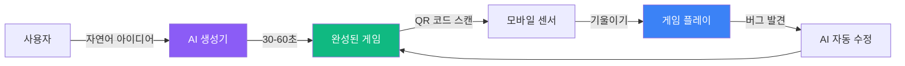
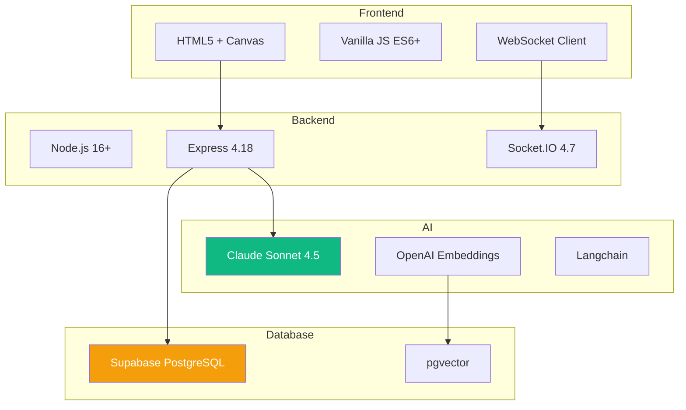
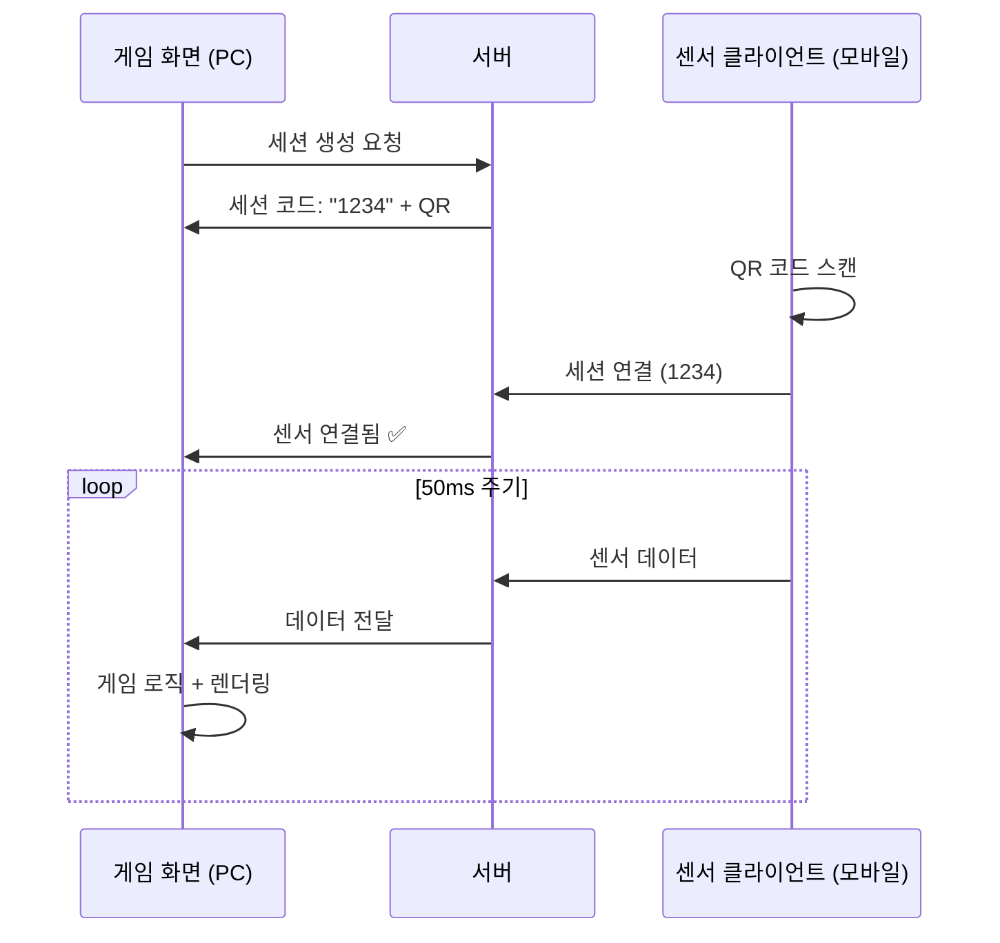
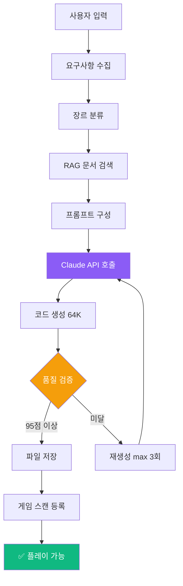
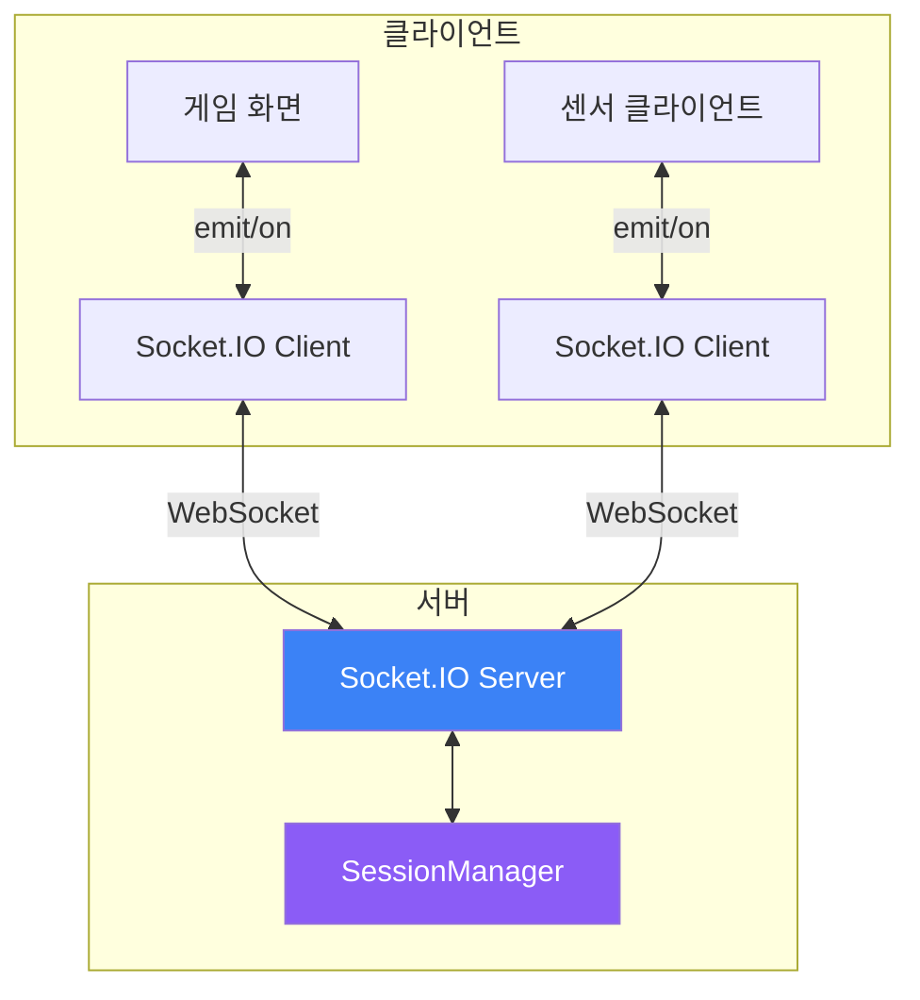

# 🎮 Sensor Game Hub v6.0 - part 1


> 프로젝트의 모든 것을 이해하고 독립적으로 개발할 수 있도록 돕는 완전한 가이드입니다.

---

## 📑 목차

### Part 1: 시작하기 (Getting Started)
- [1.1 프로젝트 개요](#11-프로젝트-개요)
- [1.2 핵심 개념 이해](#12-핵심-개념-이해)
- [1.3 로컬 환경 설정](#13-로컬-환경-설정)
- [1.4 첫 실행 및 동작 확인](#14-첫-실행-및-동작-확인)
- [1.5 개발 도구 설정](#15-개발-도구-설정)

### Part 2: 프로젝트 아키텍처 (Architecture Deep Dive)
- [2.1 전체 시스템 아키텍처](#21-전체-시스템-아키텍처)
- [2.2 디렉토리 구조 완전 분해](#22-디렉토리-구조-완전-분해)
- [2.3 핵심 모듈 역할 및 상호작용](#23-핵심-모듈-역할-및-상호작용)
- [2.4 데이터 흐름 추적](#24-데이터-흐름-추적)

### Part 3-10: [다음 Phase에서 계속...]

---

# Part 1: 시작하기 (Getting Started)

## 1.1 프로젝트 개요

### 무엇을 만드는 프로젝트인가요?

**Sensor Game Hub v6.0**은 AI 기반 센서 게임 생성 및 플레이 플랫폼입니다.



### 핵심 가치 (Why?)

| 기존 방식 | Sensor Game Hub |
|-----------|-----------------|
| 게임 개발 수주~수개월 | **30-60초** |
| 코딩 지식 필수 | **자연어만 입력** |
| 수동 버그 수정 | **AI 자동 수정** |
| 플랫폼 파편화 | **웹 기반 통합** |

### 주요 기능 (What?)

1. **🤖 AI 게임 생성기**
   - Claude Sonnet 4.5 (64K 토큰)
   - RAG 기반 400개 문서 검색
   - 5단계 실시간 진행률 표시
   - 자동 품질 검증 (95점 이상)

2. **🎮 실시간 게임 플레이**
   - WebSocket 기반 50ms 센서 전송
   - QR 코드 즉시 연결
   - Solo/Dual/Multi 게임 지원

3. **👤 개발자 계정 시스템**
   - 게임 소유권 관리
   - 버전 이력 자동 추적
   - AI 기반 유지보수

### 기술 스택 (How?)



## 1.2 핵심 개념 이해

### 개념 1: 세션 기반 게임 플레이



**핵심 이해**:
- PC는 게임 **화면** (디스플레이)
- 모바일은 **컨트롤러** (센서)
- 서버는 **중개자** (라우팅)

### 개념 2: AI 게임 생성 파이프라인



**5단계 진행률**:
1. **0-20%**: 게임 아이디어 분석
2. **20-40%**: RAG 시스템 문서 검색 (Vector DB)
3. **40-80%**: Claude Sonnet 4.5 코드 생성
4. **80-90%**: 코드 품질 검증
5. **90-100%**: 파일 저장 및 게임 등록

### 개념 3: RAG (Retrieval-Augmented Generation)

**왜 RAG를 사용하나요?**
- Claude API만 사용 → 일반적인 게임 생성
- RAG 추가 → **우리 프로젝트 전용** 게임 생성


**실제 예시**:
```javascript
// 사용자: "스마트폰을 기울여서 공을 굴리는 게임"

// 1. 임베딩 변환
const queryVector = await openai.embeddings.create({
    input: "스마트폰을 기울여서 공을 굴리는 게임",
    model: "text-embedding-3-small"
});

// 2. Vector DB 검색
const docs = await supabase
    .from('game_knowledge')
    .select('content')
    .match_documents(queryVector, 5);  // Top-5

// 3. Claude 프롬프트에 포함
const prompt = `
관련 문서:
${docs.map(d => d.content).join('\n')}

사용자 요구사항:
스마트폰을 기울여서 공을 굴리는 게임

위 문서를 참고하여 게임 코드를 생성하세요.
`;
```

### 개념 4: WebSocket 양방향 통신



**주요 이벤트**:
| 이벤트 | 방향 | 설명 |
|--------|------|------|
| `create-session` | PC → 서버 | 세션 생성 요청 |
| `session-created` | 서버 → PC | 세션 코드 반환 |
| `connect-sensor` | 모바일 → 서버 | 센서 연결 |
| `sensor-connected` | 서버 → PC/모바일 | 연결 완료 |
| `sensor-data` | 모바일 → 서버 → PC | 센서 데이터 전송 |

## 1.3 로컬 환경 설정

### 시스템 요구사항

```bash
Node.js:  >= 16.0.0
npm:      >= 7.0.0
OS:       macOS, Windows, Linux
메모리:    >= 4GB
디스크:    >= 500MB
```

### Step 1: 저장소 클론

```bash
# HTTPS (권장)
git clone https://github.com/your-org/sensorchatbot.git

# 또는 SSH
git clone git@github.com:your-org/sensorchatbot.git

# 디렉토리 이동
cd sensorchatbot
```

**확인**:
```bash
ls -la
# 출력 예시:
# .git/
# server/
# public/
# package.json
# ...
```

### Step 2: 환경 변수 설정

**2.1 `.env` 파일 생성**

```bash
# 템플릿 복사
cp .env.example .env

# 편집기로 열기
code .env  # VSCode
# 또는
nano .env  # 터미널 에디터
```

**2.2 필수 환경 변수 입력**

```bash
# ===== Claude API (필수) =====
CLAUDE_API_KEY=sk-ant-api...

# ===== OpenAI API (필수) =====
OPENAI_API_KEY=sk-proj...

# ===== Supabase (필수) =====
SUPABASE_URL=https://xxx.supabase.co
SUPABASE_ANON_KEY=eyJhbGc...

# ===== 서버 설정 (선택) =====
PORT=3000
NODE_ENV=development
```

**📌 API 키 발급 방법**:

<details>
<summary><b>Claude API 키 발급 (클릭하여 펼치기)</b></summary>

1. [Anthropic Console](https://console.anthropic.com/) 접속
2. 로그인 또는 회원가입
3. "API Keys" 메뉴 선택
4. "Create Key" 버튼 클릭
5. 키 이름 입력 (예: "SensorGameHub")
6. 생성된 키 복사 → `.env` 파일에 붙여넣기

**주의**: 키는 한 번만 표시됩니다. 안전하게 보관하세요!
</details>

<details>
<summary><b>OpenAI API 키 발급</b></summary>

1. [OpenAI Platform](https://platform.openai.com/) 접속
2. 로그인 또는 회원가입
3. "API keys" 메뉴 선택
4. "Create new secret key" 클릭
5. 생성된 키 복사 → `.env` 파일에 붙여넣기
</details>

<details>
<summary><b>Supabase 프로젝트 생성</b></summary>

1. [Supabase](https://supabase.com/) 접속
2. "New Project" 클릭
3. 프로젝트 이름: `sensorgame-hub`
4. 리전 선택: `Singapore (ap-southeast-1)` 권장
5. 데이터베이스 비밀번호 설정 (안전하게 보관!)
6. 프로젝트 생성 완료 (1-2분 소요)

**설정 → API**:
- `Project URL` → `SUPABASE_URL`
- `anon public` 키 → `SUPABASE_ANON_KEY`
</details>

### Step 3: 의존성 설치

```bash
npm install
```

**예상 출력**:
```
added 293 packages in 15s
```

**설치되는 주요 패키지**:
- `express` (4.18.2) - 웹 서버
- `socket.io` (4.7.2) - WebSocket 통신
- `@anthropic-ai/sdk` (0.30.1) - Claude API
- `@supabase/supabase-js` (2.58.0) - Supabase 클라이언트
- `openai` (4.71.1) - OpenAI Embeddings
- `langchain` (0.3.7) - RAG 파이프라인

**문제 발생 시**:
```bash
# 캐시 삭제 후 재설치
rm -rf node_modules package-lock.json
npm install
```

### Step 4: 데이터베이스 초기화

**4.1 Vector 확장 활성화**

Supabase 대시보드에서:
1. **SQL Editor** 메뉴 선택
2. "New query" 클릭
3. 다음 SQL 실행:

```sql
-- pgvector 확장 활성화
CREATE EXTENSION IF NOT EXISTS vector;

-- UUID 생성 함수 활성화
CREATE EXTENSION IF NOT EXISTS "uuid-ossp";
```

**4.2 테이블 생성**

```sql
-- game_knowledge 테이블 (RAG용)
CREATE TABLE game_knowledge (
    id UUID PRIMARY KEY DEFAULT uuid_generate_v4(),
    content TEXT NOT NULL,
    metadata JSONB,
    embedding VECTOR(1536),
    created_at TIMESTAMP WITH TIME ZONE DEFAULT NOW()
);

-- 벡터 인덱스 생성 (검색 속도 향상)
CREATE INDEX ON game_knowledge
USING ivfflat (embedding vector_cosine_ops)
WITH (lists = 100);
```

**4.3 문서 임베딩 생성**

```bash
# 프로젝트 루트에서 실행
node server/DocumentEmbedder.js
```

**예상 출력**:
```
🚀 임베딩 프로세스 시작...
📄 문서 로드: docs/PERFECT_GAME_DEVELOPMENT_GUIDE.md
📄 문서 로드: docs/SENSOR_GAME_TROUBLESHOOTING.md
...
✅ 35개 문서 → 400개 청크 생성
💾 Supabase 저장 중...
✅ 임베딩 완료! (총 소요: 45초)
```

## 1.4 첫 실행 및 동작 확인

### Step 1: 서버 시작

```bash
npm start
```

**성공 시 출력**:
```
🚀 GameServer v6.0 초기화 완료
📝 18개 게임 스캔 완료
🎯 대화형 게임 생성기 초기화 중...
✅ Claude API 연결 확인
✅ Supabase Vector Store 연결 확인
✅ AI Assistant 준비 완료

🌐 서버 실행 중: http://localhost:3000
```

### Step 2: 브라우저 접속

**랜딩 페이지**:
```
http://localhost:3000
```

**개발자 센터**:
```
http://localhost:3000/developer
```

**센서 클라이언트** (모바일):
```
http://localhost:3000/sensor.html
```

### Step 3: 첫 게임 생성 테스트

**3.1 개발자 센터 접속**
1. `http://localhost:3000/developer` 열기
2. "🤖 AI 게임 생성기" 탭 클릭

**3.2 게임 아이디어 입력**
```
스마트폰을 기울여서 공을 굴려 목표 지점에 도달하는 게임
```

**3.3 대화 진행**
- AI가 장르 질문 (아케이드/퍼즐?) → "아케이드"
- 센서 타입 확인 → "기울기만"
- 요구사항 요약 → "네, 생성해주세요!"

**3.4 생성 진행 확인**
```
🎯 게임 생성 시작!

1️⃣ 게임 아이디어 분석중... 10%
2️⃣ 관련 문서 검색 중... (Vector DB) 25%
3️⃣ Claude AI로 게임 코드 생성 중... 60%
4️⃣ 게임 코드 검증 중... 85%
5️⃣ 게임 저장 및 등록 중... 95%

✅ 게임 생성 완료! (소요 시간: 38초)
```

**3.5 게임 플레이**
1. "🎮 바로 플레이하기" 버튼 클릭
2. PC 화면에 세션 코드 + QR 표시
3. 모바일에서 `http://localhost:3000/sensor.html` 접속
4. QR 스캔 또는 세션 코드 입력
5. 센서 권한 허용
6. 게임 플레이 시작!

### Step 4: 동작 확인 체크리스트

```markdown
- [ ] 서버가 3000 포트에서 실행됨
- [ ] 랜딩 페이지가 정상 표시됨
- [ ] 개발자 센터 접속 가능
- [ ] AI 게임 생성기 탭이 보임
- [ ] 게임 아이디어 입력 가능
- [ ] 생성 진행률이 실시간 표시됨
- [ ] 게임 생성 완료 (30-60초)
- [ ] QR 코드 생성됨
- [ ] 모바일 센서 클라이언트 접속됨
- [ ] 센서 연결 후 게임 플레이 가능
```

**모두 체크되었나요? 축하합니다! 🎉**

## 1.5 개발 도구 설정

### VSCode 권장 설정

**1.1 필수 확장 프로그램**

```json
{
  "recommendations": [
    "dbaeumer.vscode-eslint",
    "esbenp.prettier-vscode",
    "ms-vscode.vscode-node-debug2",
    "christian-kohler.path-intellisense",
    "bierner.markdown-mermaid",
    "ms-vscode.live-server"
  ]
}
```

**설치 방법**:
1. VSCode에서 `Cmd+Shift+X` (Extensions)
2. 위 ID 검색하여 설치

**1.2 작업 영역 설정 (`.vscode/settings.json`)**

```json
{
  "editor.formatOnSave": true,
  "editor.defaultFormatter": "esbenp.prettier-vscode",
  "editor.codeActionsOnSave": {
    "source.fixAll.eslint": true
  },
  "javascript.suggest.autoImports": true,
  "files.exclude": {
    "**/node_modules": true,
    "**/coverage": true
  }
}
```

**1.3 디버깅 설정 (`.vscode/launch.json`)**

```json
{
  "version": "0.2.0",
  "configurations": [
    {
      "type": "node",
      "request": "launch",
      "name": "서버 디버그",
      "skipFiles": ["<node_internals>/**"],
      "program": "${workspaceFolder}/server/index.js",
      "envFile": "${workspaceFolder}/.env"
    }
  ]
}
```

**사용법**:
1. `server/index.js` 열기
2. 중단점 설정 (라인 번호 클릭)
3. `F5` 키 눌러 디버그 시작

### 개발 워크플로우

**Hot Reload 사용**:
```bash
# nodemon 설치 (전역)
npm install -g nodemon

# 파일 변경 시 자동 재시작
nodemon server/index.js
```

**로그 필터링**:
```bash
# 특정 모듈만 보기
DEBUG=GameGenerator npm start

# 모든 디버그 로그
DEBUG=* npm start
```

### 유용한 명령어 모음

```bash
# 서버 시작
npm start

# 개발 모드 (자동 재시작)
npm run dev

# 코드 스타일 검사
npm run lint

# 전체 게임 목록 조회
curl http://localhost:3000/api/games | jq

# 서버 통계
curl http://localhost:3000/api/stats | jq

# 게임 재스캔
curl -X POST http://localhost:3000/api/admin/rescan
```

---

**Part 1 완료! ✅**

다음: [Part 2: 프로젝트 아키텍처](#part-2-프로젝트-아키텍처)로 계속...
