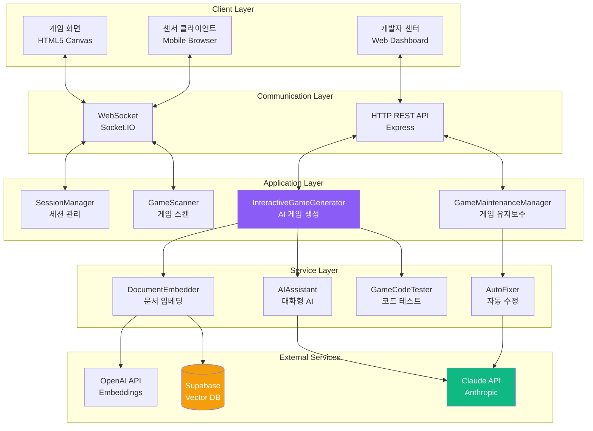
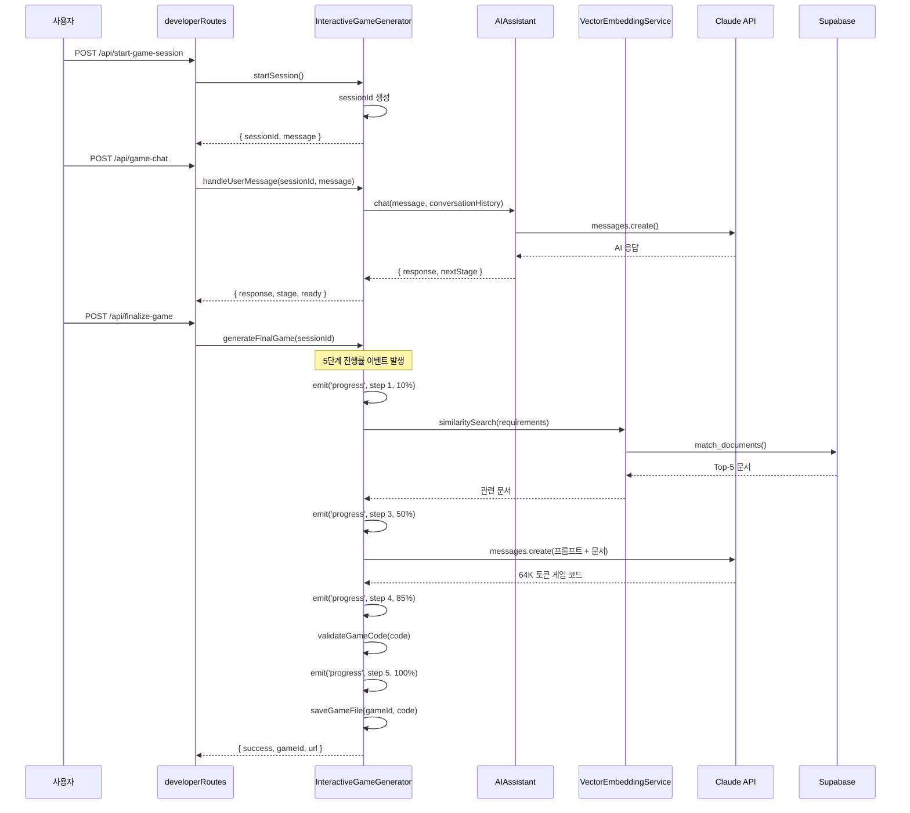
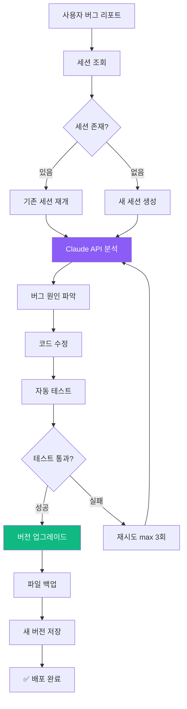
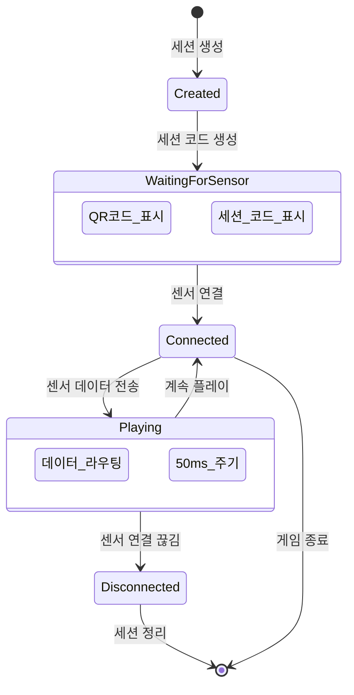
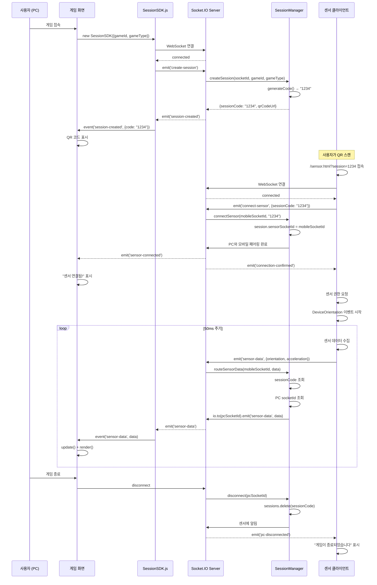
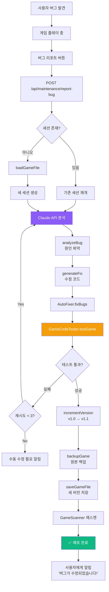

# Part 2: 프로젝트 아키텍처 (Architecture Deep Dive)

## 2.1 전체 시스템 아키텍처

### 레이어드 아키텍처 개요



### 주요 컴포넌트 역할

| 컴포넌트 | 역할 | 핵심 기능 | 파일 위치 |
|---------|------|-----------|----------|
| **SessionManager** | 게임 세션 관리 | 세션 생성, 센서 연결, 데이터 라우팅 | `server/SessionManager.js:150` |
| **InteractiveGameGenerator** | AI 게임 생성 | 대화형 생성, RAG 검색, 코드 생성 | `server/InteractiveGameGenerator.js:1400` |
| **GameMaintenanceManager** | 게임 유지보수 | 버그 수정, 기능 추가, 버전 관리 | `server/GameMaintenanceManager.js:429` |
| **GameScanner** | 게임 자동 스캔 | 게임 발견, 메타데이터 파싱 | `server/GameScanner.js:200` |
| **AIAssistant** | 대화형 AI | 요구사항 수집, 챗봇 응답 | `server/AIAssistant.js:350` |
| **DocumentEmbedder** | 문서 임베딩 | 마크다운 청킹, 벡터 변환 | `server/DocumentEmbedder.js:250` |

## 2.2 디렉토리 구조 완전 분해

### 프로젝트 루트 구조

```
sensorchatbot/
├── server/                 # 백엔드 코드 (50개 파일, 25,000 LOC)
├── public/                 # 프론트엔드 정적 파일
├── docs/                   # 프로젝트 문서
├── .env                    # 환경 변수 (비공개)
├── .gitignore              # Git 제외 파일
├── package.json            # 의존성 및 스크립트
└── README.md               # 프로젝트 소개
```

### server/ 디렉토리 상세 분해 (50개 파일)

#### 📁 server/ (루트 레벨 - 핵심 모듈)

```
server/
├── index.js                           # 메인 진입점 (755줄)
│   ├── Express 서버 초기화
│   ├── Socket.IO 설정
│   ├── 라우트 등록
│   └── 게임 스캔 및 세션 관리 시작
│
├── InteractiveGameGenerator.js        # AI 게임 생성기 (1,400줄) ⭐
│   ├── 4단계 대화형 생성 플로우
│   ├── RAG 시스템 통합
│   ├── Claude Sonnet 4.5 API 호출
│   └── 5단계 진행률 트래킹
│
├── GameMaintenanceManager.js          # 게임 유지보수 (429줄) ⭐
│   ├── 버그 리포트 처리
│   ├── 기능 추가 요청
│   ├── 자동 버전 관리
│   └── 세션 유지 (30분 타임아웃)
│
├── SessionManager.js                  # 세션 관리 (150줄) ⭐
│   ├── 4자리 세션 코드 생성
│   ├── 센서 클라이언트 연결
│   ├── 데이터 라우팅 (PC ↔ 모바일)
│   └── 세션 정리
│
├── GameScanner.js                     # 게임 스캔 (200줄)
│   ├── public/games/ 자동 스캔
│   ├── game.json 파싱
│   └── 게임 메타데이터 관리
│
├── DocumentEmbedder.js                # 문서 임베딩 (250줄)
│   ├── 마크다운 파일 로드
│   ├── 청크 분할 (512토큰)
│   ├── OpenAI Embedding 생성
│   └── Supabase 저장
│
├── AIAssistant.js                     # 대화형 AI (350줄)
│   ├── Claude API 대화 관리
│   ├── 요구사항 추출
│   └── 컨텍스트 유지
│
├── GameCodeTester.js                  # 코드 테스트 (400줄)
│   ├── Puppeteer 기반 브라우저 테스트
│   ├── SDK 연결 검증
│   ├── 게임 로직 검증
│   └── 버그 탐지
│
└── AutoFixer.js                       # 자동 수정 (300줄)
    ├── 테스트 결과 분석
    ├── Claude API로 버그 수정
    └── 최대 3회 재시도
```

#### 📁 server/routes/ (라우팅)

```
server/routes/
├── developerRoutes.js                 # 개발자 센터 (2,300줄) ⭐
│   ├── /developer - 대시보드 HTML 생성
│   ├── /api/start-game-session - 세션 시작
│   ├── /api/game-chat - AI 대화
│   ├── /api/finalize-game - 게임 생성 실행
│   ├── /api/download-game/:gameId - ZIP 다운로드
│   └── 실시간 진행률 WebSocket 이벤트
│
├── gameRoutes.js                      # 게임 API (150줄)
│   ├── /api/games - 게임 목록
│   ├── /api/games/:gameId - 게임 정보
│   └── /games/:gameId - 게임 HTML 제공
│
├── landingRoutes.js                   # 랜딩 페이지 (100줄)
│   └── / - 동적 홈페이지 생성
│
├── performanceRoutes.js               # 성능 모니터링 (80줄)
│   └── /api/stats - 서버 통계
│
└── testRoutes.js                      # 테스트 API (120줄)
    └── /api/test/* - 개발 전용 엔드포인트
```

#### 📁 server/generators/ (멀티 스테이지 생성기)

```
server/generators/
├── StructureGenerator.js              # Stage 1: 구조 생성 (200줄)
│   ├── HTML 뼈대 생성
│   ├── SessionSDK 통합
│   └── 캔버스 초기화
│
├── GameLogicGenerator.js              # Stage 2: 로직 생성 (250줄)
│   ├── 물리 시뮬레이션
│   ├── 충돌 감지
│   └── 게임 상태 관리
│
└── IntegrationGenerator.js            # Stage 3: 통합 (180줄)
    ├── Stage 1 + Stage 2 결합
    └── 센서 연결 검증
```

#### 📁 server/services/ (서비스 레이어)

```
server/services/
├── DocumentChunker.js                 # 문서 청킹 (120줄)
│   └── RecursiveCharacterTextSplitter 래퍼
│
├── EmbeddingGenerator.js              # 임베딩 생성 (150줄)
│   └── OpenAI API 호출 및 배치 처리
│
├── VectorEmbeddingService.js          # 벡터 DB 서비스 (180줄)
│   ├── Supabase 연결
│   └── 유사도 검색
│
├── SearchAPI.js                       # 검색 API (100줄)
│   └── RAG 검색 추상화
│
├── LegacyGameValidator.js             # 게임 검증 (200줄)
│   └── 생성된 게임 품질 검사
│
└── SystemIntegrationTester.js         # 통합 테스트 (150줄)
    └── E2E 테스트 자동화
```

#### 📁 server/core/ (핵심 시스템)

```
server/core/
├── GameServer.js                      # 게임 서버 (300줄)
│   ├── Express + Socket.IO 통합
│   └── 전역 상태 관리
│
└── MiddlewareConfig.js                # 미들웨어 (100줄)
    ├── CORS 설정
    ├── Body Parser
    ├── Gzip 압축
    └── 에러 핸들러
```

#### 📁 server/utils/ (유틸리티)

```
server/utils/
├── htmlGenerator.js                   # HTML 생성 (180줄)
│   └── 동적 페이지 생성
│
├── markdownRenderer.js                # 마크다운 렌더러 (120줄)
│   └── MD → HTML 변환
│
└── templateCode.js                    # 코드 템플릿 (150줄)
    └── 게임 코드 스니펫
```

#### 📁 server/validation/ (검증)

```
server/validation/
├── CodeValidator.js                   # 코드 검증 (200줄)
│   ├── SDK 통합 확인
│   ├── 센서 데이터 처리 검증
│   └── 100점 만점 채점
│
└── ErrorDetectionEngine.js            # 에러 감지 (180줄)
    └── 정적 분석 및 패턴 매칭
```

#### 📁 server/monitoring/ (모니터링)

```
server/monitoring/
├── PerformanceMonitor.js              # 성능 모니터링 (150줄)
│   ├── CPU/메모리 사용량
│   └── 응답 시간 추적
│
└── LiveErrorMonitor.js                # 실시간 에러 (120줄)
    └── 에러 로깅 및 알림
```

#### 📁 server/templates/, prompts/, context/ (지원 모듈)

```
server/templates/
└── GameTemplateStandard.js            # 표준 템플릿 (200줄)

server/prompts/
└── StandardizedPromptTemplates.js     # 프롬프트 (300줄)

server/context/
└── ContextManager.js                  # 컨텍스트 (150줄)
```

### public/ 디렉토리 상세 분해

```
public/
├── games/                             # 게임 디렉토리
│   ├── solo/                          # 솔로 게임
│   ├── dual/                          # 듀얼 게임
│   ├── multi/                         # 멀티플레이어 게임
│   ├── cake-delivery/                 # 케이크 배달 (3D 게임)
│   ├── shot-target/                   # 슈팅 게임
│   └── [AI 생성 게임들]/              # 자동 생성된 게임
│
├── js/
│   └── SessionSDK.js                  # 통합 SDK (500줄) ⭐
│       ├── 세션 생성
│       ├── QR 코드 생성
│       ├── WebSocket 연결
│       ├── 센서 데이터 수신
│       └── 이벤트 시스템
│
├── sensor.html                        # 센서 클라이언트 (300줄)
│   ├── 세션 코드 입력
│   ├── 센서 권한 요청
│   ├── 50ms 주기 데이터 전송
│   └── 연결 상태 표시
│
└── ai-game-generator.html             # 게임 생성기 UI (구 버전)
```

### docs/ 디렉토리

```
docs/
├── 프로젝트_설계_명세서.md            # 설계 명세서 (2,671줄)
├── 개발자_온보딩_가이드.md            # 이 문서!
├── PERFECT_GAME_DEVELOPMENT_GUIDE.md  # 게임 개발 가이드
├── SENSOR_GAME_TROUBLESHOOTING.md     # 트러블슈팅
└── [35개 추가 마크다운 파일]          # RAG용 문서
```

## 2.3 핵심 모듈 역할 및 상호작용

### 모듈 1: InteractiveGameGenerator (AI 게임 생성기)

**파일**: `server/InteractiveGameGenerator.js:1-1400`

**역할**: 사용자와 대화하며 게임을 생성하는 핵심 AI 시스템



**핵심 함수**:

```javascript
// server/InteractiveGameGenerator.js

class InteractiveGameGenerator {
    // 1. 세션 시작
    async startSession(userId) {
        const sessionId = this.generateSessionId();
        this.sessions.set(sessionId, {
            requirements: {},
            conversationHistory: [],
            stage: 'initial'
        });
        return { sessionId, message: '어떤 게임을 만들고 싶으신가요?' };
    }

    // 2. 사용자 메시지 처리
    async handleUserMessage(sessionId, userMessage) {
        const session = this.sessions.get(sessionId);

        // AI Assistant와 대화
        const response = await this.aiAssistant.chat(
            userMessage,
            session.conversationHistory
        );

        // 요구사항 추출
        this.extractRequirements(response, session);

        // 다음 단계 결정
        const nextStage = this.determineNextStage(session);

        return {
            response,
            stage: nextStage,
            ready: nextStage === 'confirmation'
        };
    }

    // 3. 최종 게임 생성 (5단계 진행률)
    async generateFinalGame(sessionId) {
        const session = this.sessions.get(sessionId);

        // Step 1 (0-20%): 게임 아이디어 분석
        this.io.emit('game-generation-progress', {
            sessionId,
            step: 1,
            percentage: 10,
            message: '게임 아이디어 분석 중...'
        });

        // Step 2 (20-40%): RAG 문서 검색
        this.io.emit('game-generation-progress', {
            sessionId,
            step: 2,
            percentage: 25,
            message: '관련 문서 검색 중... (Vector DB)'
        });

        const docs = await this.getGameDevelopmentContext(
            session.requirements
        );

        // Step 3 (40-80%): Claude 코드 생성
        this.io.emit('game-generation-progress', {
            sessionId,
            step: 3,
            percentage: 50,
            message: 'Claude AI로 게임 코드 생성 중...'
        });

        const gameCode = await this.generateGameCode(
            session.requirements,
            docs
        );

        // Step 4 (80-90%): 코드 검증
        this.io.emit('game-generation-progress', {
            sessionId,
            step: 4,
            percentage: 85,
            message: '게임 코드 검증 중...'
        });

        const validationScore = await this.validateGameCode(gameCode);

        if (validationScore < 60) {
            throw new Error('생성된 게임 품질 미달');
        }

        // Step 5 (90-100%): 파일 저장
        this.io.emit('game-generation-progress', {
            sessionId,
            step: 5,
            percentage: 95,
            message: '게임 저장 및 등록 중...'
        });

        const gameId = await this.saveGameFile(gameCode);

        this.io.emit('game-generation-progress', {
            sessionId,
            step: 5,
            percentage: 100,
            message: '✅ 게임 생성 완료!'
        });

        return { success: true, gameId };
    }

    // 4. RAG 시스템 (server/InteractiveGameGenerator.js:1374)
    async getGameDevelopmentContext(requirements) {
        const queryText = `
            게임 타입: ${requirements.gameType}
            장르: ${requirements.genre}
            센서: ${requirements.sensorType}
            특징: ${requirements.description}
        `;

        // Vector DB 검색
        const results = await this.vectorStore.similaritySearch(
            queryText,
            5  // Top-5 문서
        );

        return results.map(doc => doc.pageContent).join('\n\n');
    }

    // 5. 코드 검증 (server/InteractiveGameGenerator.js:1589)
    validateGameCode(code) {
        let score = 0;

        // SessionSDK 통합 (20점)
        if (code.includes('new SessionSDK')) score += 20;

        // 센서 데이터 처리 (25점)
        if (code.includes('sensor-data')) score += 25;

        // 게임 루프 (20점)
        if (code.includes('update(') && code.includes('render(')) {
            score += 20;
        }

        // Canvas 렌더링 (15점)
        if (code.includes('canvas.getContext')) score += 15;

        // 게임 상태 관리 (10점)
        if (code.includes('gameState')) score += 10;

        // 코드 품질 (10점)
        const hasErrorHandling = code.includes('try') || code.includes('catch');
        const hasComments = code.includes('//');
        if (hasErrorHandling && hasComments) score += 10;

        return score;
    }
}
```

**의존성**:
- `AIAssistant` (대화 관리)
- `VectorEmbeddingService` (RAG 검색)
- `CodeValidator` (품질 검증)
- `Socket.IO` (진행률 이벤트)

### 모듈 2: GameMaintenanceManager (게임 유지보수)

**파일**: `server/GameMaintenanceManager.js:1-429`

**역할**: 생성된 게임의 버그 수정 및 기능 추가



**핵심 함수**:

```javascript
// server/GameMaintenanceManager.js

class GameMaintenanceManager {
    constructor(io, gameScanner) {
        this.io = io;
        this.gameScanner = gameScanner;
        this.activeSessions = new Map();

        // 30분 후 세션 자동 정리
        setInterval(() => this.cleanupSessions(), 30 * 60 * 1000);
    }

    // 1. 버그 리포트 처리
    async reportBug(gameId, userReport) {
        // 기존 세션 확인 또는 생성
        let session = this.activeSessions.get(gameId);

        if (!session) {
            // 게임 파일 로드
            const gameCode = await this.loadGameFile(gameId);

            session = {
                gameId,
                gameCode,
                conversationHistory: [],
                version: 'v1.0',
                createdAt: Date.now()
            };

            this.activeSessions.set(gameId, session);
        }

        // Claude API로 버그 분석
        const analysis = await this.analyzeBug(userReport, session.gameCode);

        // 버그 수정 코드 생성
        const fixedCode = await this.generateFix(analysis, session);

        // 버전 업그레이드
        session.version = this.incrementVersion(session.version);

        // 백업 및 저장
        await this.backupGame(gameId, session.gameCode);
        await this.saveGameFile(gameId, fixedCode);

        return { success: true, version: session.version };
    }

    // 2. 기능 추가 요청
    async addFeature(gameId, featureRequest) {
        const session = this.activeSessions.get(gameId);

        // Claude API로 증분 업데이트
        const prompt = `
기존 게임 코드:
${session.gameCode}

사용자 요청:
${featureRequest}

위 게임에 요청된 기능을 추가하세요. 기존 코드를 최대한 유지하고,
새 기능만 추가하세요.
        `;

        const updatedCode = await this.claudeClient.messages.create({
            model: 'claude-sonnet-4-5-20250929',
            max_tokens: 64000,
            messages: [{ role: 'user', content: prompt }]
        });

        return updatedCode;
    }

    // 3. 세션 정리 (30분 타임아웃)
    cleanupSessions() {
        const now = Date.now();
        const timeout = 30 * 60 * 1000; // 30분

        for (const [gameId, session] of this.activeSessions) {
            if (now - session.createdAt > timeout) {
                this.activeSessions.delete(gameId);
                console.log(`세션 만료: ${gameId}`);
            }
        }
    }
}
```

**API 엔드포인트** (`server/routes/developerRoutes.js`):
- `POST /api/maintenance/report-bug` - 버그 리포트
- `POST /api/maintenance/add-feature` - 기능 추가
- `GET /api/maintenance/session/:gameId` - 세션 정보
- `GET /api/maintenance/history/:gameId` - 수정 이력

### 모듈 3: SessionManager (세션 관리)

**파일**: `server/SessionManager.js:1-150`

**역할**: PC와 모바일 간 게임 세션 연결 관리



**핵심 함수**:

```javascript
// server/SessionManager.js

class SessionManager {
    constructor(io) {
        this.io = io;
        this.sessions = new Map(); // sessionCode → session
        this.pcClients = new Map(); // socketId → sessionCode
        this.sensorClients = new Map(); // socketId → sessionCode
    }

    // 1. 세션 생성 (PC 게임 화면)
    createSession(pcSocketId, gameId, gameType) {
        const sessionCode = this.generateCode(); // 1000-9999

        const session = {
            code: sessionCode,
            gameId,
            gameType,
            pcSocketId,
            sensorSocketId: null,
            createdAt: Date.now(),
            status: 'waiting'
        };

        this.sessions.set(sessionCode, session);
        this.pcClients.set(pcSocketId, sessionCode);

        console.log(`✅ 세션 생성: ${sessionCode} (${gameType})`);

        return {
            sessionCode,
            qrCodeUrl: this.generateQRCodeURL(sessionCode)
        };
    }

    // 2. 센서 연결 (모바일)
    connectSensor(sensorSocketId, sessionCode) {
        const session = this.sessions.get(sessionCode);

        if (!session) {
            throw new Error(`세션을 찾을 수 없습니다: ${sessionCode}`);
        }

        if (session.sensorSocketId) {
            throw new Error('이미 센서가 연결되어 있습니다');
        }

        // 센서 연결
        session.sensorSocketId = sensorSocketId;
        session.status = 'connected';
        this.sensorClients.set(sensorSocketId, sessionCode);

        // PC에 알림
        this.io.to(session.pcSocketId).emit('sensor-connected', {
            sessionCode,
            message: '센서 연결됨!'
        });

        // 모바일에 확인
        this.io.to(sensorSocketId).emit('connection-confirmed', {
            sessionCode,
            gameId: session.gameId,
            gameType: session.gameType
        });

        console.log(`✅ 센서 연결: ${sessionCode}`);

        return { success: true };
    }

    // 3. 센서 데이터 라우팅 (모바일 → PC)
    routeSensorData(sensorSocketId, sensorData) {
        const sessionCode = this.sensorClients.get(sensorSocketId);

        if (!sessionCode) {
            console.warn('센서가 세션에 연결되지 않음');
            return;
        }

        const session = this.sessions.get(sessionCode);

        if (!session || !session.pcSocketId) {
            console.warn('PC 클라이언트 없음');
            return;
        }

        // PC로 데이터 전달
        this.io.to(session.pcSocketId).emit('sensor-data', sensorData);
    }

    // 4. 연결 해제
    disconnect(socketId) {
        // PC 클라이언트 연결 해제
        if (this.pcClients.has(socketId)) {
            const sessionCode = this.pcClients.get(socketId);
            const session = this.sessions.get(sessionCode);

            if (session && session.sensorSocketId) {
                // 센서에 알림
                this.io.to(session.sensorSocketId).emit('pc-disconnected');
            }

            this.sessions.delete(sessionCode);
            this.pcClients.delete(socketId);
            console.log(`PC 연결 해제: ${sessionCode}`);
        }

        // 센서 클라이언트 연결 해제
        if (this.sensorClients.has(socketId)) {
            const sessionCode = this.sensorClients.get(socketId);
            const session = this.sessions.get(sessionCode);

            if (session) {
                session.sensorSocketId = null;
                session.status = 'waiting';

                // PC에 알림
                this.io.to(session.pcSocketId).emit('sensor-disconnected');
            }

            this.sensorClients.delete(socketId);
            console.log(`센서 연결 해제: ${sessionCode}`);
        }
    }

    // 유틸리티
    generateCode() {
        return Math.floor(1000 + Math.random() * 9000).toString();
    }

    generateQRCodeURL(sessionCode) {
        return `http://localhost:3000/sensor.html?session=${sessionCode}`;
    }
}
```

**WebSocket 이벤트 핸들링** (`server/index.js:450-550`):

```javascript
// server/index.js

io.on('connection', (socket) => {
    console.log('클라이언트 연결:', socket.id);

    // 세션 생성 (PC)
    socket.on('create-session', ({ gameId, gameType }) => {
        const result = sessionManager.createSession(
            socket.id,
            gameId,
            gameType
        );
        socket.emit('session-created', result);
    });

    // 센서 연결 (모바일)
    socket.on('connect-sensor', ({ sessionCode }) => {
        try {
            sessionManager.connectSensor(socket.id, sessionCode);
        } catch (error) {
            socket.emit('connection-error', { message: error.message });
        }
    });

    // 센서 데이터 전송 (모바일 → PC)
    socket.on('sensor-data', (data) => {
        sessionManager.routeSensorData(socket.id, data);
    });

    // 연결 해제
    socket.on('disconnect', () => {
        sessionManager.disconnect(socket.id);
    });
});
```

## 2.4 데이터 흐름 추적

### 플로우 1: 게임 생성 플로우 (End-to-End)

```mermaid
graph TB
    Start([사용자]) --> A1[개발자 센터 접속]
    A1 --> A2[AI 게임 생성기 탭]
    A2 --> A3[POST /api/start-game-session]

    A3 --> B1[InteractiveGameGenerator.startSession]
    B1 --> B2{sessionId 생성}
    B2 --> B3[초기 메시지 반환]

    B3 --> C1[사용자 메시지 입력]
    C1 --> C2[POST /api/game-chat]
    C2 --> C3[AIAssistant.chat]
    C3 --> C4[Claude API 호출]
    C4 --> C5{4단계 완료?}

    C5 -->|아니오| C1
    C5 -->|예| D1[생성 시작 버튼]

    D1 --> D2[POST /api/finalize-game]
    D2 --> E1[Step 1: 아이디어 분석]
    E1 --> E2[emit progress 10%]

    E2 --> F1[Step 2: RAG 문서 검색]
    F1 --> F2[VectorEmbeddingService.similaritySearch]
    F2 --> F3[(Supabase Vector DB)]
    F3 --> F4[Top-5 문서 반환]
    F4 --> F5[emit progress 25%]

    F5 --> G1[Step 3: Claude 코드 생성]
    G1 --> G2[emit progress 50%]
    G2 --> G3[Claude API 호출<br/>64K 토큰]
    G3 --> G4[게임 코드 생성]
    G4 --> G5[emit progress 75%]

    G5 --> H1[Step 4: 코드 검증]
    H1 --> H2[validateGameCode]
    H2 --> H3{점수 >= 60?}

    H3 -->|실패| I1[재생성 max 3회]
    I1 --> G1

    H3 -->|성공| J1[Step 5: 파일 저장]
    J1 --> J2[fs.writeFile]
    J2 --> J3[GameScanner 재스캔]
    J3 --> J4[emit progress 100%]

    J4 --> End([✅ 게임 생성 완료])

    style C4 fill:#8b5cf6,color:#fff
    style F3 fill:#f59e0b,color:#fff
    style G3 fill:#10b981,color:#fff
    style End fill:#10b981,color:#fff
```



### 플로우 2: 게임 플레이 세션 플로우



### 플로우 3: 게임 유지보수 플로우



---

**Part 2 완료! ✅**

**완료된 내용**:
- 2.1 전체 시스템 아키텍처 (레이어드 아키텍처 다이어그램)
- 2.2 디렉토리 구조 완전 분해 (50개 파일 상세 설명)
- 2.3 핵심 모듈 역할 (InteractiveGameGenerator, GameMaintenanceManager, SessionManager 코드 포함)
- 2.4 데이터 흐름 추적 (3개 주요 플로우 다이어그램)

**통계**:
- 추가된 라인 수: ~620줄
- 다이어그램: 6개
- 코드 예시: 3개 주요 모듈
