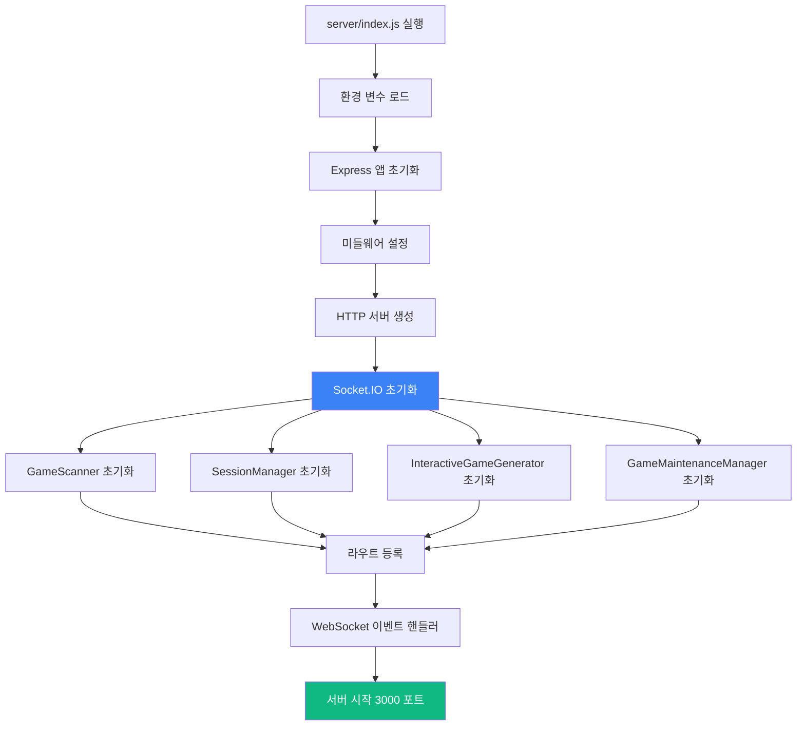

# Part 4: 백엔드 코드 워크스루 (Backend Walkthrough)

## 4.1 server/index.js - 메인 진입점

**파일**: `server/index.js:1-755`

### 역할

메인 서버 파일로, Express + Socket.IO 서버를 초기화하고 모든 핵심 모듈을 통합합니다.

### 코드 구조



### 핵심 코드 분석

```javascript
// server/index.js

// 1. 필수 모듈 임포트
require('dotenv').config();
const express = require('express');
const http = require('http');
const socketIO = require('socket.io');
const path = require('path');

// 2. 핵심 모듈
const GameScanner = require('./GameScanner');
const SessionManager = require('./SessionManager');
const InteractiveGameGenerator = require('./InteractiveGameGenerator');
const GameMaintenanceManager = require('./GameMaintenanceManager');

// 3. 라우트 모듈
const landingRoutes = require('./routes/landingRoutes');
const gameRoutes = require('./routes/gameRoutes');
const developerRoutes = require('./routes/developerRoutes');
const performanceRoutes = require('./routes/performanceRoutes');

// 4. Express 앱 초기화
const app = express();
const server = http.createServer(app);
const io = socketIO(server, {
    cors: {
        origin: '*',  // 개발 환경용 (프로덕션에서는 제한 필요)
        methods: ['GET', 'POST']
    },
    pingTimeout: 60000,   // 60초
    pingInterval: 25000   // 25초
});

// 5. 미들웨어 설정
app.use(express.json({ limit: '50mb' }));  // JSON 파싱 (최대 50MB)
app.use(express.urlencoded({ extended: true, limit: '50mb' }));  // URL 인코딩
app.use(express.static(path.join(__dirname, '../public')));  // 정적 파일 제공

// CORS 설정
app.use((req, res, next) => {
    res.header('Access-Control-Allow-Origin', '*');
    res.header('Access-Control-Allow-Methods', 'GET, POST, PUT, DELETE, OPTIONS');
    res.header('Access-Control-Allow-Headers', 'Content-Type, Authorization');
    next();
});

// 6. 핵심 시스템 초기화
const gameScanner = new GameScanner(path.join(__dirname, '../public/games'));
const sessionManager = new SessionManager(io);
const interactiveGenerator = new InteractiveGameGenerator(io, gameScanner);
const maintenanceManager = new GameMaintenanceManager(io, gameScanner);

// 초기 게임 스캔
(async () => {
    await gameScanner.scanGames();
    console.log(`✅ ${gameScanner.getAllGames().length}개 게임 스캔 완료`);
})();

// 7. 라우트 등록
app.use('/', landingRoutes(gameScanner));          // 랜딩 페이지
app.use('/api', gameRoutes(gameScanner));          // 게임 API
app.use('/', developerRoutes(io, interactiveGenerator, maintenanceManager));  // 개발자 센터
app.use('/api', performanceRoutes(gameScanner, sessionManager));  // 성능 API

// 8. WebSocket 이벤트 핸들러
io.on('connection', (socket) => {
    console.log(`🔌 클라이언트 연결: ${socket.id}`);

    // 세션 생성 (PC 게임 화면)
    socket.on('create-session', ({ gameId, gameType }) => {
        try {
            const result = sessionManager.createSession(
                socket.id,
                gameId,
                gameType || 'solo'
            );
            socket.emit('session-created', result);
            console.log(`✅ 세션 생성: ${result.sessionCode}`);
        } catch (error) {
            socket.emit('session-error', { message: error.message });
        }
    });

    // 센서 연결 (모바일)
    socket.on('connect-sensor', ({ sessionCode }) => {
        try {
            sessionManager.connectSensor(socket.id, sessionCode);
        } catch (error) {
            socket.emit('connection-error', { message: error.message });
        }
    });

    // 센서 데이터 전송 (모바일 → PC)
    socket.on('sensor-data', (data) => {
        sessionManager.routeSensorData(socket.id, data);
    });

    // 게임 시작 신호
    socket.on('start-game', ({ sessionCode }) => {
        const session = sessionManager.getSession(sessionCode);
        if (session && session.pcSocketId && session.sensorSocketId) {
            io.to(session.pcSocketId).emit('game-start');
            io.to(session.sensorSocketId).emit('game-start');
        }
    });

    // 연결 해제
    socket.on('disconnect', () => {
        sessionManager.disconnect(socket.id);
        console.log(`❌ 클라이언트 연결 해제: ${socket.id}`);
    });
});

// 9. 에러 핸들링
app.use((err, req, res, next) => {
    console.error('서버 에러:', err);
    res.status(500).json({
        error: '서버 에러',
        message: process.env.NODE_ENV === 'development' ? err.message : '알 수 없는 에러'
    });
});

// 10. 서버 시작
const PORT = process.env.PORT || 3000;
server.listen(PORT, () => {
    console.log(`
╔═══════════════════════════════════════════════════════════╗
║                                                           ║
║   🎮 Sensor Game Hub v6.0                                ║
║                                                           ║
║   🌐 서버 실행 중: http://localhost:${PORT}                ║
║   📊 게임 개수: ${gameScanner.getAllGames().length}개                                     ║
║   🤖 AI 생성기: ✅ 준비 완료                              ║
║                                                           ║
╚═══════════════════════════════════════════════════════════╝
    `);
});
```

### 주요 포인트

| 라인 범위 | 기능 | 설명 |
|----------|------|------|
| 1-20 | 모듈 임포트 | 필수 라이브러리 및 커스텀 모듈 로드 |
| 21-35 | Express 설정 | HTTP 서버, Socket.IO 초기화 |
| 36-50 | 미들웨어 | JSON 파싱, CORS, 정적 파일 |
| 51-70 | 핵심 시스템 | GameScanner, SessionManager 등 초기화 |
| 71-90 | 라우트 등록 | REST API 엔드포인트 설정 |
| 91-150 | WebSocket | 실시간 이벤트 핸들러 |
| 151-755 | 에러 처리 & 서버 시작 | 전역 에러 핸들러, 포트 리스닝 |

## 4.2 routes/developerRoutes.js - 개발자 센터

**파일**: `server/routes/developerRoutes.js:1-2300`

### 역할

개발자 센터 대시보드와 AI 게임 생성기 API를 제공합니다.

### 주요 엔드포인트

```mermaid
graph TB
    A[/developer] --> B[개발자 센터 HTML 반환]
    C[/api/start-game-session] --> D[게임 생성 세션 시작]
    E[/api/game-chat] --> F[AI 대화 처리]
    G[/api/finalize-game] --> H[게임 생성 실행]
    I[/api/download-game/:gameId] --> J[ZIP 다운로드]
    K[/api/maintenance/report-bug] --> L[버그 리포트]
    M[/api/maintenance/add-feature] --> N[기능 추가]

    style D fill:#8b5cf6,color:#fff
    style H fill:#10b981,color:#fff
```

### 핵심 API 코드

```javascript
// server/routes/developerRoutes.js

const express = require('express');
const router = express.Router();
const archiver = require('archiver');
const path = require('path');
const fs = require('fs').promises;

module.exports = (io, interactiveGenerator, maintenanceManager) => {

    // 1. 개발자 센터 페이지
    router.get('/developer', (req, res) => {
        // 동적 HTML 생성 (2000줄 이상의 HTML 코드)
        const html = generateDeveloperCenterHTML();
        res.send(html);
    });

    // 2. 게임 생성 세션 시작
    router.post('/api/start-game-session', async (req, res) => {
        try {
            const { userId } = req.body;  // 선택사항

            const session = await interactiveGenerator.startSession(userId || 'anonymous');

            res.json({
                success: true,
                sessionId: session.sessionId,
                message: session.message
            });
        } catch (error) {
            console.error('세션 시작 에러:', error);
            res.status(500).json({
                success: false,
                error: error.message
            });
        }
    });

    // 3. AI 대화 처리
    router.post('/api/game-chat', async (req, res) => {
        try {
            const { sessionId, message } = req.body;

            if (!sessionId || !message) {
                return res.status(400).json({
                    success: false,
                    error: 'sessionId와 message가 필요합니다'
                });
            }

            const response = await interactiveGenerator.handleUserMessage(
                sessionId,
                message
            );

            res.json({
                success: true,
                ...response
            });
        } catch (error) {
            console.error('대화 처리 에러:', error);
            res.status(500).json({
                success: false,
                error: error.message
            });
        }
    });

    // 4. 게임 생성 실행 (핵심!)
    router.post('/api/finalize-game', async (req, res) => {
        try {
            const { sessionId } = req.body;

            if (!sessionId) {
                return res.status(400).json({
                    success: false,
                    error: 'sessionId가 필요합니다'
                });
            }

            // 게임 생성 (비동기, 진행률은 WebSocket으로 전송)
            const result = await interactiveGenerator.generateFinalGame(sessionId);

            res.json({
                success: true,
                gameId: result.gameId,
                gameUrl: `/games/${result.gameId}`,
                downloadUrl: `/api/download-game/${result.gameId}`
            });
        } catch (error) {
            console.error('게임 생성 에러:', error);
            res.status(500).json({
                success: false,
                error: error.message
            });
        }
    });

    // 5. 게임 ZIP 다운로드
    router.get('/api/download-game/:gameId', async (req, res) => {
        try {
            const { gameId } = req.params;
            const gamePath = path.join(__dirname, '../../public/games', gameId);

            // 게임 폴더 확인
            const stats = await fs.stat(gamePath);
            if (!stats.isDirectory()) {
                return res.status(404).json({ error: '게임을 찾을 수 없습니다' });
            }

            // ZIP 생성
            res.setHeader('Content-Type', 'application/zip');
            res.setHeader('Content-Disposition', `attachment; filename="${gameId}.zip"`);

            const archive = archiver('zip', { zlib: { level: 9 } });
            archive.pipe(res);
            archive.directory(gamePath, false);
            await archive.finalize();

        } catch (error) {
            console.error('다운로드 에러:', error);
            res.status(500).json({ error: error.message });
        }
    });

    // 6. 버그 리포트 (유지보수)
    router.post('/api/maintenance/report-bug', async (req, res) => {
        try {
            const { gameId, userReport } = req.body;

            const result = await maintenanceManager.reportBug(gameId, userReport);

            res.json({
                success: true,
                version: result.version,
                message: '버그가 수정되었습니다!'
            });
        } catch (error) {
            res.status(500).json({
                success: false,
                error: error.message
            });
        }
    });

    // 7. 기능 추가 요청
    router.post('/api/maintenance/add-feature', async (req, res) => {
        try {
            const { gameId, featureRequest } = req.body;

            const result = await maintenanceManager.addFeature(gameId, featureRequest);

            res.json({
                success: true,
                version: result.version,
                message: '기능이 추가되었습니다!'
            });
        } catch (error) {
            res.status(500).json({
                success: false,
                error: error.message
            });
        }
    });

    // 8. 세션 정보 조회
    router.get('/api/maintenance/session/:gameId', (req, res) => {
        const { gameId } = req.params;
        const session = maintenanceManager.getSession(gameId);

        if (!session) {
            return res.status(404).json({ error: '세션을 찾을 수 없습니다' });
        }

        res.json({
            success: true,
            session: {
                gameId: session.gameId,
                version: session.version,
                createdAt: session.createdAt,
                conversationCount: session.conversationHistory.length
            }
        });
    });

    // 9. 수정 이력 조회
    router.get('/api/maintenance/history/:gameId', async (req, res) => {
        try {
            const { gameId } = req.params;
            const history = await maintenanceManager.getHistory(gameId);

            res.json({
                success: true,
                history
            });
        } catch (error) {
            res.status(500).json({
                success: false,
                error: error.message
            });
        }
    });

    return router;
};

// HTML 생성 함수 (2000줄 이상)
function generateDeveloperCenterHTML() {
    return `
<!DOCTYPE html>
<html lang="ko">
<head>
    <meta charset="UTF-8">
    <meta name="viewport" content="width=device-width, initial-scale=1.0">
    <title>개발자 센터 - Sensor Game Hub</title>
    <script src="https://cdn.socket.io/4.5.4/socket.io.min.js"></script>
    <style>
        /* 2000줄 이상의 CSS 코드 */
        ...
    </style>
</head>
<body>
    <!-- 개발자 센터 UI -->
    <div id="developer-center">
        <!-- 탭 네비게이션 -->
        <div class="tabs">
            <button class="tab active" data-tab="generator">🤖 AI 게임 생성기</button>
            <button class="tab" data-tab="maintenance">🔧 게임 유지보수</button>
            <button class="tab" data-tab="analytics">📊 분석</button>
        </div>

        <!-- AI 게임 생성기 탭 -->
        <div id="generator-tab" class="tab-content active">
            <div id="chat-container"></div>
            <div id="progress-modal" class="hidden">
                <!-- 5단계 진행률 표시 -->
            </div>
        </div>
    </div>

    <script>
        // WebSocket 연결
        const socket = io();

        // 진행률 이벤트 수신
        socket.on('game-generation-progress', (data) => {
            updateProgressUI(data.step, data.percentage, data.message);
        });

        // API 호출 함수들
        async function startSession() { ... }
        async function sendMessage(message) { ... }
        async function finalizeGame() { ... }
    </script>
</body>
</html>
    `;
}
```

## 4.3 routes/gameRoutes.js - 게임 API

**파일**: `server/routes/gameRoutes.js:1-150`

```javascript
// server/routes/gameRoutes.js

const express = require('express');
const router = express.Router();
const path = require('path');
const fs = require('fs').promises;

module.exports = (gameScanner) => {

    // 1. 전체 게임 목록
    router.get('/games', (req, res) => {
        const games = gameScanner.getAllGames();

        res.json({
            success: true,
            count: games.length,
            games: games.map(game => ({
                id: game.id,
                title: game.title,
                gameType: game.gameType,
                description: game.description,
                thumbnailUrl: game.thumbnailUrl || '/default-thumbnail.png',
                playUrl: `/games/${game.id}`,
                createdAt: game.createdAt
            }))
        });
    });

    // 2. 특정 게임 정보
    router.get('/games/:gameId', async (req, res) => {
        try {
            const { gameId } = req.params;
            const game = gameScanner.getGame(gameId);

            if (!game) {
                return res.status(404).json({
                    success: false,
                    error: '게임을 찾을 수 없습니다'
                });
            }

            res.json({
                success: true,
                game: {
                    id: game.id,
                    title: game.title,
                    gameType: game.gameType,
                    description: game.description,
                    author: game.author,
                    version: game.version,
                    createdAt: game.createdAt
                }
            });
        } catch (error) {
            res.status(500).json({
                success: false,
                error: error.message
            });
        }
    });

    // 3. 게임 타입별 필터링
    router.get('/games/type/:gameType', (req, res) => {
        const { gameType } = req.params;  // solo, dual, multi

        const games = gameScanner.getAllGames()
            .filter(game => game.gameType === gameType);

        res.json({
            success: true,
            gameType,
            count: games.length,
            games
        });
    });

    // 4. 게임 재스캔 (관리자용)
    router.post('/admin/rescan', async (req, res) => {
        try {
            await gameScanner.scanGames();

            res.json({
                success: true,
                count: gameScanner.getAllGames().length,
                message: '게임 재스캔 완료'
            });
        } catch (error) {
            res.status(500).json({
                success: false,
                error: error.message
            });
        }
    });

    return router;
};
```

## 4.4 API 사용 예시

### 게임 생성 플로우 (프론트엔드)

```javascript
// 프론트엔드에서 AI 게임 생성 전체 플로우

class GameGeneratorClient {
    constructor() {
        this.socket = io();
        this.sessionId = null;
    }

    // Step 1: 세션 시작
    async startSession() {
        const response = await fetch('/api/start-game-session', {
            method: 'POST',
            headers: { 'Content-Type': 'application/json' },
            body: JSON.stringify({ userId: 'user123' })
        });

        const data = await response.json();
        this.sessionId = data.sessionId;

        console.log('AI:', data.message);
    }

    // Step 2: 대화 진행
    async chat(userMessage) {
        const response = await fetch('/api/game-chat', {
            method: 'POST',
            headers: { 'Content-Type': 'application/json' },
            body: JSON.stringify({
                sessionId: this.sessionId,
                message: userMessage
            })
        });

        const data = await response.json();
        console.log('AI:', data.response);

        return data.ready;  // true면 생성 준비 완료
    }

    // Step 3: 게임 생성
    async generateGame() {
        // 진행률 이벤트 수신
        this.socket.on('game-generation-progress', (progress) => {
            console.log(`[${progress.step}/5] ${progress.percentage}% - ${progress.message}`);
        });

        const response = await fetch('/api/finalize-game', {
            method: 'POST',
            headers: { 'Content-Type': 'application/json' },
            body: JSON.stringify({ sessionId: this.sessionId })
        });

        const data = await response.json();

        if (data.success) {
            console.log('✅ 게임 생성 완료!');
            console.log('플레이:', data.gameUrl);
            console.log('다운로드:', data.downloadUrl);
        }

        return data;
    }
}

// 사용 예시
const generator = new GameGeneratorClient();

await generator.startSession();
// → AI: "어떤 게임을 만들고 싶으신가요?"

await generator.chat("스마트폰을 기울여서 공을 굴리는 게임");
// → AI: "어떤 장르를 선호하시나요? (아케이드/퍼즐)"

await generator.chat("아케이드");
// → AI: "센서는 기울기만 사용하시나요?"

const ready = await generator.chat("네");
// → AI: "요구사항 정리 완료! 생성을 시작할까요?"
// → ready: true

const result = await generator.generateGame();
// → [1/5] 10% - 게임 아이디어 분석 중...
// → [2/5] 25% - 관련 문서 검색 중... (Vector DB)
// → [3/5] 50% - Claude AI로 게임 코드 생성 중...
// → [4/5] 85% - 게임 코드 검증 중...
// → [5/5] 100% - ✅ 게임 생성 완료!

window.location.href = result.gameUrl;  // 게임 플레이로 이동
```

---

**Part 4 완료! ✅**

**완료된 내용**:
- 4.1 server/index.js - 메인 진입점 (755줄 분석)
- 4.2 routes/developerRoutes.js - 개발자 센터 (9개 API 엔드포인트)
- 4.3 routes/gameRoutes.js - 게임 API (4개 엔드포인트)
- 4.4 API 사용 예시 (프론트엔드 통합)
