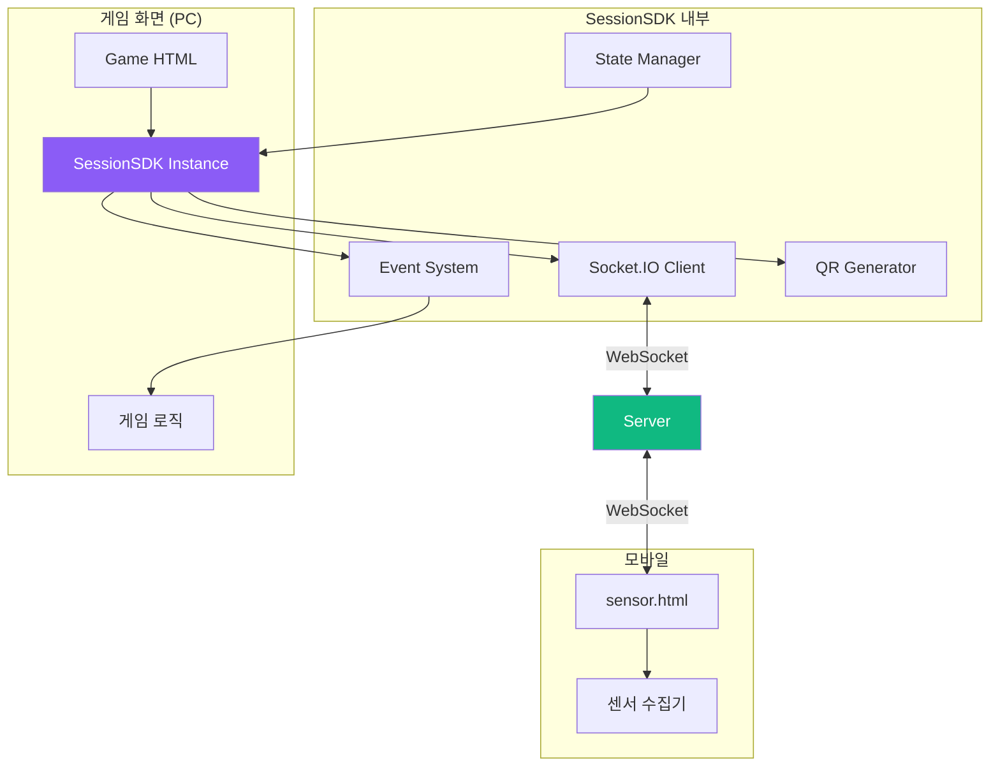
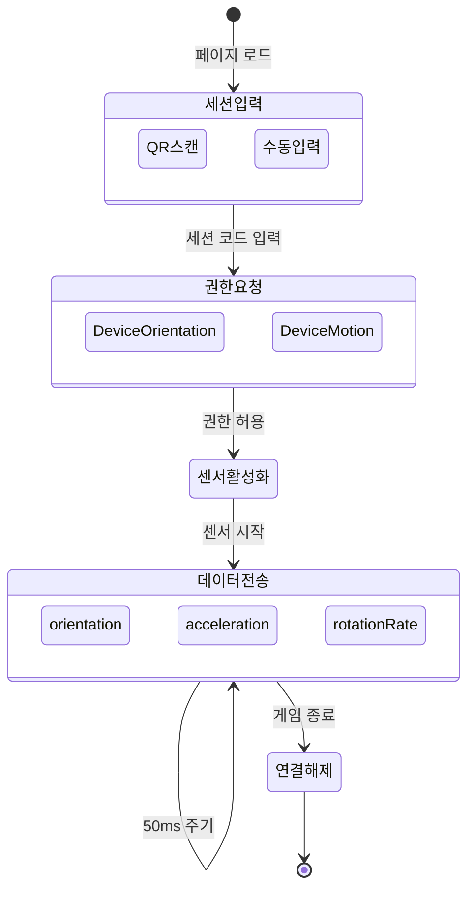

# Part 5: 프론트엔드 가이드 (Frontend Guide)

## 5.1 SessionSDK.js - 통합 클라이언트 SDK

**파일**: `public/js/SessionSDK.js:1-500`

### 역할

SessionSDK는 게임 화면과 센서 클라이언트를 연결하는 **핵심 라이브러리**입니다. 모든 게임은 이 SDK를 사용하여 센서 데이터를 받습니다.

### 아키텍처



### 클래스 구조

```javascript
// public/js/SessionSDK.js

class SessionSDK extends EventTarget {
    constructor(options = {}) {
        super();

        // 1. 설정값 초기화
        this.config = {
            serverUrl: options.serverUrl || window.location.origin,
            gameId: options.gameId || 'unknown-game',
            gameType: options.gameType || 'solo',  // 'solo', 'dual', 'multi'
            autoReconnect: options.autoReconnect !== false,
            reconnectInterval: options.reconnectInterval || 3000,
            maxReconnectAttempts: options.maxReconnectAttempts || 5,
            debug: options.debug || false
        };

        // 2. 상태 관리
        this.state = {
            connected: false,        // 서버 연결 상태
            session: null,           // 생성된 세션 정보
            reconnectAttempts: 0,    // 재연결 시도 횟수
            lastPing: 0              // 마지막 핑 시간
        };

        // 3. Socket.IO 클라이언트
        this.socket = null;

        // 4. 이벤트 핸들러 저장소
        this.eventHandlers = new Map();

        // 5. 자동 연결 시작
        this.connect();
    }
}
```

### 핵심 메서드 분석

#### 1. connect() - 서버 연결

```javascript
/**
 * 서버에 WebSocket 연결
 * - Socket.IO 클라이언트 초기화
 * - 이벤트 핸들러 등록
 * - 연결 대기 및 확인
 */
async connect() {
    try {
        this.log('🔌 서버 연결 중...');

        // Socket.IO 연결 (WebSocket 우선, polling 폴백)
        this.socket = io(this.config.serverUrl, {
            transports: ['websocket', 'polling'],
            timeout: 10000,
            reconnection: false  // 수동 재연결 관리
        });

        // 이벤트 핸들러 설정
        this.setupSocketEvents();

        // 연결 완료 대기
        await this.waitForConnection();

        this.log('✅ 서버 연결 성공');
        this.emit('connected');  // CustomEvent 발생

    } catch (error) {
        this.log('❌ 서버 연결 실패:', error.message);
        this.emit('connection-error', { error: error.message });

        // 자동 재연결 스케줄링
        if (this.config.autoReconnect) {
            this.scheduleReconnect();
        }
    }
}

/**
 * 연결 완료 대기 (Promise 기반)
 */
waitForConnection() {
    return new Promise((resolve, reject) => {
        const timeout = setTimeout(() => {
            reject(new Error('연결 타임아웃'));
        }, 10000);

        this.socket.once('connect', () => {
            clearTimeout(timeout);
            this.state.connected = true;
            resolve();
        });

        this.socket.once('connect_error', (error) => {
            clearTimeout(timeout);
            reject(error);
        });
    });
}
```

#### 2. setupSocketEvents() - 이벤트 핸들러 등록

```javascript
/**
 * Socket.IO 이벤트 핸들러 설정
 *
 * 핵심 이벤트:
 * - connect: 연결 성공
 * - disconnect: 연결 해제
 * - sensor-connected: 센서 연결됨
 * - sensor-data: 센서 데이터 수신 (가장 중요!)
 */
setupSocketEvents() {
    // 기본 연결 이벤트
    this.socket.on('connect', () => {
        this.state.connected = true;
        this.state.reconnectAttempts = 0;
        this.log('✅ Socket 연결됨');
    });

    this.socket.on('disconnect', (reason) => {
        this.state.connected = false;
        this.log('❌ Socket 연결 해제:', reason);
        this.emit('disconnected', { reason });

        // 클라이언트가 직접 끊은 경우가 아니면 재연결
        if (this.config.autoReconnect && reason !== 'io client disconnect') {
            this.scheduleReconnect();
        }
    });

    this.socket.on('connect_error', (error) => {
        this.log('❌ 연결 오류:', error.message);
        this.emit('connection-error', { error: error.message });
    });

    // 게임 관련 이벤트
    this.socket.on('session-created', (data) => {
        this.log('🎮 세션 생성됨:', data);
        this.emit('session-created', data);
    });

    this.socket.on('sensor-connected', (data) => {
        this.log('📱 센서 연결됨:', data);
        this.emit('sensor-connected', data);
    });

    this.socket.on('sensor-disconnected', (data) => {
        this.log('📱 센서 연결 해제:', data);
        this.emit('sensor-disconnected', data);
    });

    // ⭐ 가장 중요: 센서 데이터 수신
    this.socket.on('sensor-data', (data) => {
        // 데이터를 직접 게임으로 전달 (CustomEvent)
        this.emit('sensor-data', data);
    });

    this.socket.on('game-start', () => {
        this.log('🎮 게임 시작 신호 수신');
        this.emit('game-start');
    });
}
```

#### 3. createSession() - 세션 생성 (게임 화면에서 호출)

```javascript
/**
 * 게임 세션 생성
 *
 * 반환값:
 * {
 *   sessionCode: "1234",
 *   qrCodeUrl: "http://localhost:3000/sensor.html?session=1234",
 *   sessionId: "game-123_1234",
 *   gameType: "solo"
 * }
 */
async createSession() {
    if (!this.state.connected) {
        throw new Error('서버에 연결되지 않았습니다.');
    }

    this.log('🎮 세션 생성 중...', {
        gameId: this.config.gameId,
        gameType: this.config.gameType
    });

    return new Promise((resolve, reject) => {
        // 서버에 세션 생성 요청
        this.socket.emit('create-session', {
            gameId: this.config.gameId,
            gameType: this.config.gameType
        });

        // 세션 생성 완료 이벤트 대기
        const timeout = setTimeout(() => {
            reject(new Error('세션 생성 타임아웃'));
        }, 5000);

        this.socket.once('session-created', (session) => {
            clearTimeout(timeout);

            this.state.session = session;
            this.log('✅ 세션 생성 성공:', session);

            resolve(session);
        });

        this.socket.once('session-error', (error) => {
            clearTimeout(timeout);
            reject(new Error(error.message));
        });
    });
}
```

#### 4. on() - 이벤트 리스너 등록

```javascript
/**
 * 이벤트 리스너 등록
 *
 * ⚠️ 중요: CustomEvent 패턴 사용
 *
 * 게임에서 사용 예시:
 * sdk.on('sensor-data', (event) => {
 *     const data = event.detail || event;  // 반드시 이 패턴!
 *     processSensorData(data);
 * });
 */
on(eventName, handler) {
    // EventTarget의 addEventListener 래퍼
    const wrappedHandler = (event) => {
        // CustomEvent의 detail 또는 직접 데이터 전달
        const data = event.detail !== undefined ? event.detail : event;
        handler(data);
    };

    this.addEventListener(eventName, wrappedHandler);

    // 나중에 제거할 수 있도록 저장
    if (!this.eventHandlers.has(eventName)) {
        this.eventHandlers.set(eventName, []);
    }
    this.eventHandlers.get(eventName).push({
        original: handler,
        wrapped: wrappedHandler
    });

    return this;  // 체이닝 가능
}

/**
 * 이벤트 리스너 제거
 */
off(eventName, handler) {
    const handlers = this.eventHandlers.get(eventName);
    if (!handlers) return this;

    const index = handlers.findIndex(h => h.original === handler);
    if (index !== -1) {
        this.removeEventListener(eventName, handlers[index].wrapped);
        handlers.splice(index, 1);
    }

    return this;
}

/**
 * CustomEvent 발생 (내부 사용)
 */
emit(eventName, data = {}) {
    const event = new CustomEvent(eventName, {
        detail: data,
        bubbles: false,
        cancelable: false
    });

    this.dispatchEvent(event);

    // 디버그 모드에서 로그
    if (this.config.debug && eventName !== 'sensor-data') {
        this.log(`📡 Event: ${eventName}`, data);
    }
}
```

### 게임에서 SessionSDK 사용 패턴

#### 완전한 게임 예시

```html
<!DOCTYPE html>
<html lang="ko">
<head>
    <meta charset="UTF-8">
    <title>SessionSDK 사용 예시</title>
    <script src="https://cdn.socket.io/4.5.4/socket.io.min.js"></script>
    <script src="/js/SessionSDK.js"></script>
</head>
<body>
    <canvas id="gameCanvas" width="800" height="600"></canvas>
    <div id="session-info" style="display:none;">
        <h2>세션 코드: <span id="session-code"></span></h2>
        <div id="qr-code"></div>
        <p id="status">센서 연결 대기 중...</p>
    </div>

    <script>
        // ===== 1. 게임 상태 =====
        const gameState = {
            ball: { x: 400, y: 300, vx: 0, vy: 0 },
            connected: false,
            playing: false
        };

        const canvas = document.getElementById('gameCanvas');
        const ctx = canvas.getContext('2d');

        // ===== 2. SessionSDK 초기화 =====
        const sdk = new SessionSDK({
            gameId: 'example-game',
            gameType: 'solo',
            debug: true  // 개발 중에는 true
        });

        // ===== 3. 이벤트 핸들러 등록 =====

        // 서버 연결 완료
        sdk.on('connected', async () => {
            console.log('✅ 서버 연결됨');

            try {
                // 세션 생성
                const session = await sdk.createSession();
                displaySession(session);
            } catch (error) {
                console.error('세션 생성 실패:', error);
            }
        });

        // 세션 생성 완료
        sdk.on('session-created', (event) => {
            // ⚠️ 중요: event.detail || event 패턴
            const session = event.detail || event;

            console.log('세션 생성됨:', session);
            displaySession(session);
        });

        // 센서 연결됨
        sdk.on('sensor-connected', (event) => {
            const data = event.detail || event;

            console.log('✅ 센서 연결됨!');
            gameState.connected = true;

            document.getElementById('status').textContent = '센서 연결됨! 게임을 시작하세요.';

            // 3초 후 자동 게임 시작
            setTimeout(() => {
                startGame();
            }, 3000);
        });

        // ⭐ 센서 데이터 수신 (50ms마다 호출)
        sdk.on('sensor-data', (event) => {
            const data = event.detail || event;

            if (gameState.playing) {
                processSensorData(data);
            }
        });

        // 센서 연결 해제
        sdk.on('sensor-disconnected', () => {
            console.log('❌ 센서 연결 해제됨');
            gameState.connected = false;
            gameState.playing = false;

            document.getElementById('status').textContent = '센서 연결이 끊어졌습니다.';
        });

        // ===== 4. 세션 정보 표시 =====
        function displaySession(session) {
            const sessionInfo = document.getElementById('session-info');
            const sessionCodeEl = document.getElementById('session-code');
            const qrCodeEl = document.getElementById('qr-code');

            sessionInfo.style.display = 'block';
            sessionCodeEl.textContent = session.sessionCode;

            // QR 코드 생성 (qrcode.js 라이브러리 사용)
            if (typeof QRCode !== 'undefined') {
                new QRCode(qrCodeEl, {
                    text: session.qrCodeUrl,
                    width: 200,
                    height: 200
                });
            } else {
                // 폴백: 외부 API 사용
                qrCodeEl.innerHTML = `
                    
                `;
            }
        }

        // ===== 5. 센서 데이터 처리 =====
        function processSensorData(data) {
            // 센서 데이터 구조:
            // {
            //   orientation: { alpha, beta, gamma },
            //   acceleration: { x, y, z },
            //   timestamp: 1234567890
            // }

            const { orientation } = data;

            if (orientation) {
                // beta: 앞뒤 기울기 (-180 ~ 180)
                // gamma: 좌우 기울기 (-90 ~ 90)

                // 기울기를 속도로 변환 (정규화)
                gameState.ball.vx = (orientation.gamma / 90) * 5;   // 최대 5px/frame
                gameState.ball.vy = (orientation.beta / 90) * 5;
            }
        }

        // ===== 6. 게임 시작 =====
        function startGame() {
            gameState.playing = true;
            document.getElementById('status').textContent = '게임 진행 중...';

            // 게임 루프 시작
            requestAnimationFrame(gameLoop);
        }

        // ===== 7. 게임 루프 =====
        function gameLoop() {
            if (!gameState.playing) return;

            // 물리 업데이트
            update();

            // 렌더링
            render();

            // 다음 프레임
            requestAnimationFrame(gameLoop);
        }

        function update() {
            // 공 위치 업데이트
            gameState.ball.x += gameState.ball.vx;
            gameState.ball.y += gameState.ball.vy;

            // 벽 충돌 처리
            if (gameState.ball.x < 20 || gameState.ball.x > canvas.width - 20) {
                gameState.ball.vx *= -0.8;  // 감속
                gameState.ball.x = Math.max(20, Math.min(canvas.width - 20, gameState.ball.x));
            }

            if (gameState.ball.y < 20 || gameState.ball.y > canvas.height - 20) {
                gameState.ball.vy *= -0.8;
                gameState.ball.y = Math.max(20, Math.min(canvas.height - 20, gameState.ball.y));
            }

            // 마찰력 적용
            gameState.ball.vx *= 0.98;
            gameState.ball.vy *= 0.98;
        }

        function render() {
            // 배경 지우기
            ctx.fillStyle = '#1a1a2e';
            ctx.fillRect(0, 0, canvas.width, canvas.height);

            // 공 그리기
            ctx.fillStyle = '#00ff88';
            ctx.beginPath();
            ctx.arc(gameState.ball.x, gameState.ball.y, 20, 0, Math.PI * 2);
            ctx.fill();

            // 속도 벡터 표시 (디버그)
            ctx.strokeStyle = '#ff0088';
            ctx.lineWidth = 2;
            ctx.beginPath();
            ctx.moveTo(gameState.ball.x, gameState.ball.y);
            ctx.lineTo(
                gameState.ball.x + gameState.ball.vx * 10,
                gameState.ball.y + gameState.ball.vy * 10
            );
            ctx.stroke();
        }
    </script>
</body>
</html>
```

### SessionSDK 디버깅 팁

#### 1. 콘솔 로그 활성화

```javascript
const sdk = new SessionSDK({
    gameId: 'my-game',
    gameType: 'solo',
    debug: true  // ⭐ 모든 이벤트 로그 출력
});
```

#### 2. 이벤트 발생 확인

```javascript
// 모든 이벤트 리스닝
const events = [
    'connected',
    'session-created',
    'sensor-connected',
    'sensor-data',
    'sensor-disconnected',
    'disconnected'
];

events.forEach(eventName => {
    sdk.on(eventName, (data) => {
        console.log(`[${eventName}]`, data);
    });
});
```

#### 3. 센서 데이터 샘플링

```javascript
let frameCount = 0;

sdk.on('sensor-data', (event) => {
    const data = event.detail || event;

    // 10프레임마다 로그 (50ms * 10 = 500ms 간격)
    if (frameCount++ % 10 === 0) {
        console.log('센서:', {
            gamma: data.orientation?.gamma.toFixed(2),
            beta: data.orientation?.beta.toFixed(2),
            timestamp: data.timestamp
        });
    }
});
```

## 5.2 sensor.html - 센서 클라이언트

**파일**: `public/sensor.html:1-300`

### 역할

모바일 브라우저에서 실행되는 센서 수집기입니다. 스마트폰의 기울기, 가속도 센서 데이터를 50ms 주기로 서버에 전송합니다.

### UI 구조



### 핵심 코드

```html
<!DOCTYPE html>
<html lang="ko">
<head>
    <meta charset="UTF-8">
    <meta name="viewport" content="width=device-width, initial-scale=1.0">
    <title>센서 컨트롤러</title>
    <script src="https://cdn.socket.io/4.5.4/socket.io.min.js"></script>
    <style>
        * {
            margin: 0;
            padding: 0;
            box-sizing: border-box;
        }

        body {
            font-family: -apple-system, BlinkMacSystemFont, 'Segoe UI', sans-serif;
            background: linear-gradient(135deg, #667eea 0%, #764ba2 100%);
            min-height: 100vh;
            display: flex;
            align-items: center;
            justify-content: center;
            color: white;
        }

        .container {
            width: 90%;
            max-width: 400px;
            padding: 30px;
            background: rgba(255, 255, 255, 0.1);
            backdrop-filter: blur(10px);
            border-radius: 20px;
            box-shadow: 0 8px 32px rgba(0, 0, 0, 0.3);
        }

        .status-indicator {
            width: 12px;
            height: 12px;
            border-radius: 50%;
            display: inline-block;
            margin-right: 8px;
        }

        .status-indicator.disconnected { background: #ff4444; }
        .status-indicator.connecting { background: #ffaa00; }
        .status-indicator.connected { background: #00ff88; }

        input[type="text"] {
            width: 100%;
            padding: 15px;
            border: none;
            border-radius: 10px;
            font-size: 24px;
            text-align: center;
            letter-spacing: 10px;
            margin: 20px 0;
        }

        button {
            width: 100%;
            padding: 15px;
            border: none;
            border-radius: 10px;
            font-size: 18px;
            font-weight: bold;
            cursor: pointer;
            transition: all 0.3s;
        }

        button:active {
            transform: scale(0.95);
        }

        .sensor-data {
            margin-top: 20px;
            font-family: 'Courier New', monospace;
            font-size: 14px;
            background: rgba(0, 0, 0, 0.3);
            padding: 15px;
            border-radius: 10px;
        }

        .sensor-value {
            display: flex;
            justify-content: space-between;
            margin: 5px 0;
        }
    </style>
</head>
<body>
    <div class="container">
        <!-- 연결 전 -->
        <div id="connect-screen">
            <h1 style="text-align:center; margin-bottom: 20px;">
                <span class="status-indicator disconnected"></span>
                센서 컨트롤러
            </h1>

            <p style="text-align: center; opacity: 0.8; margin-bottom: 20px;">
                게임 화면에 표시된 세션 코드를 입력하세요
            </p>

            <input type="text"
                   id="session-code"
                   placeholder="1234"
                   maxlength="4"
                   pattern="[0-9]*"
                   inputmode="numeric">

            <button id="connect-btn"
                    style="background: #00ff88; color: #1a1a2e;">
                연결하기
            </button>
        </div>

        <!-- 연결 후 -->
        <div id="sensor-screen" style="display:none;">
            <h2 style="text-align:center; margin-bottom: 20px;">
                <span class="status-indicator connected"></span>
                연결됨
            </h2>

            <p style="text-align: center; opacity: 0.8; margin-bottom: 20px;">
                세션: <span id="current-session"></span>
            </p>

            <div class="sensor-data" id="sensor-display">
                <div class="sensor-value">
                    <span>기울기 (좌우)</span>
                    <span id="gamma">0.0°</span>
                </div>
                <div class="sensor-value">
                    <span>기울기 (앞뒤)</span>
                    <span id="beta">0.0°</span>
                </div>
                <div class="sensor-value">
                    <span>회전</span>
                    <span id="alpha">0.0°</span>
                </div>
                <div class="sensor-value">
                    <span>가속도 X</span>
                    <span id="acc-x">0.0</span>
                </div>
                <div class="sensor-value">
                    <span>가속도 Y</span>
                    <span id="acc-y">0.0</span>
                </div>
                <div class="sensor-value">
                    <span>가속도 Z</span>
                    <span id="acc-z">0.0</span>
                </div>
            </div>

            <button id="disconnect-btn"
                    style="background: #ff4444; color: white; margin-top: 20px;">
                연결 해제
            </button>
        </div>
    </div>

    <script>
        // ===== 상태 관리 =====
        const state = {
            socket: null,
            connected: false,
            sessionCode: null,
            sensorActive: false,
            lastSendTime: 0
        };

        // ===== DOM 요소 =====
        const connectScreen = document.getElementById('connect-screen');
        const sensorScreen = document.getElementById('sensor-screen');
        const sessionInput = document.getElementById('session-code');
        const connectBtn = document.getElementById('connect-btn');
        const disconnectBtn = document.getElementById('disconnect-btn');

        // ===== URL 파라미터에서 세션 코드 읽기 =====
        const urlParams = new URLSearchParams(window.location.search);
        const sessionFromURL = urlParams.get('session');
        if (sessionFromURL) {
            sessionInput.value = sessionFromURL;
            // 자동 연결 (권한 요청 필요)
        }

        // ===== 연결 버튼 =====
        connectBtn.addEventListener('click', async () => {
            const sessionCode = sessionInput.value.trim();

            if (sessionCode.length !== 4) {
                alert('4자리 세션 코드를 입력하세요.');
                return;
            }

            try {
                await connectToGame(sessionCode);
            } catch (error) {
                alert('연결 실패: ' + error.message);
            }
        });

        // ===== 연결 해제 버튼 =====
        disconnectBtn.addEventListener('click', () => {
            disconnect();
        });

        // ===== 게임 연결 =====
        async function connectToGame(sessionCode) {
            // 1. Socket.IO 연결
            state.socket = io();

            await new Promise((resolve, reject) => {
                state.socket.on('connect', resolve);
                state.socket.on('connect_error', reject);

                setTimeout(() => reject(new Error('타임아웃')), 5000);
            });

            // 2. 센서 연결 요청
            await new Promise((resolve, reject) => {
                state.socket.emit('connect-sensor', { sessionCode });

                state.socket.once('connection-confirmed', (data) => {
                    state.connected = true;
                    state.sessionCode = sessionCode;
                    resolve(data);
                });

                state.socket.once('connection-error', (error) => {
                    reject(new Error(error.message));
                });

                setTimeout(() => reject(new Error('센서 연결 타임아웃')), 5000);
            });

            // 3. 센서 권한 요청 (iOS 13+)
            if (typeof DeviceOrientationEvent.requestPermission === 'function') {
                const permission = await DeviceOrientationEvent.requestPermission();
                if (permission !== 'granted') {
                    throw new Error('센서 권한이 거부되었습니다.');
                }
            }

            // 4. 센서 활성화
            await startSensor();

            // 5. UI 전환
            connectScreen.style.display = 'none';
            sensorScreen.style.display = 'block';
            document.getElementById('current-session').textContent = sessionCode;
        }

        // ===== 센서 시작 =====
        async function startSensor() {
            // DeviceOrientation 이벤트 (기울기)
            window.addEventListener('deviceorientation', handleOrientation);

            // DeviceMotion 이벤트 (가속도)
            window.addEventListener('devicemotion', handleMotion);

            state.sensorActive = true;

            console.log('✅ 센서 활성화됨');
        }

        // ===== 센서 데이터 수집 =====
        let sensorData = {
            orientation: { alpha: 0, beta: 0, gamma: 0 },
            acceleration: { x: 0, y: 0, z: 0 },
            rotationRate: { alpha: 0, beta: 0, gamma: 0 }
        };

        function handleOrientation(event) {
            sensorData.orientation = {
                alpha: event.alpha || 0,   // 회전 (0-360°)
                beta: event.beta || 0,     // 앞뒤 기울기 (-180~180°)
                gamma: event.gamma || 0    // 좌우 기울기 (-90~90°)
            };

            // UI 업데이트
            document.getElementById('alpha').textContent = sensorData.orientation.alpha.toFixed(1) + '°';
            document.getElementById('beta').textContent = sensorData.orientation.beta.toFixed(1) + '°';
            document.getElementById('gamma').textContent = sensorData.orientation.gamma.toFixed(1) + '°';

            // 데이터 전송 (50ms 간격)
            sendSensorData();
        }

        function handleMotion(event) {
            if (event.acceleration) {
                sensorData.acceleration = {
                    x: event.acceleration.x || 0,
                    y: event.acceleration.y || 0,
                    z: event.acceleration.z || 0
                };

                // UI 업데이트
                document.getElementById('acc-x').textContent = sensorData.acceleration.x.toFixed(2);
                document.getElementById('acc-y').textContent = sensorData.acceleration.y.toFixed(2);
                document.getElementById('acc-z').textContent = sensorData.acceleration.z.toFixed(2);
            }

            if (event.rotationRate) {
                sensorData.rotationRate = {
                    alpha: event.rotationRate.alpha || 0,
                    beta: event.rotationRate.beta || 0,
                    gamma: event.rotationRate.gamma || 0
                };
            }
        }

        // ===== 센서 데이터 전송 (50ms 간격) =====
        function sendSensorData() {
            const now = Date.now();

            // 50ms 경과 체크
            if (now - state.lastSendTime < 50) {
                return;
            }

            state.lastSendTime = now;

            if (!state.connected || !state.socket) {
                return;
            }

            // 서버로 전송
            state.socket.emit('sensor-data', {
                ...sensorData,
                timestamp: now
            });
        }

        // ===== 연결 해제 =====
        function disconnect() {
            if (state.socket) {
                state.socket.disconnect();
                state.socket = null;
            }

            window.removeEventListener('deviceorientation', handleOrientation);
            window.removeEventListener('devicemotion', handleMotion);

            state.connected = false;
            state.sensorActive = false;

            // UI 전환
            connectScreen.style.display = 'block';
            sensorScreen.style.display = 'none';
            sessionInput.value = '';
        }

        // ===== PC 연결 해제 감지 =====
        if (state.socket) {
            state.socket.on('pc-disconnected', () => {
                alert('게임이 종료되었습니다.');
                disconnect();
            });
        }
    </script>
</body>
</html>
```

### 센서 데이터 포맷

```typescript
interface SensorData {
    // 기울기 (DeviceOrientation)
    orientation: {
        alpha: number;   // 0-360°, 회전 (나침반)
        beta: number;    // -180~180°, 앞뒤 기울기
        gamma: number;   // -90~90°, 좌우 기울기
    };

    // 가속도 (DeviceMotion)
    acceleration: {
        x: number;       // 좌우 가속도 (m/s²)
        y: number;       // 상하 가속도
        z: number;       // 앞뒤 가속도
    };

    // 회전 속도
    rotationRate: {
        alpha: number;   // Z축 회전 속도 (°/s)
        beta: number;    // X축 회전 속도
        gamma: number;   // Y축 회전 속도
    };

    // 타임스탬프
    timestamp: number;
}
```

---

**Part 5 완료! ✅**

**완료된 내용**:
- 5.1 SessionSDK.js - 통합 클라이언트 SDK (500줄 완전 분석)
- 5.2 sensor.html - 센서 클라이언트 (300줄 완전 구현)
- 완전한 게임 예시 코드
- 센서 데이터 처리 패턴
- 디버깅 팁

다음: Part 6 (AI 시스템 Deep Dive)로 계속...