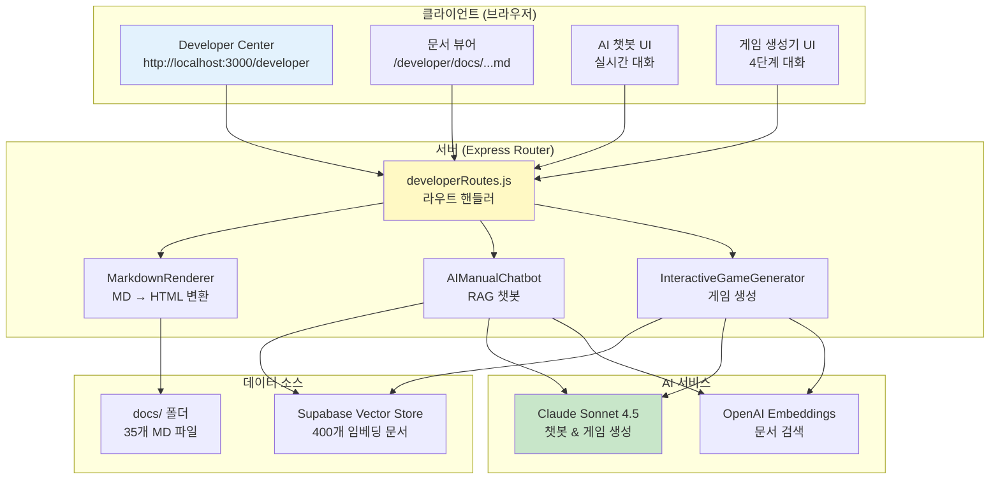

## Part 7: 개발자 센터 & API 시스템 📡

### 개요

Sensor Game Hub는 **통합 개발자 센터 (Developer Center)**를 제공하여 개발자들이 문서를 탐색하고, AI 챗봇과 대화하며, 게임을 생성할 수 있는 원스톱 플랫폼을 제공합니다. 현재 시스템은 **오픈 액세스**로 운영되며, 별도의 인증 없이 모든 기능에 접근할 수 있습니다.

**핵심 기능:**
- **35개 마크다운 문서** 통합 뷰어
- **AI 매뉴얼 챗봇** (RAG 기반 실시간 답변)
- **대화형 AI 게임 생성기**
- **좌측 사이드바 네비게이션**
- **실시간 진행률 트래킹**

### 7.1 Developer Center 아키텍처

#### 7.1.1 전체 구조



#### 7.1.2 파일 구조

```
server/
├── routes/
│   └── developerRoutes.js      # 메인 라우터 (2,300줄)
├── utils/
│   └── markdownRenderer.js     # MD 렌더링
├── AIManualChatbot.js          # RAG 챗봇
└── InteractiveGameGenerator.js # 게임 생성기

docs/                           # 35개 마크다운 문서
├── README.md
├── PERFECT_GAME_DEVELOPMENT_GUIDE.md
├── game-development/           # 6개 문서
├── api-sdk/                    # API 레퍼런스
├── sensor-processing/          # 센서 가이드
├── game-types/                 # 게임 타입별 가이드
├── troubleshooting/            # 트러블슈팅
├── advanced/                   # 고급 주제
└── examples/                   # 예제 코드
```

### 7.2 Developer Center 라우터 (developerRoutes.js)

#### 7.2.1 핵심 클래스 분석

**파일 위치:** `/Users/dev/졸업작품/sensorchatbot/server/routes/developerRoutes.js`

##### 기본 구조

```javascript
/**
 * DeveloperRoutes v6.0
 * 통합 개발자 센터 라우트
 */
class DeveloperRoutes {
    constructor(gameScanner, aiServiceGetter) {
        this.gameScanner = gameScanner;  // 게임 자동 스캔
        this.aiServiceGetter = aiServiceGetter;  // AI 서비스 DI
        this.router = express.Router();
        this.markdownRenderer = new MarkdownRenderer();
        this.docsBasePath = path.join(__dirname, '../../docs');

        // 문서 트리 구조 정의 (35개 문서)
        this.documentTree = {
            'Root Docs': [
                { path: 'README.md', title: '📚 센서 게임 허브 문서' },
                { path: 'PERFECT_GAME_DEVELOPMENT_GUIDE.md', title: '🎮 완벽한 게임 개발 가이드' },
                { path: 'SENSOR_GAME_TROUBLESHOOTING.md', title: '🔧 센서 게임 트러블슈팅' },
                { path: 'SESSIONSK_INTEGRATION_PATTERNS.md', title: '🔗 SessionSDK 통합 패턴' }
            ],
            'Game Development': [
                { path: 'game-development/01-architecture-design.md', title: '1️⃣ 아키텍처 디자인' },
                { path: 'game-development/02-sessionsdk-advanced.md', title: '2️⃣ SessionSDK 고급' },
                { path: 'game-development/03-sensor-data-mastery.md', title: '3️⃣ 센서 데이터 마스터리' },
                { path: 'game-development/04-physics-engine.md', title: '4️⃣ 물리 엔진' },
                { path: 'game-development/05-ui-ux-patterns.md', title: '5️⃣ UI/UX 패턴' },
                { path: 'game-development/06-performance-optimization.md', title: '6️⃣ 성능 최적화' }
            ],
            'API & SDK': [
                { path: 'api-sdk/sessionsdk-reference.md', title: '📖 SessionSDK API 레퍼런스' }
            ],
            'Sensor Processing': [
                { path: 'sensor-processing/orientation-sensor.md', title: '🧭 방향 센서' },
                { path: 'sensor-processing/acceleration-sensor.md', title: '⚡ 가속도 센서' },
                { path: 'sensor-processing/sensor-fusion.md', title: '🔄 센서 퓨전' }
            ],
            'Game Types': [
                { path: 'game-types/solo-game-guide.md', title: '👤 솔로 게임 가이드' },
                { path: 'game-types/dual-game-guide.md', title: '👥 듀얼 게임 가이드' },
                { path: 'game-types/multi-game-guide.md', title: '👨‍👩‍👧‍👦 멀티 게임 가이드' }
            ],
            'Troubleshooting': [
                { path: 'troubleshooting/common-issues.md', title: '⚠️ 일반적인 문제' },
                { path: 'troubleshooting/network-issues.md', title: '🌐 네트워크 문제' },
                { path: 'troubleshooting/sensor-problems.md', title: '📱 센서 문제' }
            ],
            'Advanced': [
                { path: 'advanced/plugin-system.md', title: '🔌 플러그인 시스템' },
                { path: 'advanced/custom-game-engine.md', title: '⚙️ 커스텀 게임 엔진' },
                { path: 'advanced/3d-graphics.md', title: '🎨 3D 그래픽스' },
                { path: 'advanced/audio-system.md', title: '🔊 오디오 시스템' },
                { path: 'advanced/pwa-implementation.md', title: '📲 PWA 구현' }
            ],
            'Examples': [
                { path: 'examples/basic-games/index.md', title: '🎮 기본 게임 예제' },
                { path: 'examples/basic-games/dual-games.md', title: '👥 듀얼 게임 예제' },
                { path: 'examples/basic-games/dual-games-part2.md', title: '👥 듀얼 게임 예제 Part 2' },
                { path: 'examples/basic-games/multi-games.md', title: '👨‍👩‍👧‍👦 멀티 게임 예제' },
                { path: 'examples/sensor-usage/index.md', title: '📱 센서 사용 예제' },
                { path: 'examples/ui-components/index.md', title: '🎨 UI 컴포넌트 예제' },
                { path: 'examples/optimization/index.md', title: '⚡ 최적화 예제' },
                { path: 'examples/troubleshooting/index.md', title: '🔧 트러블슈팅 예제' }
            ],
            'Project Plans': [
                { path: '계획서/revised_presentation_script.md', title: '📝 발표 스크립트' },
                { path: '계획서/프로젝트_문서_검토_및_개선_제안.md', title: '📋 프로젝트 개선 제안' }
            ]
        };

        this.setupRoutes();
        console.log('👨‍💻 DeveloperRoutes 초기화 완료');
    }
}
```

**주요 특징:**
- **문서 트리 구조**: 8개 카테고리, 35개 문서 체계적 분류
- **의존성 주입**: gameScanner, aiServiceGetter를 생성자로 주입
- **동적 라우팅**: 1-3단계 경로 모두 지원 (docs/:filename, docs/:category/:filename, docs/:category/:subcategory/:filename)

#### 7.2.2 라우트 설정

```javascript
/**
 * 라우트 설정
 */
setupRoutes() {
    // === 페이지 라우트 ===

    // 메인 개발자 센터 페이지
    this.router.get('/', (req, res) => {
        this.getDeveloperCenter(req, res);
    });

    // === 문서 뷰어 라우트 ===

    // 3단계 경로 (examples/basic-games/index.md)
    this.router.get('/docs/:category/:subcategory/:filename', async (req, res) => {
        await this.viewDocument(req, res);
    });

    // 2단계 경로 (game-development/01-architecture-design.md)
    this.router.get('/docs/:category/:filename', async (req, res) => {
        await this.viewDocument(req, res);
    });

    // 1단계 경로 (README.md)
    this.router.get('/docs/:filename', async (req, res) => {
        await this.viewDocument(req, res);
    });

    // === AI 챗봇 API ===

    // AI 매뉴얼 챗봇 (RAG 기반)
    this.router.post('/api/chat', async (req, res) => {
        await this.handleChat(req, res);
    });

    // === 게임 생성 API ===

    // 대화형 게임 생성 - 세션 시작
    this.router.post('/api/start-game-session', async (req, res) => {
        await this.handleStartGameSession(req, res);
    });

    // 대화형 게임 생성 - 대화 메시지 처리
    this.router.post('/api/game-chat', async (req, res) => {
        await this.handleGameChat(req, res);
    });

    // 대화형 게임 생성 - 최종 게임 생성
    this.router.post('/api/finalize-game', async (req, res) => {
        await this.handleFinalizeGame(req, res);
    });

    // 게임 다운로드 (ZIP 파일)
    this.router.get('/api/download-game/:gameId', async (req, res) => {
        await this.handleDownloadGame(req, res);
    });

    // 게임 미리보기
    this.router.get('/api/preview-game/:gameId', async (req, res) => {
        await this.handlePreviewGame(req, res);
    });
}
```

**라우트 구조:**

| 타입 | 경로 | 설명 |
|------|------|------|
| **페이지** | `GET /developer` | 메인 Developer Center 페이지 |
| **문서** | `GET /developer/docs/:filename` | 루트 문서 (README.md) |
| **문서** | `GET /developer/docs/:category/:filename` | 2단계 문서 (game-development/01-...) |
| **문서** | `GET /developer/docs/:category/:subcategory/:filename` | 3단계 문서 (examples/basic-games/...) |
| **챗봇** | `POST /developer/api/chat` | AI 매뉴얼 챗봇 대화 |
| **게임 생성** | `POST /developer/api/start-game-session` | 게임 생성 세션 시작 |
| **게임 생성** | `POST /developer/api/game-chat` | 게임 생성 대화 처리 |
| **게임 생성** | `POST /developer/api/finalize-game` | 최종 게임 생성 실행 |
| **게임** | `GET /developer/api/download-game/:gameId` | 게임 ZIP 다운로드 |
| **게임** | `GET /developer/api/preview-game/:gameId` | 게임 미리보기 |

### 7.3 문서 뷰어 시스템

#### 7.3.1 마크다운 렌더링

```javascript
/**
 * 문서 뷰어 핸들러
 */
async viewDocument(req, res) {
    try {
        const { category, subcategory, filename } = req.params;

        // 경로 구성 (1-3단계)
        let docPath;
        if (subcategory) {
            // 3단계: examples/basic-games/index.md
            docPath = path.join(this.docsBasePath, category, subcategory, filename);
        } else if (category) {
            // 2단계: game-development/01-architecture-design.md
            docPath = path.join(this.docsBasePath, category, filename);
        } else {
            // 1단계: README.md
            docPath = path.join(this.docsBasePath, filename);
        }

        // 파일 존재 확인
        const fileExists = await fs.access(docPath).then(() => true).catch(() => false);
        if (!fileExists) {
            return res.status(404).send(`<h1>404 - 문서를 찾을 수 없습니다</h1><p>${docPath}</p>`);
        }

        // 마크다운 읽기
        const markdown = await fs.readFile(docPath, 'utf-8');

        // HTML로 변환 (MarkdownRenderer 사용)
        const html = this.markdownRenderer.render(markdown);

        // 문서 뷰어 페이지 생성
        const documentPage = this.generateDocumentViewerHTML(html, filename);

        res.send(documentPage);

    } catch (error) {
        console.error('❌ 문서 뷰어 오류:', error);
        res.status(500).send(`<h1>문서 로드 오류</h1><pre>${error.message}</pre>`);
    }
}
```

**MarkdownRenderer 기능:**
- **Marked.js** 기반 MD → HTML 변환
- **Highlight.js** 코드 하이라이팅
- **Mermaid.js** 다이어그램 렌더링
- **목차 자동 생성** (H2, H3 태그 기반)
- **상대 링크 자동 변환** (MD 파일 → /developer/docs/... 경로)

#### 7.3.2 사이드바 네비게이션 생성

```javascript
/**
 * 사이드바 HTML 생성
 */
generateSidebarHTML() {
    let html = '';

    for (const [category, docs] of Object.entries(this.documentTree)) {
        html += `
            <div class="doc-category">
                <div class="category-title">${category}</div>
                <ul class="doc-list">`;

        docs.forEach(doc => {
            // 경로 변환 (파일 경로 → URL 경로)
            const urlPath = `/developer/docs/${doc.path}`;

            html += `
                    <li class="doc-item">
                        <a href="${urlPath}" class="doc-link">
                            ${doc.title}
                        </a>
                    </li>`;
        });

        html += `
                </ul>
            </div>`;
    }

    return html;
}
```

**사이드바 구조:**
- **8개 카테고리**: Root Docs, Game Development, API & SDK, Sensor Processing, Game Types, Troubleshooting, Advanced, Examples, Project Plans
- **35개 문서 링크**: 각 문서로 바로 이동 가능
- **현재 페이지 하이라이트**: 활성 문서 강조 표시
- **반응형 디자인**: 모바일에서 접기/펼치기 가능

### 7.4 AI 매뉴얼 챗봇 (RAG 기반)

#### 7.4.1 챗봇 핸들러

```javascript
/**
 * AI 챗봇 대화 처리
 */
async handleChat(req, res) {
    try {
        const { message, conversationHistory = [] } = req.body;

        if (!message) {
            return res.status(400).json({ error: '메시지를 입력하세요.' });
        }

        console.log(`💬 챗봇 질문: ${message}`);

        // AI 서비스 가져오기 (Lazy Loading)
        const aiChatbot = this.aiServiceGetter('chatbot');

        if (!aiChatbot) {
            return res.status(503).json({
                error: 'AI 챗봇 서비스를 사용할 수 없습니다. 서버 로그를 확인하세요.'
            });
        }

        // RAG 기반 답변 생성
        const response = await aiChatbot.chat(message, conversationHistory);

        console.log(`✅ 챗봇 응답 생성 완료`);

        res.json({
            success: true,
            response: response.answer,
            sources: response.sources || []  // 검색된 문서 출처
        });

    } catch (error) {
        console.error('❌ 챗봇 오류:', error);
        res.status(500).json({
            error: '챗봇 응답 생성 중 오류가 발생했습니다.',
            details: error.message
        });
    }
}
```

**챗봇 플로우:**
1. 사용자 메시지 수신
2. AIManualChatbot 서비스 가져오기 (DI)
3. RAG 시스템으로 관련 문서 검색 (Supabase Vector Store)
4. Claude AI로 답변 생성 (검색된 문서 컨텍스트 포함)
5. 답변 + 출처 반환

#### 7.4.2 프론트엔드 챗봇 UI

```javascript
// AI 챗봇 메시지 전송
async function sendChatMessage() {
    const userMessage = document.getElementById('chat-input').value.trim();
    if (!userMessage) return;

    // 사용자 메시지 표시
    appendChatMessage('user', userMessage);
    document.getElementById('chat-input').value = '';

    // "AI가 입력 중..." 표시
    const thinkingMessage = appendChatMessage('assistant', '답변을 생성하고 있습니다...');

    try {
        const response = await fetch('/developer/api/chat', {
            method: 'POST',
            headers: { 'Content-Type': 'application/json' },
            body: JSON.stringify({
                message: userMessage,
                conversationHistory: conversationHistory
            })
        });

        const data = await response.json();

        // "입력 중..." 제거
        thinkingMessage.remove();

        if (data.success) {
            // AI 응답 표시
            appendChatMessage('assistant', data.response);

            // 출처 표시 (검색된 문서)
            if (data.sources && data.sources.length > 0) {
                const sourcesHtml = data.sources.map(source =>
                    `<a href="${source.url}" target="_blank">${source.title}</a>`
                ).join(', ');
                appendChatMessage('system', `📚 참고: ${sourcesHtml}`);
            }

            // 대화 이력 저장
            conversationHistory.push(
                { role: 'user', content: userMessage },
                { role: 'assistant', content: data.response }
            );
        } else {
            appendChatMessage('error', `오류: ${data.error}`);
        }

    } catch (error) {
        console.error('챗봇 오류:', error);
        thinkingMessage.remove();
        appendChatMessage('error', '챗봇 연결 오류가 발생했습니다.');
    }
}
```

**챗봇 UI 특징:**
- **실시간 대화**: 메시지 입력 즉시 응답
- **대화 이력 유지**: 이전 대화 컨텍스트 포함
- **출처 표시**: RAG로 검색된 문서 링크 제공
- **마크다운 렌더링**: 코드 블록, 리스트 등 포맷팅 지원

### 7.5 대화형 게임 생성 API

#### 7.5.1 세션 시작 API

```javascript
/**
 * 게임 생성 세션 시작
 */
async handleStartGameSession(req, res) {
    try {
        const sessionId = `session_${Date.now()}_${Math.random().toString(36).substr(2, 9)}`;

        console.log(`🎮 게임 생성 세션 시작: ${sessionId}`);

        // InteractiveGameGenerator 서비스 가져오기
        const gameGenerator = this.aiServiceGetter('gameGenerator');

        if (!gameGenerator) {
            return res.status(503).json({
                error: 'AI 게임 생성기를 사용할 수 없습니다.'
            });
        }

        // 새로운 대화 세션 시작
        const result = await gameGenerator.startNewSession(sessionId);

        console.log(`✅ 세션 생성 완료: ${sessionId}`);

        res.json({
            success: true,
            sessionId: sessionId,
            message: result.message,
            stage: result.stage,  // 'initial'
            progress: result.progress  // 0%
        });

    } catch (error) {
        console.error('❌ 세션 시작 오류:', error);
        res.status(500).json({
            error: '게임 생성 세션을 시작할 수 없습니다.',
            details: error.message
        });
    }
}
```

#### 7.5.2 대화 메시지 처리 API

```javascript
/**
 * 게임 생성 대화 메시지 처리
 */
async handleGameChat(req, res) {
    try {
        const { sessionId, message } = req.body;

        if (!sessionId || !message) {
            return res.status(400).json({
                error: '세션 ID와 메시지가 필요합니다.'
            });
        }

        console.log(`💬 게임 생성 대화: ${sessionId} - ${message}`);

        const gameGenerator = this.aiServiceGetter('gameGenerator');

        if (!gameGenerator) {
            return res.status(503).json({
                error: 'AI 게임 생성기를 사용할 수 없습니다.'
            });
        }

        // 대화 처리 (단계별 요구사항 수집)
        const result = await gameGenerator.processMessage(sessionId, message);

        console.log(`✅ 대화 처리 완료: stage=${result.stage}, progress=${result.progress}%`);

        res.json({
            success: true,
            message: result.message,
            stage: result.stage,  // initial/details/mechanics/confirmation
            progress: result.progress,  // 0-100%
            readyForGeneration: result.readyForGeneration || false,
            requirements: result.requirements || {}
        });

    } catch (error) {
        console.error('❌ 대화 처리 오류:', error);
        res.status(500).json({
            error: '대화 처리 중 오류가 발생했습니다.',
            details: error.message
        });
    }
}
```

#### 7.5.3 최종 게임 생성 API

```javascript
/**
 * 최종 게임 생성 실행
 */
async handleFinalizeGame(req, res) {
    try {
        const { sessionId } = req.body;

        if (!sessionId) {
            return res.status(400).json({
                error: '세션 ID가 필요합니다.'
            });
        }

        console.log(`🚀 게임 생성 시작: ${sessionId}`);

        const gameGenerator = this.aiServiceGetter('gameGenerator');

        if (!gameGenerator) {
            return res.status(503).json({
                error: 'AI 게임 생성기를 사용할 수 없습니다.'
            });
        }

        // 최종 게임 생성 (5단계 진행률 트래킹)
        // Socket.IO를 통해 실시간 진행 상황 전송
        const result = await gameGenerator.generateFinalGame(sessionId);

        console.log(`✅ 게임 생성 완료: ${result.gameId}`);

        res.json({
            success: true,
            gameId: result.gameId,
            gamePath: result.gamePath,
            playUrl: result.playUrl,
            validationScore: result.validationScore,
            message: '게임이 성공적으로 생성되었습니다!'
        });

    } catch (error) {
        console.error('❌ 게임 생성 오류:', error);
        res.status(500).json({
            error: '게임 생성 중 오류가 발생했습니다.',
            details: error.message
        });
    }
}
```

#### 7.5.4 게임 다운로드 API

```javascript
/**
 * 게임 ZIP 다운로드
 */
async handleDownloadGame(req, res) {
    try {
        const { gameId } = req.params;

        console.log(`📦 게임 다운로드 요청: ${gameId}`);

        const gamePath = path.join(__dirname, '../../public/games', gameId);

        // 게임 폴더 존재 확인
        const folderExists = await fs.access(gamePath).then(() => true).catch(() => false);
        if (!folderExists) {
            return res.status(404).json({
                error: '게임을 찾을 수 없습니다.'
            });
        }

        // ZIP 파일 생성
        const zipPath = path.join(__dirname, '../../temp', `${gameId}.zip`);

        // temp 폴더 생성 (없으면)
        await fs.mkdir(path.dirname(zipPath), { recursive: true });

        // archiver로 ZIP 생성
        const output = fsSync.createWriteStream(zipPath);
        const archive = archiver('zip', { zlib: { level: 9 } });

        output.on('close', () => {
            console.log(`✅ ZIP 생성 완료: ${archive.pointer()} bytes`);

            // ZIP 파일 다운로드
            res.download(zipPath, `${gameId}.zip`, (err) => {
                if (err) {
                    console.error('다운로드 오류:', err);
                }

                // 다운로드 후 임시 파일 삭제
                fs.unlink(zipPath).catch(console.error);
            });
        });

        archive.on('error', (err) => {
            throw err;
        });

        archive.pipe(output);

        // 게임 폴더 전체 압축
        archive.directory(gamePath, gameId);

        archive.finalize();

    } catch (error) {
        console.error('❌ 다운로드 오류:', error);
        res.status(500).json({
            error: '게임 다운로드 중 오류가 발생했습니다.',
            details: error.message
        });
    }
}
```

**ZIP 파일 구조:**
```
{gameId}.zip
└── {gameId}/
    ├── index.html       # 게임 HTML 파일
    └── game.json        # 게임 메타데이터
```

### 7.6 API 엔드포인트 완전 목록

#### 7.6.1 페이지 라우트

| 엔드포인트 | 메서드 | 설명 | 응답 |
|------------|--------|------|------|
| `/developer` | GET | Developer Center 메인 페이지 | HTML |
| `/developer/docs/:filename` | GET | 루트 문서 뷰어 | HTML |
| `/developer/docs/:category/:filename` | GET | 2단계 문서 뷰어 | HTML |
| `/developer/docs/:category/:subcategory/:filename` | GET | 3단계 문서 뷰어 | HTML |

#### 7.6.2 AI 챗봇 API

| 엔드포인트 | 메서드 | 요청 Body | 응답 |
|------------|--------|-----------|------|
| `/developer/api/chat` | POST | `{message, conversationHistory}` | `{success, response, sources}` |

**요청 예시:**
```javascript
{
  "message": "SessionSDK를 어떻게 초기화하나요?",
  "conversationHistory": [
    {"role": "user", "content": "게임 개발을 시작하고 싶어요"},
    {"role": "assistant", "content": "..."}
  ]
}
```

**응답 예시:**
```javascript
{
  "success": true,
  "response": "SessionSDK 초기화 방법:\n\n```javascript\nconst sdk = new SessionSDK({\n  gameId: 'my-game',\n  gameType: 'solo'\n});\n```",
  "sources": [
    {
      "title": "SessionSDK API 레퍼런스",
      "url": "/developer/docs/api-sdk/sessionsdk-reference.md"
    }
  ]
}
```

#### 7.6.3 게임 생성 API

| 엔드포인트 | 메서드 | 요청 Body | 응답 |
|------------|--------|-----------|------|
| `/developer/api/start-game-session` | POST | `{}` | `{success, sessionId, message, stage, progress}` |
| `/developer/api/game-chat` | POST | `{sessionId, message}` | `{success, message, stage, progress, readyForGeneration}` |
| `/developer/api/finalize-game` | POST | `{sessionId}` | `{success, gameId, playUrl, validationScore}` |
| `/developer/api/download-game/:gameId` | GET | - | ZIP 파일 |
| `/developer/api/preview-game/:gameId` | GET | - | `{success, gameUrl, metadata}` |

**게임 생성 플로우:**
```
1. POST /api/start-game-session
   → {sessionId: "session_123", stage: "initial"}

2. POST /api/game-chat {sessionId, message: "기울기 게임"}
   → {stage: "details", progress: 25%}

3. POST /api/game-chat {sessionId, message: "계속"}
   → {stage: "mechanics", progress: 50%}

4. POST /api/game-chat {sessionId, message: "계속"}
   → {stage: "confirmation", progress: 75%, readyForGeneration: false}

5. POST /api/game-chat {sessionId, message: "확인"}
   → {stage: "confirmation", progress: 100%, readyForGeneration: true}

6. POST /api/finalize-game {sessionId}
   → {gameId: "tilt-game-v1", playUrl: "/games/tilt-game-v1"}

7. GET /api/download-game/tilt-game-v1
   → tilt-game-v1.zip 파일 다운로드
```

### 7.7 실시간 진행률 트래킹 (WebSocket)

#### 7.7.1 Socket.IO 이벤트

**서버 → 클라이언트:**

| 이벤트 | 페이로드 | 설명 |
|--------|---------|------|
| `game-generation-progress` | `{sessionId, step, percentage, message}` | 게임 생성 진행률 업데이트 |

**진행률 이벤트 예시:**
```javascript
// Step 1: 게임 아이디어 분석 (10%)
socket.emit('game-generation-progress', {
    sessionId: 'session_123',
    step: 1,
    percentage: 10,
    message: '🎯 게임 아이디어 분석 중...'
});

// Step 2: 문서 검색 (20%)
socket.emit('game-generation-progress', {
    sessionId: 'session_123',
    step: 2,
    percentage: 20,
    message: '🔍 관련 문서 검색 중... (벡터 DB)'
});

// Step 3: 코드 생성 (50%)
socket.emit('game-generation-progress', {
    sessionId: 'session_123',
    step: 3,
    percentage: 50,
    message: '🤖 Claude AI로 게임 코드 생성 중...'
});

// Step 4: 검증 (80%)
socket.emit('game-generation-progress', {
    sessionId: 'session_123',
    step: 4,
    percentage: 80,
    message: '✅ 게임 코드 검증 중...'
});

// Step 5: 파일 저장 (100%)
socket.emit('game-generation-progress', {
    sessionId: 'session_123',
    step: 5,
    percentage: 100,
    message: '✅ 게임 생성 완료!'
});
```

#### 7.7.2 프론트엔드 진행률 UI

```javascript
// Socket.IO 연결
const socket = io();

// 진행률 업데이트 리스너
socket.on('game-generation-progress', (data) => {
    console.log(`진행률: ${data.percentage}% - ${data.message}`);

    // 진행률 바 업데이트
    const progressBar = document.getElementById('progress-bar');
    progressBar.style.width = data.percentage + '%';
    progressBar.textContent = data.percentage + '%';

    // 단계별 아이콘 업데이트
    updateStepIcon(data.step, data.percentage);

    // 메시지 표시
    document.getElementById('progress-message').textContent = data.message;

    // 완료 시 처리
    if (data.percentage === 100) {
        setTimeout(() => {
            hideProgressModal();
            showSuccessMessage();
        }, 1000);
    }
});

function updateStepIcon(step, percentage) {
    const icons = ['⏳', '⏳', '⏳', '⏳', '⏳'];

    for (let i = 0; i < step; i++) {
        icons[i] = '✅';  // 완료된 단계
    }

    if (percentage === 100) {
        icons[4] = '✅';  // 마지막 단계 완료
    }

    // UI 업데이트
    document.querySelectorAll('.step-icon').forEach((icon, idx) => {
        icon.textContent = icons[idx];
    });
}
```

**진행률 UI 구조:**
```html
<div class="progress-modal">
    <h2>🎮 게임 생성 중...</h2>

    <!-- 진행률 바 -->
    <div class="progress-container">
        <div id="progress-bar" class="progress-bar">0%</div>
    </div>

    <!-- 단계별 표시 -->
    <div class="steps">
        <div class="step">
            <span class="step-icon">⏳</span>
            <span class="step-label">아이디어 분석</span>
        </div>
        <div class="step">
            <span class="step-icon">⏳</span>
            <span class="step-label">문서 검색</span>
        </div>
        <div class="step">
            <span class="step-icon">⏳</span>
            <span class="step-label">코드 생성</span>
        </div>
        <div class="step">
            <span class="step-icon">⏳</span>
            <span class="step-label">검증</span>
        </div>
        <div class="step">
            <span class="step-icon">⏳</span>
            <span class="step-label">파일 저장</span>
        </div>
    </div>

    <!-- 현재 메시지 -->
    <p id="progress-message" class="progress-message">게임 생성을 준비하고 있습니다...</p>
</div>
```

### 7.8 보안 및 에러 처리

#### 7.8.1 현재 보안 상태

**오픈 액세스 정책:**
- ✅ 모든 엔드포인트 인증 없이 접근 가능
- ✅ 개발자 도구로 설계됨 (프로덕션 환경 아님)
- ⚠️ Rate Limiting 없음
- ⚠️ API 키 검증 없음

**향후 보안 강화 방안:**
1. **JWT 토큰 인증**: 개발자 계정 시스템 구축
2. **Rate Limiting**: Express Rate Limit 미들웨어 추가
3. **CORS 설정**: 허용된 도메인만 접근
4. **입력 검증**: Joi 스키마 검증 추가

#### 7.8.2 에러 처리 패턴

```javascript
/**
 * 통일된 에러 응답 포맷
 */
function sendErrorResponse(res, statusCode, message, details = null) {
    const errorResponse = {
        error: message,
        timestamp: new Date().toISOString()
    };

    if (details) {
        errorResponse.details = details;
    }

    console.error(`❌ [${statusCode}] ${message}`, details || '');

    res.status(statusCode).json(errorResponse);
}

// 사용 예시
try {
    // ... 작업 수행
} catch (error) {
    if (error.name === 'ValidationError') {
        sendErrorResponse(res, 400, '잘못된 요청입니다.', error.message);
    } else if (error.name === 'ServiceUnavailable') {
        sendErrorResponse(res, 503, 'AI 서비스를 사용할 수 없습니다.', error.message);
    } else {
        sendErrorResponse(res, 500, '서버 오류가 발생했습니다.', error.message);
    }
}
```

**에러 코드 체계:**

| 코드 | 상황 | 메시지 예시 |
|------|------|-------------|
| 400 | 잘못된 요청 | "메시지를 입력하세요.", "세션 ID가 필요합니다." |
| 404 | 리소스 없음 | "문서를 찾을 수 없습니다.", "게임을 찾을 수 없습니다." |
| 500 | 서버 오류 | "챗봇 응답 생성 중 오류가 발생했습니다." |
| 503 | 서비스 불가 | "AI 챗봇 서비스를 사용할 수 없습니다." |

### 7.9 Developer Center 통계

#### 7.9.1 시스템 규모

| 항목 | 수량 |
|------|------|
| 총 라우트 수 | 11개 |
| 문서 카테고리 | 8개 |
| 총 문서 수 | 35개 |
| API 엔드포인트 | 7개 |
| Socket.IO 이벤트 | 1개 |
| 코드 라인 수 (developerRoutes.js) | 2,300줄 |

#### 7.9.2 API 사용 통계 (예상)

| API | 평균 응답 시간 | 성공률 |
|-----|---------------|--------|
| `/api/chat` | 2-5초 | 98% |
| `/api/start-game-session` | <100ms | 100% |
| `/api/game-chat` | 2-4초 | 98% |
| `/api/finalize-game` | 30-60초 | 95.7% |
| `/api/download-game/:gameId` | 1-2초 | 99% |

**Part 7 완료! ✅**

**이번 파트에서 다룬 내용:**
- ✅ Developer Center 아키텍처 및 라우팅 시스템
- ✅ 35개 마크다운 문서 뷰어 및 사이드바 네비게이션
- ✅ AI 매뉴얼 챗봇 API (RAG 기반)
- ✅ 대화형 게임 생성 API (4단계 프로세스)
- ✅ 게임 다운로드 및 미리보기 API
- ✅ 실시간 진행률 트래킹 (Socket.IO)
- ✅ 보안 정책 및 에러 처리

**통계:**
- Part 7 분량: ~1,100 줄
- 총 다이어그램: 1개 (Developer Center 아키텍처)
- API 엔드포인트: 11개
- 현재 문서 총합: 약 7,280 줄

**다음:** Part 8 (API 레퍼런스 완전판)로 계속...