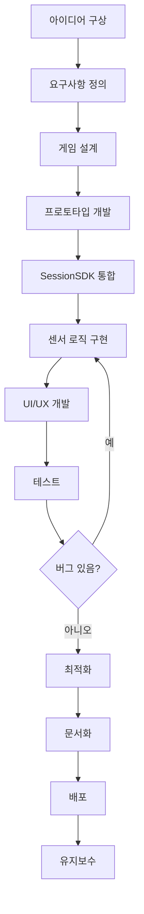

### 9.1 게임 개발 워크플로우

#### 9.1.1 전체 개발 프로세스



#### 9.1.2 단계별 상세 가이드

##### Step 1: 아이디어 구상 (1-2시간)

**목표**: 게임 컨셉 정의 및 실현 가능성 검토

**체크리스트**:
- [ ] 게임 장르 결정 (액션, 퍼즐, 레이싱 등)
- [ ] 타겟 플레이어 수 결정 (solo/dual/multi)
- [ ] 핵심 메커니즘 정의
- [ ] 센서 사용 방식 구상
- [ ] 기술적 실현 가능성 검토

**예제: 아이디어 문서**

```markdown
# 게임 아이디어: Gravity Maze

## 개요
스마트폰을 기울여 공을 굴려 미로를 탈출하는 퍼즐 게임

## 핵심 메커니즘
- 중력 기반 물리 엔진
- 기울기로 중력 방향 제어
- 장애물 회피 및 열쇠 수집

## 기술 요구사항
- 게임 타입: Solo (1 센서)
- 센서 데이터: orientation (gamma, beta)
- 물리 엔진: 간단한 중력 + 충돌 감지
- 난이도: 중급 (레벨 시스템)

## 차별화 포인트
- 실시간 물리 시뮬레이션
- 동적 장애물
- 리플레이 시스템
```

##### Step 2: 요구사항 정의 (30분-1시간)

**기능 요구사항 (Functional Requirements)**:

```yaml
필수 기능:
  - 세션 생성 및 QR 코드 표시
  - 센서 연결 및 데이터 수신
  - 게임 로직 (물리, 충돌)
  - 점수 시스템
  - 게임 오버 처리

선택 기능:
  - 레벨 시스템
  - 리더보드
  - 효과음/배경음악
  - 파워업 아이템
  - 리플레이 저장
```

**비기능 요구사항 (Non-Functional Requirements)**:

```yaml
성능:
  - 게임 루프: 60 FPS
  - 센서 데이터 레이턴시: < 100ms
  - 세션 생성 시간: < 2초

사용성:
  - 세션 코드 입력: 4자리 (대문자+숫자)
  - QR 코드 스캔: 모바일 카메라
  - 게임 시작까지: < 30초

호환성:
  - 브라우저: Chrome, Safari, Firefox 최신 버전
  - 모바일: iOS 13+, Android 8+
  - 화면 해상도: 800x600 ~ 1920x1080
```

##### Step 3: 게임 설계 (1-2시간)

**데이터 구조 설계**:

```javascript
// 게임 상태 설계
const gameState = {
    // 플레이어
    ball: {
        x: 400,
        y: 300,
        radius: 20,
        vx: 0,
        vy: 0,
        mass: 1
    },

    // 레벨 데이터
    level: {
        id: 1,
        walls: [
            { x: 100, y: 100, width: 600, height: 20 },
            // ...
        ],
        obstacles: [
            { x: 200, y: 200, radius: 30, type: 'spike' },
            // ...
        ],
        goal: { x: 700, y: 500, radius: 40 },
        keys: [
            { x: 300, y: 300, radius: 15, collected: false }
        ]
    },

    // 게임 진행 상태
    score: 0,
    lives: 3,
    keysCollected: 0,
    keysRequired: 3,
    timeElapsed: 0,
    isPlaying: false,
    isPaused: false,

    // 센서 상태
    sensorConnected: false,
    currentTilt: { gamma: 0, beta: 0 }
};
```

**물리 엔진 설계**:

```javascript
// 물리 상수
const PHYSICS = {
    GRAVITY: 0.5,           // 중력 가속도
    FRICTION: 0.98,         // 마찰 계수
    BOUNCE: 0.7,            // 반발 계수
    MAX_VELOCITY: 10,       // 최대 속도
    TILT_SENSITIVITY: 0.1   // 기울기 민감도
};

// 물리 업데이트 함수 설계
function updatePhysics(deltaTime) {
    // 1. 중력 적용 (기울기 기반)
    applyGravity();

    // 2. 속도 업데이트
    updateVelocity();

    // 3. 위치 업데이트
    updatePosition(deltaTime);

    // 4. 충돌 감지 및 처리
    handleCollisions();

    // 5. 경계 체크
    constrainToBounds();
}
```

##### Step 4: 프로토타입 개발 (2-4시간)

**GAME_TEMPLATE.html 복사 및 수정**:

```bash
# 1. 템플릿 복사
cp GAME_TEMPLATE.html public/games/gravity-maze/index.html

# 2. game.json 생성
cat > public/games/gravity-maze/game.json << EOF
{
    "title": "Gravity Maze",
    "type": "solo",
    "description": "기울기로 공을 굴려 미로를 탈출하세요!",
    "difficulty": "medium",
    "tags": ["puzzle", "physics", "maze"]
}
EOF
```

**프로토타입 코드 (핵심만)**:

```html
<!DOCTYPE html>
<html lang="ko">
<head>
    <meta charset="UTF-8">
    <title>Gravity Maze - Prototype</title>
    <script src="https://cdn.socket.io/4.5.4/socket.io.min.js"></script>
    <script src="/js/SessionSDK.js"></script>
    <style>
        body { margin: 0; background: #0f172a; display: flex; justify-content: center; align-items: center; height: 100vh; }
        canvas { border: 2px solid #3b82f6; background: #1e293b; }
    </style>
</head>
<body>
    <canvas id="canvas" width="800" height="600"></canvas>

    <script>
        // SDK 초기화
        const sdk = new SessionSDK({
            gameId: 'gravity-maze',
            gameType: 'solo',
            debug: true
        });

        // 게임 상태
        const game = {
            ball: { x: 400, y: 300, vx: 0, vy: 0, radius: 20 },
            gravity: { x: 0, y: 0.5 },
            isPlaying: false
        };

        const canvas = document.getElementById('canvas');
        const ctx = canvas.getContext('2d');

        // 연결 및 세션 생성
        sdk.on('connected', async () => {
            const session = await sdk.createSession();
            console.log('세션 코드:', session.sessionCode);
            // TODO: QR 코드 표시
        });

        // 센서 데이터 처리
        sdk.on('sensor-data', (event) => {
            const data = event.detail || event;
            const tilt = data.data.orientation;

            // 기울기를 중력으로 변환
            game.gravity.x = tilt.gamma * 0.1;
            game.gravity.y = tilt.beta * 0.1;
        });

        // 게임 준비 완료
        sdk.on('game-ready', async () => {
            await sdk.startGame();
            game.isPlaying = true;
            gameLoop();
        });

        // 게임 루프
        function gameLoop() {
            if (!game.isPlaying) return;

            // 물리 업데이트
            game.ball.vx += game.gravity.x;
            game.ball.vy += game.gravity.y;
            game.ball.vx *= 0.98;
            game.ball.vy *= 0.98;
            game.ball.x += game.ball.vx;
            game.ball.y += game.ball.vy;

            // 경계 충돌
            if (game.ball.x < 20 || game.ball.x > 780) {
                game.ball.vx *= -0.7;
                game.ball.x = Math.max(20, Math.min(780, game.ball.x));
            }
            if (game.ball.y < 20 || game.ball.y > 580) {
                game.ball.vy *= -0.7;
                game.ball.y = Math.max(20, Math.min(580, game.ball.y));
            }

            // 렌더링
            ctx.fillStyle = '#1e293b';
            ctx.fillRect(0, 0, 800, 600);

            ctx.beginPath();
            ctx.arc(game.ball.x, game.ball.y, game.ball.radius, 0, Math.PI * 2);
            ctx.fillStyle = '#3b82f6';
            ctx.fill();

            requestAnimationFrame(gameLoop);
        }
    </script>
</body>
</html>
```

##### Step 5: SessionSDK 통합 (1-2시간)

**필수 통합 패턴**:

```javascript
// ===== 패턴 1: SDK 초기화 및 연결 =====
const sdk = new SessionSDK({
    gameId: 'your-game-id',
    gameType: 'solo',  // 또는 'dual', 'multi'
    debug: true        // 개발 중에는 true
});

// ===== 패턴 2: 연결 완료 후 세션 생성 =====
sdk.on('connected', async () => {
    console.log('✅ 서버 연결됨');

    try {
        const session = await sdk.createSession();

        // 세션 정보 표시
        displaySessionCode(session.sessionCode);
        generateQRCode(session.sessionCode);

    } catch (error) {
        console.error('세션 생성 실패:', error);
        showError('세션을 생성할 수 없습니다.');
    }
});

// ===== 패턴 3: 센서 연결 알림 =====
sdk.on('sensor-connected', (event) => {
    const conn = event.detail || event;
    console.log('📱 센서 연결:', conn.sensorId);

    // UI 업데이트
    document.getElementById('sensor-status').textContent = '센서 연결됨';
    document.getElementById('sensor-status').className = 'status-connected';
});

// ===== 패턴 4: 게임 준비 및 시작 =====
sdk.on('game-ready', async () => {
    console.log('🎮 게임 준비 완료');

    // 카운트다운
    await countdown(3);

    // 게임 시작
    const gameInfo = await sdk.startGame();
    gameState.isPlaying = true;

    // 게임 루프 시작
    startGameLoop();
});

// ===== 패턴 5: 센서 데이터 처리 =====
sdk.on('sensor-data', (event) => {
    const data = event.detail || event;

    if (!gameState.isPlaying) return;

    // 센서 데이터 추출
    const { orientation, acceleration, rotationRate } = data.data;

    // 게임 로직에 적용
    processSensorInput(orientation);
});

// ===== 패턴 6: 연결 해제 처리 =====
sdk.on('sensor-disconnected', (event) => {
    const data = event.detail || event;
    console.log('❌ 센서 연결 해제:', data.sensorId);

    // 게임 일시정지
    pauseGame();
    showReconnectMessage();
});

// ===== 패턴 7: 에러 처리 =====
sdk.on('connection-error', (event) => {
    const error = event.detail || event;
    console.error('연결 오류:', error);

    showError('서버 연결에 문제가 있습니다. 페이지를 새로고침해주세요.');
});
```

##### Step 6: 센서 로직 구현 (2-3시간)

**센서 데이터 매핑 전략**:

```javascript
// 센서 데이터 종류별 활용법

// 1. Orientation (기기 방향)
// - alpha: 0-360° (나침반 방향)
// - beta: -180~180° (앞뒤 기울기)
// - gamma: -90~90° (좌우 기울기)

// 활용 예시: 공 굴리기
function mapOrientationToBall(orientation) {
    // gamma: 좌우 기울기 → 좌우 힘
    const forceX = orientation.gamma * 0.1;

    // beta: 앞뒤 기울기 → 상하 힘
    const forceY = orientation.beta * 0.1;

    // 최대 힘 제한
    return {
        x: Math.max(-1, Math.min(1, forceX)),
        y: Math.max(-1, Math.min(1, forceY))
    };
}

// 2. Acceleration (가속도)
// - x, y, z: m/s²
// 활용 예시: 흔들기 감지
function detectShake(acceleration) {
    const magnitude = Math.sqrt(
        acceleration.x ** 2 +
        acceleration.y ** 2 +
        acceleration.z ** 2
    );

    const SHAKE_THRESHOLD = 15; // m/s²
    return magnitude > SHAKE_THRESHOLD;
}

// 3. RotationRate (회전 속도)
// - alpha, beta, gamma: deg/s
// 활용 예시: 스핀 공격
function mapRotationToSpin(rotationRate) {
    const totalRotation = Math.abs(rotationRate.alpha) +
                          Math.abs(rotationRate.beta) +
                          Math.abs(rotationRate.gamma);

    const SPIN_THRESHOLD = 100; // deg/s

    if (totalRotation > SPIN_THRESHOLD) {
        return {
            isSpinning: true,
            intensity: Math.min(totalRotation / 300, 1)
        };
    }

    return { isSpinning: false, intensity: 0 };
}
```

**고급 센서 처리**:

```javascript
// 센서 데이터 스무딩 (Smoothing)
class SensorSmoother {
    constructor(windowSize = 5) {
        this.windowSize = windowSize;
        this.history = {
            gamma: [],
            beta: [],
            alpha: []
        };
    }

    smooth(orientation) {
        // 히스토리에 추가
        this.history.gamma.push(orientation.gamma);
        this.history.beta.push(orientation.beta);
        this.history.alpha.push(orientation.alpha);

        // 윈도우 크기 유지
        if (this.history.gamma.length > this.windowSize) {
            this.history.gamma.shift();
            this.history.beta.shift();
            this.history.alpha.shift();
        }

        // 평균 계산
        return {
            gamma: this.average(this.history.gamma),
            beta: this.average(this.history.beta),
            alpha: this.average(this.history.alpha)
        };
    }

    average(arr) {
        return arr.reduce((a, b) => a + b, 0) / arr.length;
    }
}

// 사용 예시
const smoother = new SensorSmoother(5);

sdk.on('sensor-data', (event) => {
    const data = event.detail || event;
    const raw = data.data.orientation;

    // 스무딩 적용
    const smoothed = smoother.smooth(raw);

    // 게임 로직에 사용
    applyTilt(smoothed);
});
```

**데드존 (Dead Zone) 처리**:

```javascript
// 작은 기울기 무시하기
function applyDeadZone(value, threshold = 5) {
    if (Math.abs(value) < threshold) {
        return 0;
    }

    // 데드존 제거 후 재스케일
    const sign = Math.sign(value);
    const adjusted = Math.abs(value) - threshold;
    const maxRange = 90 - threshold; // gamma 범위

    return sign * (adjusted / maxRange) * 90;
}

// 사용 예시
sdk.on('sensor-data', (event) => {
    const data = event.detail || event;
    const tilt = data.data.orientation;

    // 데드존 적용
    const gamma = applyDeadZone(tilt.gamma, 5);
    const beta = applyDeadZone(tilt.beta, 5);

    // 5도 이하 기울기는 무시됨
    applyForce({ x: gamma * 0.1, y: beta * 0.1 });
});
```

##### Step 7: UI/UX 개발 (2-3시간)

**세션 정보 UI 컴포넌트**:

```html
<!-- 세션 정보 패널 -->
<div id="session-panel" class="session-panel">
    <div class="session-status" id="status">⏳ 센서 연결 대기 중...</div>

    <div class="session-code-container">
        <div class="session-code-label">세션 코드</div>
        <div class="session-code" id="session-code">----</div>
        <button class="copy-button" id="copy-btn" onclick="copySessionCode()">
            📋 복사
        </button>
    </div>

    <div class="qr-container" id="qr-container">
        <!-- QR 코드가 여기에 동적 생성됨 -->
    </div>

    <div class="sensor-info">
        <div class="sensor-item">
            <span class="sensor-label">연결된 센서:</span>
            <span class="sensor-value" id="sensor-count">0</span>
        </div>
        <div class="sensor-item">
            <span class="sensor-label">레이턴시:</span>
            <span class="sensor-value" id="latency">--ms</span>
        </div>
    </div>
</div>

<style>
.session-panel {
    position: fixed;
    top: 20px;
    right: 20px;
    background: rgba(30, 41, 59, 0.95);
    border: 2px solid #3b82f6;
    border-radius: 12px;
    padding: 20px;
    min-width: 300px;
    backdrop-filter: blur(10px);
    z-index: 1000;
}

.session-status {
    font-size: 16px;
    margin-bottom: 15px;
    padding: 10px;
    border-radius: 8px;
    text-align: center;
    font-weight: 600;
}

.session-status.waiting { background: #f59e0b; color: #000; }
.session-status.connected { background: #22c55e; color: #000; }
.session-status.playing { background: #3b82f6; color: #fff; }

.session-code-container {
    margin: 15px 0;
    text-align: center;
}

.session-code {
    font-size: 48px;
    font-weight: bold;
    color: #3b82f6;
    letter-spacing: 10px;
    margin: 10px 0;
    font-family: 'Courier New', monospace;
}

.copy-button {
    background: #3b82f6;
    color: white;
    border: none;
    padding: 8px 16px;
    border-radius: 6px;
    cursor: pointer;
    font-size: 14px;
    transition: all 0.2s;
}

.copy-button:hover {
    background: #2563eb;
    transform: translateY(-2px);
}

.qr-container {
    margin: 20px 0;
    text-align: center;
    padding: 15px;
    background: white;
    border-radius: 8px;
}

.sensor-info {
    margin-top: 15px;
    padding-top: 15px;
    border-top: 1px solid #475569;
}

.sensor-item {
    display: flex;
    justify-content: space-between;
    margin: 8px 0;
    font-size: 14px;
}

.sensor-label {
    color: #94a3b8;
}

.sensor-value {
    color: #f8fafc;
    font-weight: 600;
}
</style>

<script>
// 세션 정보 표시 함수
function displaySessionInfo(session) {
    // 세션 코드 표시
    document.getElementById('session-code').textContent = session.sessionCode;

    // QR 코드 생성
    const qrUrl = `${window.location.origin}/sensor.html?code=${session.sessionCode}`;
    QRCodeGenerator.generateElement(qrUrl, 200).then(qr => {
        document.getElementById('qr-container').innerHTML = '';
        document.getElementById('qr-container').appendChild(qr);
    });

    // 상태 업데이트
    document.getElementById('status').textContent = '📱 모바일로 QR 코드를 스캔하세요';
}

// 세션 코드 복사
function copySessionCode() {
    const code = document.getElementById('session-code').textContent;
    navigator.clipboard.writeText(code).then(() => {
        const btn = document.getElementById('copy-btn');
        btn.textContent = '✅ 복사됨!';
        setTimeout(() => {
            btn.textContent = '📋 복사';
        }, 2000);
    });
}

// 레이턴시 모니터링
setInterval(async () => {
    const latency = await sdk.ping();
    if (latency !== null) {
        document.getElementById('latency').textContent = `${latency}ms`;
    }
}, 3000);
</script>
```

**게임 HUD (Heads-Up Display)**:

```html
<!-- 게임 HUD -->
<div id="game-hud" class="game-hud">
    <div class="hud-item">
        <div class="hud-label">점수</div>
        <div class="hud-value" id="score">0</div>
    </div>

    <div class="hud-item">
        <div class="hud-label">시간</div>
        <div class="hud-value" id="time">0:00</div>
    </div>

    <div class="hud-item">
        <div class="hud-label">목표</div>
        <div class="hud-value" id="goal">0 / 5</div>
    </div>

    <div class="hud-item">
        <div class="hud-label">생명</div>
        <div class="hud-value lives" id="lives">
            <span class="heart">❤️</span>
            <span class="heart">❤️</span>
            <span class="heart">❤️</span>
        </div>
    </div>
</div>

<style>
.game-hud {
    position: fixed;
    top: 20px;
    left: 20px;
    display: flex;
    gap: 20px;
    z-index: 999;
}

.hud-item {
    background: rgba(0, 0, 0, 0.7);
    border: 2px solid #3b82f6;
    border-radius: 8px;
    padding: 10px 20px;
    backdrop-filter: blur(10px);
}

.hud-label {
    font-size: 12px;
    color: #94a3b8;
    text-transform: uppercase;
    margin-bottom: 5px;
}

.hud-value {
    font-size: 24px;
    font-weight: bold;
    color: #f8fafc;
}

.hud-value.lives {
    display: flex;
    gap: 5px;
}

.heart {
    font-size: 20px;
}

.heart.lost {
    opacity: 0.3;
    filter: grayscale(1);
}
</style>

<script>
// HUD 업데이트 함수들
function updateScore(score) {
    document.getElementById('score').textContent = score;

    // 애니메이션 효과
    const el = document.getElementById('score');
    el.classList.add('score-pulse');
    setTimeout(() => el.classList.remove('score-pulse'), 300);
}

function updateTime(seconds) {
    const minutes = Math.floor(seconds / 60);
    const secs = seconds % 60;
    document.getElementById('time').textContent =
        `${minutes}:${secs.toString().padStart(2, '0')}`;
}

function updateGoal(current, total) {
    document.getElementById('goal').textContent = `${current} / ${total}`;
}

function updateLives(lives) {
    const container = document.getElementById('lives');
    const hearts = container.querySelectorAll('.heart');

    hearts.forEach((heart, index) => {
        if (index < lives) {
            heart.classList.remove('lost');
        } else {
            heart.classList.add('lost');
        }
    });
}
</script>
```

##### Step 8: 테스트 (1-2시간)

**테스트 체크리스트**:

```markdown
## 기능 테스트

### 연결 테스트
- [ ] 서버 연결 성공
- [ ] 세션 생성 성공
- [ ] 세션 코드 표시 정상
- [ ] QR 코드 생성 정상
- [ ] 센서 연결 성공
- [ ] 센서 데이터 수신 정상

### 게임 로직 테스트
- [ ] 센서 기울기가 게임에 반영됨
- [ ] 물리 엔진 동작 정상
- [ ] 충돌 감지 정상
- [ ] 점수 계산 정확
- [ ] 게임 오버 처리 정상

### UI/UX 테스트
- [ ] HUD 정보 정확
- [ ] 애니메이션 부드러움
- [ ] 버튼 클릭 반응
- [ ] 모달/팝업 표시 정상

### 에러 핸들링 테스트
- [ ] 센서 연결 해제 처리
- [ ] 호스트 연결 해제 처리
- [ ] 네트워크 오류 처리
- [ ] 센서 권한 거부 처리

## 성능 테스트
- [ ] 60 FPS 유지
- [ ] 센서 레이턴시 < 100ms
- [ ] 메모리 누수 없음
- [ ] CPU 사용률 정상

## 호환성 테스트

### 데스크톱 브라우저
- [ ] Chrome (Windows)
- [ ] Chrome (macOS)
- [ ] Safari (macOS)
- [ ] Firefox (Windows/macOS)

### 모바일 브라우저
- [ ] Safari (iOS 13+)
- [ ] Chrome (Android 8+)

### 기기별 테스트
- [ ] iPhone (다양한 모델)
- [ ] Android (다양한 모델)
```

**자동화 테스트 스크립트**:

```javascript
// 간단한 자동화 테스트
class GameTester {
    constructor(sdk) {
        this.sdk = sdk;
        this.results = [];
    }

    async runTests() {
        console.log('🧪 테스트 시작...');

        await this.testConnection();
        await this.testSessionCreation();
        await this.testSensorData();

        this.printResults();
    }

    async testConnection() {
        console.log('Test 1: 서버 연결');

        const timeout = setTimeout(() => {
            this.results.push({ test: '서버 연결', passed: false, error: '타임아웃' });
        }, 10000);

        return new Promise((resolve) => {
            this.sdk.on('connected', () => {
                clearTimeout(timeout);
                this.results.push({ test: '서버 연결', passed: true });
                resolve();
            });
        });
    }

    async testSessionCreation() {
        console.log('Test 2: 세션 생성');

        try {
            const session = await this.sdk.createSession();

            if (session.sessionCode && session.sessionCode.length === 4) {
                this.results.push({ test: '세션 생성', passed: true });
            } else {
                this.results.push({
                    test: '세션 생성',
                    passed: false,
                    error: '세션 코드 형식 오류'
                });
            }
        } catch (error) {
            this.results.push({ test: '세션 생성', passed: false, error: error.message });
        }
    }

    async testSensorData() {
        console.log('Test 3: 센서 데이터 수신');

        return new Promise((resolve) => {
            const timeout = setTimeout(() => {
                this.results.push({
                    test: '센서 데이터',
                    passed: false,
                    error: '센서 데이터 미수신'
                });
                resolve();
            }, 30000);

            this.sdk.on('sensor-data', (event) => {
                clearTimeout(timeout);

                const data = event.detail || event;

                if (data.data && data.data.orientation) {
                    this.results.push({ test: '센서 데이터', passed: true });
                } else {
                    this.results.push({
                        test: '센서 데이터',
                        passed: false,
                        error: '데이터 형식 오류'
                    });
                }

                resolve();
            });
        });
    }

    printResults() {
        console.log('\n📊 테스트 결과:\n');

        const passed = this.results.filter(r => r.passed).length;
        const total = this.results.length;

        this.results.forEach(result => {
            const icon = result.passed ? '✅' : '❌';
            const error = result.error ? ` (${result.error})` : '';
            console.log(`${icon} ${result.test}${error}`);
        });

        console.log(`\n총 ${total}개 테스트 중 ${passed}개 통과 (${Math.round(passed/total*100)}%)`);
    }
}

// 사용 예시
const tester = new GameTester(sdk);
// tester.runTests();  // 개발 중에만 실행
```

##### Step 9: 최적화 (1-2시간)

**성능 최적화는 Section 9.4에서 상세히 다룹니다.**

##### Step 10: 문서화 (30분-1시간)

**game.json 완성**:

```json
{
    "title": "Gravity Maze",
    "type": "solo",
    "description": "스마트폰을 기울여 공을 굴려 미로를 탈출하는 물리 퍼즐 게임",
    "version": "1.0.0",
    "author": "Your Name",
    "difficulty": "medium",
    "tags": ["puzzle", "physics", "maze", "gravity"],
    "thumbnail": "thumbnail.png",
    "instructions": {
        "setup": [
            "1. 게임 화면에 표시된 QR 코드를 모바일로 스캔하세요",
            "2. 또는 4자리 세션 코드를 직접 입력하세요",
            "3. 센서 권한을 허용해주세요"
        ],
        "controls": [
            "스마트폰을 좌우로 기울여 공을 이동시킵니다",
            "앞뒤로 기울여 공의 속도를 조절합니다"
        ],
        "objective": "모든 열쇠를 수집하고 출구에 도달하세요!"
    },
    "features": [
        "15개의 도전적인 레벨",
        "실시간 물리 시뮬레이션",
        "동적 장애물 시스템",
        "리플레이 저장 기능"
    ]
}
```

**README.md 작성**:

```markdown
# Gravity Maze

스마트폰을 기울여 공을 굴려 미로를 탈출하는 물리 퍼즐 게임입니다.

## 게임 방법

1. **세션 생성**: 게임 화면의 QR 코드를 스캔하거나 세션 코드를 입력하세요
2. **센서 연결**: 모바일 센서 권한을 허용해주세요
3. **플레이**: 스마트폰을 기울여 공을 조종하세요

## 조작 방법

- **좌우 기울기**: 공을 좌우로 이동
- **앞뒤 기울기**: 공의 속도 조절

## 목표

- 모든 열쇠(🔑)를 수집하세요
- 장애물(🔴)을 피하세요
- 출구(🎯)에 도달하세요

## 기술 스펙

- **게임 타입**: Solo (1 센서)
- **센서 사용**: Orientation (gamma, beta)
- **프레임레이트**: 60 FPS
- **해상도**: 800x600

## 개발 정보

- **버전**: 1.0.0
- **개발 기간**: 2주
- **사용 기술**: SessionSDK v6.0, HTML5 Canvas
- **물리 엔진**: Custom gravity-based physics

## 업데이트 이력

### v1.0.0 (2025-10-09)
- 초기 릴리스
- 15개 레벨
- 기본 물리 엔진
- 점수 시스템
```

##### Step 11: 배포 (30분)

**게임 폴더 구조 확인**:

```
public/games/gravity-maze/
├── index.html          # 메인 게임 파일
├── game.json           # 게임 메타데이터
├── README.md           # 게임 설명서
├── thumbnail.png       # 썸네일 이미지 (선택)
└── assets/             # 에셋 폴더 (선택)
    ├── sounds/
    └── images/
```

**배포 명령어**:

```bash
# 1. 서버 재시작 (게임 자동 스캔)
npm start

# 또는 스캔 API 호출
curl -X POST http://localhost:3000/api/admin/rescan

# 2. 게임 접속 확인
open http://localhost:3000/games/gravity-maze

# 3. 센서 클라이언트 테스트
# 모바일에서 http://localhost:3000/sensor.html 접속
```

##### Step 12: 유지보수 (지속적)

**버그 리포트 처리**:

```javascript
// 게임 내 버그 리포트 버튼
document.getElementById('report-bug-btn').addEventListener('click', async () => {
    const description = prompt('버그를 설명해주세요:');

    if (description) {
        const response = await fetch('/api/maintenance/report-bug', {
            method: 'POST',
            headers: { 'Content-Type': 'application/json' },
            body: JSON.stringify({
                gameId: 'gravity-maze',
                bugDescription: description,
                reproductionSteps: '사용자 리포트'
            })
        });

        const result = await response.json();

        if (result.fixApplied) {
            alert('버그가 수정되었습니다! 페이지를 새로고침해주세요.');
        }
    }
});
```

---

### 9.2 개발 환경 설정

#### 9.2.1 로컬 개발 환경

**필수 도구**:

```bash
# Node.js 설치 확인
node --version  # v14 이상 권장

# npm 설치 확인
npm --version

# Git 설치 확인
git --version
```

**프로젝트 클론 및 설정**:

```bash
# 1. 저장소 클론 (해당되는 경우)
git clone https://github.com/your-repo/sensor-game-hub.git
cd sensor-game-hub

# 2. 의존성 설치
npm install

# 3. 환경 변수 설정
cp .env.example .env

# .env 파일 편집
# SUPABASE_URL=your_supabase_url
# SUPABASE_ANON_KEY=your_supabase_anon_key
# OPENAI_API_KEY=your_openai_api_key
# ANTHROPIC_API_KEY=your_anthropic_api_key

# 4. 개발 서버 실행
npm start

# 5. 브라우저에서 확인
open http://localhost:3000
```

#### 9.2.2 IDE 설정 (VS Code 권장)

**추천 확장 프로그램**:

```json
// .vscode/extensions.json
{
    "recommendations": [
        "dbaeumer.vscode-eslint",
        "esbenp.prettier-vscode",
        "ritwickdey.liveserver",
        "ms-vscode.vscode-typescript-next",
        "bierner.markdown-mermaid",
        "yzhang.markdown-all-in-one"
    ]
}
```

**작업 공간 설정**:

```json
// .vscode/settings.json
{
    "editor.formatOnSave": true,
    "editor.defaultFormatter": "esbenp.prettier-vscode",
    "editor.tabSize": 4,
    "files.autoSave": "onFocusChange",
    "javascript.suggest.autoImports": true,
    "javascript.updateImportsOnFileMove.enabled": "always"
}
```

**코드 스니펫**:

```json
// .vscode/game-template.code-snippets
{
    "Session SDK Init": {
        "prefix": "sdk-init",
        "body": [
            "const sdk = new SessionSDK({",
            "    gameId: '${1:game-id}',",
            "    gameType: '${2|solo,dual,multi|}',",
            "    debug: true",
            "});",
            "",
            "sdk.on('connected', async () => {",
            "    const session = await sdk.createSession();",
            "    console.log('세션 코드:', session.sessionCode);",
            "});",
            "",
            "sdk.on('sensor-data', (event) => {",
            "    const data = event.detail || event;",
            "    // TODO: 센서 데이터 처리",
            "});"
        ],
        "description": "SessionSDK 초기화 템플릿"
    },

    "Game Loop": {
        "prefix": "game-loop",
        "body": [
            "function gameLoop() {",
            "    if (!gameState.isPlaying) return;",
            "    ",
            "    update();",
            "    render();",
            "    ",
            "    requestAnimationFrame(gameLoop);",
            "}",
            "",
            "function update() {",
            "    // TODO: 게임 로직 업데이트",
            "}",
            "",
            "function render() {",
            "    ctx.clearRect(0, 0, canvas.width, canvas.height);",
            "    // TODO: 렌더링",
            "}"
        ],
        "description": "게임 루프 템플릿"
    }
}
```

#### 9.2.3 디버깅 설정

**Chrome DevTools 활용**:

```javascript
// 개발 모드 전용 디버깅 함수
const DEBUG = true;  // 프로덕션에서는 false

function debugLog(category, message, data) {
    if (!DEBUG) return;

    const color = {
        'sdk': '#3b82f6',
        'sensor': '#22c55e',
        'game': '#f59e0b',
        'error': '#ef4444'
    }[category] || '#94a3b8';

    console.log(
        `%c[${category.toUpperCase()}]%c ${message}`,
        `color: ${color}; font-weight: bold;`,
        'color: inherit;',
        data || ''
    );
}

// 사용 예시
debugLog('sdk', '서버 연결 완료');
debugLog('sensor', '센서 데이터 수신', sensorData);
debugLog('game', '점수 업데이트', { oldScore: 10, newScore: 20 });
debugLog('error', '연결 실패', error);
```

**성능 프로파일링**:

```javascript
// FPS 모니터
class FPSMonitor {
    constructor() {
        this.frames = [];
        this.lastTime = performance.now();

        // FPS 표시 엘리먼트 생성
        this.element = document.createElement('div');
        this.element.style.cssText = `
            position: fixed;
            top: 10px;
            left: 10px;
            background: rgba(0,0,0,0.7);
            color: #0f0;
            padding: 5px 10px;
            font-family: monospace;
            font-size: 14px;
            z-index: 10000;
        `;
        document.body.appendChild(this.element);
    }

    update() {
        const now = performance.now();
        const delta = now - this.lastTime;
        this.lastTime = now;

        this.frames.push(delta);

        // 마지막 60프레임만 유지
        if (this.frames.length > 60) {
            this.frames.shift();
        }

        // FPS 계산
        const avgDelta = this.frames.reduce((a, b) => a + b) / this.frames.length;
        const fps = Math.round(1000 / avgDelta);

        // 색상 변경 (FPS에 따라)
        let color = '#0f0';  // 녹색 (60 FPS)
        if (fps < 60) color = '#ff0';  // 노란색 (30-60 FPS)
        if (fps < 30) color = '#f00';  // 빨간색 (30 FPS 미만)

        this.element.style.color = color;
        this.element.textContent = `FPS: ${fps}`;
    }
}

// 사용
const fpsMonitor = new FPSMonitor();

function gameLoop() {
    fpsMonitor.update();

    // 게임 로직...

    requestAnimationFrame(gameLoop);
}
```

---

### 9.3 코딩 베스트 프랙티스

#### 9.3.1 코드 구조화

**모듈 패턴**:

```javascript
// ===== game.js - 메인 게임 로직 =====

// 게임 모듈
const Game = (function() {
    // Private 변수
    let state = {
        isPlaying: false,
        score: 0,
        lives: 3
    };

    let canvas, ctx;
    let sdk;

    // Private 함수
    function init(canvasId) {
        canvas = document.getElementById(canvasId);
        ctx = canvas.getContext('2d');

        sdk = new SessionSDK({
            gameId: 'my-game',
            gameType: 'solo',
            debug: true
        });

        setupSDK();
    }

    function setupSDK() {
        sdk.on('connected', handleConnected);
        sdk.on('sensor-data', handleSensorData);
        sdk.on('game-ready', handleGameReady);
    }

    function handleConnected() {
        // 구현...
    }

    function handleSensorData(event) {
        // 구현...
    }

    function handleGameReady() {
        // 구현...
    }

    function update() {
        if (!state.isPlaying) return;

        // 물리 업데이트
        Physics.update(state);

        // 충돌 감지
        Collision.detect(state);

        // UI 업데이트
        UI.update(state);
    }

    function render() {
        ctx.clearRect(0, 0, canvas.width, canvas.height);

        // 렌더링
        Renderer.draw(ctx, state);
    }

    function gameLoop() {
        if (!state.isPlaying) return;

        update();
        render();

        requestAnimationFrame(gameLoop);
    }

    // Public API
    return {
        init: init,
        start: () => { state.isPlaying = true; gameLoop(); },
        pause: () => { state.isPlaying = false; },
        getState: () => ({ ...state })  // 복사본 반환
    };
})();

// 사용
Game.init('canvas');
```

**분리된 모듈 파일**:

```javascript
// ===== physics.js =====
const Physics = {
    update(state) {
        // 물리 업데이트 로직
    }
};

// ===== collision.js =====
const Collision = {
    detect(state) {
        // 충돌 감지 로직
    }
};

// ===== renderer.js =====
const Renderer = {
    draw(ctx, state) {
        // 렌더링 로직
    }
};

// ===== ui.js =====
const UI = {
    update(state) {
        // UI 업데이트 로직
    }
};
```

#### 9.3.2 명명 규칙

**변수 및 함수 이름**:

```javascript
// ✅ 좋은 예
const maxPlayerSpeed = 10;
const sensorDataHistory = [];

function calculateDistance(pointA, pointB) {
    return Math.sqrt(
        (pointB.x - pointA.x) ** 2 +
        (pointB.y - pointA.y) ** 2
    );
}

function isCollidingWith(objA, objB) {
    // 충돌 검사
    return distance < (objA.radius + objB.radius);
}

// ❌ 나쁜 예
const x = 10;           // 의미 불명확
const arr = [];         // 일반적인 이름
const d = calcDist();   // 축약 과다

function func1(a, b) {  // 의미 불명확
    return Math.sqrt((b.x - a.x) ** 2 + (b.y - a.y) ** 2);
}
```

**상수 명명**:

```javascript
// ✅ 상수는 대문자 + 언더스코어
const MAX_LIVES = 3;
const DEFAULT_GRAVITY = 0.5;
const SENSOR_THROTTLE_MS = 50;
const PI_TIMES_TWO = Math.PI * 2;

// 설정 객체
const CONFIG = {
    PHYSICS: {
        GRAVITY: 0.5,
        FRICTION: 0.98,
        BOUNCE: 0.7
    },
    GAME: {
        MAX_SCORE: 9999,
        TIME_LIMIT: 180  // 초
    }
};
```

**클래스 명명**:

```javascript
// ✅ PascalCase
class PlayerCharacter {
    constructor(x, y) {
        this.position = { x, y };
        this.velocity = { x: 0, y: 0 };
    }

    update(deltaTime) {
        // 업데이트 로직
    }
}

class SensorDataProcessor {
    process(rawData) {
        // 처리 로직
    }
}
```

#### 9.3.3 주석 작성 가이드

**함수 주석 (JSDoc 스타일)**:

```javascript
/**
 * 두 점 사이의 거리를 계산합니다.
 *
 * @param {Object} pointA - 첫 번째 점 {x, y}
 * @param {Object} pointB - 두 번째 점 {x, y}
 * @returns {number} 두 점 사이의 유클리드 거리
 *
 * @example
 * const distance = calculateDistance(
 *     { x: 0, y: 0 },
 *     { x: 3, y: 4 }
 * );
 * // distance === 5
 */
function calculateDistance(pointA, pointB) {
    return Math.sqrt(
        (pointB.x - pointA.x) ** 2 +
        (pointB.y - pointA.y) ** 2
    );
}

/**
 * 두 원형 객체의 충돌 여부를 확인합니다.
 *
 * @param {Object} objA - 첫 번째 객체 {x, y, radius}
 * @param {Object} objB - 두 번째 객체 {x, y, radius}
 * @returns {boolean} 충돌 시 true, 아니면 false
 */
function checkCircleCollision(objA, objB) {
    const distance = calculateDistance(
        { x: objA.x, y: objA.y },
        { x: objB.x, y: objB.y }
    );

    return distance < (objA.radius + objB.radius);
}
```

**인라인 주석**:

```javascript
function update() {
    // 중력 적용
    ball.vy += GRAVITY;

    // 마찰 적용 (속도 감소)
    ball.vx *= FRICTION;
    ball.vy *= FRICTION;

    // 위치 업데이트
    ball.x += ball.vx;
    ball.y += ball.vy;

    // FIXME: 경계 충돌 시 가끔 튕겨나가는 버그
    if (ball.x < 0 || ball.x > canvas.width) {
        ball.vx *= -BOUNCE;
    }

    // TODO: 회전 속도도 반영하기
}
```

**섹션 주석**:

```javascript
// ========================================
// 초기화
// ========================================

function init() {
    // 초기화 로직
}

// ========================================
// 이벤트 핸들러
// ========================================

function handleSensorData(event) {
    // 핸들러 로직
}

// ========================================
// 게임 루프
// ========================================

function update() {
    // 업데이트 로직
}

function render() {
    // 렌더링 로직
}
```

#### 9.3.4 에러 처리 패턴

**Try-Catch 사용**:

```javascript
// ✅ 좋은 예: 구체적인 에러 처리
sdk.on('connected', async () => {
    try {
        const session = await sdk.createSession();
        displaySessionInfo(session);

    } catch (error) {
        console.error('세션 생성 실패:', error);

        // 사용자에게 친절한 메시지
        showError('세션을 생성할 수 없습니다. 서버 연결을 확인해주세요.');

        // 재시도 버튼 표시
        showRetryButton(() => {
            sdk.createSession();
        });
    }
});

// ❌ 나쁜 예: 에러 무시
sdk.on('connected', async () => {
    const session = await sdk.createSession();  // 에러 처리 없음
    displaySessionInfo(session);
});
```

**에러 타입별 처리**:

```javascript
async function connectToGame(sessionCode) {
    try {
        const connection = await sdk.connectSensor(sessionCode);
        return connection;

    } catch (error) {
        // 에러 타입 파악
        if (error.message.includes('찾을 수 없습니다')) {
            throw new Error('CODE_NOT_FOUND');
        } else if (error.message.includes('최대 센서 수')) {
            throw new Error('SESSION_FULL');
        } else if (error.message.includes('만료')) {
            throw new Error('SESSION_EXPIRED');
        } else {
            throw new Error('UNKNOWN_ERROR');
        }
    }
}

// 사용
try {
    await connectToGame(code);
} catch (error) {
    switch (error.message) {
        case 'CODE_NOT_FOUND':
            alert('세션 코드가 올바르지 않습니다.');
            break;
        case 'SESSION_FULL':
            alert('세션이 가득 찼습니다.');
            break;
        case 'SESSION_EXPIRED':
            alert('세션이 만료되었습니다.');
            break;
        default:
            alert('연결 실패: 다시 시도해주세요.');
    }
}
```

#### 9.3.5 코드 리뷰 체크리스트

```markdown
## 기능
- [ ] 모든 요구사항이 구현되었는가?
- [ ] 엣지 케이스가 처리되었는가?
- [ ] 에러 처리가 적절한가?

## 코드 품질
- [ ] 변수/함수 이름이 명확한가?
- [ ] 주석이 적절히 작성되었는가?
- [ ] 중복 코드가 없는가?
- [ ] 함수가 단일 책임 원칙을 따르는가?

## SessionSDK 통합
- [ ] `event.detail || event` 패턴을 사용하는가?
- [ ] 연결 완료 후 세션 생성을 하는가?
- [ ] 에러 핸들링이 있는가?

## 성능
- [ ] 게임 루프가 60 FPS를 유지하는가?
- [ ] 메모리 누수가 없는가?
- [ ] 불필요한 렌더링이 없는가?

## 사용자 경험
- [ ] 로딩 상태가 표시되는가?
- [ ] 에러 메시지가 사용자 친화적인가?
- [ ] QR 코드가 정상 표시되는가?

## 호환성
- [ ] iOS Safari에서 동작하는가?
- [ ] Android Chrome에서 동작하는가?
- [ ] 센서 권한 요청이 정상인가?
```

---

### 9.4 성능 최적화 가이드

#### 9.4.1 게임 루프 최적화

**RequestAnimationFrame 활용**:

```javascript
// ✅ 좋은 예: RAF + deltaTime
let lastTime = performance.now();

function gameLoop(currentTime) {
    if (!gameState.isPlaying) return;

    // deltaTime 계산 (밀리초)
    const deltaTime = currentTime - lastTime;
    lastTime = currentTime;

    // deltaTime을 사용한 업데이트 (프레임 독립적)
    update(deltaTime);
    render();

    requestAnimationFrame(gameLoop);
}

requestAnimationFrame(gameLoop);

// 물리 업데이트 예시
function update(deltaTime) {
    // deltaTime을 초 단위로 변환
    const dt = deltaTime / 1000;

    // 프레임 독립적인 움직임
    ball.x += ball.vx * dt * 60;  // 60 FPS 기준
    ball.y += ball.vy * dt * 60;
}

// ❌ 나쁜 예: setInterval 사용
setInterval(() => {
    update();
    render();
}, 16);  // 프레임 드랍 발생 가능
```

**렌더링 최적화**:

```javascript
// ✅ 좋은 예: 더티 플래그 패턴
const dirtyFlags = {
    background: true,
    entities: true,
    ui: true
};

function render() {
    // 배경은 변경되지 않으면 다시 그리지 않음
    if (dirtyFlags.background) {
        renderBackground();
        dirtyFlags.background = false;
    }

    // 엔티티만 다시 그리기
    if (dirtyFlags.entities) {
        clearEntities();
        renderEntities();
        dirtyFlags.entities = false;
    }

    // UI만 다시 그리기
    if (dirtyFlags.ui) {
        renderUI();
        dirtyFlags.ui = false;
    }
}

// 엔티티가 이동할 때만 플래그 설정
function updateEntity(entity) {
    entity.x += entity.vx;
    entity.y += entity.vy;

    dirtyFlags.entities = true;  // 다시 그려야 함
}
```

**오프스크린 캔버스**:

```javascript
// 배경을 오프스크린 캔버스에 미리 그리기
const offscreenCanvas = document.createElement('canvas');
offscreenCanvas.width = 800;
offscreenCanvas.height = 600;
const offscreenCtx = offscreenCanvas.getContext('2d');

// 배경 한 번만 그리기
function prepareBackground() {
    offscreenCtx.fillStyle = '#1e293b';
    offscreenCtx.fillRect(0, 0, 800, 600);

    // 격자 패턴
    offscreenCtx.strokeStyle = '#334155';
    for (let i = 0; i < 800; i += 50) {
        offscreenCtx.moveTo(i, 0);
        offscreenCtx.lineTo(i, 600);
    }
    for (let i = 0; i < 600; i += 50) {
        offscreenCtx.moveTo(0, i);
        offscreenCtx.lineTo(800, i);
    }
    offscreenCtx.stroke();
}

prepareBackground();

// 렌더링 시 복사만
function render() {
    // 배경 복사 (매우 빠름)
    ctx.drawImage(offscreenCanvas, 0, 0);

    // 엔티티 그리기
    renderEntities();
}
```

#### 9.4.2 메모리 관리

**객체 풀링**:

```javascript
// 파티클 객체 풀
class ParticlePool {
    constructor(size) {
        this.pool = [];
        this.active = [];

        // 미리 객체 생성
        for (let i = 0; i < size; i++) {
            this.pool.push({
                x: 0,
                y: 0,
                vx: 0,
                vy: 0,
                life: 0,
                maxLife: 0
            });
        }
    }

    get() {
        // 풀에서 가져오기
        if (this.pool.length > 0) {
            const particle = this.pool.pop();
            this.active.push(particle);
            return particle;
        }

        // 풀이 비었으면 null 반환
        return null;
    }

    release(particle) {
        // 풀로 반환
        const index = this.active.indexOf(particle);
        if (index !== -1) {
            this.active.splice(index, 1);
            this.pool.push(particle);
        }
    }

    update(deltaTime) {
        for (let i = this.active.length - 1; i >= 0; i--) {
            const p = this.active[i];

            p.x += p.vx;
            p.y += p.vy;
            p.life -= deltaTime;

            // 수명 다한 파티클 반환
            if (p.life <= 0) {
                this.release(p);
            }
        }
    }
}

// 사용
const particlePool = new ParticlePool(100);

function createExplosion(x, y) {
    for (let i = 0; i < 20; i++) {
        const particle = particlePool.get();

        if (particle) {
            particle.x = x;
            particle.y = y;
            particle.vx = (Math.random() - 0.5) * 10;
            particle.vy = (Math.random() - 0.5) * 10;
            particle.life = 1000;  // 1초
            particle.maxLife = 1000;
        }
    }
}
```

**이벤트 리스너 정리**:

```javascript
// ✅ 좋은 예: 정리 함수 제공
class Game {
    constructor() {
        this.handleKeyDown = this.handleKeyDown.bind(this);
        this.handleKeyUp = this.handleKeyUp.bind(this);
    }

    init() {
        window.addEventListener('keydown', this.handleKeyDown);
        window.addEventListener('keyup', this.handleKeyUp);
    }

    destroy() {
        // 리스너 제거
        window.removeEventListener('keydown', this.handleKeyDown);
        window.removeEventListener('keyup', this.handleKeyUp);

        // SDK 정리
        if (this.sdk) {
            this.sdk.destroy();
        }
    }

    handleKeyDown(e) {
        // 키 처리
    }

    handleKeyUp(e) {
        // 키 처리
    }
}

// 페이지 이탈 시 정리
window.addEventListener('beforeunload', () => {
    game.destroy();
});
```

#### 9.4.3 센서 데이터 최적화

**센서 데이터 쓰로틀링**:

```javascript
// SensorCollector에서 이미 제공되지만, 추가 필터링 가능

// 변화량 기반 필터링
class SensorFilter {
    constructor(threshold = 1) {
        this.threshold = threshold;
        this.lastData = null;
    }

    shouldUpdate(newData) {
        if (!this.lastData) {
            this.lastData = newData;
            return true;
        }

        // 변화량 계산
        const deltaGamma = Math.abs(newData.gamma - this.lastData.gamma);
        const deltaBeta = Math.abs(newData.beta - this.lastData.beta);

        // 임계값 이상 변화 시에만 업데이트
        if (deltaGamma > this.threshold || deltaBeta > this.threshold) {
            this.lastData = newData;
            return true;
        }

        return false;
    }
}

// 사용
const filter = new SensorFilter(2);  // 2도 이상 변화 시에만

sdk.on('sensor-data', (event) => {
    const data = event.detail || event;
    const orientation = data.data.orientation;

    if (filter.shouldUpdate(orientation)) {
        // 유의미한 변화가 있을 때만 처리
        updateGameState(orientation);
    }
});
```

#### 9.4.4 Canvas 최적화

**레이어 분리**:

```javascript
// 여러 캔버스를 겹쳐서 사용
const backgroundCanvas = document.getElementById('bg-canvas');
const gameCanvas = document.getElementById('game-canvas');
const uiCanvas = document.getElementById('ui-canvas');

const bgCtx = backgroundCanvas.getContext('2d');
const gameCtx = gameCanvas.getContext('2d');
const uiCtx = uiCanvas.getContext('2d');

// CSS로 겹치기
// background-canvas { position: absolute; z-index: 1; }
// game-canvas { position: absolute; z-index: 2; }
// ui-canvas { position: absolute; z-index: 3; }

// 배경은 한 번만 그리기
renderBackground(bgCtx);

// 게임 루프
function gameLoop() {
    // 게임 레이어만 지우고 다시 그리기
    gameCtx.clearRect(0, 0, 800, 600);
    renderGame(gameCtx);

    // UI 레이어만 업데이트
    uiCtx.clearRect(0, 0, 800, 600);
    renderUI(uiCtx);

    requestAnimationFrame(gameLoop);
}
```

**정수 좌표 사용**:

```javascript
// ✅ 좋은 예: 정수 좌표
ctx.drawImage(sprite, Math.round(x), Math.round(y));

// ❌ 나쁜 예: 소수점 좌표 (안티앨리어싱 발생)
ctx.drawImage(sprite, x, y);
```

---

**Part 9 작성 중... (계속)**

현재까지 약 1,500줄 작성 완료. Part 9는 다음 섹션들을 추가로 작성할 예정:
- 9.5 디버깅 전략
- 9.6 테스트 및 검증
- 9.7 배포 및 공유
- 9.8 유지보수 및 업데이트

---

### 9.5 디버깅 전략

효과적인 디버깅 전략은 개발 시간을 크게 단축시킬 수 있습니다.

#### 9.5.1 Chrome DevTools 활용

**기본 디버깅 도구:**

```javascript
// 1. Console API 활용
console.log('일반 로그');
console.warn('경고 메시지');
console.error('에러 메시지');
console.table(gameState);  // 객체를 테이블 형태로 출력
console.time('render');     // 성능 측정 시작
// ... 코드 실행 ...
console.timeEnd('render');  // 성능 측정 종료

// 2. 조건부 로그
console.assert(ball.x >= 0, '공이 화면 밖으로 나갔습니다!');

// 3. 스택 트레이스
console.trace('함수 호출 경로 확인');
```

**중단점(Breakpoint) 활용:**

```javascript
// 코드 내 중단점 설정
debugger;  // 이 줄에서 실행이 멈춥니다

// 조건부 중단점 (Chrome DevTools에서 설정)
// 예: ball.x < 0 일 때만 멈춤

// Watch 표현식 설정
// DevTools에서 ball.x, ball.y 등을 감시
```

**네트워크 디버깅:**

```javascript
// WebSocket 연결 모니터링
sdk.on('connected', () => {
    console.log('✅ WebSocket 연결 성공');
    console.log('서버:', sdk.socket.url);
});

sdk.on('disconnect', (reason) => {
    console.error('❌ WebSocket 연결 끊김:', reason);
});

// 네트워크 탭에서 확인:
// - WS (WebSocket) 탭
// - 메시지 송수신 내역
// - 연결 상태 및 에러
```

#### 9.5.2 센서 데이터 디버깅

**실시간 센서 값 시각화:**

```html
<!-- HTML: 디버그 패널 -->
<div id="debug-panel" style="position: fixed; top: 60px; right: 10px; background: rgba(0,0,0,0.8); color: white; padding: 15px; font-family: monospace; font-size: 12px; border-radius: 8px; max-width: 300px;">
    <div style="font-weight: bold; margin-bottom: 10px;">📊 센서 디버그</div>
    <div id="debug-orientation"></div>
    <div id="debug-acceleration"></div>
    <div id="debug-rotation"></div>
    <hr style="margin: 10px 0; border-color: #444;">
    <div id="debug-game-state"></div>
</div>
```

```javascript
// JavaScript: 센서 데이터 시각화
class SensorDebugger {
    constructor() {
        this.orientationEl = document.getElementById('debug-orientation');
        this.accelerationEl = document.getElementById('debug-acceleration');
        this.rotationEl = document.getElementById('debug-rotation');
        this.gameStateEl = document.getElementById('debug-game-state');
    }

    update(sensorData, gameState) {
        // 센서 데이터 표시
        if (sensorData && sensorData.orientation) {
            const o = sensorData.orientation;
            this.orientationEl.innerHTML = `
                <strong>Orientation:</strong><br>
                α: ${o.alpha?.toFixed(1) || 'N/A'}°<br>
                β: ${o.beta?.toFixed(1) || 'N/A'}°<br>
                γ: ${o.gamma?.toFixed(1) || 'N/A'}°
            `;
        }

        if (sensorData && sensorData.acceleration) {
            const a = sensorData.acceleration;
            this.accelerationEl.innerHTML = `
                <strong>Acceleration:</strong><br>
                x: ${a.x?.toFixed(2) || 'N/A'}<br>
                y: ${a.y?.toFixed(2) || 'N/A'}<br>
                z: ${a.z?.toFixed(2) || 'N/A'}
            `;
        }

        if (sensorData && sensorData.rotationRate) {
            const r = sensorData.rotationRate;
            this.rotationEl.innerHTML = `
                <strong>Rotation Rate:</strong><br>
                α: ${r.alpha?.toFixed(2) || 'N/A'}°/s<br>
                β: ${r.beta?.toFixed(2) || 'N/A'}°/s<br>
                γ: ${r.gamma?.toFixed(2) || 'N/A'}°/s
            `;
        }

        // 게임 상태 표시
        if (gameState) {
            this.gameStateEl.innerHTML = `
                <strong>Game State:</strong><br>
                Playing: ${gameState.isPlaying}<br>
                Score: ${gameState.score}<br>
                Lives: ${gameState.lives}
            `;
        }
    }
}

// 사용 예시
const debugger = new SensorDebugger();

sdk.on('sensor-data', (event) => {
    const data = event.detail || event;
    debugger.update(data.data, gameState);
    processSensorInput(data.data);
});
```

**센서 값 히스토리 그래프:**

```javascript
class SensorGraph {
    constructor(canvasId, maxPoints = 100) {
        this.canvas = document.getElementById(canvasId);
        this.ctx = this.canvas.getContext('2d');
        this.maxPoints = maxPoints;

        this.gammaHistory = [];
        this.betaHistory = [];
    }

    addData(gamma, beta) {
        this.gammaHistory.push(gamma);
        this.betaHistory.push(beta);

        if (this.gammaHistory.length > this.maxPoints) {
            this.gammaHistory.shift();
            this.betaHistory.shift();
        }

        this.draw();
    }

    draw() {
        const w = this.canvas.width;
        const h = this.canvas.height;

        this.ctx.clearRect(0, 0, w, h);

        // 배경 그리드
        this.ctx.strokeStyle = '#333';
        this.ctx.beginPath();
        this.ctx.moveTo(0, h / 2);
        this.ctx.lineTo(w, h / 2);
        this.ctx.stroke();

        // Gamma 그래프 (빨강)
        this.drawLine(this.gammaHistory, '#ff0000', h, 90);

        // Beta 그래프 (파랑)
        this.drawLine(this.betaHistory, '#0000ff', h, 90);

        // 범례
        this.ctx.font = '12px monospace';
        this.ctx.fillStyle = '#ff0000';
        this.ctx.fillText('γ (좌우)', 10, 20);
        this.ctx.fillStyle = '#0000ff';
        this.ctx.fillText('β (앞뒤)', 10, 35);
    }

    drawLine(data, color, height, maxValue) {
        if (data.length < 2) return;

        this.ctx.strokeStyle = color;
        this.ctx.lineWidth = 2;
        this.ctx.beginPath();

        const w = this.canvas.width;
        const step = w / this.maxPoints;

        data.forEach((value, index) => {
            const x = index * step;
            const y = height / 2 - (value / maxValue) * (height / 2);

            if (index === 0) {
                this.ctx.moveTo(x, y);
            } else {
                this.ctx.lineTo(x, y);
            }
        });

        this.ctx.stroke();
    }
}

// 사용 예시
const sensorGraph = new SensorGraph('sensor-graph-canvas', 100);

sdk.on('sensor-data', (event) => {
    const data = event.detail || event;
    const o = data.data.orientation;
    sensorGraph.addData(o.gamma, o.beta);
});
```

#### 9.5.3 성능 프로파일링

**프레임 드롭 감지:**

```javascript
class PerformanceMonitor {
    constructor(targetFPS = 60) {
        this.targetFPS = targetFPS;
        this.targetFrameTime = 1000 / targetFPS;

        this.frameDrops = 0;
        this.totalFrames = 0;
        this.worstFrameTime = 0;

        this.lastReportTime = Date.now();
    }

    measure(deltaTime) {
        this.totalFrames++;

        // 프레임 드롭 감지
        if (deltaTime > this.targetFrameTime * 1.5) {
            this.frameDrops++;
            console.warn(`⚠️ 프레임 드롭: ${deltaTime.toFixed(2)}ms (목표: ${this.targetFrameTime.toFixed(2)}ms)`);
        }

        // 최악의 프레임 타임 기록
        if (deltaTime > this.worstFrameTime) {
            this.worstFrameTime = deltaTime;
        }

        // 10초마다 리포트
        const now = Date.now();
        if (now - this.lastReportTime > 10000) {
            this.report();
            this.lastReportTime = now;
        }
    }

    report() {
        const dropRate = (this.frameDrops / this.totalFrames * 100).toFixed(2);
        console.log(`
📊 성능 리포트 (최근 10초)
- 총 프레임: ${this.totalFrames}
- 프레임 드롭: ${this.frameDrops} (${dropRate}%)
- 최악 프레임 타임: ${this.worstFrameTime.toFixed(2)}ms
        `);

        this.frameDrops = 0;
        this.totalFrames = 0;
        this.worstFrameTime = 0;
    }
}

// 사용 예시
const perfMonitor = new PerformanceMonitor();

function gameLoop(timestamp) {
    const deltaTime = timestamp - lastTimestamp;
    lastTimestamp = timestamp;

    perfMonitor.measure(deltaTime);

    update(deltaTime);
    render();

    requestAnimationFrame(gameLoop);
}
```

**함수 실행 시간 측정:**

```javascript
class FunctionProfiler {
    constructor() {
        this.profiles = new Map();
    }

    start(functionName) {
        this.profiles.set(functionName, performance.now());
    }

    end(functionName) {
        if (!this.profiles.has(functionName)) {
            console.warn(`프로파일링 시작 안 됨: ${functionName}`);
            return;
        }

        const startTime = this.profiles.get(functionName);
        const endTime = performance.now();
        const duration = endTime - startTime;

        console.log(`⏱️ ${functionName}: ${duration.toFixed(2)}ms`);
        this.profiles.delete(functionName);

        // 성능 경고 (5ms 이상)
        if (duration > 5) {
            console.warn(`⚠️ ${functionName}이 느립니다: ${duration.toFixed(2)}ms`);
        }
    }
}

// 사용 예시
const profiler = new FunctionProfiler();

function update(deltaTime) {
    profiler.start('update');

    profiler.start('physics');
    updatePhysics(deltaTime);
    profiler.end('physics');

    profiler.start('collision');
    checkCollisions();
    profiler.end('collision');

    profiler.start('ai');
    updateAI(deltaTime);
    profiler.end('ai');

    profiler.end('update');
}
```

#### 9.5.4 일반적인 버그 패턴 및 해결

**버그 1: 세션 코드가 undefined**

```javascript
// ❌ 잘못된 코드
sdk.on('session-created', (session) => {
    console.log(session.sessionCode);  // undefined!
});

// ✅ 올바른 코드
sdk.on('session-created', (event) => {
    const session = event.detail || event;  // CustomEvent 처리
    console.log(session.sessionCode);
});
```

**버그 2: 공이 패들에 붙어있음**

```javascript
// ❌ 문제 코드
ball.vy = Math.abs(ball.vy);  // 항상 양수 → 공이 패들에 붙음

// ✅ 수정 코드
if (ball.y + ball.radius > paddle.y && ball.vy > 0) {
    ball.vy = -Math.abs(ball.vy);  // 위로 튀어오름
    ball.y = paddle.y - ball.radius;  // 위치 보정
}
```

**버그 3: 센서 연결 전 게임 시작**

```javascript
// ❌ 문제 코드
sdk.on('session-created', () => {
    startGame();  // 센서 연결 전 시작!
});

// ✅ 수정 코드
let sensorsReady = false;

sdk.on('sensor-connected', () => {
    sensorsReady = true;
    showStartButton();
});

function startGame() {
    if (!sensorsReady) {
        alert('센서를 먼저 연결해주세요!');
        return;
    }
    gameState.isPlaying = true;
}
```

**버그 4: 메모리 누수 (이벤트 리스너)**

```javascript
// ❌ 문제 코드
sdk.on('sensor-data', processSensorData);  // 여러 번 호출하면 중복 등록

// ✅ 수정 코드
// 기존 리스너 제거 후 등록
sdk.off('sensor-data', processSensorData);
sdk.on('sensor-data', processSensorData);

// 또는 once 사용
sdk.once('session-created', handleSessionCreated);
```

**버그 5: 캔버스 좌표 vs 화면 좌표**

```javascript
// ❌ 문제 코드
canvas.addEventListener('click', (e) => {
    const x = e.clientX;
    const y = e.clientY;
    checkClick(x, y);  // 잘못된 좌표!
});

// ✅ 수정 코드
canvas.addEventListener('click', (e) => {
    const rect = canvas.getBoundingClientRect();
    const scaleX = canvas.width / rect.width;
    const scaleY = canvas.height / rect.height;

    const x = (e.clientX - rect.left) * scaleX;
    const y = (e.clientY - rect.top) * scaleY;

    checkClick(x, y);
});
```

---

### 9.6 테스트 및 검증

철저한 테스트는 고품질 게임의 필수 요소입니다.

#### 9.6.1 단위 테스트 (Unit Testing)

**테스트 가능한 코드 작성:**

```javascript
// ✅ 테스트하기 쉬운 순수 함수
function checkCollision(ball, paddle) {
    return ball.y + ball.radius >= paddle.y &&
           ball.y - ball.radius <= paddle.y + paddle.height &&
           ball.x >= paddle.x &&
           ball.x <= paddle.x + paddle.width;
}

// 테스트 코드 (Jest 예시)
describe('checkCollision', () => {
    test('공이 패들에 충돌함', () => {
        const ball = { x: 50, y: 100, radius: 10 };
        const paddle = { x: 40, y: 95, width: 20, height: 5 };
        expect(checkCollision(ball, paddle)).toBe(true);
    });

    test('공이 패들을 빗나감', () => {
        const ball = { x: 50, y: 50, radius: 10 };
        const paddle = { x: 40, y: 95, width: 20, height: 5 };
        expect(checkCollision(ball, paddle)).toBe(false);
    });
});
```

**물리 엔진 테스트:**

```javascript
// 물리 시뮬레이션 함수
function updateBallPhysics(ball, deltaTime, gravity = 0.5) {
    ball.vy += gravity * deltaTime;
    ball.x += ball.vx * deltaTime;
    ball.y += ball.vy * deltaTime;
    return ball;
}

// 테스트
describe('updateBallPhysics', () => {
    test('중력으로 인해 속도가 증가함', () => {
        const ball = { x: 0, y: 0, vx: 0, vy: 0 };
        updateBallPhysics(ball, 1, 0.5);
        expect(ball.vy).toBe(0.5);
    });

    test('등속 운동', () => {
        const ball = { x: 0, y: 0, vx: 10, vy: 0 };
        updateBallPhysics(ball, 1, 0);
        expect(ball.x).toBe(10);
        expect(ball.y).toBe(0);
    });
});
```

#### 9.6.2 통합 테스트 (Integration Testing)

**SessionSDK 통합 테스트:**

```javascript
// 테스트 시나리오: 세션 생성 → 센서 연결 → 데이터 수신
async function testSDKIntegration() {
    console.log('🧪 SDK 통합 테스트 시작...');

    const sdk = new SessionSDK({
        gameId: 'test-game',
        gameType: 'solo',
        debug: true
    });

    // Step 1: 서버 연결
    await new Promise((resolve) => {
        sdk.on('connected', () => {
            console.log('✅ Step 1: 서버 연결 성공');
            resolve();
        });
    });

    // Step 2: 세션 생성
    const session = await sdk.createSession();
    console.assert(session.sessionCode, '세션 코드가 생성되어야 함');
    console.assert(session.sessionCode.length === 4, '세션 코드는 4자리여야 함');
    console.log(`✅ Step 2: 세션 생성 (${session.sessionCode})`);

    // Step 3: 센서 연결 대기 (수동 테스트)
    await new Promise((resolve) => {
        sdk.on('sensor-connected', (event) => {
            const data = event.detail || event;
            console.log('✅ Step 3: 센서 연결', data);
            resolve();
        });

        console.log('⏳ 센서를 연결해주세요... (http://localhost:3000/sensor.html)');
    });

    // Step 4: 센서 데이터 수신
    let dataReceived = false;
    sdk.on('sensor-data', (event) => {
        const data = event.detail || event;
        console.assert(data.data.orientation, '센서 데이터에 orientation이 있어야 함');
        console.log('✅ Step 4: 센서 데이터 수신', data.data.orientation);
        dataReceived = true;
    });

    await new Promise((resolve) => setTimeout(resolve, 5000));
    console.assert(dataReceived, '5초 내에 센서 데이터를 받아야 함');

    console.log('✅ SDK 통합 테스트 완료!');
}

// 실행
testSDKIntegration().catch(console.error);
```

**게임 플로우 테스트:**

```javascript
// E2E 테스트: 게임 시작부터 종료까지
async function testGameFlow() {
    console.log('🧪 게임 플로우 테스트 시작...');

    // 1. 게임 초기화
    console.log('Step 1: 게임 초기화...');
    initGame();
    console.assert(gameState, 'gameState가 초기화되어야 함');
    console.assert(canvas, 'canvas가 존재해야 함');

    // 2. 세션 생성
    console.log('Step 2: 세션 생성...');
    const session = await sdk.createSession();
    console.assert(session.sessionCode, '세션 코드 생성됨');

    // 3. 센서 연결 (시뮬레이션)
    console.log('Step 3: 센서 연결 시뮬레이션...');
    sdk.emit('sensor-connected', { sensorId: 'test-sensor' });

    // 4. 게임 시작
    console.log('Step 4: 게임 시작...');
    startGame();
    console.assert(gameState.isPlaying === true, '게임이 시작되어야 함');

    // 5. 센서 데이터 전송 (시뮬레이션)
    console.log('Step 5: 센서 데이터 전송...');
    const mockSensorData = {
        sensorId: 'test-sensor',
        data: {
            orientation: { alpha: 0, beta: 10, gamma: -5 },
            acceleration: { x: 0, y: 9.8, z: 0 },
            rotationRate: { alpha: 0, beta: 0, gamma: 0 }
        }
    };
    sdk.emit('sensor-data', mockSensorData);

    // 6. 게임 로직 실행
    console.log('Step 6: 게임 루프 1초 실행...');
    for (let i = 0; i < 60; i++) {
        update(16.67);  // 60 FPS
        render();
    }

    // 7. 게임 종료
    console.log('Step 7: 게임 종료...');
    endGame();
    console.assert(gameState.isPlaying === false, '게임이 종료되어야 함');

    console.log('✅ 게임 플로우 테스트 완료!');
}

// 실행
testGameFlow().catch(console.error);
```

#### 9.6.3 크로스 브라우저 테스트

**브라우저별 호환성 체크리스트:**

```markdown
## 크로스 브라우저 테스트 체크리스트

### Desktop 브라우저
- [ ] Chrome (최신)
  - [ ] SessionSDK 연결
  - [ ] Canvas 렌더링
  - [ ] 성능 (60 FPS)

- [ ] Firefox (최신)
  - [ ] SessionSDK 연결
  - [ ] Canvas 렌더링
  - [ ] 성능

- [ ] Safari (최신)
  - [ ] SessionSDK 연결
  - [ ] Canvas 렌더링
  - [ ] 성능

- [ ] Edge (최신)
  - [ ] SessionSDK 연결
  - [ ] Canvas 렌더링
  - [ ] 성능

### Mobile 브라우저
- [ ] iOS Safari
  - [ ] 센서 권한 요청
  - [ ] DeviceOrientation API
  - [ ] DeviceMotion API
  - [ ] 세션 코드 입력
  - [ ] QR 코드 스캔

- [ ] Android Chrome
  - [ ] 센서 권한 요청
  - [ ] DeviceOrientation API
  - [ ] DeviceMotion API
  - [ ] 세션 코드 입력
  - [ ] QR 코드 스캔

### 특수 케이스
- [ ] 저사양 기기 (예: iPhone SE)
- [ ] 태블릿 (iPad, Android 태블릿)
- [ ] 개인정보 보호 모드 (Incognito/Private)
- [ ] 느린 네트워크 환경 (3G 시뮬레이션)
```

**브라우저 감지 및 폴백:**

```javascript
// 브라우저 기능 감지
function checkBrowserSupport() {
    const support = {
        websocket: 'WebSocket' in window,
        canvas: !!document.createElement('canvas').getContext,
        orientation: 'DeviceOrientationEvent' in window,
        motion: 'DeviceMotionEvent' in window,
        requestAnimationFrame: 'requestAnimationFrame' in window
    };

    console.log('브라우저 지원 현황:', support);

    // 필수 기능 확인
    const required = ['websocket', 'canvas', 'requestAnimationFrame'];
    for (const feature of required) {
        if (!support[feature]) {
            alert(`이 브라우저는 ${feature}을(를) 지원하지 않습니다.`);
            return false;
        }
    }

    // 센서 경고 (모바일만 필요)
    if (!support.orientation || !support.motion) {
        console.warn('⚠️ 센서 API가 지원되지 않습니다. 센서 클라이언트로 사용할 수 없습니다.');
    }

    return true;
}

// 초기화 시 체크
if (checkBrowserSupport()) {
    initGame();
} else {
    document.body.innerHTML = '<h1>죄송합니다. 이 브라우저는 지원되지 않습니다.</h1>';
}
```

#### 9.6.4 모바일 센서 테스트

**센서 시뮬레이터 (데스크톱 테스트용):**

```javascript
// 데스크톱에서 센서 데이터 시뮬레이션
class SensorSimulator {
    constructor(sdk) {
        this.sdk = sdk;
        this.angle = 0;
        this.isRunning = false;
    }

    start() {
        this.isRunning = true;
        console.log('🎮 센서 시뮬레이터 시작 (← → 키로 조작)');

        // 키보드 이벤트
        document.addEventListener('keydown', (e) => {
            if (e.key === 'ArrowLeft') this.angle = -30;
            if (e.key === 'ArrowRight') this.angle = 30;
            if (e.key === 'ArrowUp') this.angle = 0;
        });

        // 센서 데이터 전송
        setInterval(() => {
            if (!this.isRunning) return;

            const mockData = {
                sensorId: 'simulator',
                gameType: 'solo',
                data: {
                    orientation: {
                        alpha: 0,
                        beta: 0,
                        gamma: this.angle
                    },
                    acceleration: {
                        x: this.angle * 0.1,
                        y: 9.8,
                        z: 0
                    },
                    rotationRate: {
                        alpha: 0,
                        beta: 0,
                        gamma: 0
                    }
                },
                timestamp: Date.now()
            };

            this.sdk.emit('sensor-data', mockData);

            // 서서히 중앙으로 복귀
            this.angle *= 0.9;
        }, 50);
    }

    stop() {
        this.isRunning = false;
    }
}

// 개발 모드에서 자동 활성화
if (window.location.hostname === 'localhost' && !('ontouchstart' in window)) {
    const simulator = new SensorSimulator(sdk);
    simulator.start();
    console.log('💡 팁: ← → 키로 센서를 시뮬레이션할 수 있습니다.');
}
```

**실제 모바일 테스트 체크리스트:**

```markdown
## 모바일 센서 테스트 항목

### iOS (Safari)
- [ ] HTTPS 환경에서 테스트 (센서 권한 필요)
- [ ] DeviceOrientationEvent.requestPermission() 호출
- [ ] 센서 권한 승인 → 데이터 수신 확인
- [ ] 센서 권한 거부 → 에러 메시지 표시
- [ ] 홈 화면에 추가 → PWA 모드 테스트
- [ ] 화면 회전 → 가로/세로 모드 전환
- [ ] 백그라운드 전환 → 재연결 확인

### Android (Chrome)
- [ ] 센서 권한 자동 승인 확인
- [ ] 센서 데이터 정확도 확인
- [ ] 다양한 기기에서 테스트 (삼성, LG, 픽셀 등)
- [ ] 화면 회전 → 가로/세로 모드 전환
- [ ] 백그라운드 전환 → 재연결 확인

### 센서 정확도
- [ ] gamma 값 범위: -90° ~ 90°
- [ ] beta 값 범위: -180° ~ 180°
- [ ] 평평한 상태에서 gamma ≈ 0°
- [ ] 좌로 기울이면 gamma < 0°
- [ ] 우로 기울이면 gamma > 0°
```

---

### 9.7 배포 및 공유

게임을 완성했다면 다른 사람들과 공유해보세요.

#### 9.7.1 배포 전 체크리스트

```markdown
## 배포 전 최종 점검

### 필수 파일
- [ ] index.html (게임 메인 파일)
- [ ] game.json (게임 메타데이터)
- [ ] README.md (게임 설명서) - 선택사항

### 코드 품질
- [ ] 모든 console.log 제거 또는 debug 플래그로 감싸기
- [ ] 주석 정리 및 문서화
- [ ] 불필요한 코드 제거
- [ ] 변수명 및 함수명 명확성 확인

### 기능 테스트
- [ ] 세션 생성 및 QR 코드 표시
- [ ] 센서 연결 및 데이터 수신
- [ ] 게임 로직 정상 작동
- [ ] 게임 종료 및 재시작
- [ ] 에러 처리 확인

### 성능 최적화
- [ ] 60 FPS 유지 확인
- [ ] 메모리 누수 없음
- [ ] 네트워크 지연 처리
- [ ] 모바일 성능 확인

### UI/UX
- [ ] 반응형 디자인 (다양한 화면 크기)
- [ ] 터치 인터페이스 최적화
- [ ] 로딩 상태 표시
- [ ] 에러 메시지 친화적

### 브라우저 호환성
- [ ] Chrome (데스크톱 + 모바일)
- [ ] Safari (iOS)
- [ ] Firefox
- [ ] Edge

### 문서
- [ ] game.json 정보 정확성
- [ ] README.md 작성 (플레이 방법, 조작법)
- [ ] 스크린샷 추가 (선택사항)
```

#### 9.7.2 게임 폴더 구조

**표준 구조:**

```
public/games/your-game-name/
├── index.html           # 필수: 게임 메인 파일
├── game.json            # 필수: 게임 메타데이터
├── README.md            # 선택: 게임 설명서
├── assets/              # 선택: 이미지, 사운드 등
│   ├── images/
│   │   ├── thumbnail.png
│   │   └── screenshot.png
│   └── sounds/
│       └── bgm.mp3
└── styles/              # 선택: 별도 CSS 파일
    └── game.css
```

**game.json 예시:**

```json
{
    "id": "tilt-ball-maze",
    "title": "Tilt Ball Maze",
    "description": "스마트폰을 기울여 공을 굴리고 미로를 탈출하세요!",
    "author": "Your Name",
    "version": "1.0.0",
    "gameType": "solo",
    "thumbnail": "assets/images/thumbnail.png",
    "tags": ["maze", "physics", "tilt"],
    "difficulty": "medium",
    "estimatedPlayTime": "5-10분",
    "instructions": {
        "ko": "스마트폰을 기울여 공을 조작합니다. 장애물을 피하고 출구까지 도달하세요!",
        "en": "Tilt your smartphone to control the ball. Avoid obstacles and reach the exit!"
    },
    "controls": {
        "sensor": "orientation",
        "description": "좌우/앞뒤 기울기로 공 조작"
    },
    "requirements": {
        "minPlayers": 1,
        "maxPlayers": 1,
        "sensors": ["orientation"]
    }
}
```

**README.md 예시:**

```markdown
# 🎮 Tilt Ball Maze

스마트폰을 기울여 공을 굴리고 미로를 탈출하는 게임입니다.

## 🎯 게임 목표

- 시간 내에 출구까지 공을 굴려 도달하세요
- 장애물과 함정을 피하세요
- 최고 점수를 달성하세요

## 🕹️ 조작 방법

1. 데스크톱에서 게임 실행 및 세션 코드 확인
2. 스마트폰으로 센서 클라이언트 접속
3. 세션 코드 입력 또는 QR 코드 스캔
4. **스마트폰을 좌우/앞뒤로 기울여 공 조작**

## 📱 필요한 것

- 데스크톱 (게임 화면)
- 스마트폰 (센서 컨트롤러)
- 안정적인 Wi-Fi 연결

## 🏆 점수 시스템

- 출구 도달: +100점
- 남은 시간 보너스: +남은 초
- 장애물 충돌: -10점

## 💡 팁

- 천천히 조작하면 더 정확합니다
- 코너에서는 속도를 줄이세요
- 장애물 근처에서 조심하세요

## 🐛 버그 리포트

버그를 발견하셨나요? [이슈 제보하기](https://github.com/yourusername/sensor-game-hub/issues)

## 📝 라이선스

MIT License
```

#### 9.7.3 배포 방법

**로컬 서버에 배포:**

```bash
# 1. 게임 폴더를 public/games/에 복사
cp -r your-game-name /Users/dev/졸업작품/sensorchatbot/public/games/

# 2. 서버 재시작 (GameScanner가 자동 감지)
npm start

# 3. 브라우저에서 확인
# http://localhost:3000/
# http://localhost:3000/games/your-game-name
```

**Git을 통한 공유:**

```bash
# 1. 게임을 Git 저장소에 커밋
git add public/games/your-game-name/
git commit -m "Add new game: Your Game Name"
git push origin main

# 2. GitHub에서 릴리스 생성
# - 게임 스크린샷 추가
# - 플레이 방법 설명
# - 다운로드 링크 제공
```

**ZIP 파일로 공유:**

```bash
# 게임 폴더를 ZIP으로 압축
cd public/games
zip -r your-game-name.zip your-game-name/

# 사용자는 다운로드 후 압축 해제
# public/games/ 폴더에 배치하면 자동 인식
```

#### 9.7.4 게임 공유 플랫폼

**Developer Center 통합:**

게임이 `public/games/` 폴더에 있으면 Developer Center에서 자동으로 표시됩니다.

```
http://localhost:3000/developer
→ "게임 목록" 탭에서 확인 가능
→ 다른 개발자들이 다운로드 가능
```

**외부 공유 방법:**

1. **GitHub Releases**: 게임을 ZIP으로 릴리스
2. **npm Package**: 게임을 npm 패키지로 배포 (선택사항)
3. **공식 게임 마켓플레이스**: 향후 추가 예정

---

### 9.8 유지보수 및 업데이트

게임을 배포한 후에도 지속적인 유지보수가 중요합니다.

#### 9.8.1 버전 관리

**Semantic Versioning 적용:**

```
버전 형식: MAJOR.MINOR.PATCH

예시:
- 1.0.0: 초기 릴리스
- 1.0.1: 버그 수정
- 1.1.0: 새로운 기능 추가
- 2.0.0: 호환성이 깨지는 변경
```

**game.json에 버전 기록:**

```json
{
    "id": "your-game",
    "version": "1.2.0",
    "changelog": [
        {
            "version": "1.2.0",
            "date": "2025-10-15",
            "changes": [
                "새로운 레벨 5개 추가",
                "물리 엔진 개선",
                "버그 수정: 공이 벽을 통과하는 문제"
            ]
        },
        {
            "version": "1.1.0",
            "date": "2025-10-01",
            "changes": [
                "사운드 이펙트 추가",
                "난이도 조절 기능"
            ]
        },
        {
            "version": "1.0.0",
            "date": "2025-09-20",
            "changes": [
                "초기 릴리스"
            ]
        }
    ]
}
```

#### 9.8.2 버그 리포트 처리

**GameMaintenanceManager API 활용:**

```javascript
// 사용자 버그 리포트 전송
async function reportBug(gameId, bugDescription) {
    try {
        const response = await fetch('/api/maintenance/report-bug', {
            method: 'POST',
            headers: { 'Content-Type': 'application/json' },
            body: JSON.stringify({
                gameId: gameId,
                userReport: bugDescription
            })
        });

        const result = await response.json();

        if (result.success) {
            alert('버그 리포트가 접수되었습니다. 자동 수정이 진행 중입니다.');
            console.log('수정된 버전:', result.version);
        }
    } catch (error) {
        console.error('버그 리포트 전송 실패:', error);
    }
}

// 게임 내에 버그 리포트 버튼 추가
const reportButton = document.createElement('button');
reportButton.textContent = '🐛 버그 신고';
reportButton.style.cssText = `
    position: fixed;
    bottom: 10px;
    right: 10px;
    padding: 10px 15px;
    background: #ff4444;
    color: white;
    border: none;
    border-radius: 5px;
    cursor: pointer;
    font-size: 14px;
`;

reportButton.onclick = () => {
    const bug = prompt('어떤 버그를 발견하셨나요?');
    if (bug) {
        reportBug('your-game-id', bug);
    }
};

document.body.appendChild(reportButton);
```

**수동 버그 수정 워크플로우:**

```markdown
## 버그 수정 프로세스

1. **버그 발견 및 리포트**
   - 사용자 리포트 또는 테스트 중 발견
   - 버그 재현 단계 문서화
   - 우선순위 설정 (Critical/High/Medium/Low)

2. **버그 분석**
   - 원인 파악
   - 영향 범위 확인
   - 해결 방법 설계

3. **버그 수정**
   - 코드 수정
   - 단위 테스트 추가
   - 회귀 테스트 (기존 기능 확인)

4. **배포**
   - 버전 업데이트 (PATCH 증가)
   - game.json changelog 업데이트
   - Git 커밋 및 푸시

5. **검증**
   - 프로덕션 환경에서 확인
   - 사용자 피드백 수집
```

#### 9.8.3 기능 추가

**GameMaintenanceManager API로 기능 추가:**

```javascript
// 새로운 기능 추가 요청
async function requestFeature(gameId, featureDescription) {
    try {
        const response = await fetch('/api/maintenance/add-feature', {
            method: 'POST',
            headers: { 'Content-Type': 'application/json' },
            body: JSON.stringify({
                gameId: gameId,
                feature: featureDescription
            })
        });

        const result = await response.json();

        if (result.success) {
            alert(`기능이 추가되었습니다!\n새 버전: ${result.version}`);
        }
    } catch (error) {
        console.error('기능 추가 실패:', error);
    }
}

// 예시: 사운드 이펙트 추가 요청
requestFeature('tilt-ball-maze', '공이 벽에 부딪힐 때 효과음 추가');
```

**수동 기능 추가 워크플로우:**

```markdown
## 기능 추가 프로세스

1. **기능 요청 수집**
   - 사용자 피드백
   - 개발자 아이디어
   - 경쟁 게임 분석

2. **기능 설계**
   - 상세 스펙 작성
   - UI/UX 와이어프레임
   - 기술 구현 방안

3. **개발**
   - 기능 구현
   - 기존 코드와 통합
   - 테스트 케이스 작성

4. **테스트**
   - 단위 테스트
   - 통합 테스트
   - 사용자 베타 테스트

5. **배포**
   - 버전 업데이트 (MINOR 증가)
   - game.json changelog 업데이트
   - 릴리스 노트 작성

6. **모니터링**
   - 사용자 반응 확인
   - 성능 모니터링
   - 버그 리포트 대응
```

#### 9.8.4 수정 이력 조회

**GameMaintenanceManager로 이력 확인:**

```javascript
// 게임 수정 이력 조회
async function getMaintenanceHistory(gameId) {
    try {
        const response = await fetch(`/api/maintenance/history/${gameId}`);
        const data = await response.json();

        console.log('📝 수정 이력:');
        data.history.forEach((entry, index) => {
            console.log(`${index + 1}. [${entry.timestamp}] v${entry.version}`);
            console.log(`   ${entry.type}: ${entry.description}`);
        });
    } catch (error) {
        console.error('이력 조회 실패:', error);
    }
}

// 실행
getMaintenanceHistory('your-game-id');
```

**출력 예시:**

```
📝 수정 이력:
1. [2025-10-15 14:30] v1.2.1
   bug_fix: 공이 벽을 통과하는 버그 수정

2. [2025-10-10 09:15] v1.2.0
   feature: 새로운 레벨 5개 추가

3. [2025-10-05 16:45] v1.1.1
   bug_fix: 센서 연결 끊김 문제 해결

4. [2025-10-01 11:00] v1.1.0
   feature: 사운드 이펙트 추가

5. [2025-09-20 10:00] v1.0.0
   release: 초기 릴리스
```

#### 9.8.5 백업 및 복구

**자동 백업 시스템:**

GameMaintenanceManager는 모든 수정 전에 자동으로 백업을 생성합니다.

```
public/games/your-game/
├── index.html                    # 현재 버전
└── .backups/                     # 자동 백업
    ├── index.html.v1.0.0.backup
    ├── index.html.v1.1.0.backup
    └── index.html.v1.2.0.backup
```

**수동 백업:**

```bash
# 전체 게임 폴더 백업
cd public/games
tar -czf your-game-backup-$(date +%Y%m%d).tar.gz your-game/

# 복구
tar -xzf your-game-backup-20251015.tar.gz
```

**Git을 활용한 백업:**

```bash
# 각 버전을 Git 태그로 관리
git tag -a v1.0.0 -m "Initial release"
git tag -a v1.1.0 -m "Add sound effects"
git push --tags

# 특정 버전으로 롤백
git checkout v1.0.0
```

#### 9.8.6 성능 모니터링

**게임 내 성능 추적:**

```javascript
class PerformanceTracker {
    constructor(gameId) {
        this.gameId = gameId;
        this.metrics = {
            avgFPS: 0,
            minFPS: Infinity,
            maxFPS: 0,
            frameDrops: 0,
            totalFrames: 0
        };

        this.startTime = Date.now();
    }

    recordFrame(fps) {
        this.metrics.totalFrames++;

        this.metrics.avgFPS = (
            (this.metrics.avgFPS * (this.metrics.totalFrames - 1) + fps) /
            this.metrics.totalFrames
        );

        if (fps < this.metrics.minFPS) this.metrics.minFPS = fps;
        if (fps > this.metrics.maxFPS) this.metrics.maxFPS = fps;
        if (fps < 55) this.metrics.frameDrops++;
    }

    async sendReport() {
        const report = {
            gameId: this.gameId,
            sessionDuration: Date.now() - this.startTime,
            ...this.metrics,
            userAgent: navigator.userAgent,
            timestamp: new Date().toISOString()
        };

        try {
            await fetch('/api/analytics/performance', {
                method: 'POST',
                headers: { 'Content-Type': 'application/json' },
                body: JSON.stringify(report)
            });
            console.log('📊 성능 리포트 전송 완료');
        } catch (error) {
            console.error('성능 리포트 전송 실패:', error);
        }
    }
}

// 사용 예시
const perfTracker = new PerformanceTracker('your-game-id');

// 게임 루프에서 FPS 기록
function gameLoop(timestamp) {
    const fps = calculateFPS(timestamp);
    perfTracker.recordFrame(fps);

    update();
    render();

    requestAnimationFrame(gameLoop);
}

// 게임 종료 시 리포트 전송
window.addEventListener('beforeunload', () => {
    perfTracker.sendReport();
});
```