# 🎮 Sensor Game Hub v6.0 프로젝트 설계 명세서

> **AI 기반 모바일 센서 게임 생성 및 플레이 플랫폼**
> **작성일**: 2025년 10월 9일
> **버전**: 6.0.0
> **작성자**: Sensor Game Hub Team

---

## 📑 목차

### [1부. 프로젝트 개요](#1부-프로젝트-개요)
- [1.1 프로젝트 배경 및 목적](#11-프로젝트-배경-및-목적)
- [1.2 핵심 가치 제안](#12-핵심-가치-제안)
- [1.3 타겟 사용자](#13-타겟-사용자)
- [1.4 시스템 개요](#14-시스템-개요)

### [2부. 시스템 아키텍처](#2부-시스템-아키텍처)
- [2.1 전체 시스템 구조](#21-전체-시스템-구조)
- [2.2 핵심 모듈 설계](#22-핵심-모듈-설계)
- [2.3 개발자 계정 시스템](#23-개발자-계정-시스템)
- [2.4 실시간 통신 구조](#24-실시간-통신-구조)
- [2.5 데이터 흐름](#25-데이터-흐름)

### [3부. 기술 명세](#3부-기술-명세)
- [3.1 AI 게임 생성 시스템](#31-ai-게임-생성-시스템)
- [3.2 데이터베이스 설계](#32-데이터베이스-설계)
- [3.3 센서 시스템](#33-센서-시스템)
- [3.4 기술 스택](#34-기술-스택)

### [4부. 주요 기능 상세](#4부-주요-기능-상세)
- [4.1 게임 생성 플로우](#41-게임-생성-플로우)
- [4.2 게임 플레이 플로우](#42-게임-플레이-플로우)
- [4.3 유지보수 시스템](#43-유지보수-시스템)

### [5부. 구현 및 성과](#5부-구현-및-성과)
- [5.1 개발 환경](#51-개발-환경)
- [5.2 프로젝트 구조](#52-프로젝트-구조)
- [5.3 성능 지표](#53-성능-지표)
- [5.4 향후 계획](#54-향후-계획)

---

# 1부. 프로젝트 개요

## 1.1 프로젝트 배경 및 목적

### 배경

현대 모바일 기기는 다양한 센서(가속도계, 자이로스코프, 방향 센서)를 탑재하고 있지만, 이를 활용한 게임 개발은 다음과 같은 장벽이 존재합니다:

1. **높은 진입 장벽**: 센서 API 이해 및 실시간 통신 구현 복잡성
2. **플랫폼 파편화**: iOS/Android 간 센서 동작 차이
3. **개발 시간**: 완성도 있는 센서 게임 개발에 수주~수개월 소요
4. **테스트 어려움**: 실제 모바일 기기에서만 테스트 가능

### 목적

**Sensor Game Hub v6.0**은 이러한 문제를 해결하기 위한 **AI 기반 자동 게임 생성 플랫폼**입니다:

- ✅ **자연어로 게임 생성**: 아이디어만 입력하면 AI가 완성된 게임 코드 생성
- ✅ **즉시 플레이 가능**: QR 코드로 모바일 연결, 세팅 없이 바로 플레이
- ✅ **유지보수 자동화**: 버그 리포트 시 AI가 자동으로 수정 및 배포
- ✅ **교육 및 프로토타이핑**: 게임 개발 학습, 빠른 아이디어 검증

## 1.2 핵심 가치 제안

```mermaid
graph TB
    A[사용자 아이디어] -->|자연어 입력| B[AI 게임 생성기]
    B -->|30-60초| C[완성된 게임]
    C -->|QR 코드 스캔| D[즉시 플레이]
    D -->|버그 발견| E[AI 유지보수]
    E -->|자동 수정| C

    style A fill:#3b82f6,color:#fff
    style B fill:#8b5cf6,color:#fff
    style C fill:#10b981,color:#fff
    style D fill:#f59e0b,color:#fff
    style E fill:#ef4444,color:#fff
```

### 3가지 핵심 가치

| 가치 | 기존 방식 | Sensor Game Hub |
|------|----------|-----------------|
| **생성 속도** | 수주~수개월 | **30-60초** |
| **기술 요구** | 웹/모바일 개발 전문 지식 | **자연어만 입력** |
| **유지보수** | 수동 코드 수정 | **AI 자동 수정** |

## 1.3 타겟 사용자

```mermaid
graph LR
    A[타겟 사용자] --> B[게임 개발자]
    A --> C[교육자/학생]
    A --> D[일반 사용자]

    B --> B1[프로토타입 검증]
    B --> B2[센서 게임 학습]

    C --> C1[코딩 교육]
    C --> C2[게임 디자인 수업]

    D --> D1[창의적 아이디어 구현]
    D --> D2[커스텀 게임 제작]

    style A fill:#3b82f6,color:#fff
    style B fill:#10b981,color:#fff
    style C fill:#f59e0b,color:#fff
    style D fill:#8b5cf6,color:#fff
```

### 사용자 페르소나

#### 1. 게임 개발자 (프로토타이퍼)
- **니즈**: 센서 게임 아이디어를 빠르게 검증
- **활용**: 프로토타입 제작 → 테스트 → 피드백 수집

#### 2. 교육자/학생 (러너)
- **니즈**: 게임 개발 학습, 코드 이해
- **활용**: 생성된 코드 분석, 수정 실험

#### 3. 일반 사용자 (크리에이터)
- **니즈**: 자신만의 게임 만들기
- **활용**: 아이디어 입력 → 즉시 플레이 → 친구와 공유

## 1.4 시스템 개요

### 전체 시스템 아키텍처

```mermaid
graph TB
    subgraph "클라이언트 (Browser)"
        A1[랜딩 페이지]
        A2[게임 화면 PC]
        A3[센서 클라이언트 Mobile]
        A4[개발자 센터]
    end

    subgraph "서버 (Node.js + Express)"
        B1[GameServer]
        B2[SessionManager]
        B3[InteractiveGameGenerator]
        B4[GameMaintenanceManager]
        B5[WebSocket Server]
    end

    subgraph "AI Layer"
        C1[Claude Sonnet 4.5]
        C2[RAG System]
        C3[OpenAI Embeddings]
    end

    subgraph "Database (Supabase)"
        D1[Vector Store]
        D2[Game Knowledge]
    end

    A1 -->|HTTP| B1
    A2 <-->|WebSocket| B5
    A3 <-->|WebSocket| B5
    A4 -->|HTTP/WS| B1

    B1 --> B2
    B1 --> B3
    B1 --> B4
    B1 --> B5

    B3 <-->|API Call| C1
    B3 --> C2
    C2 --> C3
    C2 <-->|Vector Search| D1
    D1 --> D2

    style A1 fill:#3b82f6,color:#fff
    style A2 fill:#3b82f6,color:#fff
    style A3 fill:#3b82f6,color:#fff
    style A4 fill:#3b82f6,color:#fff
    style B3 fill:#8b5cf6,color:#fff
    style C1 fill:#10b981,color:#fff
    style D1 fill:#f59e0b,color:#fff
```

### 주요 기능 요약

| 기능 | 설명 | 구현 모듈 |
|------|------|-----------|
| **AI 게임 생성** | 자연어 → 완성된 게임 코드 | InteractiveGameGenerator |
| **실시간 플레이** | WebSocket 기반 센서 통신 | SessionManager + Socket.IO |
| **QR 코드 연결** | 모바일 즉시 연결 | SessionSDK |
| **AI 유지보수** | 버그 자동 수정 | GameMaintenanceManager |
| **RAG 검색** | 400개 문서에서 관련 지식 검색 | Supabase Vector Store |

---

# 2부. 시스템 아키텍처

## 2.1 전체 시스템 구조

### 레이어 구조


### 클라이언트-서버 통신 프로토콜

```mermaid
sequenceDiagram
    participant PC as 게임 화면 (PC)
    participant Server as WebSocket 서버
    participant Mobile as 센서 클라이언트 (모바일)

    PC->>Server: create-session (게임 타입)
    Server->>PC: session-created (세션 코드: 1234)
    PC->>PC: QR 코드 표시

    Mobile->>Mobile: QR 코드 스캔
    Mobile->>Server: connect-sensor (코드: 1234)
    Server->>Mobile: sensor-connected ✅
    Server->>PC: sensor-connected (센서 1 연결됨)

    Mobile->>Server: sensor-data (50ms 간격)
    Server->>PC: sensor-data (orientation, acceleration)
    PC->>PC: 게임 로직 처리 + 렌더링

    PC->>Server: game-state-update (점수, 레벨)
    Server->>Mobile: game-state-update
    Mobile->>Mobile: UI 업데이트

    Note over PC,Mobile: 실시간 양방향 통신 (50ms 주기)
```

## 2.2 핵심 모듈 설계

### 2.2.1 SessionManager (세션 관리 시스템)

**역할**: 게임 세션 생성, 센서 연결 매칭, 실시간 상태 관리


**주요 알고리즘**:

```javascript
// 4자리 고유 세션 코드 생성 (충돌 방지)
generateSessionCode() {
    let code;
    do {
        code = Math.floor(1000 + Math.random() * 9000).toString();
    } while (this.sessions.has(code));
    return code;
}

// 비활성 세션 자동 정리 (30분 초과)
cleanupInactiveSessions() {
    const now = Date.now();
    const timeout = 30 * 60 * 1000; // 30분

    for (const [code, session] of this.sessions.entries()) {
        if (now - session.lastActivityAt > timeout) {
            this.deleteSession(code);
        }
    }
}
```

### 2.2.2 InteractiveGameGenerator (AI 게임 생성기)

**역할**: 대화형 요구사항 수집 → Claude API 호출 → 게임 코드 생성

```mermaid
stateDiagram-v2
    [*] --> Initial: 세션 시작
    Initial --> Details: 사용자 아이디어 입력
    Details --> Mechanics: 장르/테마 결정
    Mechanics --> Confirmation: 센서 조작 방식 정의
    Confirmation --> Generating: 최종 요구사항 확인

    Generating --> Stage1: RAG 문서 검색
    Stage1 --> Stage2: Claude API 호출
    Stage2 --> Stage3: 코드 생성
    Stage3 --> Stage4: 코드 검증
    Stage4 --> Stage5: 파일 저장

    Stage5 --> [*]: 게임 생성 완료

    Stage4 --> Stage2: 검증 실패 (재시도)

    note right of Generating
        5단계 실시간 진행률 표시
        WebSocket 이벤트 전송
    end note
```

**5단계 생성 프로세스**:

| 단계 | 진행률 | 작업 | 소요 시간 |
|------|--------|------|-----------|
| 1 | 0-20% | 게임 아이디어 분석 | 5초 |
| 2 | 20-40% | RAG 시스템 문서 검색 (Vector DB) | 10초 |
| 3 | 40-80% | Claude Sonnet 4.5 코드 생성 | 20-40초 |
| 4 | 80-90% | 코드 검증 (95점 이상) | 5초 |
| 5 | 90-100% | 파일 저장 및 게임 등록 | 3초 |

### 2.2.3 GameMaintenanceManager (유지보수 시스템)

**역할**: 게임 생성 후 버그 수정 및 기능 추가

```mermaid
graph TB
    A[사용자 버그 리포트] -->|bugDescription| B[버그 분석 AI]
    B -->|현재 코드 읽기| C{세션 존재?}
    C -->|No| D[기존 게임에서 세션 생성]
    C -->|Yes| E[세션 정보 로드]
    D --> E

    E --> F[Claude API: 버그 분석]
    F --> G[수정된 코드 생성]
    G --> H{검증 통과?}
    H -->|No| I{재시도 < 3회?}
    I -->|Yes| F
    I -->|No| J[수정 실패 응답]

    H -->|Yes| K[백업 생성]
    K --> L[index.html 덮어쓰기]
    L --> M[버전 증가 v1.0 → v1.1]
    M --> N[수정 이력 기록]
    N --> O[✅ 수정 완료 응답]

    style A fill:#ef4444,color:#fff
    style F fill:#8b5cf6,color:#fff
    style O fill:#10b981,color:#fff
```

**자동 백업 시스템**:

```javascript
// 수정 전 자동 백업
async createBackup(gameId) {
    const timestamp = Date.now();
    const backupPath = `${gameId}/backups/${timestamp}_index.html`;
    await fs.copyFile(
        `${gameId}/index.html`,
        backupPath
    );
}

// 버전 관리
incrementVersion(currentVersion) {
    const [major, minor] = currentVersion.split('.');
    return `${major}.${parseInt(minor) + 1}`;
}
```

## 2.3 실시간 통신 구조

### WebSocket 이벤트 플로우

```mermaid
sequenceDiagram
    participant Game as 게임 화면
    participant WS as WebSocket 서버
    participant SM as SessionManager
    participant Sensor as 센서 클라이언트

    Game->>WS: emit('create-session', {gameId, gameType})
    WS->>SM: createSession()
    SM->>SM: generateSessionCode() → "1234"
    SM->>WS: {sessionCode, qrUrl}
    WS->>Game: emit('session-created', {...})
    Game->>Game: QR 코드 표시

    Sensor->>WS: emit('connect-sensor', {sessionCode: "1234"})
    WS->>SM: connectSensor()
    SM->>SM: 세션 검증 + 센서 등록
    SM->>WS: {success: true}
    WS->>Sensor: emit('sensor-connected')
    WS->>Game: emit('sensor-connected', {sensorId})

    loop Every 50ms
        Sensor->>WS: emit('sensor-data', {orientation, acceleration})
        WS->>Game: emit('sensor-data', {...})
        Game->>Game: update() + render()
    end

    Game->>WS: emit('game-over', {score})
    WS->>Sensor: emit('game-over', {score})
```

### 센서 데이터 구조

```mermaid
classDiagram
    class SensorData {
        +String sensorId
        +String gameType
        +SensorReading data
        +Number timestamp
    }

    class SensorReading {
        +Orientation orientation
        +Acceleration acceleration
        +RotationRate rotationRate
    }

    class Orientation {
        +Number alpha (0-360°)
        +Number beta (-180~180°)
        +Number gamma (-90~90°)
    }

    class Acceleration {
        +Number x (좌우)
        +Number y (상하)
        +Number z (앞뒤)
    }

    class RotationRate {
        +Number alpha (Z축)
        +Number beta (X축)
        +Number gamma (Y축)
    }

    SensorData --> SensorReading
    SensorReading --> Orientation
    SensorReading --> Acceleration
    SensorReading --> RotationRate
```

**실제 데이터 예시**:

```json
{
  "sensorId": "sensor1",
  "gameType": "solo",
  "data": {
    "orientation": {
      "alpha": 45.2,
      "beta": 12.8,
      "gamma": -5.3
    },
    "acceleration": {
      "x": 0.15,
      "y": -9.81,
      "z": 0.22
    },
    "rotationRate": {
      "alpha": 0.1,
      "beta": -0.3,
      "gamma": 0.05
    }
  },
  "timestamp": 1696820400000
}
```

## 2.3 개발자 계정 시스템

### 2.3.1 시스템 개요

**개발자 계정 시스템**은 사용자가 자신이 생성한 게임을 체계적으로 관리하고 지속적으로 개선할 수 있도록 지원하는 핵심 기능입니다.

```mermaid
graph TB
    subgraph "개발자 대시보드"
        A[로그인/회원가입]
        B[내 게임 목록]
        C[게임 상세 관리]
    end

    subgraph "게임 관리 기능"
        D1[버그 신고 처리]
        D2[기능 추가 요청]
        D3[버전 이력 조회]
        D4[게임 삭제/공유]
    end

    subgraph "자동화된 유지보수"
        E1[AI 버그 분석]
        E2[코드 자동 수정]
        E3[백업 관리]
        E4[배포 자동화]
    end

    A --> B
    B --> C
    C --> D1
    C --> D2
    C --> D3
    C --> D4

    D1 --> E1
    D2 --> E1
    E1 --> E2
    E2 --> E3
    E3 --> E4

    style A fill:#3b82f6,color:#fff
    style C fill:#8b5cf6,color:#fff
    style E2 fill:#10b981,color:#fff
```

### 2.3.2 핵심 기능

#### 1. 계정 관리

```mermaid
sequenceDiagram
    participant User as 개발자
    participant Auth as 인증 시스템
    participant DB as Supabase DB
    participant Dashboard as 대시보드

    User->>Auth: 회원가입/로그인
    Auth->>DB: 사용자 정보 저장/조회
    DB->>Auth: 인증 토큰 발급
    Auth->>User: 로그인 성공

    User->>Dashboard: 대시보드 접속
    Dashboard->>DB: 사용자 게임 목록 조회
    DB->>Dashboard: 게임 메타데이터 반환
    Dashboard->>User: 내 게임 목록 표시
```

**계정 데이터 구조**:

```javascript
// Supabase developers 테이블
{
    id: "uuid",
    email: "developer@example.com",
    display_name: "게임 크리에이터",
    created_at: "2025-01-01T00:00:00Z",
    total_games: 15,
    total_plays: 2340,
    avatar_url: "https://...",
    verified: true
}
```

#### 2. 게임 소유권 관리


**게임 메타데이터**:

```javascript
{
    game_id: "tilt-breaker-sensor-game",
    developer_id: "dev-uuid-123",
    title: "틸트 브레이커",
    genre: "arcade",
    description: "스마트폰을 기울여 벽돌을 깨는 게임",
    created_at: "2025-10-08T15:30:00Z",
    updated_at: "2025-10-09T10:20:00Z",
    version: "v1.3",
    play_count: 145,
    bug_reports: 2,
    feature_requests: 1,
    metadata: {
        sensorType: "orientation",
        difficulty: "medium",
        tags: ["arcade", "physics", "casual"]
    }
}
```

### 2.3.3 개발자 대시보드 UI

```mermaid
graph TB
    A[개발자 대시보드] --> B[내 게임 목록]
    A --> C[통계 및 분석]
    A --> D[계정 설정]

    B --> B1[게임 카드]
    B1 --> B2[🎮 게임 플레이]
    B1 --> B3[🔧 유지보수]
    B1 --> B4[📊 통계]
    B1 --> B5[💾 다운로드]
    B1 --> B6[🗑️ 삭제]

    B3 --> M1[버그 신고]
    B3 --> M2[기능 추가]
    B3 --> M3[버전 이력]

    C --> C1[총 플레이 수]
    C --> C2[인기 게임 순위]
    C --> C3[일별 통계 차트]

    style A fill:#3b82f6,color:#fff
    style B3 fill:#8b5cf6,color:#fff
    style M1 fill:#ef4444,color:#fff
    style M2 fill:#10b981,color:#fff
```

**대시보드 와이어프레임**:

```
┌─────────────────────────────────────────────────────────────┐
│  🎮 Sensor Game Hub - 개발자 센터                            │
│  👤 게임 크리에이터 (developer@example.com)  [로그아웃]     │
├─────────────────────────────────────────────────────────────┤
│                                                               │
│  📊 통계 요약                                                 │
│  ┌──────────┬──────────┬──────────┬──────────┐              │
│  │ 총 게임  │ 총 플레이 │ 버그 리포트│ 이번 주   │              │
│  │   15개   │  2,340회  │    3개    │  +2 게임  │              │
│  └──────────┴──────────┴──────────┴──────────┘              │
│                                                               │
│  🎯 내 게임 목록                               [+ 새 게임 생성]│
│                                                               │
│  ┌────────────────────────────────────────────────────────┐ │
│  │ 🎮 틸트 브레이커                    v1.3  ⭐ 145 플레이  │ │
│  │ 아케이드 · 물리 기반 · 2025-10-08                       │ │
│  │                                                          │ │
│  │ [🎮 플레이] [🔧 유지보수] [📊 통계] [💾 다운로드] [🗑️]   │ │
│  └────────────────────────────────────────────────────────┘ │
│                                                               │
│  ┌────────────────────────────────────────────────────────┐ │
│  │ 🌌 중력 공 게임                     v1.0  ⭐ 87 플레이   │ │
│  │ 퍼즐 · 중력 기반 · 2025-10-08                           │ │
│  │                                                          │ │
│  │ [🎮 플레이] [🔧 유지보수] [📊 통계] [💾 다운로드] [🗑️]   │ │
│  └────────────────────────────────────────────────────────┘ │
│                                                               │
└───────────────────────────────────────────────────────────────┘
```

### 2.3.4 유지보수 워크플로우

#### 개발자 중심 유지보수 플로우

```mermaid
sequenceDiagram
    participant Dev as 개발자
    participant Dashboard as 대시보드
    participant MaintenanceAPI as Maintenance API
    participant AI as Claude Sonnet 4.5
    participant FileSystem as 파일 시스템

    Dev->>Dashboard: "틸트 브레이커" 게임 선택
    Dashboard->>Dev: 게임 상세 정보 표시

    Dev->>Dashboard: 🔧 유지보수 버튼 클릭
    Dashboard->>Dev: 유지보수 메뉴 표시

    alt 버그 신고
        Dev->>Dashboard: 버그 설명 입력
        Dashboard->>MaintenanceAPI: POST /api/maintenance/report-bug
        MaintenanceAPI->>FileSystem: 현재 코드 읽기
        MaintenanceAPI->>AI: 버그 분석 요청
        AI->>MaintenanceAPI: 수정된 코드 반환
        MaintenanceAPI->>FileSystem: 백업 + 코드 저장
        MaintenanceAPI->>Dashboard: ✅ 수정 완료
        Dashboard->>Dev: 버전 v1.3 → v1.4
    else 기능 추가
        Dev->>Dashboard: 기능 설명 입력
        Dashboard->>MaintenanceAPI: POST /api/maintenance/add-feature
        MaintenanceAPI->>AI: 기능 추가 요청
        AI->>MaintenanceAPI: 확장된 코드 반환
        MaintenanceAPI->>FileSystem: 백업 + 코드 저장
        MaintenanceAPI->>Dashboard: ✅ 기능 추가 완료
        Dashboard->>Dev: 버전 v1.3 → v1.4
    end

    Dev->>Dashboard: 📊 버전 이력 조회
    Dashboard->>Dev: v1.0 → v1.1 → v1.2 → v1.3 → v1.4
```

### 2.3.5 권한 관리

**게임별 권한 시스템**:

```mermaid
graph TB
    A[게임 접근 요청] --> B{인증된 사용자?}
    B -->|No| C[익명 - 플레이만 가능]
    B -->|Yes| D{게임 소유자?}

    D -->|No| E[다른 개발자 - 플레이만 가능]
    D -->|Yes| F[소유자 - 전체 권한]

    F --> F1[✅ 플레이]
    F --> F2[✅ 수정/삭제]
    F --> F3[✅ 버그 신고 처리]
    F --> F4[✅ 기능 추가]
    F --> F5[✅ 버전 관리]
    F --> F6[✅ 통계 조회]

    E --> E1[✅ 플레이]
    E --> E2[❌ 수정/삭제]

    C --> C1[✅ 플레이]
    C --> C2[❌ 유지보수]

    style F fill:#10b981,color:#fff
    style E fill:#f59e0b,color:#fff
    style C fill:#ef4444,color:#fff
```

**권한 검증 미들웨어**:

```javascript
// 게임 소유권 확인 미들웨어
async function verifyGameOwnership(req, res, next) {
    const { gameId } = req.params;
    const { userId } = req.session;

    // Supabase에서 게임 정보 조회
    const { data: game } = await supabase
        .from('games')
        .select('developer_id')
        .eq('game_id', gameId)
        .single();

    if (!game) {
        return res.status(404).json({ error: '게임을 찾을 수 없습니다' });
    }

    if (game.developer_id !== userId) {
        return res.status(403).json({
            error: '이 게임을 수정할 권한이 없습니다'
        });
    }

    next();
}

// API 라우트에 적용
app.post('/api/maintenance/report-bug',
    authenticateUser,      // 로그인 확인
    verifyGameOwnership,   // 소유권 확인
    handleBugReport        // 버그 처리
);
```

### 2.3.6 통계 및 분석

**개발자별 게임 통계**:

```mermaid
graph TB
    subgraph "실시간 통계"
        A1[플레이 카운터]
        A2[평균 플레이 시간]
        A3[완료율]
    end

    subgraph "버그 추적"
        B1[버그 리포트 수]
        B2[수정 완료율]
        B3[평균 수정 시간]
    end

    subgraph "사용자 피드백"
        C1[평점]
        C2[리뷰]
        C3[공유 횟수]
    end

    D[개발자 대시보드] --> A1
    D --> A2
    D --> A3
    D --> B1
    D --> B2
    D --> B3
    D --> C1
    D --> C2
    D --> C3

    style D fill:#3b82f6,color:#fff
    style A1 fill:#10b981,color:#fff
    style B1 fill:#f59e0b,color:#fff
    style C1 fill:#8b5cf6,color:#fff
```

**통계 데이터 예시**:

```javascript
{
    developer_id: "dev-uuid-123",
    game_id: "tilt-breaker-sensor-game",
    statistics: {
        // 플레이 통계
        total_plays: 145,
        unique_players: 87,
        avg_play_time: 180,  // 초
        completion_rate: 0.65,

        // 버그 통계
        total_bugs_reported: 5,
        bugs_fixed: 4,
        avg_fix_time: 120,  // 초

        // 버전 히스토리
        versions: [
            { version: "v1.0", date: "2025-10-08" },
            { version: "v1.1", date: "2025-10-08", type: "bug_fix" },
            { version: "v1.2", date: "2025-10-09", type: "feature" },
            { version: "v1.3", date: "2025-10-09", type: "bug_fix" }
        ],

        // 인기도 지표
        trending_score: 8.5,
        daily_plays: [12, 15, 18, 22, 20, 18, 16]
    }
}
```

### 2.3.7 게임 공유 및 배포

```mermaid
graph TB
    A[내 게임] --> B{공개 설정}
    B -->|Private| C[본인만 접근]
    B -->|Public| D[모두 접근 가능]

    D --> E[게임 갤러리 등록]
    E --> F[공유 URL 생성]
    F --> G[QR 코드 생성]

    G --> H1[소셜 미디어 공유]
    G --> H2[임베드 코드 제공]
    G --> H3[ZIP 다운로드]

    style A fill:#3b82f6,color:#fff
    style D fill:#10b981,color:#fff
    style E fill:#8b5cf6,color:#fff
```

**공유 링크 예시**:

```
https://sensorchatbot.onrender.com/games/tilt-breaker-sensor-game?creator=dev-123
```

**임베드 코드**:

```html
<iframe
    src="https://sensorchatbot.onrender.com/games/tilt-breaker-sensor-game"
    width="800"
    height="600"
    frameborder="0"
    allowfullscreen>
</iframe>
```

## 2.4 실시간 통신 구조

### WebSocket 이벤트 플로우

```mermaid
graph LR
    A[사용자 입력] -->|자연어| B[RequirementCollector]
    B -->|구조화| C[GameGenreClassifier]
    C -->|장르 분류| D[RAG System]

    D -->|Vector Search| E[(Supabase<br/>Vector DB)]
    E -->|Top-5 문서| F[PromptBuilder]

    F -->|프롬프트| G[Claude Sonnet 4.5]
    G -->|64K 토큰| H[GameValidator]

    H -->|품질 검증| I{95점 이상?}
    I -->|Yes| J[FileSystem 저장]
    I -->|No| K{재시도 < 3?}
    K -->|Yes| F
    K -->|No| L[생성 실패]

    J --> M[GameScanner 등록]
    M --> N[✅ 게임 플레이 가능]

    style A fill:#3b82f6,color:#fff
    style G fill:#10b981,color:#fff
    style N fill:#10b981,color:#fff
    style L fill:#ef4444,color:#fff
```

### 게임 플레이 데이터 플로우

```mermaid
graph TB
    subgraph "모바일 (센서 클라이언트)"
        A1[DeviceMotion API]
        A2[DeviceOrientation API]
        A3[센서 데이터 수집기]
    end

    subgraph "WebSocket 통신"
        B1[50ms 주기 전송]
        B2[압축 및 최적화]
    end

    subgraph "서버 (SessionManager)"
        C1[세션 검증]
        C2[데이터 라우팅]
    end

    subgraph "PC (게임 화면)"
        D1[센서 데이터 수신]
        D2[게임 로직 업데이트]
        D3[Canvas 렌더링]
    end

    A1 --> A3
    A2 --> A3
    A3 --> B1
    B1 --> B2
    B2 --> C1
    C1 --> C2
    C2 --> D1
    D1 --> D2
    D2 --> D3

    D3 -.->|게임 상태| C2
    C2 -.->|역방향 전송| A3

    style A3 fill:#3b82f6,color:#fff
    style C2 fill:#8b5cf6,color:#fff
    style D3 fill:#10b981,color:#fff
```

---

# 3부. 기술 명세

## 3.1 AI 게임 생성 시스템

### 3.1.1 RAG (Retrieval-Augmented Generation) 시스템

**아키텍처**:

```mermaid
graph TB
    subgraph "1. 문서 임베딩 (사전 준비)"
        A1[35개 마크다운 파일]
        A2[DocumentChunker]
        A3[OpenAI Embeddings API]
        A4[(Supabase<br/>game_knowledge<br/>400개 벡터)]
    end

    subgraph "2. 실시간 검색 (게임 생성 시)"
        B1[사용자 쿼리]
        B2[Query Embedding]
        B3[Vector Similarity Search]
        B4[Top-5 문서 반환]
    end

    subgraph "3. 프롬프트 증강"
        C1[검색된 문서]
        C2[시스템 프롬프트]
        C3[사용자 요구사항]
        C4[최종 프롬프트]
    end

    subgraph "4. 코드 생성"
        D1[Claude Sonnet 4.5]
        D2[64K 토큰 출력]
        D3[완성된 게임 코드]
    end

    A1 --> A2
    A2 --> A3
    A3 --> A4

    B1 --> B2
    B2 --> B3
    A4 --> B3
    B3 --> B4

    B4 --> C1
    C1 --> C4
    C2 --> C4
    C3 --> C4

    C4 --> D1
    D1 --> D2
    D2 --> D3

    style A4 fill:#f59e0b,color:#fff
    style B3 fill:#8b5cf6,color:#fff
    style D1 fill:#10b981,color:#fff
```

**Vector Search 알고리즘**:

```sql
-- Supabase에서 실행되는 유사도 검색 쿼리
SELECT
    id,
    content,
    metadata,
    1 - (embedding <=> query_embedding) AS similarity
FROM game_knowledge
WHERE 1 - (embedding <=> query_embedding) > 0.7
ORDER BY similarity DESC
LIMIT 5;
```

**임베딩 생성 프로세스**:

```javascript
// 문서 청킹 전략
class DocumentChunker {
    chunkDocument(markdown, chunkSize = 500) {
        const sections = markdown.split(/\n#{1,3} /);  // 헤더 기준 분할
        const chunks = [];

        for (const section of sections) {
            if (section.length <= chunkSize) {
                chunks.push(section);
            } else {
                // 긴 섹션은 문장 단위로 재분할
                const sentences = section.match(/[^.!?]+[.!?]+/g);
                let currentChunk = '';

                for (const sentence of sentences) {
                    if ((currentChunk + sentence).length > chunkSize) {
                        chunks.push(currentChunk);
                        currentChunk = sentence;
                    } else {
                        currentChunk += sentence;
                    }
                }
                chunks.push(currentChunk);
            }
        }

        return chunks;
    }
}
```

### 3.1.2 Claude Sonnet 4.5 통합

**모델 스펙**:

| 항목 | 사양 |
|------|------|
| **모델 ID** | `claude-sonnet-4-5-20250929` |
| **최대 입력 토큰** | 200,000 토큰 |
| **최대 출력 토큰** | 64,000 토큰 (8K → 64K 업그레이드) |
| **온도** | 0.3 (일관성 강화) |
| **용도** | 게임 코드 생성, 버그 수정 |

**프롬프트 엔지니어링**:

```javascript
const prompt = `당신은 HTML5 Canvas 게임 전문가입니다. 다음 요구사항에 맞는 완성된 게임을 생성하세요.

**사용자 요구사항:**
${userRequirements}

**게임 장르:** ${genre}
**센서 타입:** ${sensorType} (${sensorCount}개)

**참고 문서 (RAG 검색 결과):**
${ragDocuments.map((doc, i) => `
=== 문서 ${i+1} ===
${doc.content}
`).join('\n')}

**필수 요구사항:**
1. SessionSDK 통합 (QR 코드 생성 포함)
2. 센서 연결 시 자동 게임 시작
3. 레벨 전환 시 센서 입력 유지
4. UI 요소는 화면 모서리 배치 (게임 화면 가림 방지)
5. 완전한 HTML 파일 (외부 의존성 없음)

**코드 품질 기준:**
- 최소 품질 점수: 95/100
- 주석 포함 (한국어)
- 에러 처리 완비
- 반응형 디자인

이제 완성된 게임 HTML 코드를 생성하세요 (64,000 토큰 활용):`;
```

**품질 검증 시스템**:

```mermaid
graph TB
    A[생성된 코드] --> B{검증 항목}

    B --> C1[SessionSDK 통합 20점]
    B --> C2[센서 데이터 처리 25점]
    B --> C3[게임 루프 구현 20점]
    B --> C4[Canvas 렌더링 15점]
    B --> C5[게임 상태 관리 10점]
    B --> C6[코드 품질 10점]

    C1 --> D[총점 계산]
    C2 --> D
    C3 --> D
    C4 --> D
    C5 --> D
    C6 --> D

    D --> E{95점 이상?}
    E -->|Yes| F[✅ 검증 통과]
    E -->|No| G[재생성 요청]

    style F fill:#10b981,color:#fff
    style G fill:#ef4444,color:#fff
```

### 3.1.3 5단계 실시간 진행률 시스템

**WebSocket 이벤트 발행**:

```javascript
// InteractiveGameGenerator.js 내부
async generateFinalGame(sessionId, requirements) {
    const startTime = Date.now();

    // Step 1: 아이디어 분석 (0-20%)
    this.io.emit('game-generation-progress', {
        sessionId,
        step: 1,
        percentage: 10,
        message: '게임 아이디어 분석 중...'
    });
    const genre = await this.classifyGenre(requirements);

    // Step 2: 문서 검색 (20-40%)
    this.io.emit('game-generation-progress', {
        sessionId,
        step: 2,
        percentage: 20,
        message: '관련 문서 검색 중... (Vector DB)'
    });
    const ragDocs = await this.vectorStore.similaritySearch(
        requirements.gameIdea,
        5  // Top-5
    );

    // Step 3: 코드 생성 (40-80%)
    this.io.emit('game-generation-progress', {
        sessionId,
        step: 3,
        percentage: 50,
        message: 'Claude AI로 게임 코드 생성 중...'
    });
    const gameCode = await this.claudeClient.generate({
        prompt: buildPrompt(requirements, ragDocs),
        maxTokens: 64000
    });

    // Step 4: 검증 (80-90%)
    this.io.emit('game-generation-progress', {
        sessionId,
        step: 4,
        percentage: 80,
        message: '게임 코드 검증 중...'
    });
    const validationScore = this.gameValidator.validate(gameCode);

    if (validationScore < 95) {
        throw new Error('품질 기준 미달');
    }

    // Step 5: 저장 (90-100%)
    this.io.emit('game-generation-progress', {
        sessionId,
        step: 5,
        percentage: 95,
        message: '게임 저장 중...'
    });
    await this.saveGame(gameCode, gameId);

    this.io.emit('game-generation-progress', {
        sessionId,
        step: 5,
        percentage: 100,
        message: '✅ 게임 생성 완료!',
        elapsedTime: Date.now() - startTime
    });
}
```

**프론트엔드 진행률 표시**:

```javascript
// 클라이언트 코드 (developer-center.html)
const socket = io();

socket.on('game-generation-progress', (data) => {
    const { step, percentage, message } = data;

    // 진행률 바 업데이트
    progressBar.style.width = percentage + '%';
    progressBar.textContent = percentage + '%';

    // 단계 아이콘 업데이트
    updateStepIcon(step, percentage === 100 ? '✅' : '🔄');

    // 메시지 표시
    statusMessage.textContent = message;

    // 완료 시 결과 표시
    if (percentage === 100) {
        showSuccessModal(data);
    }
});
```

## 3.2 데이터베이스 설계

### 3.2.1 Supabase Vector Store 구조

**테이블 스키마**:

```mermaid
erDiagram
    GAME_KNOWLEDGE {
        uuid id PK
        text content
        jsonb metadata
        vector embedding
        timestamp created_at
    }

    GAME_KNOWLEDGE ||--o{ METADATA : contains

    METADATA {
        string source_file
        string section
        int chunk_index
        string doc_type
    }
```

**SQL DDL**:

```sql
CREATE TABLE game_knowledge (
    id UUID PRIMARY KEY DEFAULT uuid_generate_v4(),
    content TEXT NOT NULL,
    metadata JSONB,
    embedding VECTOR(1536),  -- OpenAI text-embedding-3-small 차원
    created_at TIMESTAMP WITH TIME ZONE DEFAULT NOW()
);

-- 벡터 유사도 검색을 위한 인덱스
CREATE INDEX ON game_knowledge
USING ivfflat (embedding vector_cosine_ops)
WITH (lists = 100);

-- 메타데이터 검색을 위한 GIN 인덱스
CREATE INDEX ON game_knowledge USING gin (metadata);
```

**데이터 통계**:

| 항목 | 수량 |
|------|------|
| **원본 문서** | 35개 (.md 파일) |
| **총 청크** | 400개 |
| **평균 청크 길이** | 450자 |
| **벡터 차원** | 1536 |
| **총 DB 크기** | ~5MB |

### 3.2.2 개발자 계정 데이터베이스

**전체 ERD (개발자 계정 포함)**:

```mermaid
erDiagram
    DEVELOPERS {
        uuid id PK
        string email UK
        string display_name
        string avatar_url
        timestamp created_at
        int total_games
        int total_plays
        boolean verified
        jsonb settings
    }

    GAMES {
        uuid id PK
        string game_id UK
        uuid developer_id FK
        string title
        string genre
        text description
        timestamp created_at
        timestamp updated_at
        string version
        int play_count
        int bug_reports
        int feature_requests
        boolean is_public
        jsonb metadata
        jsonb statistics
    }

    GAME_VERSIONS {
        uuid id PK
        uuid game_id FK
        string version
        timestamp created_at
        string change_type
        text description
        string backup_path
        int code_size
        jsonb changes
    }

    GAME_SESSIONS {
        uuid id PK
        uuid game_id FK
        uuid player_id
        timestamp started_at
        timestamp ended_at
        int duration
        int score
        boolean completed
        jsonb session_data
    }

    GAME_KNOWLEDGE {
        uuid id PK
        text content
        jsonb metadata
        vector embedding
        timestamp created_at
    }

    DEVELOPERS ||--o{ GAMES : creates
    GAMES ||--o{ GAME_VERSIONS : has
    GAMES ||--o{ GAME_SESSIONS : logs
    DEVELOPERS ||--o{ GAME_SESSIONS : plays
```

**SQL DDL (개발자 계정 테이블)**:

```sql
-- 개발자 계정 테이블
CREATE TABLE developers (
    id UUID PRIMARY KEY DEFAULT uuid_generate_v4(),
    email VARCHAR(255) UNIQUE NOT NULL,
    display_name VARCHAR(100) NOT NULL,
    avatar_url TEXT,
    created_at TIMESTAMP WITH TIME ZONE DEFAULT NOW(),
    total_games INTEGER DEFAULT 0,
    total_plays INTEGER DEFAULT 0,
    verified BOOLEAN DEFAULT FALSE,
    settings JSONB DEFAULT '{}'::jsonb
);

-- 게임 메타데이터 테이블
CREATE TABLE games (
    id UUID PRIMARY KEY DEFAULT uuid_generate_v4(),
    game_id VARCHAR(255) UNIQUE NOT NULL,
    developer_id UUID NOT NULL REFERENCES developers(id) ON DELETE CASCADE,
    title VARCHAR(200) NOT NULL,
    genre VARCHAR(50),
    description TEXT,
    created_at TIMESTAMP WITH TIME ZONE DEFAULT NOW(),
    updated_at TIMESTAMP WITH TIME ZONE DEFAULT NOW(),
    version VARCHAR(20) DEFAULT 'v1.0',
    play_count INTEGER DEFAULT 0,
    bug_reports INTEGER DEFAULT 0,
    feature_requests INTEGER DEFAULT 0,
    is_public BOOLEAN DEFAULT TRUE,
    metadata JSONB DEFAULT '{}'::jsonb,
    statistics JSONB DEFAULT '{}'::jsonb
);

-- 게임 버전 이력 테이블
CREATE TABLE game_versions (
    id UUID PRIMARY KEY DEFAULT uuid_generate_v4(),
    game_id UUID NOT NULL REFERENCES games(id) ON DELETE CASCADE,
    version VARCHAR(20) NOT NULL,
    created_at TIMESTAMP WITH TIME ZONE DEFAULT NOW(),
    change_type VARCHAR(50),  -- 'initial', 'bug_fix', 'feature', 'optimization'
    description TEXT,
    backup_path TEXT,
    code_size INTEGER,
    changes JSONB DEFAULT '{}'::jsonb,
    UNIQUE(game_id, version)
);

-- 게임 플레이 세션 로그 테이블
CREATE TABLE game_sessions (
    id UUID PRIMARY KEY DEFAULT uuid_generate_v4(),
    game_id UUID NOT NULL REFERENCES games(id) ON DELETE CASCADE,
    player_id UUID REFERENCES developers(id) ON DELETE SET NULL,
    started_at TIMESTAMP WITH TIME ZONE DEFAULT NOW(),
    ended_at TIMESTAMP WITH TIME ZONE,
    duration INTEGER,  -- 초 단위
    score INTEGER,
    completed BOOLEAN DEFAULT FALSE,
    session_data JSONB DEFAULT '{}'::jsonb
);

-- 인덱스 생성
CREATE INDEX idx_games_developer ON games(developer_id);
CREATE INDEX idx_games_created ON games(created_at DESC);
CREATE INDEX idx_games_play_count ON games(play_count DESC);
CREATE INDEX idx_game_versions_game ON game_versions(game_id);
CREATE INDEX idx_game_sessions_game ON game_sessions(game_id);
CREATE INDEX idx_game_sessions_player ON game_sessions(player_id);
CREATE INDEX idx_game_sessions_started ON game_sessions(started_at DESC);

-- 게임 메타데이터 검색을 위한 GIN 인덱스
CREATE INDEX idx_games_metadata ON games USING gin (metadata);
CREATE INDEX idx_games_statistics ON games USING gin (statistics);
```

**자동 업데이트 트리거**:

```sql
-- 게임 수정 시 updated_at 자동 업데이트
CREATE OR REPLACE FUNCTION update_game_timestamp()
RETURNS TRIGGER AS $$
BEGIN
    NEW.updated_at = NOW();
    RETURN NEW;
END;
$$ LANGUAGE plpgsql;

CREATE TRIGGER trigger_update_game_timestamp
BEFORE UPDATE ON games
FOR EACH ROW
EXECUTE FUNCTION update_game_timestamp();

-- 게임 생성 시 개발자 total_games 증가
CREATE OR REPLACE FUNCTION increment_developer_games()
RETURNS TRIGGER AS $$
BEGIN
    UPDATE developers
    SET total_games = total_games + 1
    WHERE id = NEW.developer_id;
    RETURN NEW;
END;
$$ LANGUAGE plpgsql;

CREATE TRIGGER trigger_increment_developer_games
AFTER INSERT ON games
FOR EACH ROW
EXECUTE FUNCTION increment_developer_games();

-- 게임 플레이 시 play_count 증가
CREATE OR REPLACE FUNCTION increment_game_plays()
RETURNS TRIGGER AS $$
BEGIN
    UPDATE games
    SET play_count = play_count + 1
    WHERE id = NEW.game_id;

    UPDATE developers
    SET total_plays = total_plays + 1
    WHERE id = (SELECT developer_id FROM games WHERE id = NEW.game_id);

    RETURN NEW;
END;
$$ LANGUAGE plpgsql;

CREATE TRIGGER trigger_increment_game_plays
AFTER INSERT ON game_sessions
FOR EACH ROW
EXECUTE FUNCTION increment_game_plays();
```

**Row Level Security (RLS) 정책**:

```sql
-- RLS 활성화
ALTER TABLE developers ENABLE ROW LEVEL SECURITY;
ALTER TABLE games ENABLE ROW LEVEL SECURITY;
ALTER TABLE game_versions ENABLE ROW LEVEL SECURITY;
ALTER TABLE game_sessions ENABLE ROW LEVEL SECURITY;

-- 개발자는 자신의 정보만 수정 가능
CREATE POLICY developers_own_data ON developers
FOR ALL
USING (auth.uid() = id);

-- 게임 소유자만 수정/삭제 가능, 공개 게임은 모두 읽기 가능
CREATE POLICY games_owner_full_access ON games
FOR ALL
USING (auth.uid() = developer_id);

CREATE POLICY games_public_read ON games
FOR SELECT
USING (is_public = TRUE OR auth.uid() = developer_id);

-- 버전 이력은 게임 소유자만 접근
CREATE POLICY versions_owner_only ON game_versions
FOR ALL
USING (
    auth.uid() = (
        SELECT developer_id FROM games WHERE id = game_id
    )
);

-- 세션 로그는 본인 또는 게임 소유자만 조회
CREATE POLICY sessions_restricted_access ON game_sessions
FOR SELECT
USING (
    auth.uid() = player_id OR
    auth.uid() = (SELECT developer_id FROM games WHERE id = game_id)
);
```

### 3.2.3 메모리 기반 세션 저장소

**SessionManager 내부 구조**:

```javascript
class SessionManager {
    constructor() {
        // 세션 저장소 (메모리)
        this.sessions = new Map();
        /*
        세션 데이터 구조:
        {
            sessionCode: "1234",
            gameId: "tilt-maze",
            gameType: "solo",
            sensors: [
                {
                    sensorId: "sensor1",
                    socket: WebSocket,
                    lastData: {...},
                    connectedAt: 1696820400000
                }
            ],
            createdAt: 1696820400000,
            lastActivityAt: 1696820400000,
            isActive: true
        }
        */

        // 센서 연결 저장소
        this.sensorConnections = new Map();
        /*
        {
            sensorId: "sensor1",
            sessionCode: "1234",
            socket: WebSocket
        }
        */
    }
}
```

**자동 정리 메커니즘**:

```mermaid
graph TB
    A[세션 생성] --> B{활동 감지}
    B -->|센서 데이터 수신| C[lastActivityAt 갱신]
    B -->|30분 경과| D[비활성 플래그]

    C --> E{계속 활성?}
    E -->|Yes| B
    E -->|No| D

    D --> F[세션 삭제]
    F --> G[센서 연결 해제]
    G --> H[WebSocket 종료]

    style A fill:#10b981,color:#fff
    style F fill:#ef4444,color:#fff
```

## 3.3 센서 시스템

### 3.3.1 DeviceMotion & DeviceOrientation API

**지원 센서 타입**:

| 센서 | API | 데이터 | 용도 |
|------|-----|--------|------|
| **방향** | DeviceOrientationEvent | alpha, beta, gamma | 기울기 조작 |
| **가속도** | DeviceMotionEvent | x, y, z | 흔들기, 속도 |
| **회전 속도** | DeviceMotionEvent | alpha, beta, gamma | 빠른 회전 감지 |

**센서 초기화 플로우**:

```mermaid
sequenceDiagram
    participant User as 사용자
    participant Browser as 모바일 브라우저
    participant Sensor as 센서 클라이언트
    participant API as DeviceMotion API

    User->>Sensor: QR 코드 스캔 후 접속
    Sensor->>Browser: requestPermission() 요청
    Browser->>User: "센서 접근 허용" 팝업
    User->>Browser: 허용 클릭

    Browser->>API: 센서 활성화
    API->>Sensor: 'deviceorientation' 이벤트
    API->>Sensor: 'devicemotion' 이벤트

    Sensor->>Sensor: 50ms 타이머 시작

    loop Every 50ms
        Sensor->>API: 현재 센서 값 읽기
        API->>Sensor: {orientation, acceleration, ...}
        Sensor->>Sensor: WebSocket 전송
    end
```

**크로스 플랫폼 호환성**:

```javascript
// iOS 13+ 권한 요청
async requestSensorPermission() {
    if (typeof DeviceOrientationEvent.requestPermission === 'function') {
        // iOS 13+
        const permission = await DeviceOrientationEvent.requestPermission();
        if (permission === 'granted') {
            this.startSensorCollection();
        }
    } else {
        // Android, iOS < 13
        this.startSensorCollection();
    }
}

// 센서 데이터 수집
startSensorCollection() {
    // 방향 센서
    window.addEventListener('deviceorientation', (event) => {
        this.latestOrientation = {
            alpha: event.alpha,  // 0-360
            beta: event.beta,    // -180~180
            gamma: event.gamma   // -90~90
        };
    });

    // 가속도 센서
    window.addEventListener('devicemotion', (event) => {
        this.latestAcceleration = event.acceleration;
        this.latestRotationRate = event.rotationRate;
    });

    // 50ms 주기로 WebSocket 전송
    setInterval(() => {
        this.sendSensorData({
            orientation: this.latestOrientation,
            acceleration: this.latestAcceleration,
            rotationRate: this.latestRotationRate,
            timestamp: Date.now()
        });
    }, 50);
}
```

### 3.3.2 센서 데이터 최적화

**전송 최적화 전략**:

```mermaid
graph TB
    A[센서 이벤트 발생<br/>수백 Hz] --> B[데이터 샘플링<br/>50ms = 20Hz]
    B --> C{값 변화 감지}
    C -->|변화 없음| D[전송 스킵]
    C -->|변화 있음| E[소수점 반올림<br/>3자리까지]
    E --> F[JSON 직렬화]
    F --> G[WebSocket 전송]

    style A fill:#ef4444,color:#fff
    style B fill:#f59e0b,color:#fff
    style G fill:#10b981,color:#fff
```

**데이터 압축**:

```javascript
// 불필요한 정밀도 제거
function optimizeSensorData(raw) {
    return {
        orientation: {
            alpha: Math.round(raw.orientation.alpha * 10) / 10,  // 소수점 1자리
            beta: Math.round(raw.orientation.beta * 10) / 10,
            gamma: Math.round(raw.orientation.gamma * 10) / 10
        },
        acceleration: {
            x: Math.round(raw.acceleration.x * 100) / 100,  // 소수점 2자리
            y: Math.round(raw.acceleration.y * 100) / 100,
            z: Math.round(raw.acceleration.z * 100) / 100
        },
        timestamp: raw.timestamp
    };
}

// 변화 감지 (델타 인코딩)
function shouldSend(current, previous) {
    const threshold = 0.5;  // 0.5도 이상 변화 시 전송

    return (
        Math.abs(current.orientation.beta - previous.orientation.beta) > threshold ||
        Math.abs(current.orientation.gamma - previous.orientation.gamma) > threshold
    );
}
```

## 3.4 기술 스택

### 전체 기술 스택 다이어그램

```mermaid
graph TB
    subgraph "Frontend"
        F1[HTML5 + CSS3]
        F2[Vanilla JavaScript ES6+]
        F3[Canvas API]
        F4[WebSocket Client]
    end

    subgraph "Backend"
        B1[Node.js 16+]
        B2[Express 4.18]
        B3[Socket.IO 4.7]
        B4[Compression + CORS]
    end

    subgraph "AI Layer"
        A1[Anthropic Claude Sonnet 4.5]
        A2[OpenAI Embeddings API]
        A3[Langchain 0.3]
    end

    subgraph "Database"
        D1[Supabase PostgreSQL]
        D2[pgvector Extension]
    end

    subgraph "DevOps"
        O1[Git + GitHub]
        O2[npm Package Manager]
        O3[dotenv Config]
    end

    F1 --> B1
    F2 --> B2
    F3 --> B1
    F4 --> B3

    B2 --> A1
    B2 --> A2
    A2 --> D1
    D1 --> D2

    B1 --> O2
    B1 --> O3

    style A1 fill:#10b981,color:#fff
    style D1 fill:#f59e0b,color:#fff
```

### 주요 의존성 (package.json)

```json
{
  "dependencies": {
    "@anthropic-ai/sdk": "^0.30.1",
    "@langchain/anthropic": "^0.3.7",
    "@langchain/community": "^0.3.20",
    "@langchain/openai": "^0.3.16",
    "@supabase/supabase-js": "^2.58.0",
    "archiver": "^7.0.1",
    "compression": "^1.7.4",
    "cors": "^2.8.5",
    "dotenv": "^16.4.5",
    "express": "^4.18.2",
    "helmet": "^7.0.0",
    "jsdom": "^26.1.0",
    "langchain": "^0.3.7",
    "marked": "^15.0.12",
    "openai": "^4.71.1",
    "socket.io": "^4.7.2"
  }
}
```

### 환경 변수 설정

```bash
# .env 파일
CLAUDE_API_KEY=sk-ant-api...
OPENAI_API_KEY=sk-proj...
SUPABASE_URL=https://xxx.supabase.co
SUPABASE_ANON_KEY=eyJhbGc...
PORT=3000
```

---

# 4부. 주요 기능 상세

## 4.1 게임 생성 플로우

### 전체 프로세스

```mermaid
graph TB
    Start([사용자 접속]) --> A[Developer Center]
    A --> B[AI 게임 생성기 탭]
    B --> C{대화 단계}

    C -->|Step 1| D1[게임 아이디어 입력]
    D1 --> D2[AI: 장르 추천]

    C -->|Step 2| E1[장르/테마 선택]
    E1 --> E2[AI: 센서 조작 방식 제안]

    C -->|Step 3| F1[센서 조작 확정]
    F1 --> F2[AI: 최종 요구사항 요약]

    C -->|Step 4| G[🚀 게임 생성 시작 버튼]

    G --> H[5단계 생성 프로세스]

    H --> I1[1️⃣ 아이디어 분석 20%]
    I1 --> I2[2️⃣ RAG 문서 검색 40%]
    I2 --> I3[3️⃣ Claude 코드 생성 80%]
    I3 --> I4[4️⃣ 품질 검증 90%]
    I4 --> I5{95점 이상?}

    I5 -->|No| J[재생성 3회까지]
    J --> I3
    I5 -->|Yes| K[5️⃣ 파일 저장 100%]

    K --> L[✅ 생성 완료 모달]
    L --> M{사용자 선택}
    M -->|바로 플레이| N[게임 화면 이동]
    M -->|다운로드| O[ZIP 파일 다운로드]

    N --> End([게임 플레이])
    O --> End

    style G fill:#10b981,color:#fff
    style L fill:#10b981,color:#fff
```

### 대화형 요구사항 수집

**4단계 대화 시스템**:

```mermaid
stateDiagram-v2
    [*] --> Initial
    Initial --> Details: 사용자 아이디어 입력
    Details --> Mechanics: 장르/테마 결정
    Mechanics --> Confirmation: 센서 조작 방식 정의
    Confirmation --> [*]: 요구사항 확정

    state Initial {
        [*] --> Waiting
        Waiting --> Analyzing: 입력 완료
        Analyzing --> [*]: AI 응답
    }

    state Details {
        [*] --> GenreSelection
        GenreSelection --> ThemeSelection
        ThemeSelection --> [*]
    }

    state Mechanics {
        [*] --> SensorTypeSelection
        SensorTypeSelection --> ControlMapping
        ControlMapping --> [*]
    }

    state Confirmation {
        [*] --> Summary
        Summary --> UserApproval
        UserApproval --> [*]
    }
```

**실제 대화 예시**:

| 단계 | AI 질문 | 사용자 응답 예시 |
|------|---------|------------------|
| **Initial** | "어떤 게임을 만들고 싶으신가요?" | "스마트폰을 기울여서 공을 굴리는 게임" |
| **Details** | "장르는 **아케이드** 또는 **퍼즐** 중 어떤 걸 원하세요?" | "아케이드" |
| **Mechanics** | "센서 조작은 **기울기**만 쓸까요, **흔들기**도 추가할까요?" | "기울기만" |
| **Confirmation** | "요약: 아케이드 장르, 기울기 조작, 공 굴리기 게임. 맞나요?" | "네, 생성해주세요!" |

### 코드 생성 알고리즘

**템플릿 기반 생성 (단순 게임)**:

```mermaid
graph LR
    A[사용자 요구사항] --> B{복잡도 분석}
    B -->|단순| C[템플릿 선택]
    C --> D[변수 치환]
    D --> E[완성된 코드]

    B -->|복잡| F[Claude API 호출]
    F --> G[RAG 문서 검색]
    G --> H[프롬프트 구성]
    H --> I[64K 토큰 생성]
    I --> E

    style C fill:#10b981,color:#fff
    style F fill:#8b5cf6,color:#fff
```

**품질 보증 메커니즘**:

```javascript
class GameValidator {
    validate(gameCode) {
        let score = 0;
        const checks = [
            {
                name: 'SessionSDK 통합',
                pattern: /<script src=".*\/SessionSDK\.js"><\/script>/,
                points: 20
            },
            {
                name: '센서 데이터 처리',
                pattern: /sdk\.on\(['"]sensor-data['"]/,
                points: 25
            },
            {
                name: '게임 루프 (update)',
                pattern: /function update\(/,
                points: 20
            },
            {
                name: 'Canvas 렌더링',
                pattern: /ctx\.(fillRect|drawImage|arc)/,
                points: 15
            },
            {
                name: '게임 상태 관리',
                pattern: /(gameState|isPlaying|score)/,
                points: 10
            },
            {
                name: '코드 품질 (주석)',
                pattern: /\/\/ .+|\/\*.+\*\//,
                points: 10
            }
        ];

        for (const check of checks) {
            if (check.pattern.test(gameCode)) {
                score += check.points;
                console.log(`✅ ${check.name}: ${check.points}점`);
            } else {
                console.log(`❌ ${check.name}: 0점`);
            }
        }

        return score;
    }
}
```

## 4.2 게임 플레이 플로우

### 사용자 플로우 (PC + 모바일)

```mermaid
sequenceDiagram
    actor User as 사용자 (PC)
    participant Game as 게임 화면
    participant Server as 서버
    actor Mobile as 사용자 (모바일)

    User->>Game: 게임 접속
    Game->>Server: create-session
    Server->>Game: session-created (코드: 1234)
    Game->>Game: QR 코드 표시

    Mobile->>Mobile: QR 코드 스캔
    Mobile->>Server: connect-sensor (1234)
    Server->>Game: sensor-connected ✅
    Server->>Mobile: sensor-connected ✅

    Mobile->>Mobile: 센서 권한 허용
    Mobile->>Server: sensor-data (50ms 주기)
    Server->>Game: sensor-data

    Game->>Game: update() - 공 위치 계산
    Game->>Game: render() - 화면 그리기

    Note over Game: 목표물 수집!
    Game->>Server: game-state-update (점수+)
    Server->>Mobile: 점수 표시

    Note over Game: 게임 오버
    Game->>Server: game-over (최종 점수)
    Server->>Mobile: game-over (결과 화면)
```

### 게임 타입별 차이점

```mermaid
graph TB
    A[게임 타입] --> B[Solo 1개 센서]
    A --> C[Dual 2개 센서]
    A --> D[Multi 10개 센서]

    B --> B1[단일 플레이어]
    B --> B2[점수 경쟁]
    B --> B3[무제한 시간]

    C --> C1[협력 플레이]
    C --> C2[공동 목표]
    C --> C3[센서별 역할]

    D --> D1[경쟁 플레이]
    D --> D2[실시간 순위]
    D --> D3[3분 제한]

    style B fill:#3b82f6,color:#fff
    style C fill:#8b5cf6,color:#fff
    style D fill:#10b981,color:#fff
```

**세션 관리 차이**:

| 게임 타입 | 센서 수 | 세션 코드 | 대기 로직 |
|-----------|---------|-----------|-----------|
| **Solo** | 1개 | 4자리 | 즉시 시작 |
| **Dual** | 2개 | 4자리 | 2개 연결 대기 |
| **Multi** | 1-10개 | 4자리 | 최소 2개 필요 |

## 4.3 유지보수 시스템

### 버그 리포트 처리 플로우

```mermaid
graph TB
    Start([버그 발견]) --> A[게임 관리 페이지]
    A --> B[🐛 버그 신고 버튼]
    B --> C[버그 설명 입력]
    C --> D[POST /api/maintenance/report-bug]

    D --> E{세션 존재?}
    E -->|No| F[기존 게임에서 세션 생성]
    E -->|Yes| G[세션 로드]
    F --> G

    G --> H[현재 코드 읽기]
    H --> I[Claude API: 버그 분석]
    I --> J[수정 코드 생성 64K]

    J --> K{검증 통과?}
    K -->|No| L{재시도 < 3?}
    L -->|Yes| I
    L -->|No| M[❌ 수정 실패 응답]

    K -->|Yes| N[백업 생성]
    N --> O[index.html 덮어쓰기]
    O --> P[버전 증가 v1.0 → v1.1]
    P --> Q[수정 이력 기록]
    Q --> R[✅ 수정 완료 응답]

    R --> S[사용자에게 알림]
    S --> End([게임 재실행])

    style B fill:#ef4444,color:#fff
    style R fill:#10b981,color:#fff
```

### 기능 추가 플로우

```mermaid
sequenceDiagram
    participant User as 사용자
    participant UI as 게임 관리 UI
    participant API as Maintenance API
    participant AI as Claude Sonnet 4.5
    participant FS as File System

    User->>UI: ➕ 기능 추가 버튼
    UI->>User: 추가할 기능 설명 입력
    User->>UI: "파워업 아이템 추가"

    UI->>API: POST /api/maintenance/add-feature
    API->>FS: 현재 코드 읽기
    FS->>API: index.html (50KB)

    API->>AI: 프롬프트 전송
    Note over AI: 기존 코드 분석<br/>파워업 아이템 로직 추가<br/>UI 요소 추가
    AI->>API: 수정된 코드 (64K 토큰)

    API->>API: 코드 검증
    API->>FS: 백업 생성
    API->>FS: index.html 덮어쓰기
    API->>API: 버전 v1.1 → v1.2

    API->>UI: ✅ 기능 추가 완료
    UI->>User: 성공 메시지 + 변경 사항 요약
```

### 수정 이력 관리

**데이터 구조**:

```javascript
// GameMaintenanceManager 내부
{
    gameId: "tilt-maze",
    modifications: [
        {
            type: "bug_fix",
            description: "공이 패들에서 떨어지지 않는 버그",
            version: "v1.1",
            timestamp: 1696820400000,
            changedFiles: ["index.html"],
            backupPath: "tilt-maze/backups/1696820400000_index.html"
        },
        {
            type: "feature_addition",
            description: "파워업 아이템 추가",
            version: "v1.2",
            timestamp: 1696820700000,
            changedFiles: ["index.html"],
            backupPath: "tilt-maze/backups/1696820700000_index.html"
        }
    ]
}
```

**버전 관리 전략**:

```mermaid
graph LR
    A[v1.0 초기 생성] --> B[v1.1 버그 수정]
    B --> C[v1.2 기능 추가]
    C --> D[v1.3 버그 수정]

    A -.->|백업| A1[backup/xxx_v1.0.html]
    B -.->|백업| B1[backup/xxx_v1.1.html]
    C -.->|백업| C1[backup/xxx_v1.2.html]

    style A fill:#3b82f6,color:#fff
    style B fill:#f59e0b,color:#fff
    style C fill:#10b981,color:#fff
```

---

# 5부. 구현 및 성과

## 5.1 개발 환경

### 로컬 개발 환경

```bash
# 시스템 요구사항
Node.js: >= 16.0.0
npm: >= 7.0.0
OS: macOS, Windows, Linux

# 설치 및 실행
git clone https://github.com/your-repo/sensorchatbot.git
cd sensorchatbot
npm install
npm start

# 접속 URL
http://localhost:3000          # 랜딩 페이지
http://localhost:3000/developer # 개발자 센터
http://localhost:3000/sensor.html # 센서 클라이언트
```

### 개발 도구 및 워크플로우

```mermaid
graph LR
    A[코드 작성] --> B[Git Commit]
    B --> C[로컬 테스트]
    C --> D{테스트 통과?}
    D -->|No| A
    D -->|Yes| E[Git Push]
    E --> F[서버 재시작]
    F --> G[프로덕션 배포]

    style C fill:#f59e0b,color:#fff
    style G fill:#10b981,color:#fff
```

## 5.2 프로젝트 구조

### 디렉토리 구조 (상세)

```
sensorchatbot/
├── server/                             # 백엔드 코드 (19,872 라인)
│   ├── index.js                        # 메인 서버 (755줄)
│   ├── SessionManager.js               # 세션 관리
│   ├── InteractiveGameGenerator.js     # AI 게임 생성 (1,400줄)
│   ├── GameMaintenanceManager.js       # 유지보수 (429줄)
│   ├── DocumentEmbedder.js             # RAG 임베딩
│   ├── GameValidator.js                # 코드 검증
│   │
│   ├── routes/                         # HTTP 라우트
│   │   ├── landingRoutes.js            # 랜딩 페이지 (2,000줄)
│   │   ├── developerRoutes.js          # 개발자 센터 (2,300줄)
│   │   └── gameRoutes.js               # 게임 라우트
│   │
│   ├── generators/                     # 멀티 스테이지 생성기
│   │   ├── StructureGenerator.js       # HTML 뼈대 생성
│   │   ├── GameLogicGenerator.js       # 로직 생성
│   │   └── IntegrationGenerator.js     # 통합
│   │
│   ├── services/                       # 서비스 레이어
│   │   ├── DocumentChunker.js          # 문서 청킹
│   │   ├── EmbeddingGenerator.js       # 임베딩 생성
│   │   └── VectorEmbeddingService.js   # 벡터 검색
│   │
│   └── monitoring/                     # 모니터링 시스템
│       ├── PerformanceMonitor.js       # 성능 추적
│       └── LiveErrorMonitor.js         # 에러 추적
│
├── public/                             # 프론트엔드
│   ├── games/                          # 생성된 게임들
│   │   ├── solo/                       # 솔로 게임
│   │   ├── dual/                       # 듀얼 게임
│   │   ├── multi/                      # 멀티 게임
│   │   ├── tilt-breaker-sensor-game/   # AI 생성 게임 예시
│   │   └── gravity-ball-sensor-game/   # AI 생성 게임 예시
│   │
│   ├── js/
│   │   └── SessionSDK.js               # 통합 SDK (QR, 센서)
│   │
│   ├── sensor.html                     # 센서 클라이언트 (1,000줄)
│   └── ai-game-generator.html          # AI 생성기 UI
│
├── docs/                               # 문서
│   ├── PERFECT_GAME_DEVELOPMENT_GUIDE.md
│   ├── SENSOR_GAME_TROUBLESHOOTING.md
│   ├── game-types/                     # 게임 타입별 가이드
│   │   ├── solo-game-guide.md
│   │   ├── dual-game-guide.md
│   │   └── multi-game-guide.md
│   └── advanced/                       # 고급 주제
│       ├── audio-system.md
│       ├── 3d-graphics.md
│       └── pwa-implementation.md
│
├── package.json                        # 의존성 (15개 패키지)
├── .env                                # 환경 변수
└── README.md                           # 프로젝트 개요
```

### 핵심 파일 역할

```mermaid
graph TB
    subgraph "Entry Point"
        A[server/index.js]
    end

    subgraph "Core Systems"
        B[InteractiveGameGenerator]
        C[SessionManager]
        D[GameMaintenanceManager]
    end

    subgraph "Routes"
        E[landingRoutes]
        F[developerRoutes]
    end

    subgraph "Frontend"
        G[SessionSDK.js]
        H[sensor.html]
    end

    A --> B
    A --> C
    A --> D
    A --> E
    A --> F

    E --> G
    F --> B
    F --> D

    G --> H

    style A fill:#ef4444,color:#fff
    style B fill:#8b5cf6,color:#fff
    style G fill:#3b82f6,color:#fff
```

## 5.3 성능 지표

### 게임 생성 성능

```mermaid
graph LR
    subgraph "생성 시간 분포"
        A[20초 미만<br/>10%]
        B[20-40초<br/>60%]
        C[40-60초<br/>25%]
        D[60초 이상<br/>5%]
    end

    style A fill:#10b981,color:#fff
    style B fill:#3b82f6,color:#fff
    style C fill:#f59e0b,color:#fff
    style D fill:#ef4444,color:#fff
```

| 지표 | 값 |
|------|-----|
| **평균 생성 시간** | 38초 |
| **최소 생성 시간** | 18초 |
| **최대 생성 시간** | 85초 |
| **생성 성공률** | 92% |
| **평균 품질 점수** | 87/100 |

### 실시간 통신 성능

```mermaid
graph TB
    A[센서 데이터 전송] -->|50ms 주기| B[WebSocket]
    B -->|5-10ms 지연| C[서버 라우팅]
    C -->|5-10ms 지연| D[게임 화면 수신]
    D -->|16ms update| E[Canvas 렌더링]

    F[총 지연시간: 26-42ms] --> G[60 FPS 유지 가능]

    style A fill:#3b82f6,color:#fff
    style E fill:#10b981,color:#fff
    style G fill:#10b981,color:#fff
```

| 지표 | 값 |
|------|-----|
| **센서 전송 주기** | 50ms (20Hz) |
| **WebSocket 지연** | 5-10ms |
| **서버 처리 시간** | 2-5ms |
| **총 왕복 지연** | 26-42ms |
| **프레임레이트** | 60 FPS |

### 시스템 리소스 사용

```mermaid
pie title "서버 메모리 사용 (100MB 기준)"
    "Node.js 런타임" : 30
    "활성 세션 데이터" : 20
    "WebSocket 연결" : 15
    "캐시 및 버퍼" : 25
    "여유 메모리" : 10
```

| 리소스 | 사용량 |
|--------|--------|
| **메모리** | ~100MB |
| **CPU (유휴)** | 2-5% |
| **CPU (생성 중)** | 30-50% |
| **디스크 (게임 저장)** | ~500KB/게임 |
| **네트워크 (센서)** | 5-10KB/s |

### 확장성 분석

```mermaid
graph TB
    A[동시 접속자] --> B{세션 수}
    B -->|1-10 세션| C[단일 서버 충분<br/>CPU 10%]
    B -->|10-50 세션| D[단일 서버 적정<br/>CPU 40%]
    B -->|50-100 세션| E[로드 밸런싱 권장<br/>CPU 80%]
    B -->|100+ 세션| F[멀티 서버 필수<br/>Redis 세션 공유]

    style C fill:#10b981,color:#fff
    style D fill:#3b82f6,color:#fff
    style E fill:#f59e0b,color:#fff
    style F fill:#ef4444,color:#fff
```

## 5.4 향후 계획

### 단기 계획 (3개월)

```mermaid
gantt
    title 단기 개발 로드맵
    dateFormat YYYY-MM-DD
    section 기능 추가
    게임 결과 저장 시스템      :2025-01-01, 30d
    사용자 랭킹 시스템          :2025-01-15, 30d
    PWA 지원                   :2025-02-01, 30d
    section 개선
    UI/UX 개선                 :2025-01-01, 60d
    성능 최적화                :2025-02-01, 30d
```

### 중기 계획 (6-12개월)

1. **모바일 앱 개발**
   - React Native 기반
   - 네이티브 센서 직접 접근
   - 오프라인 모드 지원

2. **AI 모델 업그레이드**
   - Claude Opus 4.1 통합 (더 복잡한 게임)
   - 멀티모달 입력 (이미지 → 게임)
   - 음성 명령 지원

3. **게임 마켓플레이스**
   - 사용자가 만든 게임 공유
   - 평점 및 리뷰 시스템
   - 수익 분배 모델

### 장기 비전 (1-2년)

```mermaid
graph TB
    A[Sensor Game Hub] --> B[교육 플랫폼]
    A --> C[엔터프라이즈 솔루션]
    A --> D[게임 개발 도구]

    B --> B1[코딩 교육 과정]
    B --> B2[게임 디자인 수업]

    C --> C1[기업 교육 게임]
    C --> C2[팀 빌딩 게임]

    D --> D1[Unity 플러그인]
    D --> D2[Unreal Engine 연동]

    style A fill:#3b82f6,color:#fff
    style B fill:#10b981,color:#fff
    style C fill:#f59e0b,color:#fff
    style D fill:#8b5cf6,color:#fff
```

---

# 📊 부록

## A. API 레퍼런스

### HTTP 엔드포인트

| 메소드 | 경로 | 설명 |
|--------|------|------|
| GET | `/` | 랜딩 페이지 |
| GET | `/developer` | 개발자 센터 |
| GET | `/games/:gameId` | 특정 게임 실행 |
| GET | `/api/games` | 게임 목록 조회 |
| POST | `/api/start-game-session` | AI 게임 생성 세션 시작 |
| POST | `/api/game-chat` | AI와 대화 (요구사항 수집) |
| POST | `/api/finalize-game` | 게임 생성 실행 |
| POST | `/api/maintenance/report-bug` | 버그 신고 |
| POST | `/api/maintenance/add-feature` | 기능 추가 요청 |
| GET | `/api/maintenance/session/:gameId` | 세션 정보 조회 |
| GET | `/api/maintenance/history/:gameId` | 수정 이력 조회 |

### WebSocket 이벤트

**클라이언트 → 서버**:

| 이벤트 | 페이로드 | 설명 |
|--------|----------|------|
| `create-session` | `{gameId, gameType}` | 게임 세션 생성 |
| `connect-sensor` | `{sessionCode, sensorId}` | 센서 연결 |
| `sensor-data` | `{sensorId, data, timestamp}` | 센서 데이터 전송 |
| `disconnect` | - | 연결 종료 |

**서버 → 클라이언트**:

| 이벤트 | 페이로드 | 설명 |
|--------|----------|------|
| `session-created` | `{sessionCode, qrUrl}` | 세션 생성 완료 |
| `sensor-connected` | `{sensorId}` | 센서 연결 완료 |
| `sensor-data` | `{sensorId, data}` | 센서 데이터 브로드캐스트 |
| `game-generation-progress` | `{step, percentage, message}` | 생성 진행률 |
| `game-over` | `{score, stats}` | 게임 종료 |

## B. 환경 변수

```bash
# Claude API
CLAUDE_API_KEY=sk-ant-api...           # Anthropic API 키

# OpenAI API
OPENAI_API_KEY=sk-proj...              # OpenAI Embeddings 키

# Supabase
SUPABASE_URL=https://xxx.supabase.co   # Supabase 프로젝트 URL
SUPABASE_ANON_KEY=eyJhbGc...            # Supabase Anonymous 키

# 서버 설정
PORT=3000                               # 서버 포트 (기본: 3000)
NODE_ENV=development                    # 환경 (development/production)
```

## C. 트러블슈팅

### 자주 발생하는 문제

| 문제 | 원인 | 해결 방법 |
|------|------|-----------|
| **센서 연결 안 됨** | iOS 13+ 권한 미허용 | requestPermission() 호출 |
| **QR 코드 생성 실패** | 라이브러리 로드 오류 | 외부 API 폴백 사용 |
| **게임 생성 실패** | Claude API 키 없음 | .env 파일 확인 |
| **Vector Search 오류** | Supabase 연결 실패 | 환경 변수 확인 |
| **WebSocket 끊김** | 네트워크 불안정 | 자동 재연결 활성화 |

---

## 📌 결론

**Sensor Game Hub v6.0**은 AI 기술을 활용하여 **게임 개발의 민주화**를 실현한 혁신적인 플랫폼입니다.

### 주요 성과

✅ **자연어 → 게임 코드** 30-60초 생성
✅ **RAG 시스템** 400개 문서 검색으로 품질 보장
✅ **Claude Sonnet 4.5** 64K 토큰 완전 활용
✅ **실시간 플레이** WebSocket 기반 50ms 센서 통신
✅ **AI 유지보수** 버그 자동 수정 및 기능 추가

### 기술적 혁신

- **멀티 스테이지 생성**: 단계별 검증으로 품질 향상
- **실시간 진행률 트래킹**: 5단계 WebSocket 이벤트
- **증분 유지보수**: 전체 재생성 없이 부분 수정
- **크로스 플랫폼**: iOS/Android 센서 통일 처리

### 비즈니스 가치

- **교육 시장**: 코딩 교육, 게임 디자인 수업
- **B2B 솔루션**: 기업 교육 게임, 팀 빌딩
- **개발자 도구**: 빠른 프로토타이핑, 아이디어 검증

---

**문서 작성일**: 2025년 10월 9일
**버전**: 1.0
**작성자**: Sensor Game Hub Team
**라이선스**: MIT
